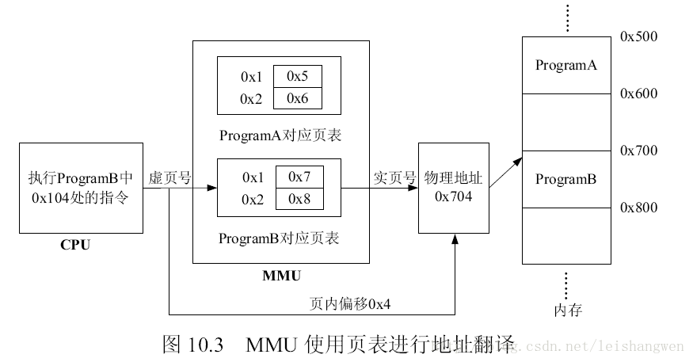

# MMU的作用及工作过程

​      MMU（Memory Management Unit）是内存管理单元的简称，读者朋友在学习嵌入式的时候应该听说过µCLinux，这是适合没有MMU的微控制器使用的嵌入式Linux操作系统，比如ARM7。由于没有MMU，所以在µCLinux上实现多任务功能是一个非常棘手的问题。从而引出了本节的关注点：MMU的作用是什么？简单地说，MMU的作用有两点：地址翻译、内存保护。

## 1、地址翻译

在处理器上一般会运行一个操作系统，如Linux，用户编写的源程序需要经过编译、链接得到可执行文件，然后被操作系统加载执行。编译、链接的过程在第2章实验环境搭建中有过描述，在链接的时候需要指定一个链接描述脚本，链接描述脚本有很多作用，其中一项是控制可执行文件中Section和符号的内存布局，也就是控制可执行程序在内存中是如何放置的，操作系统会按照可执行文件的要求将其加载到内存对应地址并执行。假如用户A编写了程序ProgramA，并且ProgramA占用的内存空间是0x100-0x200，用户B编写了程序ProgramB，并且ProgramB要求的内存空间也是0x100-0x200，这是完全有可能的，因为给操作系统提供程序的用户很多，不可能限定每个用户使用不同部分的内存。这样当ProgramA被加载执行时，ProgramB就不能被加载执行，一旦ProgramB也被加载了就会破坏ProgramA的执行，因为后者会覆盖ProgramA占用的内存。为了解决这个问题，将操作系统和处理器都做了修改，添加了MMU，在其中进行地址翻译，程序加载入内存的时候为其建立地址翻译表，处理器执行不同程序的时候使用不同的地址翻译表，如图10.1所示。

 ProgramA被加载到地址0x500-0x600处，ProgramB被加载到地址0x700-0x800处，同时建立了各自的地址翻译表，当处理器要执行ProgramB时，会使用ProgramB对应的地址翻译表，比如读取ProgramB地址0x100处的指令，那么经过地址翻译表可知0x100对应实际内存的0x700处，所以实际读取的就是0x700处的指令。同样的，当处理器要执行ProgramA时，会使用ProgramA对应的地址翻译表，这样就避免了之前提到的内存冲突问题，有了MMU的支持，操作系统就可以轻松实现多任务了。

MMU的地址翻译功能还可以为用户提供比实际大得多的内存空间。用户在编写程序的时候并不知道运行该程序的计算机内存大小，如果在链接的时候指定程序被加载到地址Addr处，而运行该程序的计算机内存小于Addr，那么程序就无法执行，有了MMU后，程序员就不用关心实际内存大小，可以认为内存大小就是“2^指令地址宽度”。MMU会将超过实际内存的虚拟地址翻译为物理地址进行访问。

地址翻译表存储在内存中，如果采用图10.1中的方式：地址翻译表的表项是一个虚拟地址对应一个物理地址，那么会占用太多的内存空间，为此，需要修改翻译方式，常用的有三种：页式、段式、段页式，这也是三种不同的内存管理方式。

页式内存管理将虚拟内存、物理内存空间划分为大小固定的块，每一块称之为一页，以页为单位来分配、管理、保护内存。此时MMU中的地址翻译表称为页表（Page Table），每个任务或进程对应一个页表，页表由若干个页表项（PTE：Page Table Entry）组成，每个页表项对应一个虚页，内含有关地址翻译的信息和一些控制信息。在页式内存管理方式中地址由页号和页内位移两部分组成，其地址翻译方式如图10.2所示。

使用虚拟地址中的虚页号查询页表得到对应的物理页号，然后与虚拟地址中的页内位移组成物理地址。比如：页大小是256字节，虚拟地址是0x104，可知对应的虚页号是0x1，页内位移是0x4，假如通过页表翻译得到的对应物理页号是0x7，那么0x104对应的物理地址就是0x704。使用页表方式进行地址翻译可以有效减少地址翻译表占用的内存空间，还是以图10.1为例，页大小是256字节，此时每个程序对应的页表就只有两项，如图10.3所示。

 段式内存管理将虚拟内存、物理内存空间划分为段进行管理，段的大小取决于程序的逻辑结构，可长可短，一般将一个具有共同属性的程序代码和数据定义在一个段中。每个任务和进程对应一个段表（Segment Table），段表由若干个段表项（STE：Segment Table Entry）组成，内含地址映像信息（段基址和段长度）等内容。在段式虚拟存储器中，地址分为段号、段内位移两部分，使用段表进行地址翻译的过程与使用页表进行地址翻译的过程是相似的。
段页式内存管理是在内存分段的基础上再分页，即每段分成若干个固定大小的页。每个任务或进程对应有一个段表，每段对应有自己的页表。在访问存储器时，由CPU经页表对段内存储单元进行寻址。

   OR1200处理器中的MMU使用页表进行地址翻译，所以本章对段式、段页式不做过多着墨，同时，下文介绍内存保护、TLB时都默认是页式内存管理。

## 2、内存保护

 MMU除了具有地址翻译的功能外，还提供了内存保护功能。采用页式内存管理时可以提供页粒度级别的保护，允许对单一内存页设置某一类用户的读、写、执行权限，比如：一个页中存储代码，并且该代码不允许在用户模式下执行，那么可以设置该页的保护属性，这样当处理器在用户模式下要求执行该页的代码时，MMU会检测到并触发异常，从而实现对代码的保护。下文在分析OR1200处理器中MMU模块时会具体介绍内存保护的实现机制。