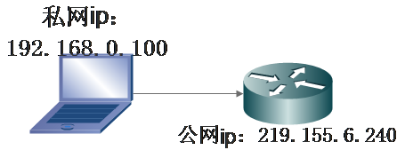

# **NAT产生背景**

今天，无数快乐的互联网用户在尽情享受Internet带来的乐趣。他们浏览新闻，搜索资料，下载软件，广交新朋，分享信息，甚至于足不出户获取一切日用所需。企业利用互联网发布信息，传递资料和订单，提供技术支持，完成日常办公。然而，Internet在给亿万用户带来便利的同时，自身却面临一个致命的问题：构建这个无所不能的Internet的基础IPv4协议已经不能再提供新的网络地址了。

2011年2月3日中国农历新年， IANA对外宣布：IPv4地址空间最后5个地址块已经被分配给下属的5个地区委员会。2011年4月15日，亚太区委员会APNIC对外宣布，除了个别保留地址外，本区域所有的IPv4地址基本耗尽。一时之间，IPv4地址作为一种濒危资源身价陡增，各大网络公司出巨资收购剩余的空闲地址。其实，IPv4地址不足问题已不是新问题，早在20年以前，IPv4地址即将耗尽的问题就已经摆在Internet先驱们面前。这不禁让我们想去了解，是什么技术使这一危机延缓了尽20年。

要找到问题的答案，让我们先来简略回顾一下IPv4协议。

IPv4即网际网协议第4版——Internet Protocol Version 4的缩写。IPv4定义一个跨越异种网络互连的超级网，它为每个网际网的节点分配全球唯一IP地址。如果我们把Internet比作一个邮政系统，那么IP地址的作用就等同于包含城市、街区、门牌编号在内的完整地址。IPv4使用32bits整数表达一个地址，地址最大范围就是232 约为43亿。以IP创始时期可被联网的设备来看，这样的一个空间已经很大，很难被短时间用完。然而，事实远远超出人们的设想，计算机网络在此后的几十年里迅速壮大，网络终端数量呈爆炸性增长。

更为糟糕的是，为了路由和管理方便，43亿的地址空间被按照不同前缀长度划分为A,B,C,D类地址网络和保留地址。其中，A类网络地址127段，每段包括主机地址约1678万个。B类网络地址16384段，每段包括65536个主机地址。
ANA向超大型企业/组织分配A类网络地址，一次一段。向中型企业或教育机构分配B类网络地址，一次一段。这样一种分配策略使得IP地址浪费很严重，很多被分配出去的地址没有真实被利用，地址消耗很快。以至于二十世纪90年代初，网络专家们意识到，这样大手大脚下去，IPv4地址很快就要耗光了。于是，人们开始考虑IPv4的替代方案，同时采取一系列的措施来减缓IPv4地址的消耗。正是在这样一个背景之下，本期的主角闪亮登场，它就是网络地址转换——NAT。

NAT是一项神奇的技术，说它神奇在于它的出现几乎使IPv4起死回生。在IPv4已经被认为行将结束历史使命之后近20年时间里，人们几乎忘了IPv4的地址空间即将耗尽这样一个事实——在新技术日新月异的时代，20年可算一段漫长的历史。更不用说，在NAT产生以后，网络终端的数量呈加速上升趋势，对IP地址的需求剧烈增加。此足见NAT技术之成功，影响之深远。

说它神奇，更因为NAT给IP网络模型带来了深远影响，其身影遍布网络每个角落。根据一份最近的研究报告，70%的P2P用户位于NAT网关以内。因为P2P主要运行在终端用户的个人电脑之上，这个数字意味着大多数PC通过NAT网关连接到Internet。如果加上2G和3G方式联网的智能手机等移动终端，在NAT网关之后的用户远远超过这个比例。

# **ip地址基础知识**

同学你现在做两个操作

- 打开你的命令行输入ipconfig查询你的Ip地址
- 打开百度，输入Ip查询，查询你的ip地址

你是不是发现了一件很神奇的事情，这两个地址是不一样的。但是我们又经常说每个主机只有一个ip,这个ip是他的身份标识。这完全矛盾啊。这就引出了我们今天要讲的NAT技术
其实并不矛盾。这里我们要引入公网ip和私网ip这两个概念，关于这个问题的解读。大家可以参看我的博文。为什么百度查到的ip和ipconfig查到的不一样

# **NAT技术的工作原理和特点**

NAT名字很准确，网络地址转换，就是替换IP报文头部的地址信息。NAT通常部署在一个组织的网络出口位置，通过将内部网络IP地址替换为出口的IP地址提供公网可达性和上层协议的连接能力。那么，什么是内部网络IP地址？

RFC1918规定了三个保留地址段落：10.0.0.0-10.255.255.255；172.16.0.0-172.31.255.255；192.168.0.0-192.168.255.255。这三个范围分别处于A,B,C类的地址段，不向特定的用户分配，被IANA作为私有地址保留。这些地址可以在任何组织或企业内部使用，和其他Internet地址的区别就是，仅能在内部使用，不能作为全球路由地址。这就是说，出了组织的管理范围这些地址就不再有意义，无论是作为源地址，还是目的地址。对于一个封闭的组织，如果其网络不连接到Internet，就可以使用这些地址而不用向IANA提出申请，而在内部的路由管理和报文传递方式与其他网络没有差异。

对于有Internet访问需求而内部又使用私有地址的网络，就要在组织的出口位置部署NAT网关，在报文离开私网进入Internet时，将源IP替换为公网地址，通常是出口设备的接口地址。一个对外的访问请求在到达目标以后，表现为由本组织出口设备发起，因此被请求的服务端可将响应由Internet发回出口网关。出口网关再将目的地址替换为私网的源主机地址，发回内部。这样一次由私网主机向公网服务端的请求和响应就在通信两端均无感知的情况下完成了。依据这种模型，数量庞大的内网主机就不再需要公有IP地址了。
**NAT的转换示意图如下所示**

我们一般使用私网ip作为局域网内部的主机标识，使用公网ip作为互联网上通信的标识
在整个NAT的转换中，最关键的流程有以下几点

* 网络被分为私网和公网两个部分，NAT网关设置在私网到公网的路由出口位置，双向流量必须都要经过NAT网关
* 网络访问只能先由私网侧发起，公网无法主动访问私网主机；
* NAT网关在两个访问方向上完成两次地址的转换或翻译，出方向做源信息替换，入方向做目的信息替换；
* NAT网关的存在对通信双方是保持透明的；
* NAT网关为了实现双向翻译的功能，需要维护一张关联表，把会话的信息保存下来。

## 静态NAT

如果一个内部主机唯一占用一个公网IP，这种方式被称为一对一模型。此种方式下，转换上层协议就是不必要的，因为一个公网IP就能唯一对应一个内部主机。显然，这种方式对节约公网IP没有太大意义，主要是为了实现一些特殊的组网需求。比如用户希望隐藏内部主机的真实IP，或者实现两个IP地址重叠网络的通信。

## **动态NAT**

它能够将未注册的IP地址映射到注册IP地址池中的一个地址。不像使用静态NAT那样，你无需静态地配置路由器，使其将每个内部地址映射到一个外部地址，但必须有足够的公有因特网IP地址，让连接到因特网的主机都能够同时发送和接收分组

## NAT重载（经常应用到实际中）

这是最常用的NAT类型。NAT重载也是动态NAT，它利用源端口将多个私网ip地址映射到一个公网ip地址(多对一)。那么，它的独特之处何在呢?它也被称为端口地址特换(PAT)。通过使用PAT(NAT重载)，只需使用一个公网ip地址，就可将数千名用户连接到因特网。其核心之处就在于利用端口号实现公网和私网的转换。
面对私网内部数量庞大的主机，如果NAT只进行IP地址的简单替换，就会产生一个问题：当有多个内部主机去访问同一个服务器时，从返回的信息不足以区分响应应该转发到哪个内部主机。此时，需要NAT设备根据传输层信息或其他上层协议去区分不同的会话，并且可能要对上层协议的标识进行转换，比如TCP或UDP端口号。这样NAT网关就可以将不同的内部连接访问映射到同一公网IP的不同传输层端口，通过这种方式实现公网IP的复用和解复用。这种方式也被称为端口转换PAT、NAPT或IP伪装，但更多时候直接被称为NAT，因为它是最典型的一种应用模式。
举个例子，客户端172.18.250.6和百度服务器202.108.22.5通信，172.18.250.6发送数据时，先转换为219.155.6.240:1723（任意>1024的随机端口），然后再利用这个身份发送数据给百度服务器，然后百度服务器回应数据并发送给219.155.6.240:1723，NAT网关检查自己的关联表，意识到这是自己地私网中172.18.250.6的数据包，然后把这个数据发送给客户端

也就是说，我们利用端口号的唯一性实现了公网ip转换为私网ip的这一步。PAT（NAT重载）能够使用传输层端口号来标识主机，因此，从理论上说，最多可让大约65000台主机共用一个公有IP地址

# NAT技术的优缺点

### 优点

* 节省合法的公有ip地址

* 地址重叠时，提供 解决办法

* 网络发生变化时，避免重新编址（这个问题具有亲身体会，原本所在的实习单位搬迁，我们搬到了新的住处，

  网络环境发生了一些变化，但是由于nat技术的特点，我们局域网的地址并没有发生改变，我们依然使用着最初的编址方案）

NAT对我们来说最大的贡献就是帮助我们节省了大量的ip资源

### **缺点**

在介绍NAT的诸多缺点之前，我们先简单介绍下什么是IP的端到端通信：
IP协议的一个重要贡献是把世界变得平等。在理论上，具有IP地址的每个站点在协议层面有相当的获取服务和提供服务的能力，不同的IP地址之间没有差异。人们熟知的服务器和客户机实际是在应用协议层上的角色区分，而在网络层和传输层没有差异。一个具有IP地址的主机既可以是客户机，也可以是服务器，大部分情况下，既是客户机，也是服务器。端到端对等看起来是很平常的事情，而意义并不寻常。但在以往的技术中，很多协议体系下的网络限定了终端的能力。正是IP的这个开放性，使得TCP/IP协议族可以提供丰富的功能，为应用实现提供了广阔平台。因为所有的IP主机都可以服务器的形式出现，所以通讯设计可以更加灵活。使用UNIX/LINUX的系统充分利用了这个特性，使得任何一个主机都可以建立自己的HTTP、SMTP、POP3、DNS、DHCP等服务。与此同时，很多应用也是把客户端和服务器的角色组合起来完成功能。例如在VoIP应用中，用户端向注册服务器登录自己的IP地址和端口信息过程中，主机是客户端；而在呼叫到达时，呼叫处理服务器向用户端发送呼叫请求时，用户端实际工作在服务器模式下。在语音媒体流信道建立过程后，通讯双向发送语音数据，发送端是客户模式，接收端是服务器模式。而在P2P的应用中，一个用户的主机既为下载的客户，同时也向其他客户提供数据，是一种C/S混合的模型。上层应用之所以能这样设计，是因为IP协议栈定义了这样的能力。试想一下，如果IP提供的能力不对等，那么每个通信会话都只能是单方向发起的，这会极大限制通信的能力。细心的读者会发现，前面介绍NAT的一个特性正是这样一种限制。没错，NAT最大的弊端正在于此——破坏了IP端到端通信的能力。
**NAT的弊端**

首先，NAT使IP会话的保持时效变短。因为一个会话建立后会在NAT设备上建立一个关联表，在会话静默的这段时间，NAT网关会进行老化操作。这是任何一个NAT网关必须做的事情，因为IP和端口资源有限，通信的需求无限，所以必须在会话结束后回收资源。通常TCP会话通过协商的方式主动关闭连接，NAT网关可以跟踪这些报文，但总是存在例外的情况，要依赖自己的定时器去回收资源。而基于UDP的通信协议很难确定何时通信结束，所以NAT网关主要依赖超时机制回收外部端口。通过定时器老化回收会带来一个问题，如果应用需要维持连接的时间大于NAT网关的设置，通信就会意外中断。因为网关回收相关转换表资源以后，新的数据到达时就找不到相关的转换信息，必须建立新的连接。当这个新数据是由公网侧向私网侧发送时，就会发生无法触发新连接建立，也不能通知到私网侧的主机去重建连接的情况。这时候通信就会中断，不能自动恢复。即使新数据是从私网侧发向公网侧，因为重建的会话表往往使用不同于之前的公网IP和端口地址，公网侧主机也无法对应到之前的通信上，导致用户可感知的连接中断。NAT网关要把回收空闲连接的时间设置到不发生持续的资源流失，又维持大部分连接不被意外中断，是一件比较有难度的事情。在NAT已经普及化的时代，很多应用协议的设计者已经考虑到了这种情况，所以一般会设置一个连接保活的机制，即在一段时间没有数据需要发送时，主动发送一个NAT能感知到而又没有实际数据的保活消息，这么做的主要目的就是重置NAT的会话定时器。

其次，NAT在实现上将多个内部主机发出的连接复用到一个IP上，这就使依赖IP进行主机跟踪的机制都失效了。如网络管理中需要的基于网络流量分析的应用无法跟踪到终端用户与流量的具体行为的关系。基于用户行为的日志分析也变得困难，因为一个IP被很多用户共享，如果存在恶意的用户行为，很难定位到发起连接的那个主机。即便有一些机制提供了在NAT网关上进行连接跟踪的方法，但是把这种变换关系接续起来也困难重重。基于IP的用户授权不再可靠，因为拥有一个IP的不等于一个用户或主机。一个服务器也不能简单把同一IP的访问视作同一主机发起的，不能进行关联。有些服务器设置有连接限制，同一时刻只接纳来自一个IP的有限访问(有时是仅一个访问)，这会造成不同用户之间的服务抢占和排队。有时服务器端这样做是出于DOS攻击防护的考虑，因为一个用户正常情况下不应该建立大量的连接请求，过度使用服务资源被理解为攻击行为。但是这在NAT存在时不能简单按照连接数判断。
总之，缺点大概如下：

- 无法进行端到端的ip跟踪（破坏了端对端通信的平等性）
- 很多应用层协议无法识别（比如ftp协议 ）

# **NAT穿越技术**

前面解释了NAT的弊端，为了解决IP端到端应用在NAT环境下遇到的问题，网络协议的设计者们创造了各种武器来进行应对。但遗憾的是，这里每一种方法都不完美，还需要在内部主机、应用程序或者NAT网关上增加额外的处理。

## **应用层网关（ALG）**

前面我们已经介绍到了，NAT实现了对UDP或TCP报文头中的的IP地址及端口转换功能，但对应用层数据载荷中的字段无能为力（也就是净载中的数据无法修改），在许多应用层协议中，比如多媒体协议（H.323、SIP等）、FTP、SQLNET等，TCP/UDP载荷中带有地址或者端口信息，这些内容不能被NAT进行有效的转换，就可能导致问题。也就是说，NAT只是将数据包的包头的ip地址和端口号进行了转换，但是没有对包内数据中的ip地址和端口号进行转换于是我们开始设想能不能**使用一种行之有效的方法保证包头的ip和端口号与包中数据里的Ip地址和端口号都转化为公网的ip地址和端口号。****ALG的实际应用**

**对于ALG的实现机制还是不清楚，如果有懂的大佬，推荐下书籍**
下面我们举个FTP传输的例子来简单介绍一下ALG的实际应用

图中私网侧的主机要访问公网的FTP服务器。
NAT设备上配置了私网地址192.168.1.2到公网地址8.8.8.11的映射，实现地址的NAT转换，以支持私网主机对公网的访问。组网中，若没有ALG对报文载荷的处理，私网主机发送的PORT报文到达服务器端后，服务器无法根据私网地址进行寻址，也就无法建立正确的数据连接。整个通信过程包括如下四个阶段：

(1) 私网主机和公网FTP服务器之间通过TCP三次握手成功建立控制连接。

(2) 控制连接建立后，私网主机向FTP服务器发送PORT报文，报文中携带私网主机指定的数据连接的目的地址和端口，用于通知服务器使用该地址和端口和自己进行数据连接。

(3) PORT报文在经过支持ALG特性的NAT设备时，报文载荷中的私网地址和端口会被转换成对应的公网地址和端口。即设备将收到的PORT报文载荷中的私网地址192.168.1.2转换成公网地址8.8.8.11，端口1084转换成12487。

(4) 公网的FTP服务器收到PORT报文后，解析其内容，并向私网主机发起数据连接，该数据连接的目的地址为8.8.8.11，目的端口为12487（注意：一般情况下，该报文源端口为20，但由于FTP协议没有严格规定，有的服务器发出的数据连接源端口为大于1024的随机端口，如本例采用的是wftpd服务器，采用的源端口为3004）。由于该目的地址是一个公网地址，因此后续的数据连接就能够成功建立，从而实现私网主机对公网服务器的访问。

# NAT技术的未来

在知乎上看到过这样一种言论，随着ipV6技术的到来，NAT技术已经不再需要了。在我看来，技术的革命一定是一步一步实现的，比如先是在局部地区使用IPV6，然后再逐步扩大其规模，减少IPv4的规模，所以NAT技术还是需要的。而且到了那个时候，网络世界中会充斥着两种地址ipV4和ipV6，这个时候更需要NAT技术了，因为NAT的中文翻译叫做网络地址转换啊。所以学好这个知识点对于我们理解网络是至关重要的。每到此时都会感慨，学校学到的知识真的只是皮毛，但是却是我现在所有知识的基础。