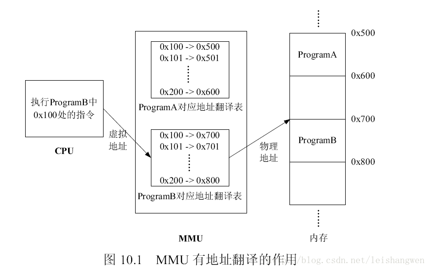

# 基础

## 1. 集合

### 1. ArrayList & LinkedList & Vector & Array（数组）

1. Array
   1. 容纳基本类型和对象
   2. 大小固定
2. ArrayList
   1. 底层：数组，只能容纳对象。扩容时创建更大数组，把原有数组复制到新数组。
   2. 访问：随机访问O(1)
   3. 增删数据O(n)：重排数据
   4. 内存占用：预留空间供扩容。

3. LinkedList

   1. 底层：双向循环链表

   2. 访问：顺序访问O(n)
   3. 增删数据O(1)

   4. 内存占用：
      1. 实际数据item，前指针Node pre，后指针Node next。 
      2. Node first， Node last。

4. Vector
   1. 线程安全的ArrayList

### 2. ArrayList

1. 介绍：
   1. 容量可变，底层是数组。
   2. 支持对元素的快速随机访问，插入和删除速度慢。
   3. ArrayList实现了RandomAcess标记接口，如果一个类实现了该接口，那么表示使用索引遍历比迭代器快。
   
2. `elementData`是ArrayList的数据域，被transient修饰。序列化时会调用writeObject，直接将size和element写入ObjectOutputStream。反序列化时调用readObject，从ObjectInputStream获取size和element，再恢复到elementData。elementData容量通常大于实际存储元素的数量，所以只需发送真正有实际值的数组元素。

   * elementData是一个缓存数组，它通常会预留一些容量，等容量不足时再扩充容量，那么有些空间可能就没有实际存储元素，采用上诉的方式来实现序列化时，就可以保证只序列化实际存储的那些元素，而不是整个数组，从而节省空间和时间。

3. `size`是当前实际大小，elementData大小 >= size

4. `modeCount`记录了ArrayList结构性变化的次数，继承自AbstractList。所有涉及结构变化的方法都会增加该值。expectedModCount是迭代器初始化记录的modCount值，每次访问新元素都会检查modCount和expectedModCount是否相等，不相等就抛出异常。这种机制叫fail-fast。所有集合类都有这种机制。

   https://blog.csdn.net/ljw619/article/details/79150635?spm=1001.2101.3001.4242


### 3. LinkedList

1. 介绍
   1. 本质是双向链表，插入和删除速度快，随机访问速度慢
   2. 继承AbstractList，实现了Deque接口，这个接口具有队列和栈的性质。
   3. 成员变量被transient修饰，原理和ArrayList类似
2. 成员：size，first，last：个数和头尾节点的引用
3. 优点：将零散的内存单元通过附加引用的方式关联起来，形成按链路顺序查找的线性结构，内存利用率较高。

### 4. Set

1. 特点：不允许重复元素，无序
2. HashSet：
   1. 底层基于HashMap，Key即为HashSet存储的元素，Value为PRESENT的Object常量。
   2. 使用Key保证元素唯一性，不保证有序性，线程不安全
   3. HashSet判断元素是否相同时，对于包装类型直接按值比较。对于引用类型先比较hashCode是否相同，相同则继续比较equals。
3. LinkedHashSet：继承自HashSet，通过LinkedHashMap实现，使用双向链表维护元素插入顺序
4. TreeSet：通过TreeMap实现。添加元素到集合时按照比较规则将其插入合适的位置，保证插入后的集合依然有序


### 6. Map类

1. HashMap
   1. 底层：基于拉链法的散列表
   2. 特点：
      1. key的hashcode值存储数据。用key获取value
   3. 访问速度快，方便插入，删除，定位
   4. 允许key和value的值为null

2. HashTable

   1. 特点：
      1. 线程同步的HashMap
   2. 访问速度慢
   3. 不允许key和value值为null

3. LinkedHashMap

   1. 特点：
      1. 基于链表，保存了记录的插入顺序（before和after标识2前后节点）
      2. 非同步
   2. 遍历比HashMap慢
   3. key和value允许为空

4. TreeMap

   1. 底层：红黑树
   2. 特点
      1. 保存的记录按key自然排序，默认升序
      2. key要实现comparable接口，或创建时参数传递一个Comparator比较器
      3. 有利于遍历操作
      4. 非同步

   3. 不允许key值为null


### 5. TreeMap

1. 基于红黑树。增删查改的平均和最差时间复杂度为$O(logn)$。
2. Key有序。Key必须实现Comparable接口或者提供的Comparator比较器，所以不允许为null
3. HashMap依靠hashCode和equals去重，TreeMap依靠Comparable或Comparator。TreeMap排序时，如果比较器不为空就使用比较器的compare方法，否则使用Key实现的Comparable的compareTo方法。
4. TreeMap通过`put`和`deleteEntry`实现增加和删除树节点。
   1. 插入规则：
      1. 需要调整的新节点总是红色的
      2. 如果插入新节点的父节点是黑色的，不需要调整
      3. 如果插入新节点的父节点是红色的，由于红黑树不能出现相邻红色，进入循环判断，通过重新着色或者左右旋转调整。
   2. TreeMap的插入操作就是按照Key的对比往下遍历，大于节点值向右查找，小于向左查找，先按照二叉查找树的特性操作，后续会重新着色和旋转，保持红黑树的特性。


### 8. HashMap

1. 结构：

   1. JDK8之前：数组+链表。 JDK8：数组+链表/红黑树。   节点：Entry->Node
      1. 链表长度>8 & 数组大小>64 ------红黑树
      2. 红黑树节点<6 -------链表

2. 成员变量：

   1. table数组：记录数据。每个下标对应一条链表。链表存储哈希冲突的数据。Node/Entry节点包含4个成员变量：key，value，next，hash值
   2. 元素数量size
   3. 加载因子loadFactor

3. 初始容量

   1. new hashmap()不传值：16，负载因子0.75
   2. 传值k：大于k的2的整数次方

4. 数据插入原理

   1. 数组判空，为空------初始化
   2. 数组不为空：
      1. 计算hashcode
      2. 计算key的hash值，计算`index = (n-1)& hash`为下标
      3. 查看table[index]，没有数据就构造一个Node节点放在table[index]
      4. 有数据，hash冲突，判断key是否相等，相等就用新的value替换
      5. key不相等，判断节点是否是树形节点。
         1. 树形节点：插入红黑树
         2. 非树形节点：插入链表，判断链表长度是否大于8且数组长度大于64，转换红黑树
      6. 判断节点数是否大于阙值，大于则扩容到**2倍**

5. hash函数的设计

   1. 设计方式
      1. 获取key的hashcode，32位int
      2. 高16位和低16位异或

   2. 设计原因：扰动函数
      1. 减少hash碰撞
      2. 位运算提高效率

6. 1.8版本的优化

   1. 数组+链表  ---》  数组+红黑树
   2. 头插法 ---》 尾插法
   3. 扩容：
      1. 1.7对原数组元素重新hash，获得新数组的位置
      2. 1.8位置不变 或 索引+旧容量大小
   4. 插入判断是否扩容：先判断后插入 ---》 先插入后判断

   * 1.7版本弊端：头插法可能产生环

7. 线程不安全：

   1. 1.7死循环，数据丢失，数据覆盖
   2. 1.8数据覆盖

8. 线程安全优化：

   1. HashTable：方法上加synchronized关键字，粒度较大
   2. ConcurrentHashMap：分段锁，锁粒度较小，并发度较高

9. [扩容](https://blog.csdn.net/zhengwangzw/article/details/104889549)（JDK1.8）

   1. 2次幂的扩展  --- 》 元素要么在原位置，要么在原位置再移动2次幂的位置。
      1. 因为：n-1的mask范围在高位多1bit。
      2. 只需查看原来的hash值新增的那个bit是1还是0。是1就 原索引 + oldCap，是0就索引不变。
   2. 问题：使用HashMap可能出现环形链表。


### 9. HashMap源码

**JDK8 之前**

**hash：计算元素 key 的散列值**

① 处理 String 类型时，调用 `stringHash32` 方法获取 hash 值。

② 处理其他类型数据时，提供一个相对于 HashMap 实例唯一不变的随机值 hashSeed 作为计算初始量。

③ 执行异或和无符号右移使 hash 值更加离散，减小哈希冲突概率。

**indexFor：计算元素下标**

将 hash 值和数组长度-1 进行与操作，保证结果不会超过 table 数组范围。

**get：获取元素的 value 值**

① 如果 key 为 null，调用 `getForNullKey` 方法，如果 size 为 0 表示链表为空，返回 null。如果 size 不为 0 说明存在链表，遍历 table[0] 链表，如果找到了 key 为 null 的节点则返回其 value，否则返回 null。

② 如果 key 为 不为 null，调用 `getEntry` 方法，如果 size 为 0 表示链表为空，返回 null 值。如果 size 不为 0，首先计算 key 的 hash 值，然后遍历该链表的所有节点，如果节点的 key 和 hash 值都和要查找的元素相同则返回其 Entry 节点。

③ 如果找到了对应的 Entry 节点，调用 `getValue` 方法获取其 value 并返回，否则返回 null。

**put：添加元素**

① 如果 key 为 null，直接存入 table[0]。

② 如果 key 不为 null，计算 key 的 hash 值。

③ 调用 `indexFor` 计算元素存放的下标 i。

④ 遍历 table[i] 对应的链表，如果 key 已存在，就更新 value 然后返回旧 value。

⑤ 如果 key 不存在，将 modCount 值加 1，使用 `addEntry` 方法增加一个节点并返回 null。

**resize：扩容数组**

① 如果当前容量达到了最大容量，将阈值设置为 Integer 最大值，之后扩容不再触发。

② 否则计算新的容量，将阈值设为 `newCapacity x loadFactor` 和 `最大容量 + 1` 的较小值。

③ 创建一个容量为 newCapacity 的 Entry 数组，调用 `transfer` 方法将旧数组的元素转移到新数组。

**transfer：转移元素**

① 遍历旧数组的所有元素，调用 `rehash` 方法判断是否需要哈希重构，如果需要就重新计算元素 key 的 hash 值。

② 调用 `indexFor` 方法计算元素存放的下标 i，利用头插法将旧数组的元素转移到新数组。

**JDK8**

**hash：计算元素 key 的散列值**

如果 key 为 null 返回 0，否则就将 key 的 `hashCode` 方法返回值高低16位异或，让尽可能多的位参与运算，让结果的 0 和 1 分布更加均匀，降低哈希冲突概率。

**put：添加元素**

① 调用 `putVal` 方法添加元素。

② 如果 table 为空或长度为 0 就进行扩容，否则计算元素下标位置，不存在就调用 `newNode` 创建一个节点。

③ 如果存在且是链表，如果首节点和待插入元素的 hash 和 key 都一样，更新节点的 value。

④ 如果首节点是 TreeNode 类型，调用 `putTreeVal` 方法增加一个树节点，每一次都比较插入节点和当前节点的大小，待插入节点小就往左子树查找，否则往右子树查找，找到空位后执行两个方法：`balanceInsert` 方法，插入节点并调整平衡、`moveRootToFront` 方法，由于调整平衡后根节点可能变化，需要重置根节点。

⑤ 如果都不满足，遍历链表，根据 hash 和 key 判断是否重复，决定更新 value 还是新增节点。如果遍历到了链表末尾则添加节点，如果达到建树阈值 7，还需要调用 `treeifyBin` 把链表重构为红黑树。

⑥ 存放元素后将 modCount 加 1，如果 `++size > threshold` ，调用 `resize` 扩容。

**get ：获取元素的 value 值**

① 调用 `getNode` 方法获取 Node 节点，如果不是 null 就返回其 value 值，否则返回 null。

② `getNode` 方法中如果数组不为空且存在元素，先比较第一个节点和要查找元素的 hash 和 key ，如果都相同则直接返回。

③ 如果第二个节点是 TreeNode 类型则调用 `getTreeNode` 方法进行查找，否则遍历链表根据 hash 和 key 查找，如果没有找到就返回 null。

**resize：扩容数组**

重新规划长度和阈值，如果长度发生了变化，部分数据节点也要重新排列。

**重新规划长度**

① 如果当前容量 `oldCap > 0` 且达到最大容量，将阈值设为 Integer 最大值，return 终止扩容。

② 如果未达到最大容量，当 `oldCap << 1` 不超过最大容量就扩大为 2 倍。

③ 如果都不满足且当前扩容阈值 `oldThr > 0`，使用当前扩容阈值作为新容量。

④ 否则将新容量置为默认初始容量 16，新扩容阈值置为 12。

**重新排列数据节点**

① 如果节点为 null 不进行处理。

② 如果节点不为 null 且没有next节点，那么通过节点的 hash 值和 `新容量-1` 进行与运算计算下标存入新的 table 数组。

③ 如果节点为 TreeNode 类型，调用 `split` 方法处理，如果节点数 hc 达到6 会调用 `untreeify` 方法转回链表。

④ 如果是链表节点，需要将链表拆分为 hash 值超出旧容量的链表和未超出容量的链表。对于`hash & oldCap == 0` 的部分不需要做处理，否则需要放到新的下标位置上，新下标 = 旧下标 + 旧容量。

### 10. HashMap线程不安全

1. JDK7：死循环和数据丢失
   1. 数据丢失：
      1. 并发赋值被覆盖：在`createEntry()`方法中，新添加的元素直接放在头部，使元素之后可以被更快的访问到。但是如果两个线程同时执行到此处，会导致其中一个线程的赋值被覆盖
      2. 已遍历区间新增元素丢失：当某个线程在`transfer()`方法迁移时，其他线程新增的元素可能落在已经遍历过的哈希槽上。遍历完成后，table数组引用指向了newTable，新增元素丢失。
      3. 新表被覆盖：如果`resize()`完成，执行了`table = newTable`，后续元素就可以在新表上进行插入。但是如果多线程同时`resize()`，每个线程会new一个数组，这是线程内的局部对象，线程之间不可见。迁移完成后`resize()`的线程会赋值给table线程共享变量，可能会覆盖其它线程的操作，在新表中插入的对象都会被丢弃。
   2. 死循环：扩容时`resize()`调用`transfer()`使用头插法迁移元素，虽然newTable是局部变量，但是原来table中的Entry链表是共享的，问题根源是Entry的next指针并发修改，某线程还没有将table设为newTable时用完了时间片，导致数据丢失或死循环。
2. JDK8：在`resize`方法中完成扩容，并改用尾插法，不会产生死循环，但并发下仍可能丢失数据，可用ConcurrentHashMap。


### 11. ConcurrentHashMap

[详细](https://blog.csdn.net/weixin_44460333/article/details/86770169)

1. JDK7
   1. ConcurrentHashMap采用分段锁技术。首先将数据分成Segment数据段，然后给每一个数据段配一把锁，当一个线程占用锁访问其中一段的数据，其它段的数据也能被其他线程访问
   2. `get`：只需要将 Key 通过 Hash 之后定位到具体的 Segment ，再通过一次 Hash 定位到具体的元素上。get的高效在于不需要加锁，除非读到空值才会加锁重读。get方法中将共享变量定义为volatile，只需要读所以不用加锁。
   3. `put`：必须加锁。首先定位到Segment，再进行插入操作。先判断是否需要对HashEntry数组进行扩容，第二步定位添加元素的位置，然后将其放入数组
2. JDK8
   1. 改变：
      1. 取消分段锁机制，降低了冲突概率
      2. 引入红黑树结构，同一个哈希槽上的元素超过阙值后从单向链表转化为红黑树。
      3. 使用了更加优化的方式统计集合内的元素数量。
   2. `get`：不需要同步，`put`如果没有出现哈希冲突，就使用CAS插入元素，否则使用synchronized插入元素
   3. 当槽内的元素个数到达7且table容量不小于64，转化为红黑树。减小到6时转化为链表。
      1. 转化时使用同步块锁住当前槽的首元素，防止其他线程对当前槽进行增删查改操作，转化完成后使用CAS替换原有链表。
      2. 由于TreeNode节点也存储了next引用，红黑树转换为链表很简单，只需要从first元素开始遍历所有节点，把节点转为Node类型。构造好新链表用CAS转化为红黑树。

### 26. Map & Set & List & Queue & Stack


1. Map：存储键值对 get, put
2. Set：不允许存储重复元素的集合。 add, remove, contains
3. List：列表，有序序列 get, add
4. Queue：队列接口，先进先出 add, remove
5. Stack：栈，后进先出 push, pop

### 27. Collection & Collections

1. Collection：
   1. 集合框架的基本接口
   2. 提供了集合对象基本操作的通用接口方式，提供了最大化的统一操作方式
2. Collections：集合框架提供的工具类，包含很多操作集合的静态方法，排序，搜索，线程安全等。

### 33. 容器


1. 数组和List转换

   1. 数组 ---》 List：ArrayList的toArray方法
   2. List ---》 数组：Arrays的asList方法

2. Queue的poll()和remove()

   1. 二者都是队列中取出一个元素
      1. poll()：取出失败返回空
      2. remove()：取出失败抛出异常

3. 线程安全的集合类

   vector，stack，hashtable，enumeration

### 34. Iterator

1. 特性：
   1. 是设计模式也是对象
   2. Iterator接口被collection继承
   3. 迭代器，遍历集合，单向移动
2. 使用：
   1. iterator()：获取一个Iterator
   2. next()：获取下一个元素
   3. hasNext()：检查序列中是否有元素
   4. remove()：将迭代器返回的元素删除
3. 和ListIterator区别
   1. 前者遍历Set和List，后者遍历List
   2. Iterator只能前向遍历，ListIterator双向遍历
   3. ListIterator实现了Iterator，包含其他功能，增加元素，替换元素，获取前后元素索引


## 3. IO流

### 1. 同步/异步

1. [详解](https://zhuanlan.zhihu.com/p/23488863)
2. 同步和异步是通信机制
   1. 同步IO：用户线程发起IO请求后需要等待或轮询内核IO操作完成后才能继续执行。
      1. 同步阻塞：一个线程维护一个连接，该线程完成数据读写到处理全部过程，线程阻塞
      2. 同步非阻塞：用户线程发出请求后，读请求不阻塞当前线程。不过用户线程还是需要不断主动轮询判断数据是否准备OK。 此时还是会阻塞 等待内核复制数据到用户进程。
   2. 异步IO：用户线程发起IO请求后可以继续执行，当内核IO操作完成后会通知用户线程，或调用用户线程注册的回调函数。
      * 用户进行读或写后，内核完成数据读取及数据拷贝，全部完成后再通知用户，并执行回调函数（用户提供的callback）。用户线程不需要关注读写和数据拷贝工作，在得到通知数据时数据已经被复制到用户空间。
3. 阻塞和非阻塞是调用状态

### 2. 阻塞IO


阻塞IO：IO操作需要彻底完成后次才能返回用户控件

1. 用户调用read后，用户线程阻塞，内核数据准备好且数据从内核缓冲区拷贝到用户态缓冲区后read才会返回。
2. 阻塞两部分：①CPU把数据从磁盘读到内核缓冲区 ②CPU把数据从内核缓冲区拷贝到用户缓冲区。

### 2. 非阻塞IO


IO操作调用后立即返回一个状态值，无需等IO操作彻底完成。

1. 用户调用read，发现数据没准备好，继续往下执行。 应用程序不断轮询polling内核数据是否准备好。数据未准备好时，内核返回EWOULDBLOCK错误，知道数据被拷贝到应用程序缓冲区，read才获取到结果。
2. 这里最后一个read，是同步过程，**是等待内核态的数据拷贝到用户程序缓存区这个过程**。

### 2. IO多路复用


1. 背景：非阻塞情况下，应用程序每次轮询内核看数据是否准备完成。能否不让他轮询，当内核缓冲区数据准备完毕，以事件机制通知应用程序数据已经准备好。应用程序在收到数据准备完成事件前，可以忙其他工作。
2. 定义：使用单个线程通过记录跟踪每个IO流的状态来同时管理多个IO流。实现一个进程监控多个IO请求。哪个IO有请求就把数据从内核拷贝到进程缓冲区，**拷贝期间阻塞**。
   * 现在可以通过mmap地址映射方式，达到内存共享效果，避免真复制，提高效率。
     * mmap将一个文件或其他对象映射进内存。文件被映射到多个页上，如果文件大小不是所有页大小之和，最后一个页不被使用的空间将会清零。
3. 具体实现：
   1. select：
      1. select会修改传入的参数数组，对于需要多次调用的函数不友好
      2. select如果任何一个IO流出现数据，select只会返回，不会告知哪个IO流有数据
      3. select只能监控1024个链接
      4. select非线程安全。如果你把一个sock加入到select, 然后突然另外一个线程发现这个sock不用，要收回，这个select 不支持的。
   2. poll：
      1. 去掉了只能监控1024个链接的限制
      2. 不再修改传入数组。
      3. 非线程安全
   3. [epoll](../基础/epoll.md)
      1. 会通知IO流有数据以及具体是哪个IO流有数据
      2. 线程安全
      3. epoll 内核态管理了各种IO文件描述符， 以前用户态发送所有文件描述符到内核态，然后内核态负责筛选返回可用数组，现在epoll模式下所有文件描述符在内核态有存，查询时不用传文件描述符进去了。

### 2. 异步IO


真正的异步IO是内核数据准备好 和 数据从内核态拷贝到用户态这两个过程都不用等待。

### 2. BIO

1. 定义：同步阻塞式IO，JDK1.4之前的IO模型
2. 服务器实现模式：一个连接请求对应一个线程，服务器需要为每一个客户端请求创建一个线程，如果这个连接不做任何事会造成不必要的线程开销。
3. 可以通过线程池改善，这种IO称为伪异步IO。适用连接数目少且服务器资源多的场景。

### 3. NIO


1. [定义](https://www.cnblogs.com/snailclimb/p/9086334.html)：NIO是JDK1.4引用的同步非阻塞IO。
2. 服务器实现模式：多个连接请求对应一个线程，客户端连接请求会注册到一个多路复用器Selector，Selector轮询到连接有IO请求时才启动一个线程处理。适用连接数目多且连接时间短的场景。

3. 同步是指线程还是不断接受客户端连接并处理数据，非阻塞是指如果一个管道没有数据，不需要等待，可以轮询下一个管道。

4. 核心组件：

   1. Selector：多路复用器。轮询检查多个Channel的状态，判断注册事件是否发生，即判断Channel是否处于可读或可写状态。使用前需将Channel注册到Selector，注册后会得到一个SelectionKey，通过SelectionKey获取Channel和Selector相关信息。select方法方法会一直阻塞到某个注册的通道有事件就绪。一旦这个方法返回，线程就可以处理这些事件，事件的例子入有新连接接进来，数据接收等。
   2. Channel：双向通道，替换了BIO中的stream流，不能直接访问数据，要通过buffer来读写数据，也可以与其他channel交互。
   3. Buffer：缓冲区，本质是一块可读写的内存，用来简化数据读写。Buffer三个属性：position（下次读写数据的位置），limit（本次读写的极限位置），capacity（最大容量）。该对象提供了一组方法，可以更轻松的使用内存块，缓冲区对象内置了一些机制，能够跟踪和记录缓冲区的状态变换情况，Channel提供从文件，网络读取数据的渠道，但是读取或者写入的数据都必须经由Buffer。

   * 使用步骤：向buffer写数据，调用`flip()`方法转为读模式，从Buffer中读数据，调用clear或compact方法情况缓冲区。

### 4. AIO

1. 定义：JDK7引入的异步非阻塞IO。
2. 服务器实现模式：为一个有效请求对应一个线程。客户端的IO请求都是由操作系统先完成IO操作后，再通知服务器应用来直接使用准备好的数据。适用连接数目多且连接时间长的场景。
3. 实现方法：Future的`get()`方法进行阻塞式调用，以及实现CompetitionHandler接口，重写请求成功的回调方法`completed`和请求失败回调方法`failed`。

### 5. Java.io包下有哪些流

1. 字符流
   1. Reader, Writer
   2. 对应缓冲流（带有8KB的缓冲数组）：
2. 字节流
   1. InputStream, OutputStream
   2. 对应缓冲流
3. 过滤流（FilterReader），字符数组流（CharArrayReader），字节数组流（ByteArrayInputStream）、文件流（FileInputStream）。


## 3. 其他


### 1. == 和 equals

1. ==：
   1. 基本类型：比较值
   2. 引用类型：比较地址
2. equals：
   1. Object类的方法，继承类重写，用来比较值
   2. 本质：==

### 2. hashcode和equals

1. hashcode
   1. 对象的散列码是为了更好的支持基于哈希机制的Java集合类，例如 Hashtable, HashMap, HashSet 等
2. equals
   1. 自反性，对称性，传递性，一致性。非空性
3. 设计原则
   1. ==：判断参数是否是对象引用
   2. 判断是否为空
   3. instanceOf：参数类型是否正确
   4. 强制转换
   5. 检查每个对应的域值是否相同
4. 为什么重写equals要重写hashCode
   1. 会出现哈希冲突，HashMap用链地址法解决，会出现两种情形
      1. 两个逻辑相等对象重复写入
      2. 两个逻辑不等对象出现hash冲突
   2. 先判断这key的`hashCode`是否相等
      1. 不相等，说明key和数组中对象一定逻辑不相等，就不用再判断了
      2. 相等，就继续判断是否逻辑相等，从而确定究竟是出现了哈希冲突，还是确实就是要取这个key的对应的值
5. hahsCode和equals
   1. 2个对象equals，那么 hashCode一定相同规则
   2. 两个键值对的hashcode可能相同。不能得出二者equals

### 3. 基本类型

byte, short, int, long, float, double, char, boolean


### 4. String, StringBuilder, StringBuffer

1. String：
   1. final，对象不可变，不可继承
   2. 底层用 **final char[]** 数组保存数据，字符占2字节
      * Java9采用**byte[] 数组和encoding-flag**保存，字符占1字节
   3. 操作生成新实例对象，指针指向新对象，原对象垃圾回收
2. StringBuilder：
   1. 对象可操作（字符序列可变的字符串）
      1. append等方法改变
      2. toString()转换成字符串
   2. 性能好
   3. toString方法进行对象缓存，减小复制开销
3. StringBuffer：
   1. 线程安全的StringBuilder（都加了synchronized）
   2. 性能差
   3. toString方法直接返回一个新对象
4. 字符串拼接的方式：
   1. `+`：底层为StringBuilder实现，适用于小数量。如果在循环中使用`+`拼接，相当于不断创建新的StringBuilder对象再转换成String对象，效率低。
   2. `concat()`。String的`concat()`方法使用`Arrays.copyOf`创建一个新的字符数组buf并将当前字符串value数组的值拷贝到buf中。buf长度=当前字符串长度+拼接字符串长度。之后调用`getChars()`方法使用`System.arraycopy()`将拼接字符串的值也拷贝到buf数组，最后用buf作为构造参数new一个新的String对象返回，效率高于使用`+`。
   3. 使用StringBuilder或者StringBuffer的`append`方法。`append`方法继承自AbstractStringBuilder。首先使用`Arrays.copyOf()`确定新的字符数组容量，再调用`getChars`方法使用`System.arraycopy`将新的值追加到数组中。
5. String a = "a" + new String("b") 创建了几个对象
   * 常量和常量拼接仍是常量，结果在常量池。有变量参与拼接结果就是变量，存在堆。
   * 使用字面量时只创建一个常量池中的常量。new如果常量池中没有改值就会在常量池中创建，再在堆中创建一个对象引用常量池的常量。
   * 此案例会创建4个对象。常量池中的a和b，堆中的b和堆中的ab。

### 5. 抽象类和接口

1. 抽象类：
   1. 抽象方法（只有方法声明），普通方法，main方法，构造方法
   2. 不可实例化
   3. extends继承
   4. 实现数量：单继承
   5. 访问修饰符：任意
   6. 用abstract修饰

2. 接口：
   1. interface修饰
   2. 抽象方法，默认方法，静态方法，私有方法
   3. 不可实例化
   4. implements
   5. 实现数量：多实现
   6. 访问修饰符：public

| 语法     | 抽象类                                         | 接口                                                         |
| -------- | ---------------------------------------------- | ------------------------------------------------------------ |
| 成员变量 | 无要求                                         | 默认 public static final                                     |
| 构造方法 | 有构造方法，不能实例化                         | 没有构造方法，不能实例化                                     |
| 方法     | 抽象类可以没有抽象方法，有抽象方法一定是抽象类 | 默认 public abstract， JDK8支持默认，静态方法，JDK9支持私有方法 |
| 继承     | 单继承                                         | 多继承                                                       |

3. 接口和抽象类的选择
   1. 抽象类：is-a，接口：can-do。与接口相比，抽象类通常是对同类事物相对具体的抽象
   2. 抽象类：模板式设计，包含一组具体特征。如汽车的底盘，电路等。内饰，显示器则是可以有不同实现
   3. 接口：契约式设计，谁都可以实现它，必须遵守接口的约定。例如所有汽车都实现了刹车这种强制规范。
   4. 接口是顶级类，抽象类是接口下面的第二层，对接口进行了组合，然后实现部分接口。如果纠结接口还是抽象类。选择定义为接口，遵循接口隔离原则，按维度划分为多个接口，再利用抽象类实现这些，方便后续扩展。
   5. 例如Plane和Bird都有fly方法，把fly定义为接口。因为除了fly，Plane和Bird很难找到其他共同特征。


### 8. final，finally，finalize

1. final

   1. 类
   2. 方法
   3. 变量
      1. 成员变量：初始化或构造器赋值
      2. 局部变量：定义时初始化

   4. 方法参数
2. finally
   1. try，catch时使用保证运行
   2. 不会执行的情况：
      1. JVM停止运行
      2. 线程被interrupted或killed
      3. 服务器断电
3. finalize
   1. finalize()是Object中的方法，当垃圾回收器将要回收对象所占内存之前被调用，即当一个对象被虚拟机宣告死亡时会先调用它finalize()方法，让此对象处理它生前的最后事情（这个对象可以趁这个时机挣脱死亡的命运）。


### 12. 继承和聚合

1. 继承：
   1. 继承父类功能，增加自己的功能
   2. is-a

2. 聚合：
   1. 部分与整体，可分离，生命周期独立
      * 部分可以属于多个整体，也可以被多个对象共享
   2. has-a
   
3. 组合：
   1. 部分与整体，不可分，生命周期相同
   2. contains-a
   
4. 其他：

   | 类关系 | 描述                         | 权利强侧 | 举例                         |
   | ------ | ---------------------------- | -------- | ---------------------------- |
   | 继承   | 父子类之间的关系：is-a       | 父类     | 小狗继承于动物               |
   | 实现   | 接口和实现类的关系：can-do   | 接口     | 小狗实现了狗叫接口           |
   | 组合   | 比聚合更强的关系：contains-a | 整体     | 头是身体的一部分             |
   | 聚合   | 暂时组装的关系：has-a        | 组装方   | 小狗和绳子是暂时的聚合关系   |
   | 依赖   | 一个类用到另一个：depends-a  | 被依赖方 | 人养小狗，人依赖于小狗       |
   | 关联   | 平等的使用关系：links-a      | 平等     | 人使用卡消费，卡提取人的信息 |

   

### 14. 泛型

1. 定义：
   1. 泛型本质是参数化类型，解决不确定对象具体类型的问题。泛型在定义处只具备执行Object方法的能力。
2. 好处：
   1. 简单易用。代码重用。
   2. 类型安全，提前让编译器知道一个对象的限定类型，编译的时候检查类型安全
   3. 消除了显式强制类型转换，使用自动隐式的强制类型转换，可读性好。
3. 实现原理：
   * [泛型擦除](https://www.cnblogs.com/wuqinglong/p/9456193.html)
     1. 字节码中没有泛型信息，因为虚拟机没有泛型类型对象。所有对象都属于普通类。如`List<String>`和`List<Object>`编译后都会变成`List`。
     2. 编译器将类型的泛型参数擦除成限定类型。如果没有限定类型则擦除成Object类型，如果有限定类型就会替换成第一个限定类型。获取的时候转换成对应的类型。如`<T extends A & B>`会使用A类型 替换T。


### 18. 反射

1. 定义：
   1. 程序可以访问，检测和修改它本身状态或行为的一种能力
   2. 动态获取类的信息，动态调用类和对象的方法
2. 功能：
   1. 运行时判断一个对象所属的类
   2. 运行时构造任意一个类的对象
   3. 运行时调用任意一个对象的方法
   4. 运行时判断任意一个类所具有的成员变量和方法
3. 获取一个Class类（前提条件）
   1. Class class = Foo.class （任意一个类都有一个隐含的静态成员变量class）
   2. Class class = foo.getClass （通过该类的对象调用getClass方法）
   3. Class class = Class.forName(类的全路径名)（此方法要抛出异常，放在trycatch里）
4. 创建该类的对象
   1. Foo foo = (Foo) class.newInstance() 需要强制转换。
5. Class.forName和ClassLoader区别
   1. ClassLoader遵循双亲委派模型，Class.forName()实际也是调用的ClassLoader
   2. 对于一个含有静态代码块，静态标量，赋值给静态变量的静态方法的类。
      1. ClassLoader的loadClass方法：没有对类进行初始化，只是加载类到虚拟机
      2. Class.forName方法：加载类时进行了初始化
   3. 应用：
      1. IOC：ClassLoader
      2. JDBC：Class.forName：Driver类必须向DriverManager注册自己。写在静态代码块中。
6. 常用API
   1. 构造方法：
      1. public Constructor[] getConstructors()：所有"公有的"构造方法
      2.  public Constructor[] getDeclaredConstructors()：获取所有的构造方法(包括私有、受保护、默认、公有)
      3. public Constructor getConstructor(Class... parameterTypes):获取单个的"公有的"构造方法：
       4. public Constructor getDeclaredConstructor(Class... parameterTypes):获取"某个构造方法"可以是私有的，或受保护、默认、公有；
       5. Constructor-->newInstance(Object... initargs)
   2. 成员变量：
      1. Field[] getFields():获取所有的"公有字段"
       2. Field[] getDeclaredFields():获取所有字段，包括：私有、受保护、默认、公有；
       3. public Field getField(String fieldName):获取某个"公有的"字段；
       4. public Field getDeclaredField(String fieldName):获取某个字段(可以是私有的)
       5. Field --> public void set(Object obj,Object value):
           1. obj:要设置的字段所在的对象；
           2. value:要为字段设置的值；
    3. 成员方法：
        1. public Method[] getMethods():获取所有"公有方法"；（包含了父类的方法也包含Object类）
        2. public Method[] getDeclaredMethods():获取所有的成员方法，包括私有的(不包括继承的)
        3. public Method getMethod(String name,Class<?>... parameterTypes):
        4. public Method getDeclaredMethod(String name,Class<?>... parameterTypes)
            1. name : 方法名；
            2. Class ... : 形参的Class类型对象
        5. Method --> public Object invoke(Object obj,Object... args):
            1. obj : 要调用方法的对象；
            2. args:调用方式时所传递的实参；
 7. 反射的应用：
     1. 反射读取配置文件
     2. 反射越过泛型检查

### 19. Exception&Error

1. 共同点：

   1. 祖先Throwable

2. 区别：

   1. Exception：分为受检异常和非受检异常。受检异常需在代码中显式处理，否则会编译出错。非受检异常是运行时异常，继承自RunTimeException。能被程序本身处理
   2. Error：Java运行时系统内部错误和资源耗尽错误，例如StackOverFlowError和OutOfMemoryError，无法处理

3. 产生原因：

   1. 输入了非法数据
   2. 要打开的文件不存在
   3. 网络通信连接中断，JVM内存溢出
   4. 用户错误，程序错误，物理错误

4. 分类：

   

   1. 不受检查异常（unchecked Exception）：不要求必须声明抛出未被捕获的运行时异常
   2. 检查异常（checked Exception）：受检异常跟程序运行的上下文环境有关，即使程序设计无误，仍然可能因使用的问题而引发。方法必须声明抛出可能发生的受检异常。

5. Exception

   1. 类型：
      1. 编译期异常（受检异常）
         1. EOFException
         2. FileNotFoundException
         3. SQLException
      2. 运行期异常/非受检异常（RuntimeException）：虚拟机的通常操作中可能遇到的异常，是一种常见运行错误，只要程序设计得没有问题通常就不会发生
         1. ArrithmeticException
         2. ClassNotFoundException
         3. NullPointerException
         4. ArrayIndexOutOfBoundsException
         5. ClassCastException

6. Error
   1. 定义：由Java虚拟机生成并抛出
   2. 举例：
      1. VirtualMachineError
      2. OutOfMemoryError


### 20. 访问修饰符


### 21. 深拷贝 浅拷贝

1. 背景：
   1. Java数据类型分基本类型和引用类型
   2. 会出现值传递和引用传递的问题
2. 浅拷贝：
   1. 性质
      1. 产生的是新对象
      2. 基本类型：值传递，互不影响
      3. 引用类型：把内存地址赋值给成员变量。互相影响
   2. 实现
      1. 实现Clonnable接口，重写clone()方法
      2. 实现里调用父类的clone()方法

3. 深拷贝
   1. 性质
      1. 产生的是新对象
      2. 基本类型：值传递。互不影响
      3. 引用类型：新建一个对象空间，拷贝里面的内容，它们指向了不同的内存空间。互不影响
      4. 拷贝速度较慢，开销大
   2. [实现](../基础/深拷贝浅拷贝.md)
      1. 实现Clonnable接口，重写clone()方法
      2. 先拷贝产生自己的新对象
      3. 新对象的引用类型再调用拷贝操作。

### 22. 序列化 & 反序列化

1. 定义：
   1. 序列化指将java对象转化为字节序列，反序列化相反。
   2. 保存在内存中的各种对象的状态（数据，类型，属性），并且可以再读取出来。
2. 场景：
   1. 主要是为了java线程间通讯，实现对象传递。
   2. 通过套接字在网络传送对象
   3. 把内存中的对象状态保存到一个文件或数据库中
3. 种类：
   1. Java原生序列化：
      1. 实现`Serializable`接口。
      2. 保留对象类的元数据（类、成员变量、继承信息）以及对象数据，兼容性最好，但是不支持跨语言。性能一般
      3. 序列化和反序列化必须保持序列化ID一致。使用`private static final long serialVersionUID`定义。不设置则会自动生成。
   2. Hessian序列化：支持动态类型，跨语言，基于对象传输的网络协议。
   3. JSON序列化：抛弃了类型信息，反序列化时需提供类型信息。
4. 限制：
   1. 只有实现了Serializable或Externalizable接口类对象才可被序列化。
   2. 类的所有属性必须是可以序列化的，不需要可序列化使用transient修饰。
5. 使用：
   1. ObjectOutputStream，参数为OutputStream。
      1. 方法：`writeObject(Object obj)`
   2. ObjectInputStraem，参数为InputStream
      1. 方法：`readObject()`加强制转换。
      2. 可能会出现`ClassNotFoundException和InvalidClassException`。

### 23. throw和throws

1. throw
   1. 动作：抛出异常（接异常实例）
   2. 实现位置：方法实现中
   3. 数量：抛出一种异常

2. throws

   1. 状态：代表方法可能会抛出异常（接异常类）

   2. 实现位置：方法声明中
   3. 数量：抛出多个异常

### 24. 位运算符

1. `>>`：右移一位（最高位0则补0，为1则补1）
2. `>>>`：无符号右移：左边补0
3. `<<`：左移一位：最高位丢弃，右边补0

### 25. 四种引用

1. 强引用：new返回的对象引用为强引用
2. 软引用：内存不足时会回收软引用。用来缓存服务器中间计算结果及不需要实时保存的用户行为。
3. 弱引用：内存充足时也会回收弱引用。弱引用关联的对象智能生存到下次YGC前，回收时间不确定。
4. 虚引用：它指向的对象被回收时，虚引用加入引用队列，知道指向的对象何时被销毁。无法通过虚引用获取对象。唯一目的是为了能在对象被回收之前收到一个系统通知，与引用队列联合使用。

​        

### 28. Java面向对象的三个特征

1. 封装
   1. 定义：将类封装起来，只提供想提供的方法接口，不提供具体实现细节。
   2. 意义：对象功能内聚的表现形式。对属性，数据，敏感行为实现隐藏。降低了代码耦合度。
   3. 实现：访问修饰符 ， 或者内部类

   * 迪米特原则就是对封装的要求。A模块会使用B模块的某接口行为，对B模块中除此行为外的其他信息知道的应该尽可能少。
2. 继承
   1. 定义：从父类得到一些属性和方法，提供代码的可重用性
   2. 限制：单继承。多继承可以用接口实现。
   
   * 可以使用里氏替换原则判断是否满足is-a关系，即任何父类出现的地方子类都可以出现。如果父类引用直接使用子类引用来代替且可以正确编译并执行，输出结果符合子类场景预期，说明两个类符合里氏替换原则。
3. 多态
   1. 定义：子类对象可以赋值给父类变量，父类引用指向子类对象。但运行时仍表现出子类的行为特征。即程序中同名的不同方法。
   2. 实现：子类重写父类方法。或方法重载。

### 29. 内部类

1. 内部类：对同一包中的其他类隐藏，内部类方法可以访问定义这个内部类作用域中的数据。包括private数据。
   * 内部类是一个编译器现象，与虚拟机无关。编译器会把内部类转换成常规的类文件，用`$`分割外部类名和内部类型，匿名内部类使用数字编号，虚拟机对此一无所知。
2. 静态内部类：
   1. 属于外部类，只加载一次。
   2. 作用域仅在包内，可通过`外部类名.内部类名`访问。类只能访问外部类所有静态属性和方法。
      1. 如HashMap的Node节点，ReentrantLock的Sync类。
   3. 内部类中还可以定义内部类。
      1. 如ThreadLocal静态内部类ThreadLocalMap中定义了内部类Entry。
3. 非静态内部类：隐式持有外围类的一个引用。
   1. 成员内部类：属于外部类的每个对象，随对象一起加载。不可以定义静态成员和方法，可访问外部类的所有内容
   2. 局部内部类：定义在方法内，不能声明访问修饰符，只能定义实例成员变量和实例方法，作用范围仅在声明类的代码块中。
   3. 匿名内部类：只用一次的没有名字的类，可以简化diamante。创建的对象类型相当于new的类的子类类型。用于实现事件监听和其他回调。

### 31. 注解

1. 定义：

   1. 增强版注释，向编译器，虚拟机说明一些信息，完成特定功能。

   2. 注解是描述Java代码的代码，能够被编译器解析。
   
2. 组成

   1. 修饰符
       访问修饰符必须为public,不写默认为pubic；
   2. 关键字
       关键字为@interface；
   3. 注解名称
       注解名称为自定义注解的名称，使用时还会用到；
   4. 注解类型元素
       注解类型元素是注解中内容，可以理解成自定义接口的实现部分；
   
   ```java
   public @interface Info {
       String value() default "tracy";
       boolean isDelete();
   }
   ```
   
3. 使用：

   1. 利用注解生成一些模板化的代码。

      ```java
      //返回指定的注解
      getAnnotation
      //判断当前元素是否被指定注解修饰
      isAnnotationPresent
      //返回所有的注解
      getAnnotations
      ```

4. 元注解：自定义注解的注解。
   1. `@Target`：约束作用位置。METHOD,VARIABLE,TYPE,PARAMETER等

   2. `@Retention`：约束生命周期

   3. `@Documented`：表名这个注解被javadoc记录。

   4. `@Inherited`：表明使用了@Inherited注解的注解，所标记的类的子类也会拥有这个注解

      ```java
      @Target({ElementType.FIELD, ElementType.TYPE})
      @Retention(RetentionPolicy.RUNTIME)
      @Documented
      public @interface Info {
            String value() default "tracy";
            boolean isDelete();
      }
      ```

5. 案例：

   ```java
   @Data
   @Builder
   @Info(isDelete = true)
   public class Person {
       private String name;
       private int age;
       private boolean isDelete;
   }
   
   
   public class AnnotationTest {
       public static void main(String[] args) {
           try {
               //获取Person的Class对象
               Person person = Person.builder().build();
               Class clazz = person.getClass();
               //判断person对象上是否有Info注解
               if (clazz.isAnnotationPresent(Info.class)) {
                   System.out.println("Person类上配置了Info注解！");
                   //获取该对象上Info类型的注解
                   Info infoAnno = (Info) clazz.getAnnotation(Info.class);
                   System.out.println("person.name :" + infoAnno.value() + ",person.isDelete:" + infoAnno.isDelete());
               } else {
                   System.out.println("Person类上没有配置Info注解！");
               }
           } catch (Exception e) {
               e.printStackTrace();
           }
       }
   }
   
   ```

   

### 32. Object类里的方法

1. clone：保护方法，实现对象的浅复制，只有实现了Cloneable接口才可以调用该方法。
   
   * clone方法生命为protected，类只能通过该方法克隆它自己的对象，如果希望其他类也能调用该方法必须定义该方法为public。默认的clone是浅拷贝，一般重写clone方法需要实现Cloneable接口并且指定访问修饰符为public。
   
  2. getClass：final方法，获得包含对象信息的类对象。

  3. toString：打印对象的默认方法，没有重写的话打印的是表示对象的一个字符串。

  4. finalize：该方法用于释放资源。

     * 当垃圾回收器将要回收对象所占内存之前被调用，即当一个对象被虚拟机宣告死亡时会先调用它finalize()方法，让此对象处理它生前的最后事情

     * 确定一个对象死亡要经过两次标记。

  5. equals：

  6. hashCode：

  7. wait：

  8. notify

  9. notifyAll


### 35. REST风格URL

1. rest定义：
   1. REST：Representational State Transfer：描述了一个架构样式的网络系统，比如web应用程序。
   2. 倾向于使用更加简单轻量的方法。没有明确标准，更像是一个设计的风格。
2. 优点：
   1. 结构清晰，符合标准，易于理解，扩展方便
3. 特性：
   1. 资源（Resources）：网络上的一个实体，一个具体信息都对应一个特定的URI。通过访问URL获取资源。URI为每一个资源的独一无二的标识符
   2. 表现层（Representation）：把资源具体呈现出来的形式。比如txt，html，json，xml等
   3. 状态转换（State Transfer）：没发出一个请求，就代表了客户端和服务器的一次交互。
      1. HTTP协议是无状态协议。状态保存在服务器端。客户端向操作服务器，必须让服务器发生状态转化，
      2. 就是HTTP协议里面，四个操作动词：
         1. GET：获取资源
         2. POST：新建资源
         3. PUT：更新资源
         4. DELETE：删除资源

### 36. 面向对象的五大原则

1. 单一职责原则：一个类应该只有一个引起它变化的原因
   1. 将功能不同的方法放在不同的类
2. 开放封闭原则：对扩展开放，对修改封闭：
   1. 实现：使用抽象和接口实现
3. 里氏替换原则：子类必须能够替换掉他们的父类型
4. 接口隔离原则：使用多个小的专门的接口，不要使用大的总接口
5. 依赖倒转原则：高层模块不应该依赖底层模块，二者都应该依赖抽象。抽象不依赖细节，细节依赖抽象。 
   1. 实现：高层模块调用接口，底层模块实现接口，控制耦合关系。

* [详细](https://blog.csdn.net/xiechao198609150053/article/details/51594162)

### 37. 哈希冲突处理方法

1. 开放地址法：
   1. 线性探测法：在原来哈希值的基础上往后移一个单位
   2. 二次探测法：在原来哈希值的基础上，在表的左右进行跳跃式探测。
   3. 伪随机探测：通过随机函数生成一个数，在原来哈希值的基础上加上随机数，直到不发生哈希冲突
2. 链地址法：相同哈希值使用链表连接。
   1. 处理简单，没有堆积现象。查找长度短。
   2. 适用于无法确定表长的情况。
   3. 装填因子可以增大点。
   4. 删除节点操作容易。删除链表上的节点即可。
   5. 指针占用较大空间时会造成空间浪费。
3. 建立公共溢出区：建立公共溢出区存储所有哈希冲突的数据。
4. 再散列法：使用多个哈希函数。对于冲突的哈希值再次进行哈希处理，直至没有哈希冲突。

* [详细](https://blog.csdn.net/qq_40803710/article/details/80945617)

### 38. 字节流

* 背景：一切文件数据在存储时，都是以二进制的形式保存。底层都是二进制数据。

1. 字节流：

   1. 输入流：InputStream

      1. 方法：`close(), read(), read(byte[] b)`

      2. FileInputStream：参数为File或者String

         1. 循环读取：

            ```java
            while((b = fis.read()) != - 1){
                System.out.println((char)b);
            }
            while((len = fis.read(b)) != -1){
                System.out.println(new String(b，0，len));
            }
            ```

   2. 输出流：OutPutStream

      1. 方法：`close()，flush()，write(byte[] b)，write(byte[] b, int off, int len)`
      2. FileOutputStream：参数为File或者String，后面是boolean的append。

2. 字符流

   1. 输入流：Reader
      1. 方法：`close(), read(), read(char[] cbuf)`
      2. FileReader
   2. 输出流：Writer
      1. 方法：`write(), write(char[] cbuf), write(char[] cbuf, int off, int len), write(String str), Write(String str, int off, int len), flush(), clise()`
      2. FileWrite

3. 缓存流

   1. BufferedInputStream
   2. BufferedOutputStream
   3. BufferedReader
      1. 特有方法：`readline(), newLine()`
   4. BufferedWriter

4. 转换流

   1. InputStreamReader：参数：InputStream或InputStream， String charsetName指定字符集
   2. OutputStreamWriter：参数：OutputStream或OutputStream， String charsetName指定字符集

### 39. IO异常：

```java
public class HandleException1 {
    public static void main(String[] args) {
        // 声明变量
        FileWriter fw = null;
        try {
    	//创建流对象
            fw = new FileWriter("fw.txt");
            // 写出数据
            fw.write("黑马程序员"); //黑马程序员
        } catch (IOException e) {
            e.printStackTrace();
        } finally {
            try {
                if (fw != null) {
                    fw.close();
                }
            } catch (IOException e) {
                e.printStackTrace();
            }
        }
    }
}
```

### 40. Socket

[详细](https://www.jianshu.com/p/066d99da7cbd)

在计算机通信领域，socket 被翻译为“套接字”，它是计算机之间进行**通信**的**一种约定**或一种方式。通过 socket 这种约定，一台计算机可以接收其他计算机的数据，也可以向其他计算机发送数据

Socket通信的数据传输方式，常用的有两种：
 　ａ、SOCK_STREAM：表示面向连接的数据传输方式。数据可以准确无误地到达另一台计算机，如果损坏或丢失，可以重新发送，但效率相对较慢。常见的 http 协议就使用 SOCK_STREAM 传输数据，因为要确保数据的正确性，否则网页不能正常解析。
 　ｂ、SOCK_DGRAM：表示无连接的数据传输方式。计算机只管传输数据，不作数据校验，如果数据在传输中损坏，或者没有到达另一台计算机，是没有办法补救的。也就是说，数据错了就错了，无法重传。因为 SOCK_DGRAM 所做的校验工作少，所以效率比 SOCK_STREAM 高。
 　例如：QQ 视频聊天和语音聊天就使用 SOCK_DGRAM 传输数据，因为首先要保证通信的效率，尽量减小延迟，而数据的正确性是次要的，即使丢失很小的一部分数据，视频和音频也可以正常解析，最多出现噪点或杂音，不会对通信质量有实质的影响


作者：yongfutian
链接：https://www.jianshu.com/p/066d99da7cbd
来源：简书
著作权归作者所有。商业转载请联系作者获得授权，非商业转载请注明出处。

### 41. IO多路复用

[详细](https://blog.csdn.net/SkydivingWang/article/details/74917897)


### 44. 自动装箱/拆箱

1. 定义：每个基本数据类型都对应一个包装类，除了int和char，其余都是首字母大写

2. 自动装箱：将基本数据类型包装为一个包装类对象，向一个泛型为Integer的集合添加int元素
3. 自动拆箱：将一个包装类对象转换为一个基本数据类型，例如将一个包装类对象赋值给一个基本数据类型的变量。
   * 比较两个包装类数值要用Equals，不能用==。

### 45. 面向对象

1. 面向对象的理解：
   1. 面向过程：让计算机有步骤顺序的做一件事，是过程化思维。面向过程开发大型项目，软件复用和维护存在很多问题，模块耦合严重。
   2. 面向对象：相对面向过程更适合解决规模较大的问题，可以拆解问题复杂度，对现实事物进行抽象并映射为开发对象，更接近人的思维。强调高内聚，低耦合。
   3. 举例：开门
      1. 面向过程：open(Door door)。door作为操作对象的参数传入，方法内定义开门的具体步骤
      2. 面向对象：定义一个类Door，抽象出门的属性（尺寸，颜色）和行为（Open，close）。

### 46. 重载和重写

1. 重载：方法名称相同，参数类型个数不同。是行为**水平方向**不同实现。
   1. 对编译器来说，方法名称和参数列表构成了一个**唯一键**，称为**方法签名**。JVM通过方法签名决定调用哪个重载方法，不管继承关系如何复杂，重载在编译时可以根据规则知道调用哪种目标方法，属于**静态绑定**。
   2. 选择顺序：精确匹配 -》基本数据类型自动转换成更大表示范围 -》 自动拆箱和装箱 -》 子类向上转型 -》 可变参数。
2. 重写：子类实现接口或者继承父类时，保持方法签名完全相同，实现不同方法体。是行为**垂直方向**不同实现。
   1. 元空间有一个**方法表**保存方法信息。如果子类重写了父类的方法，方法表的**方法引用**会指向子类实现。父类引用执行子类方法时无法调用子类存在而父类不存在的方法。
   2. 重写方法权限不能变小，返回类型和抛出的异常类型不能变大，必须加@Override。


# 多线程

## 1. JMM

### 1. JMM的作用

1. Java的**线程通信**由JMM控制，JMM的主要目的是定义程序中**各种变量的访问规则**。变量包括实例字段，静态字段，但是不包括局部变量和方法参数，他们是线程私有的，不存在多线程竞争。
2. JMM遵循一个**原则**：**只要不改变程序运行结果，编译器和处理器怎么优化都可以**。例如编译器分析某个锁只会单线程访问就消除锁，某个volatile变量只会单线程访问就把他当做普通变量。

3. JMM规定**所有变量都存储在主内存，每条线程有自己的工作内存**，工作内存中保存该变量使用的主内存副本，线程对变量的所有操作都必须在工作空间进行，不能直接读写主内存数据。不同线程间无法直接访问对方工作内存中的变量，线程通信必须经过主内存。

### 2. as-if-serial

1. 不管怎么重排序，单线程程序的**执行结果不能改变**，编译器和处理器必须遵循as-if-serial语义。
2. 编译器和处理器**不会对数据依赖关系的操作重排序**，因为这种重排序会改变执行结果。但是如果不存在数据依赖关系，这些操作就可能被编译器和处理重排序。
3. as-if-serial把单线程保护起来，给程序员一种幻觉：单线程程序是**按照程序的顺序**执行的。

### 3. happens-before

1. 定义：**两项操作间的偏序关系**，是判断数据是否存在竞争的重要手段。
2. JMM将happens-before要求禁止的重排序是否会改变程序执行结果分为两类。对于**会改变的结果**的重排序，JMM要求编译器和处理器必须**禁止**。对于不会改变结果的重排序，JMM不做要求
3. JMM的天然的happens-before关系。
   1. 程序次序规则：一个线程内写在前面的操作先行发生于写在后面的
   2. 管程锁定规则：unlock操作先行发生于后面对同一个锁的lock操作
   3. volatile规则：对volatile变量的写操作先行发生于后面的读操作
   4. 线程启动规则：线程的start方法先行发生于线程的每个工作
   5. 线程终止规则：线程中所有操作先行发生于线程的终止检测
   6. 对象终结规则：对象的初始化先行发生于finalize方法
   7. 传递性：A先于B，B先于C，则A先于C

### 4. as-if-serial和happens-before区别

as-if-serial保证**单线程**程序的执行结果不变，happens-before保证正确同步的**多线程**程序的执行结果不变。

目的都是为了在不改变程序结果的前提下尽可能提高程序执行并行度。

### 5. 什么是指令重排序

1. 编译器优化的重排序，编译器在不改变**单线程程序语义**的前提下可以重排语句的执行顺序
2. 指令级并行的重排序：如果**不存在数据依赖性**，处理器可以改变语句对应机器指令的执行顺序

3. 内存系统的重排序

### 6. 原子性、有序性、可见性

1. 原子性：
   1. **基本数据类型的访问都具有原子性**，除了long和double。虚拟机将没有被volatile修饰的64位数据操作划分为两次32位操作。
   2. 字节码指令monitorenter和monitorexit反映到Java代码中就是synchronized
2. 可见性：
   1. 当一个线程修改了共享变量，其他线程能够立即得知修改。**JMM通过在变量修改后将值同步回主内存**，在变量读取前从主内存刷新的方式实现可见性。**volatile保证新值立即同步到主内存以及每次使用时从主内存刷新**。
   2. 除了volatile，**synchronized和final也保证可见性**。synchronized：unlock前同步到主内存。final：构造完成后，而且构造方法没有把this引用传递出去，其他线程就能看到final字段的值。
3. 有序性：
   1. 在本线程内观察所有操作是有序的，在一个线程内观察另一个线程，所有操作都是无序的。 
   2. volatile和synchronized保证有序性

### 17. volatile

1. 作用：修饰成员变量和静态成员变量，**避免线程从自己的工作缓存中查找变量的值**，必须到主存中获取它的值。线程操作volatile变量都是直接操作主存。一个线程对volatile变量的修改，对另一个线程可见。
   1. 保证变量对所有线程**可见**
   2. **禁止指令重排序**优化

### 7. fianl可以保证可见性吗

* final可以保证可见性，被final修饰的字段在构造方法中一旦初始化完成，并且构造方法没有把this引用传递出去，其他线程中就能看到final字段值。
* 编译器会在final域的写后，构造方法的return前插入一个store 屏障。确保在对象引用为任意线程可见之前，对象的final域已经初始化

## 2. 锁

### 1. synchronized介绍

1. 每个Java对象都有一个关联的**monitor**，JVM会根据环境找到对象的monitor，根据monitor的状态进行加解锁的判断。
2. 同步代码块使用**monitorenter和monitorexit**这两个字节码指令获取和释放monitor。这两个字节码指令都需要一个引用类型的参数指明要**加锁和解锁的对象**。对于**同步普通方法**， 锁是当前实例对象；对于**静态同步方法**，锁是当前类的class对象；对于**同步方法块**，锁是synchronized里的对象
3. monitorenter：首先尝试获取对象锁，加锁锁的计数器加一，减为0锁释放
4. 举例：两个线程A,B竞争monitor，A成功时将monitor的owner设置为A，把B阻塞并放到等待资源的ContentionList队列。ContentionList部分线程会进入EntryList，EntryList中的线程会被指定为OnDeck竞争候选者。被阻塞的线程进入WaitSet。

* [参考1](https://www.pianshen.com/article/40891696663/)， [参考2](https://www.jianshu.com/p/e624460c645c)

### 13. synchronized底层

1. 绑定monitor实现
2. **被 synchronized 修饰的同步方法**并没有通过指令monitorenter和monitorexit来完成（理论上其实也可以通过这两条指令来实现），不过相对于普通方法，**其常量池中多了ACC_SYNCHRONIZED标示符**。JVM就是根据该标示符来实现方法的同步的：当方法调用时，调用指令将会检查方法的 ACC_SYNCHRONIZED 访问标志是否被设置，如果设置了，执行线程将先获取monitor，获取成功之后才能执行方法体，方法执行完后再释放monitor。在方法执行期间，**其他任何线程都无法再获得同一个monitor对象**。 其实本质上没有区别，只是方法的同步是一种隐式的方式来实现，无需通过字节码来完成

### 2. Synchronized & ReentrantLock

1. 相同点：

   1. 加锁，阻塞式同步（阻塞唤醒代价较高）

2. 不同点：

   1. Synchronized：

      1. 关键字：**Java语言关键字，JVM实现**
      2. 实现：
         1. 同步块字节码前后加Monitorenter和monitorexit
         2. monitorenter锁的计数器加一，exit减一，为0释放。

   2. ReentrantLock

      1. 关键字：**API层面的互斥锁，实现了AQS框架**

      2. 特性：

         1. 等待可中断
         2. 公平锁（默认非公平）：性能降低，抢锁时先查等待队列上是否有线程等待。
         3. 多个条件变量
         4. 可重入


### 2. 锁优化策略

1. 自适应自旋
2. 锁消除
3. 锁粗化
4. 偏向锁，轻量级锁。

### 3. 自旋锁

1. 同步对性能最大的影响是**阻塞**，**挂起和恢复线程**的操作都需要转入内核态完成。许多应用上共享数据的锁定会持续很短时间，为了这段时间去挂起和恢复线程不值得。如果处理器有多个核心，我们可以让后面请求锁的线程稍等一会，但不放弃处理器的执行时间，看看持有锁的线程是否会很快释放锁。为了让线程等待只需让线程执行一个忙循环，这个就是自选锁。
2. 自选锁不能代替阻塞，虽然避免了线程切换开销，但是要**占用处理器时间**。如果锁被占用的时间很短，自旋的效果就非常好，反之白白消耗处理器资源。自旋超过默认次数没有成功获得锁，就挂起，默认为10。

### 4. 自适应自旋

1. JDK6对自选锁优化，时间不再固定，由前一次的自旋时间以及锁拥有者的状态决定
2. 如果一个锁**自旋刚刚成功**过且持有锁的线程政治运行，虚拟机认为这次自旋也很可能成功，允许自旋持续更久。**自旋成功很少**，以后获取锁时可能直接省略掉自旋，避免浪费处理器资源。
3. 有了自适应自旋，程序运行时间增长，虚拟机对程序锁的预测越来越精准。

### 5. 锁消除

1.  定义：即时编译器对检测到不可能存在共享数据竞争的锁进行消除
2. 判定依据：逃逸分析。如果一段代码中堆上的所有数据都只被一个线程访问，就可以当做栈上的数据对待，认为他们是线程私有的无需同步。

### 6. 锁粗化

1. **原则需要将同步块的作用范围限制的尽量小**，只在共享数据的实际作用域进行同步，使等待锁的线程尽快拿到锁。 
2. 如果一系列的连续操作都**对同一个对象反复加锁和解锁**，甚至**加锁操作出现在循环体之外**，即使没有线程竞争也会导致不必要的性能消耗。如果虚拟机探测到有一串零散的操作都对同一个对象加锁，将**把同步的范围扩展到整个操作序列的外部**。

### 7. 偏向锁

1. 定义：为了在没有竞争的情况下减小锁的开销，**锁会偏向第一个获得他的进程**。如果执行过程中锁一直没有被别的线程获取，则持有偏向锁的线程将不需要进行同步。
2. 过程：当锁对象第一次被线程获取时，虚拟机将对象头的偏向模式设置为1.同时使用CAS把获取到锁的**线程ID**记录在对象的**MarkWord**中。如果CAS成功，持有偏向锁的线程以后每次进入锁相关的操作都不再进行同步操作。
3. 一旦有其他线程尝试获取锁，偏向模式立即结束。根据锁对象是否处于锁定状态决定是否撤销偏向。后续同步按照轻量级锁那样执行。

### 8. 轻量级锁

1. 定义：轻量级锁是为了在没有竞争的前提下**减小重量级锁使用操作系统互斥量造成的性能开销**。

2. 过程：在代码即将进入同步块时，如果同步对象没有被锁定，虚拟机将在当前线程的**栈帧中建立一个锁记录**空间，**存储锁对象的MarkWord的拷贝**。然后虚拟机使用CAS把锁对象的MarkWord更新为**指向锁记录的指针**，

   * 如果更新成功代表该线程拥有了锁，锁标志位转换为**00**，表示处于轻量级锁状态。

   * 如果更新失败意味着至少存在一条线程与当前线程竞争。虚拟机检查对象的markword是否指向当前线程的栈帧，如果是这说明当前线程已经拥有了锁，直接进入同步块执行。否则说明锁对象已经被其他线程抢占。如果出现两条线程以上竞争同一个锁，发生锁膨胀升级为重量级锁，锁标志状态为10.此时markword就是指向重量级锁的指针，后面等待的线程阻塞。

3. 解锁：解锁同样通过CAS进行。如果对象markword仍然指向线程的锁记录，就用CAS把对象的markword和线程复制的markword交换回来。替换成功同步完成，失败则说明有其他的线程尝试获取过锁，就要在释放锁的同时唤醒被挂起的线程。

### 9. 偏向锁，轻量级锁，重量级锁的区别

1. 偏向锁：加解锁不需要额外消耗。缺点是存在锁竞争会带来额外锁撤销的消耗，适用于只有一个线程访问同步代码块场景。
2. 轻量级锁：竞争线程不阻塞，程序响应速度快。缺点是如果线程始终得不到锁会自旋消耗CPU。适用于追求响应时间，同步代码块执行快的场景
3. 重量级锁：线程竞争不适用自旋不消耗CPU。缺点是线程会阻塞，响应时间慢，适应追求吞吐量，同步代码块执行慢的场景。

### 10. Lock和synchronized区别

1. **Lock是juc包的顶层接口，基于Lock接口**，用户能够以非块结构实现同步互斥，摆脱了语言特性束缚，在类库层面实现同步。Lock未用到synchronized，**利用了volatile的可见性**。
2. 可重入锁ReentrantLock是最常见的实现，与synchronized一样可重入，还实现了一些其他功能。
   1. **等待可中断**：持有锁的线程长期不释放锁时，正在等待的线程可以选择放弃等待处理其他事情。
   2. **公平锁**：多个线程在等待同一个锁时，必须按照申请锁的顺序来获得锁。synchronized是非公平的。公平锁会严重影响性能。
   3. **条件变量**：一个ReentrantLock可以绑定多个condition。synchronized中锁对象的`wait`和`notify`可以实现一个隐含条件。ReentrantLock可以使用`newCondition`来创建多个条件。

### 11. ReentrantLock的可重入实现

1. 非公平锁为例，通过`nonfairTryAcquire`方法获取锁，该方法增加了再次获取同步状态state的state处理逻辑：判断当前线程是否为获取锁的线程来决定获取是否成功，如果是获取锁的线程再次请求则将同步状态值state增加并且返回true，表示获取同步状态成功。
2. 成功获取锁的线程再次获取锁会增加同步状态值，释放锁会减少同步状态值。锁获取了n次，前`n-1`次`tryRelease`方法都必须返回false。同步状态完全释放才能返回true。该方法将同步状态是否为0作为最终释放条件，释放时将owner设置为null并返回true。
3. 公平锁使用`tryAcquire`方法，此方法多了对同步队列当前节点是否有前驱结点的判断。如果该方法返回true则表示有线程比当前线程更早请求锁，需要等待前驱线程获取并释放锁之后才能获取锁。

### 12. 读写锁

1. 定义：读写锁维护了一个读锁和一个写锁。依赖AQS来实现同步功能。读写状态就是其同步器的同步状态。读写锁的自定义同步器需要在**同步状态state**，即一个int变量上，分成**高16位表示读，低16位表示写**。
2. 写锁是可重入排他锁，如果当前线程已经获得了写锁则增加写状态。读锁是可重入共享锁。如果当前线程已经获取了读锁，则增加读状态。读锁释放会减少读状态，读锁的释放是线程安全。
3. **读锁NODE.SHARED，写锁NODE.EXCLUSIVE**
4. 锁降级：把持住当前的写锁，然后获取读锁，随后释放先前拥有的写锁。
   1. 锁降级中读锁的获取是必须的，这是为了保证数据可见性。如果当前线程不获取读锁，直接释放写锁，假设另外一个线程A获取写锁修改了数据，当前线程无法感知线程A的数据更新。如果当前线程获取读锁，遵循降级步骤，A将被阻塞，直到当前线程使用数据并释放读锁之后，线程A才能获取写锁进行数据更新。

### 12. 公平锁和非公平锁

1. 为什么公平锁性能差

   * 我们必须先知道，在恢复一个被挂起的线程与该线程真正开始运行之间存在着严重的延迟。

      举个例子，a线程获取到了锁，现在b线程来请求锁。a线程释放锁唤醒b线程。b线程恢复运行状态。这里需要时间。如果允许插队，c线程刚刚好在a释放前请求锁。可能在c释放完锁后。b线程才真正开始运行起来。

     其实就是说切换上下文的开销是比较大的。有时候我们可以用短时间的轮询获取锁会更快。

### 13. AQS

1. **结构**：AQS队列同步器是用来构建锁或其他同步组件的基础框架，使用一个 **volatile int state 变量**作为共享资源。如果线程获取资源失败，进入**同步队列**等待，如果获取成功则执行临界区代码，释放资源时通知同步队列的等待线程。还支持多个**条件变量**。
2. **使用方式**：同步器的主要使用方式是**继承**。子类通过继承同步器并实现它的抽象方法来管理同步状态。主要是`getState`，`setState`，`compareAndSetState`。同步器仅定义了若干个同步状态获取和释放的方法，同步器既支持**独占式也支持共享式**。
3. 优点：
   1. 同步器是**实现锁**的关键，在锁的实现中使用同步器。
   2. 面向使用者隐藏了实现细节，面向实现者简化了锁的实现方式，屏蔽了同步状态管理，线程排队，等待与唤醒等底层操作。
4. 每当有线程请求资源时进入一个等待队列，只有当持有锁的线程释放锁之后线程才能持有资源。等待队列通过双向链表实现，线程被封装在链表的Node节点中，Node 的状态包括CANCELLED（线程已取消），SIGNAL（线程需要唤醒），CONDITION（线程正在等待），PROPAGATE（后续节点会传播唤醒操作，只在共享模式下起作用。）

### 14. AQS模式

1. **独占模式**：锁只会被一个线程占用。
2. **共享模式**：多个线程获取同一个锁可以成功，如ReadLock。
3. 独占模式通过`acquire`和`release`方法获取和释放锁，共享模式通过`acquireShared`和`releaseShared`获取和释放锁。

### 15. AQS独占式释放和获取锁的原理

1. 获取：`acquire`方法，维护一个同步队列，使用`tryAcquire`方法安全地获取线程同步状态，获取失败的线程会被构造同步节点并通过`addWaiter`方法加入同步队列尾部，在队列中自旋。之后调用`acquireQueue`方法使该节点以死循环的方式获取同步状态，如果获取不到则阻塞，被阻塞线程的唤醒主要依靠前驱结点的出队或被中断实现。移出队列或停止自旋的条件是前驱结点是头结点且成功获取了同步状态。
2. 释放：`release`方法。调用`tryRelease`方法释放同步状态，然后调用`unparkSuccessor`唤醒头结点的后继节点，使后继节点重新尝试获取同步状态。

### 16. AQS共享式获取和释放锁的原理

1. 获取：使用`acquireShared`方法，调用`tryAcquireShared`方法尝试获取同步状态，返回值为int类型。不小于0表示能够获取同步状态。
2. 释放：调用`releaseShared`方法，释放后会唤醒后续处于等待状态的节点。和独占式的区别是`tryReleaseShared`方法必须确保同步状态安全释放，通过循环CAS保障，因为释放同步状态的操作会来自多个线程。

### 17. 为什么只有前驱节点是头结点时才尝试获取同步状态

1. 维护同步队列的 FIFO原则，节点和节点之间在循环过程中不通信，而是简单判断自己的前驱节点是不是头结点，使队列的规则符合FIFO。
2. 也便于对过早通知的处理，如果前驱节点不是头节点，说明是由于中断被唤醒。

### 7. 锁的粒度

类，方法， 对象，代码块


## 3. 线程

### 1.线程的生命周期

1. NEW：新建状态，线程被创建但是未启动
2. RUNNABLE：操作系统中就绪和运行两种状态称为RUNNABLE。
3. BLOCKED：阻塞状态。可能锁被占用，调用了`sleep`，`join`等
4. WAITING：等待状态，不会被CPU分配时间片， 需要等待其他线程通知或中断。可能调用了无参的`wait`
5. TIME_WAITING：期限等待。
6. TERMINATED：终止状态。当前线程已经执行完毕或异常退出。


### 1. 线程方法

1. sleep

   1. 类型：Thread类的静态方法
   2. 锁：不释放锁
   3. 资源：不让出系统资源
   4. 一般指定睡眠时间
   5. 范围：在线程里调用

   * `sleep(0)`：触发系 统进行一次CPU竞争

2. wait

   1. 类型：来自Object类，锁调用。
   2. 锁：释放锁
   3. 资源：让出系统资源，其他线程可以占用CPU
   4. 一般不制定wait时间，资源不够无法进入就绪队列。
   
   5. 范围：在同步方法或者同步块内由锁调用。
   
3. yield：当前线程让出CPU时间片给优先级相同或更高的线程，回到RUNNABLE状态。与其他线程一起竞争CPU时间片。

4. join：等待其他线程运行终止。当前线程调用另一个线程的join方法，当前线程进入阻塞状态，等另一个线程结束时才转为就绪态。底层使用wait，也会释放锁。

### 2. 守护线程

1. 守护线程是一种支持型线程。可通过`setDaemon(true)`方法设置为守护线程，必须在线程启动前设置
2. JVM退出时，守护线程中的finally块不一定执行，因为JVM中没有非守护线程时需要立即退出，所有守护线程立即终止。

### 3. 线程的实现

1. 继承Thread类
   1. 重写run方法，new对象并start
   2. 不符合里氏替换原则，不可以继承其他类
   3. 不适合资源共享
2. 实现Runnable接口
   1. 将实现类的对象作为参数传给Thread构造器。start。
   2. 避免了单继承局限性。更加灵活，实现解耦。容易实现资源共享
      1. 多个相同的程序代码处理同一个资源
      2. 避免Java中的单继承限制
      3. 增加程序健壮性，代码可以被多个线程共享，代码和数据独立。
   
3. 实现Callable接口
   1. 能返回结果，使用FutureTask.get()实现。此方法阻塞主线程直到取出结果。
   2. call()方法允许抛出异常，Runnable的run()方法只能内部消化，不能上抛
   3. 加入线程池，Runnble使用ExcutorService的excute()方法，Callable使用submit方法。
   
   * ```java
     FutureTask<Integer> task3 = new FutureTask<>(() -> {
     	log.debug("hello");
     	return 100;
     });
     new Thread(task3, "t3").start();
     Integer result = task3.get();
     log.debug("结果是:{}", result);
     ```


### 4. 线程通信

* 线程通信机制有两种：共享内存和消息传递。
  * **共享内存**：共享程序的**公共状态**，通过读写内存中的公共状态进行隐式通信
  * **消息传递**：没有公共状态。通过发送消息来显式通信。
  * Java使用共享内存模型

1. volatile：对任何变量的读取都要从主内存中获取。写必须同步写回主存。保证可见性
2. join方式：
3. 等待通知机制：wait,notify
4. 管道IO流：线程间数据传输。PipedOutputStream和PipedWriter是输出流，PipedInputStream和PipedReader是输入流。管道流默认使用一个大小为1KB的循环缓冲数组。输入流从缓冲数组读取数据，输出流往管道中写数据。
5. ThreadLocal方式：更像是线程内部的通信。是线程共享变量，但是它可以为每个线程创建单独的副本，副本值是线程私有的。


### 5. 线程同步

**1.** **同步方法**

  即有synchronized关键字修饰的方法（所有访问状态变量的方法都必须进行同步），此时充当锁的对象为调用同步方法的对象。在调用该方法前，需要获得内置锁，否则就处于阻塞状态。

**2.** **同步代码块**

  即有synchronized关键字修饰的语句块。锁的粒度更细，并且充当锁的对象不一定是this，也可以是其它对象，使用起来更加灵活。

**3.** **使用特殊域变量（volatile—不能保证原子性）实现线程同步**

  （1）.volatile关键字为域变量的访问提供了一种免锁机制；

  （2）.使用volatile修饰域相当于告诉虚拟机该域可能会被其他线程更新；

  （3）.因此每次使用该域就要重新计算，而不是使用寄存器中的值；

  （4）.volatile不会提供任何原子操作，它也不能用来修饰final类型的变量；

**4.** **使用重入锁实现线程同步**

  ReentrantLock类是可重入、互斥、实现了Lock接口的锁，它拥有synchronized相同的并发性和内存语义，此外还多了锁投票，定时锁等候和中断锁等候。

  线程A和B都要获取对象O的锁定，假设A获取了对象O锁，B将等待A释放对O的锁定；

   如果使用synchronized，如果A不释放，B将一直等下去，不能被中断；

如果使用ReentrantLock，如果A不释放，可以使B在等待了足够长的时间以后，中断等待，而干别的事情

**5.** **使用局部变量实现线程同步**

如果使用ThreadLocal管理变量，则每一个使用该变量的线程都获得该变量的副本，副本之间相互独立，这样每一个线程都可以随意修改自己的变量副本，而不会对其他线程产生影响。


### 11. 线程池

1. 优点：

   1. 线程**复用**，减少创建销毁开销
   2. **隔离线程环境**，可以配置独立线程池，将较慢的线程与较快的线程隔离开，避免相互影响。
   3. **提高响应速度**，无需创建线程
   4. 线程池**统一管理**线程，防止并发度低或者线程过多频繁上下文切换浪费事件。
   5. 提供更多的功能。具备**可拓展性**。如实现任务队列缓冲策略和拒绝机制，定时执行，周期执行等。

2. 继承关系：

   1. Executor ---》 ExecutorService ---》 AbstractExecutorService ---》 ThreadPoolExecutor
   2. Executor：
      1. 提供一种思想：任务提交和任务执行解耦。
      2. 用户无需创建，调度线程，只需提交Runnable对象，任务的运行逻辑提交到Executor中，由Executor框架完成线程调度和执行
   3. ExecutorService：
      1. 增加一些能力，如扩充执行任务、管控线程池（比如停止线程池运行）
   4. AbstractExecutorService：
      1. 将执行任务的流程串了起来。保证下层实现只需关注一个执行任务的方法。
   5. ThreadPoolExecutor：
      1. 维护自身的生命周期
      2. 管理线程和任务，使二者良好结合。

3. 创建：

   1. ThreadPoolExcutor的构造方法创建线程池
      1. 参数：
         1. corePoolSize：常驻线程核心数
         2. maximumPoolSize：线程池能够容纳同时执行的最大任务数
         3. keepAliveTime：线程空闲空间
         4. TimeUnit unit：上面的时间单位
         5. BlockingQueue<Runnable> workQueue：工作队列
         6. ThreadFactory threadFactory：线程工厂，用来生产一组相同任务的线程，可以给线程命名。
         7. RejectedExecutionHandler handler：拒绝策略。
      2. 成员变量
         1. poolSize：为0时没有线程，线程池终止。
   2. Excutors的静态工厂方法创建线程池对象。

4. 使用：

   1. submit方法提交任务
   2. `shutdown`方法或关`shutdownNow`关闭线程池。
      1. 原理：遍历线程池中的工作线程，逐个调用线程的`interrupt`方法中断。无法响应中断的任务可能无法停止
      2. 区别：`shutdownNow`：将线程池状态设为STOP，然后尝试停止正在执行或暂停执行的线程，并返回等待执行任务的列表。而`shutdown`只是将线程池的状态设为SHUTDOWN，然后中断没有正在执行的线程。

5. 线程池的任务调度：

   1. 线程数目<corePoolSize，每来一个任务创建一个线程执行
   2. 线程数目>=corePoolSize，任务加入任务缓存队列
      1. 添加成功：等待空闲线程取出任务
      2. 添加失败：任务缓存队列满，创建救急线程
   3. 线程数目=maximumPoolSize，采取拒绝策略。

   * 线程池创建线程时，会将线程封装成工作线程worker，Worker执行完任务后还会循环获取工作队列中的任务执行。

6. 选择策略：

   1. 性质：
      1. CPU密集型：配置尽可能小的线程池。N+1个线程。
      2. IO密集型：并不是一直在执行任务，配置尽可能多的线程。2N个线程
      3. 混合型：拆分成以上两个。
   2. 优先级：使用优先级队列PriorityBlockingQueue处理
   3. 执行时间：时间不同的任务交给不同规模的线程池。或者使用优先级队列让执行时间短的先执行。
   4. 依赖数据库连接池：线程提交SQL后等待数据库返回的结果，线程数多一点，提高CPU利用率。

7. 拒绝策略：

   1. ThreadPoolExecutor.**AbortPolicy**：丢弃任务并抛出RejectedExecutionException异常
   2. ThreadPoolExecutor.**DiscardPolicy**：也是丢弃任务，但是不抛出异常。
   3. ThreadPoolExecutor.**DiscardOldestPolicy**：丢弃队列最前面的任务，然后重新尝试执行任务（重复此过程）
   4. ThreadPoolExecutor.**CallerRunsPolicy**：由调用线程处理该任务

8. 线程池状态：

   1. **RUNNING**：接受新任务并处理排队任务。
   2. **SHUTDOWN**（关闭）：不接受新任务，会处理队列任务。
   3. **STOP**（停止）：不接受新任务，不处理队列任务，并且中断进程中的任务。
   4. **TIDYING**（整理）：所有任务都已终止，工作计数为零，线程将执行terminated()方法终止线程。
   5. **TERMINATED**（已终止）：terminated()方法已完成。

9. 线程池状态转换

   1. RUNNING -> SHUTDOWN：调用shutdown()方法。
   2. RUNNING or SHUTDOWN-> STOP：调用shutdownNow()方法。
   3. SHUTDOWN -> TIDYING：当队列和池均都为空时。
   4. STOP -> TIDYING：当池为空时。
   5. TIDYING -> TERMINATED：当terminated()方法已完成。

10. 任务缓冲：生产者消费者模式，阻塞队列。

11. Worker线程管理

    1. 定义：线程池为了掌握线程的状态并维护线程的生命周期，设计了线程池内的工作线程Worker
    2. 实现：**实现Runnable接口，持有一个线程thread，一个初始化的任务firstTask**。

12. 线程池种类：

    1. **newCachedThreadPool**
       1. 作用：创建一个可根据需要创建新线程的线程池，但是在以前构造的线程可用时将重用它们，并在需要时使用提供的 ThreadFactory 创建新线程。
       2. 特征：
          1. 线程池中数量没有固定，可达到最大值（Interger. MAX_VALUE） 
          2. 线程池中的线程空闲时间超过指定大小，线程会被销毁（回收默认时间为1分钟） 
          3. 当线程池中，没有可用线程，会重新创建一个线程
          4. 有新任务到来，则插入到SynchronousQueue同步队列中。
       3. 创建方式：Executors.newCachedThreadPool();
    2. **newFixedThreadPool**
       1. 作用：创建一个可重用固定线程数的线程池，以共享的无界队列方式来运行这些线程。
       2. 特征：
          1. 线程池中的线程处于一定的量，可以很好的控制线程的并发量 
          2. 线程可以重复被使用，在显示关闭之前，都将一直存在
          3. 超出一定量的线程被提交时候需在队列中等待
       3. 创建方式：Executors.newFixedThreadPool(int nThreads)；//nThreads为线程的数量 
    3. **newSingleThreadExecutor**
       1. 作用：创建一个使用单个 worker 线程的 Executor，以无界队列方式来运行该线程。
       2. 特征：线程池中最多执行1个线程，存活时间无限制，之后提交的线程活动将会排在阻塞队列中以此执行
       3. 创建方式：Executors.newSingleThreadExecutor() ；
    4. **newScheduleThreadPool**
       1. 作用：创建一个线程池，它可安排在给定延迟后运行命令或者定期地执行
       2. 特征：
          1. 线程池中具有指定数量的线程，即便是空线程也将保留，存活时间无限制
          2. 可定时或者周期性执行线程活动
          3. 新任务进入DelayedWorkQueue队列中，这是一种按照超时时间排序的队列结构
       3. 创建方式：Executors.newScheduledThreadPool(int corePoolSize)；// corePoolSize线程的个数
    5. **newSingleThreadScheduledExecutor**
       1. 作用： 创建一个单线程执行程序，它可安排在给定延迟后运行命令或者定期地执行。
       2. 特征：
          1. 线程池中最多执行1个线程，之后提交的线程活动将会排在队列中以此执行 
          2. 可定时或者延迟执行线程活动
       3. 创建方式：Executors.newSingleThreadScheduledExecutor() ；

    * [详细1](https://www.cnblogs.com/vince66/p/9325638.html)    [详细2](https://www.cnblogs.com/sachen/p/7401959.html)

13. [详细参考](https://tech.meituan.com/2020/04/02/java-pooling-pratice-in-meituan.html)


### 12. 阻塞队列

* 阻塞队列支持阻塞插入和删除。队列满时插入元素线程阻塞，队列空时获取元素线程阻塞。
* Java中的阻塞队列
  1. ArrayBlockingQueue：由数组组成的有界阻塞队列。不保证线程公平。
  2. LinkedBlockingQueue：由链表组成的有界阻塞队列。
  3. PriorityBlockingQueue：支持优先级的无界阻塞队列。默认元素按升序排序。可自定义`compareTo`方法指定排序规则或者指定Comparator排序。
  4. DelayQueue：支持延时获取元素的无界阻塞队列
  5. SynchronizedQueue：不存储元素的阻塞队列。一个put等待一个take。
  6. LinkedTransferQueue：链表组成的无界阻塞队列。
  7. LinkedBlockingDeque：链表组成的双向阻塞队列。


### 9. ThreadLocal


1. 定义

*  ThreadLocal的作用是提供**线程内的局部变量**，在多线程环境下访问时能保证各个线程内的ThreadLocal变量各自独立。也就是说，每个线程的ThreadLocal变量是自己专用的，其他线程是访问不到的。ThreadLocal最常用于以下这个场景：多线程环境下存在对**非线程安全对象的并发访问**，而且该对象**不需要在线程间共享**，但是我们**不想加锁**，这时候可以使用**ThreadLocal来使得每个线程都持有一个该对象的副本**。

2. 应用场景

   1. 在进行对象跨层传递的时候，使用ThreadLocal避免多次传递，打破层次间的约束
   2. 线程间数据隔离
   3. 进行事务操作，用于存储线程事务信息
   4. 数据库连接，Session会话管理

3. 核心机制

   1. 每个Thread线程内部有一个ThreadLocalMap
   2. Map里面存储线程功能本地对象（key）和线程的变量副本（value）
   3. Thread内部的Map是ThreadLocal维护的，TheadLocal负责向map获取和设置线程的变量值

   * 所以对于不同的线程，每次获取副本值时，别的线程不能获取当前线程的副本值，形成了副本的隔离，互不干扰。

4. 源码方法

   1. get()方法用于获取当前线程的副本变量值。
      1. 获取当前线程的ThreadLocal对象threadLocals
      2. 从map中获取线程存储的K-V Entry节点
      3. 从Entry节点获取存储的value副本值返回
      4. map为空的话返回初始值null，即线程变量副本为null，注意NullPointerException
   2. set()方法用于保存当前线程的副本变量值。
      1. 获取当前线程的成员变量map
      2. map非空，重新将TheadLocal和新的value副本放入map
      3. map空，则对线程的成员变量ThreadLocalMap进行初始化创建，并将ThreadLocal和value副本放入map
   3. initialValue()为当前线程初始副本变量值。
   4. remove()方法移除当前线程的副本变量值。

5. [ThreadLocalMap](https://www.jianshu.com/p/98b68c97df9b)

   1. TheadLocalMap是ThreadLocal的内部类，没有实现Map接口，独立方式实现了Map和Entry的功能
   2. Entry中key只能是ThreadLocal对象
   3. Entry继承自WeakReference（弱引用，生命周期只能存活到下次GC前），只有Key是弱引用类型的，Value强引用。
      * 避免泄漏：
        * 在调用ThreadLocal的get()、set()方法时完成后再调用remove方法，将Entry节点和Map的引用关系移除，这样整个Entry对象在GC Roots分析后就变成不可达了，下次GC的时候就可以被回收。

6. 存在的问题

   1. 线程复用会产生脏数据。如线程池会重用Thread对象，因此与Thread绑定的ThreadLoacl也会被重用。如果没有调用remove清理与线程相关的ThreadLocal信息，那么假如下一个线程没有调用set设置初始值就可能get到重用的线程信息。
   2. ThreadLoacl存在内存泄漏问题。ThreadLocal是弱引用。但是Entry的value是强引用。当ThreadLoacl被回收后value不会被释放。需要及时使用remove方法进行清理操作。

7. Hash冲突问题

   1. 线性探测的方式（步长加一或减一）

      ```java
      private static int prevIndex(int i, int len) {
          return ((i - 1 >= 0) ? i - 1 : len - 1);
      }
      ```

   2. 建议：

      1. 每个线程只存一个变量，这样的话所有的线程存放到map中的Key都是相同的ThreadLocal
      2. 如果一个线程要保存多个变量，就需要创建多个ThreadLocal，多个ThreadLocal放入Map中时会极大的增加Hash冲突的可能。


### 5. 程序状态 & 切换

2. 线程切换：
   1. 定义：单核CPU一个时刻只能运行一个线程，在运行一个线程的过程中去运行另外一个线程，叫做线程的上下文切换
   2. 过程：
      1. 保存当前线程的运行状态，即**CPU寄存器的状态**。（比如说线程正在进行某个计算的时候被挂起了，那么下次继续执行的时候需要知道之前挂起时变量的值时多少）
      2. **程序计数器**可以看做是当前线程所执行字节码的行号指示器。每个线程有一个独立的程序计数器，线程私有。记录程序计数器的值，知道下次从哪里执行。


### 8. current包的架构


### 10. ArrayBlockingQueue & CountDownLatch

1. ArrayBlockingQueue

   1. 特性：

      1. 基于数组实现的阻塞队列，构造时要指定容量。

      2. 满队列添加和空队列移除会阻塞。

   2. 工作流程：

      1. 工作者线程将结果放入阻塞队列，其他线程取出结果
      2. 工作者线程快（满队列插入），等待其它线程取；工作者线程慢（空队列），其他线程等待。

2. CountDownLatch
   1. 特性：
      1. 允许线程等待计数器到0
   2. 场景：
      1. 一个或多个线程等待指定数目的事件发生后再继续执行。


### 14. 信号量，互斥量

1. 区别：信号量用于线程的同步，互斥量用于线程的互斥。
   1. 互斥：某一资源同时只允许一个访问者对其进行访问，具有唯一性和排它性。但互斥无法限制访问者对资源的访问顺序，即访问是无序的。
   2. 同步：是指在互斥的基础上（大多数情况），通过其它机制实现访问者对资源的有序访问。在大多数情况下，同步已经实现了互斥，特别是所有写入资源的情况必定是互斥的。少数情况是指可以允许多个访问者同时访问资源。
2. 互斥量（Mutex）：
   1. Mutex本质上说就是一把锁，提供对资源的独占访问，所以Mutex主要的作用是用于互斥。Mutex对象的值，只有0和1两个值。这两个值也分别代表了Mutex的两种状态。值为0, 表示锁定状态，当前对象被锁定，用户进程/线程如果试图Lock临界资源，则进入排队等待；值为1，表示空闲状态，当前对象为空闲，用户进程/线程可以Lock临界资源，之后Mutex值减1变为0。
   2. 操作：创建，加锁，解锁，销毁。

3. 信号量（Semaphore）：
   1. 通过一个计数器控制对共享资源的访问，信号量的值是一个非负整数，所有通过它的线程都会将该整数减一。如果计数器大于0，则访问被允许，计数器减1；如果为0，则访问被禁止，所有试图通过它的线程都将处于等待状态。
   2. 操作：创建，等待，释放，视图等待，销毁。

### 15. 悲观锁和乐观锁

1. 悲观锁：假定会发生并发冲突，即共享资源会被某个线程更改。当某个线程**获取共享资源时，阻止**别的线程获取共享资源。也称作独占锁或者互斥锁。如synchronized。
2. 乐观锁：假设**不会发生并发冲突**，只有在**最后更新资源的时候会判断**一下在此期间有没有别的线程修改了这个共享资源。如果发生了冲突就重试，直到没有冲突，更新成功。
3. 区别：悲观锁会阻塞其他线程，乐观锁不会。发生冲突采用死循环的方式一直重试直到成功。


## 4. JUC

### 16. CAS

1. 操作数：内存位置V，旧的预期值A和准备设置的新值B。仅当V符合A时，采用B更新V的值。
2. 思想：
   1. 在set前，先比较prev和当前值，如果不一致，则next作废，返回false表示失败。如果一致，设置next为新值，返回true表示成功。
   2. CAS借助volatile才能读取到共享变量的最新值实现比较并交换的效果。
3. 原理：利用了处理器提供的`lock cmpxchg`指令实现。能够保证原子性。
4. 问题：存在ABA问题。
   1. 背景：比如说一个线程one从内存位置V中取出A，这时候另一个线程two也从内存中取出A，并且two进行了一些操作变成了B，然后two又将V位置的数据变成A，这时候线程one进行CAS操作发现内存中仍然是A，然后one操作成功。尽管线程one的CAS操作成功，但是不代表这个过程就是没有问题的。
   2. 解决：**AtomicStampedReference**来解决ABA问题。首先检查当前引用是否等于预期引用，并且当前标志是否等于预期标志，如果全部相等，则以原子方式将该引用和该标志的值设置为给定的更新值。

### 17. 原子类

1. 原子更新基本类型类：
   1. AtomicInteger：原子更新整型，AtomicLong，AtomicBoolean
2. 原子更新数组类：
   1. AtomicIntegerArray，AtomicLongArray，AtomicReferenceArray
3. 原子更新引用类：
   1. AtomicReference，AtomicMarkableReference、AtomicStamperReference
4. 原子更新字段类：
   1. AtomicIntegerFieldUpdater、AtomicLongFieldUpdater、AtomicReferenceFieldUpdater

### 18. AtomicInteger原子更新的原理

1. `getAndIncrement`：原子方式将当前的值加一。

   1. for死循环中取得AtomicInteger里存储的数值
   2. 对AtomicInteger当前的值加一
   3. 调用`compareAndSet`进行原子更新，失败则回到1直到成功。

2. 使用Unsafe实现。Unsafe提供三种CAS方法

   1. `compareAndSwapInt`
   2. `compareAndSwapLong`
   3. `CompareAndSwapObject`。

   * 原子更新Boolean是通过先转换成整型再调用`compareAndSwapInt`


### 20. Semaphore是什么

1. 信号量用来控制同时访问特定资源的线程数量。可以用于流量控制。特别是公共资源有限的应用场景，比如数据库连接。
2. Semaphore构造方法参数接收一个int值，表示最大并发数。使用`acquire`获取一个许可证，`release`方法归还一个许可证。还可以用`tryAcquire`尝试获得许可。


### 21. Exchanger是什么

1. 交换者是用于线程间协作的工具类，用于进行线程间的数据交换。提供一个同步点，在这个同步点两个线程可以交互彼此的数据。
2. 两个线程通过`exchange`方法交换数据。第一个线程执行`exchange`后阻塞等待第二个线程执行该方法。当两个线程都到达同步点就可以交换数据。
3. 应用场景包括遗传算法，校对工作等。


### 18. ConcurrentHashmap

[详细](https://blog.csdn.net/weixin_44460333/article/details/86770169)

1. JDK7
   1. ConcurrentHashMap采用分段锁技术。首先将数据分成Segment数据段，然后给每一个数据配一把锁，当一个线程占用锁访问其中一段的数据，其它段的数据也能被其他线程访问
   2. `get`：首先经过一次再散列，再用这个散列值定位到Segment，最后通过散列算法定位到元素。get的高效在于不需要加锁，除非读到空值才会加锁重读。get方法中将共享变量定义为volatile，只需要读所以不用加锁。
   3. `put`：必须加锁。首先定位到Segment，再进行插入操作。先判断是否需要对HashEntry数组进行扩容，第二步定位添加元素的位置，然后将其放入数组
2. JDK8
   1. 改变：
      1. 取消分段锁机制，降低了冲突概率
      2. 引入红黑树结构，同一个哈希槽上的元素超过阙值后从单向链表转化为红黑树。
      3. 使用了更加优化的方式统计集合内的元素数量。
   2. `get`：不需要同步，`put`如果没有出现哈希冲突，就使用CAS插入元素，否则使用synchronized插入元素
   3. 当槽内的元素个数到达7且table容量不小于64，转化为红黑树。减小到6时转化为链表。
      1. 转化时使用同步块锁住当前槽的首元素，防止其他线程对当前槽进行增删查改操作，转化完成后使用CAS替换原有链表。
      2. 由于TreeNode节点也存储了next引用，红黑树转换为链表很简单，只需要从first元素开始遍历所有节点，把节点转为Node类型。构造好新链表用CAS转化为红黑树。


### 20. ArrayList的线程安全集合

* 使用**CopyOnWriteArrayList**代替ArrayList，它实现了读写分离。写操作复制一个新的集合。在新集合内添加或删除元素，修改完成后将原集合的引用指向新集合。
* 好处：高并发地进行读写操作而不需要加锁。可以使用批量添加或删除，避免多次扩容，比如只增加一个元素却复制整个集合。
* 场景：适合读多写少，单个添加效率极低。
* CopyOnWriteArray是fail-safe的。在安全的副本上遍历，集合修改和副本遍历没有任何关系。缺点是无法读取最新数据。这也是CAP理论中C和A的矛盾。即一致性与可用性的矛盾。


### 19. CyclicBarrier & CountDownLatch

1. [CyclicBarrier](https://www.jianshu.com/p/333fd8faa56e)

   1. 循环屏障是基于同步到达某个点的信号量触发机制。作用是让一组线程到达一个屏障时被阻塞，直到最后一个线程到达屏障才会解除阻塞。
   2. 构造方法的参数表示拦截线程数量，每个线程调用`await`告诉CyclicBarrier已经到达屏障，然后被阻塞。
      1. 还支持在构造方法中传入一个Runnable任务，当线程到达屏障时优先执行该任务。
   3. CountDownLatch的计数器只能用一次，而CyclicBarrier的计数器可以用`reset`重置，所以能处理更为复杂的业务场景。如计算错误时重置计数器重新计算。

2. CountDownLatch：

   1. 定义：CountDownLatch是一个同步工具类，用来协调多个线程之间的同步，或者说起到线程之间的通信（而不是用作互斥的作用）。
   2. 使用：CountDownLatch能够使一个线程在等待另外一些线程完成各自工作之后，再继续执行。使用一个计数器进行实现。计数器初始值为线程的数量。当每一个线程完成自己任务后，调用`countDown`方法使计数器的值就会减一。`await`当计数器的值为0时，表示所有的线程都已经完成一些任务，然后在CountDownLatch上等待的线程就可以恢复执行接下来的任务。

   3. 示例：

      ```java
      public static void main(String[] args) throws Exception{
      		CountDownLatch count = new CountDownLatch(2);
      		new Thread(new Runnable() {		
      			@Override
      			public void run() {
      				System.out.println("子线程1开始执行");
      				try {
      					Thread.sleep(10);
      				} catch (InterruptedException e) {
      				}
      				System.out.println("子线程1执行结束");
      				count.countDown();	
      			}
      		}).start();
          
      		 new Thread(new Runnable() {
      				@Override
      				public void run() {
      					System.out.println("子线程2开始执行");
      					try {
      						Thread.sleep(10);
      					} catch (InterruptedException e) {
      					}
      					System.out.println("子线程2执行结束");
      					count.countDown();
      				}
      			}).start();
      		count.await();
      		System.out.println("主线程");
       	}
      ```

3. 区别：
   1. CountDownLatch 是一次性的，CyclicBarrier 是可循环利用的
   2. CountDownLatch 参与的线程的职责是不一样的，有的在倒计时，有的在等待倒计时结束。CyclicBarrier 参与的线程职责是一样的。


### 20. 死锁定位

jps

jconsole

jstack

检测死锁可以使用 jconsole工具，或者使用 jps 定位进程 id，再用 jstack 定位死锁。

另外如果由于某个线程进入了死循环，导致其它线程一直等待，对于这种情况 linux 下可以通过 top 先定位到CPU 占用高的 Java 进程，再利用 top -Hp 进程id 来定位是哪个线程，最后再用 jstack 排查。


# JVM

## 1. GC

### 0. 定义

将内存中不再被使用的对象进行回收，GC中用于回收的方法称为收集器，由于GC需要消耗一些资源和时间，Java在对对象的生命周期特征进行分析后，按照新生代、旧生代的方式来对对象进行收集，以尽可能的缩短GC对应用造成的暂停

### 1. STW

1. 定义：执行GC而停止了应用程序的执行
2. 使用：
   1. 当Stop-the-world发生时，除了GC所需的线程以外，所有线程都处于等待状态直到GC任务完成
   2. GC优化很多时候就是指减少Stop-the-world发生的时间，从而使系统具有 高吞吐 、低停顿 的特点

### 2. 垃圾收集器

1. Serial收集器**（复制算法)**: 新生代单线程收集器

2. Serial Old收集器 **(标记-整理算法)**: **老年代单线程收集器**

3. ParNew收集器 **(复制算法)**: **新生代并行收集器**

4. Parallel Scavenge收集器 **(复制算法)**: **新生代并行收集器**，**追求高吞吐量**，高效利用 CPU。

5. Parallel Old收集器 **(标记-整理算法)**： **老年代并行收集器**，**吞吐量优先**

6. CMS(Concurrent Mark Sweep)收集器**（标记-清除算法）**： **老年代并行收集器**，**以获取最短回收停顿时间为目标的收集器，具有高并发、低停顿的特点**，追求最短GC回收停顿时间。

   1. 初始标记：STW，标记GC Roots能关联到的对象
   2. 并发标记：从GC Roots的直接关联对象开始遍历整个对象图，耗时较长但是不需要停顿用户线程。
   3. 重新标记：STW，修正并发标记期间因为用户程序运作而导致标记产生变动的那部分记录。
   4. 并发清除：清理标记阶段判断的已死亡对象，不需要移动存活对象，与用户线程并发。

   * 缺点：
     * 对处理器资源敏感，并发阶段虽然不会暂停用户线程，但是会降低吞吐量。
     * 无法处理浮动垃圾，有可能出现并发失败导致Full GC。
     * 基于标记-清除算法，产生空间碎片

7. G1(Garbage First)收集器 **(标记-整理算法)**： **Java堆并行收集器**：G1回收的范围是整个Java堆(包括新生代，老年代)

   1. 初始标记：标记GC Roots能关联到的对象，让下一阶段用户线程并发运行时能正确地在可用Region中分配新对象。需要STW但耗时很短，在Minor GC时同步完成。
   2. 并发标记：从GC Roots开始对堆中对象进行可达性分析，递归扫描整个堆的对象图。耗时长但是可与用户线程并发，扫描完成后要重新处理SATB记录的在并发时有变动的对象。
   3. 最终标记：对用户线程做短暂暂停，处理并发阶段结束后仍遗留下来的少量SATB记录。
   4. 筛选回收：对各Region的回收价值排序，根据用户期望停顿时间制定回收计划，必须暂停用户线程，由多条线程并向完成。

### 4. CMS和G1的选择

1. CMS：
   1. 获取最短回收停顿时间，标记清除算法，比较占用CPU资源，碎片多
2. G1：
   1. 面向服务端的垃圾收集器，标记整理算法，利用多核，多CPU，保留分代，实现可预测停顿，可控。

### 3. ZGC

1. JDC11中加入的具有实验性质的低延迟垃圾收集器，目标是尽可能在不影响吞吐量的前提下，实现在任意堆内存大小都可以把停顿时间限制在10ms以内的低延迟。

2. 基于 Region 内存布局，不设分代，使用了读屏障、染色指针和内存多重映射等技术实现可并发的标记-整理，以低延迟为首要目标。

   ZGC 的 Region 具有动态性，是动态创建和销毁的，并且容量大小也是动态变化的。

### 3. 垃圾回收算法

1. 标记清除法
   1. 定义：先标记有引用关系的对象，后清除没有标记的对象
      1. 标记：每个对象有一个marked字段，默认为false
      2. 清除：回收未被marked的字段，剩余对象marked再次置为false
   2. 缺点：
      1. 效率低，大量标记清除会导致效率随对象数量增长而降低。
      2. 内存碎片。以后分配大对象时容易触发Full GC。
2. 标记复制法
   1. 定义：内容按容量分成相等两块，使用其中一块。用完了将存活的对象复制到另外一块，再把已使用的内存空间一次清理掉。
   2. 使用场景：
      1. 对象存活率低。内存分配只需移动栈顶指针，顺序分配，简单高效。
      2. 一般回收新生代。
      
      * HotSpot将新生代分为一块较大的Eden和两块较小的Survivor，每次分配内存只使用Eden和其中一块Survivor，8:1。GC时将Eden和Survivor中存活的对象复制到另外一块Survivor，清理掉这两块。
   3. 缺点：
      1. 浪费10%内存空间（1个Survivor）。
      2. 对象存活率高时复制操作较多，效率降低。
3. 标记整理法
   1. 定义：标记，然后让所有存活对象向一方移动。清理掉端边界以外的内存。
   2. 使用场景：对象存活率高的地方（老年代）
   3. 与标记清除法区别：
      1. 标记清除法不进行对象移动，仅处理不存活对象
      2. 标记整理法将存活对象移到一端，对不存活对象处理。无内存碎片。但是牵扯到对象移动，效率降低。如果局部变量引用了这些地址，也要改变。速度较慢。
4. 分代收集法
   1. 定义：不同对象生命周期不同，不同生命周期的对象位于不同的内存区域。对不同的区域采用不同策略回收。
   2. 流程：
      1. 新生代：复制
         1. eden满 ---》 survivor0。清空eden
         2. eden，survivor0满 ---》survivor1。 清空eden和survivor0
            * 当survivor1空间不足以存放存活对象，直接存到老年代。
            * 当对象寿命超过阈值，会晋升至老年代。最大寿命（15，4bit）。
         3. 交换survivor0和survivor1，保持survivor0为空。
      2. 老年代（内存一般是新生代2:1）：标记清除或标记整理。
         1. 老年代满了先触发Minor GC，如果仍不足就触发FullGC。（新生代是MinorGC）

### 5. 可回收判定

1. 引用计数法：
   1. 定义：对象有一个引用计数器，每当一个地方引用，计数器加一。为0可回收。
   2. 问题：无法解决循环引用。

2. 可达性分析：GCRoots
   1. 定义：GCRoots和对象之间没有引用链，则不可达。
      - 不可达不等于可回收。
      - 不可达变为可回收需要2次标记：2次标记后仍是可回收对象则回收
   2. GCRoot对象
      1. 虚拟机栈(栈帧中的局部变量表)中引用的对象；
      2. 方法区中类静态属性引用的对象；
      3. 方法区中常量引用的对象；
      4. 本地方法栈中Native方法引用的对象；

### 7. 垃圾回收类型

1. **Minor GC：**对新生代进行回收，不会影响到年老代。频繁。一般使用速度快，效率高的算法
2. **Full GC：**也叫 Major GC，对整个堆进行回收，包括新生代和老年代。 比较慢。
   1. 原因：老年代被写满、永久代（Perm）被写满和System.gc()被显式调用等。

### 6. 内存分配策略

一般而言，对象主要分配在新生代的Eden区上，如果启动了本地线程分配缓存(TLAB)，将按线程优先在TLAB上分配

1. 对象优先在Eden分配，当Eden区没有足够空间进行分配时，虚拟机将发起一次MinorGC。
2. 大对象直接进入老年代。
   1. 需要大量连续内存空间的对象，如很长的字符串或数量庞大的数组。容易导致内存还有不少空间就提前触发垃圾回收以获得足够的连续空间。
3. 长期存活的对象将进入老年代。
   1. 每个对象头有一个对象年龄计数器。经过第一次Minor GC仍能存活且被Survivor容纳，就被移动到Survivor中并将年龄设置为1。对象在Survivor中每经过一次Minor GC年龄就加一，增加到一定程度（15）就会被晋升到老年代。阙值：`-XX:MaxTenuringThreshold`
4. 动态对象年龄判定。
   1. 如果Survivor中相同年龄所有对象的大小大于Survior的一半，年龄不小于该年龄的对象可以直接进入老年代。
5. 空间分配担保。
   1. MinorGC前虚拟机必须检查老年代最大可用连续空间是否大于新生代对象总空间，如果满足说明此次MinorGC确定安全。
   2. 如果不满足，虚拟机查看`-XX:HandlePromotionFailure`参数是否允许担保失败。允许则会检查老年代最大可用连续空间是否大于历次晋升老年代对象的平均大小，如果满足就毛线尝试一次MinorGC，否则改为Full GC
   3. 冒险是因为新生代使用复制算法，为了内存利用率只使用一个Survivor，大量对象在MinorGC后依然存活，需要老年代进行分配担保，接收Surviror无法容纳的对象。


### 9. 方法区的回收

1. 常量池的回收
   1. 没有任何对象引用常量池中的常量，类，方法，符号引用时。
2. 类型的卸载
   1. 回收无用类（同时满足下面三个）：
      1. 该类所有的实例都已经被回收
      2. 加载该类的ClassLoader已经被回收
      3. 该类对应的 java.lang.Class 对象没有在任何地方被引用，无法在任何地方通过反射访问该类的方法。
   2. 可以回收。只是可以。

### 10. 故障处理工具

1. jps：虚拟机进程状况工具
   1. 功能和ps类似，列出正在运行的虚拟机进程，显示虚拟机执行主类名称以及这些进程的本地虚拟机唯一ID（LVMID）。LVMID与操作系统ID（PID）一致。使用ps命令也可以查看。但是如果同时启动了多个虚拟机进程，必须依赖jps命令。
2. jstat：虚拟机统计信息监视工具
   1. 监视虚拟机各种运行状态信息。可以显示本地或远程虚拟机的类加载，内存，垃圾收集，即时编译器等运行时数据，在没有GUI界面的服务器上是运行期定位虚拟机性能问题的常用工具
3. jinfo：Java配置信息工具‘
   1. 实时查看和调整虚拟机各项参数，使用jps -v参数可以查看虚拟机启动时显式指定的参数，如果想知道未显式指定的参数值只能使用 jinfo -flag查询。
4. jmap：Java内存映像工具
   1. 用于生成堆转储快照，还可以查询finalize执行队列，Java堆和方法区的详细信息，如空间使用率，当前使用的收集器等。
5. jhat：虚拟机堆转储快照分析工具
   1. JDK提供jhat和jmap搭配使用分许jmap生成的堆转储快照。jhat内置了一个微型的HTTP/Web服务器，生成堆转储快照的分析结果后可以在浏览器查看
6. jstack：Java堆栈跟踪工具
   1. 用于生成虚拟机当前时刻的线程快照。线程快照就是虚拟机每一条线程正在执行的方法堆栈的集合，生成线程快照的目的通常是定位线程出现长时间停顿的原因，如死锁，死循环，请求外部资源导致的挂起等。线程出现 停顿时通过jstack查看各个线程的调用堆栈，可以获知没有相应的线程在后台做什么或者等待什么资源。

### 11. 如何查看GC使用

1. 查看GC日志

   ```
   -XX:+PrintGC 　　输出GC日志
   -XX:+PrintGCDetails 输出GC的详细日志
   -XX:+PrintGCTimeStamps 输出GC的时间戳（以基准时间的形式）
   -XX:+PrintGCDateStamps 输出GC的时间戳（以日期的形式，如 2013-05-04T21:53:59.234+0800）
   -XX:+PrintHeapAtGC 　　在进行GC的前后打印出堆的信息
   -Xloggc:../logs/gc.log 日志文件的输出路径
   ```

2. 用jps和jstat监控堆内存状况

   先通过jps获得进程id：

   ```
   E:\Workspaces\leetcode_cgua>jps
   16308
   19524 Solution
   10152 Launcher
   7144 Jps
   ```

   在使用jstat监控对应pid的进程

   ```
   jstat -gcutil 195234 1000 100
   ```

   会得到对应的堆内存情况，截取一部分

   ```
     S0     S1     E      O      M     CCS    YGC     YGCT    FGC    FGCT     GCT
     0.00  92.65 100.00  96.88  66.37  68.26     15    5.809    16   53.784   59.593
     0.00  92.65 100.00  96.88  66.37  68.26     15    5.809    16   53.784   59.593
     
   S0：幸存1区当前使用比例
   S1：幸存2区当前使用比例
   E：伊甸园区使用比例
   O：老年代使用比例
   M：元数据区使用比例
   CCS：压缩使用比例
   YGC：年轻代垃圾回收次数
   FGC：老年代垃圾回收次数
   FGCT：老年代垃圾回收消耗时间
   GCT：垃圾回收消耗总时间
   ```

3. GC日志分析：

   可以使用一些离线的工具来对GC日志进行分析，比如sun的gchisto( https://java.net/projects/gchisto)，gcviewer。

4. 快照分析：

   JVM参数配置：

   ```
   -Xms70m
   -Xmx70m
   -XX:+HeapDumpOnOutOfMemoryError
   -XX:HeapDumpPath=E:\GC
   ```

   使用对应的工具打开，进行分析，如IBM heapAnalyzer，打开对应的快照文件，可以看到内存。

3. 参考：

   [参考1](https://www.cnblogs.com/sunweiye/p/10889791.html)；[参考2](https://blog.csdn.net/g936795350/article/details/105471277/)

## 2. JVM

### 1. JVM调优

https://wangkang007.gitbooks.io/jvm/content/4jvmdiao_you.html

### 2. JVM内存模型

1. 程序计数器
   * 存储信息：很小的内存空间，指示当前线程执行的字节码指令地址（虚拟机执行的是.java编译的.class文件（字节码文件））。
   * 访问性：线程私有的
   
2. Java虚拟机栈
   * 描述Java方法的内存模型，每当有新线程创建就会分配一个栈空间，线程结束栈空间回收，生命周期相同
   * 存储信息：方法=栈帧。存储局部变量，操作数，动态链接，方法的入口，返回值等。
   * 访问性：每个线程有一个。
   * 异常类型：栈深度过大：StackOverFlowError。栈扩展无法申请足够内存：OutOfMemoryError。（HotSpot不可动态扩展。）
   
3. 堆
   1. 存储信息：存放对象实例。
   2. 访问性：所有线程共享
   3. 垃圾回收的主要区域
   4. 堆可以处于物理上不连续的空间，逻辑上应该连续。如数组这样的大对象要求物理空间连续
   
4. 方法区

   https://blog.csdn.net/wangbiao007/article/details/78545189

   https://blog.csdn.net/qq_26222859/article/details/73135660（必看）

   

   

   1. 存储信息：存储虚拟机加载的类信息，final常量，String对象，static修饰的静态变量
   2. 永久代-》元空间。方法区出现垃圾回收较少，主要针对常量池和类型卸载。
      * 永久代有`MaxPermSize`上限。不设置也有默认大小。容易溢出。
   3. class常量池：java编译成class文件后生成
      * Class文件除了有类的版本，字段，方法，接口等描述信息，还有一项是class常量池，用于存放编译器生成的各种字面量(Literal)和符号引用(Symbolic References)。
   4. 运行时常量池（属于方法区）：类加载到内存后生成
      1. 存储信息：字符串常量，直接引用（类加载时放入）。
         * 符号引用翻译的直接引用存放在运行时常量池。
      2. 动态性：常量不仅仅编译期产生，程序运行期间也可放入（`String.intern()`）。

5. 本地方法栈：
   * 为native方法服务，native方法底层使用C和C++实现。
   * 调用本地方法时虚拟机栈保持不变，动态链接并直接调用指定本地方法。
   * 本地方法接口JNI，扩展了Java的使用，融合不同高的编程语言为Java

6. 直接内存

   * 与Java NIO有关，不属于JVM运行时数据区。

   * 直接内存不属于运行时数据区，也不是虚拟机规范定义的内存区域，但这部分内存被频繁使用，而且可能导致内存溢出。

     JDK1.4 中新加入了 NIO 这种基于通道与缓冲区的 IO，它可以使用 Native 函数库直接分配堆外内存，通过一个堆里的 DirectByteBuffer 对象作为内存的引用进行操作，避免了在 Java 堆和 Native堆来回复制数据。

     直接内存的分配不受 Java 堆大小的限制，但还是会受到本机总内存及处理器寻址空间限制，一般配置虚拟机参数时会根据实际内存设置 `-Xmx` 等参数信息，但经常忽略直接内存，使内存区域总和大于物理内存限制，导致动态扩展时出现 OOM。

     由直接内存导致的内存溢出，一个明显的特征是在 Heap Dump 文件中不会看见明显的异常，如果发现内存溢出后产生的 Dump 文件很小，而程序中又直接或间接使用了直接内存（典型的间接使用就是 NIO），那么就可以考虑检查直接内存方面的原因。

* [详细](C:\Users\Chalice\Desktop\笔记\面试\JVM\Java虚拟机内存模型.md)

### 3. 内存溢出 & 内存泄漏

1. 内存泄漏：程序申请内存后，无法释放内存空间。
   1.  HashMap、Vector 等集合类的静态使用最容易出现内存泄露
       * 重写hashcode方法导致取不到原来的key也会[内存泄漏](https://zhuanlan.zhihu.com/p/100263037?from_voters_page=true)。
   2.  各种资源连接包括数据库连接、网络连接、IO连接等没有显式调用close关闭
   3.  监听器的使用，在释放对象的同时没有相应删除监听器的时候也可能导致内存泄露
   4.  内存泄漏最后会导致内存溢出。
2. 内存溢出：程序申请内存时，没有足够的内存

3. 内存泄漏定位：
   1. 检查错误日志，看“OutOfMemory”之前是否有其他错误。查看错误信息，是哪一块出现了内存溢出

   2. top

   3. 通过jinfo查看JVM启动信息

   4. 通过jmap查看堆内存

   5. dump 内存，使用Java VisualVM

      ```
      #jmap -dump:format=b,file=file.dump pid
      ```

   6. 修改JVM启动参数，增加内存（-Xms，-Xmx）
   
4. 内存使用建议
   1. 尽早释放无用对象的内存，让引用变量在退出活动域后自动设置为null
   2. 程序进行字符串处理时，避免使用String，使用StringBuffer
   3. 静态变量是全局的，GC不会回收
   4. 避免集中创建大对象，尽量使用流操作。
   5. 尽量使用对象池技术以提高系统性能。
   6. 不要在经常调用的方法里创建对象，不要在循环中创建对象
   7. 优化配置。


### 4. 堆

1. 定义：分配对象实例和数组。所有线程共享。GC的主要区域。
2. 内存模型：
   1. 新生代（1/3）：8:1:1，可用内存90%
      1. Eden
      2. Suvivor：两个
   2. 老年代（2/3）

### 5. 堆溢出

1. 背景：堆用于存储对象实例，只要不断创建对象并保证GC Roots到对象有可达路径避免垃圾回收，随着对象数量的增加，到达最大容量后会出现OOM错误。如while死循环一直new创建实例。
2. 处理方法：
   1. 通过内存映像分析工具对Dump出的堆转储快照分析，确认内存中导致OOM的对象是否必要，分清是内存泄漏还是内存溢出。
   2. 内存泄漏：通过工具查看泄漏对象到GC Roots的引用链，找到泄漏对象是怎样的引用路径，与哪些GC Roots关联导致无法回收，一般可以定位到问题代码。
   3. 如果不是内存泄漏，内存中对象都必须存活，应当检查JVM参数，与机器内存比是否还有向上调整的空间。再从代码检查是否某些对象生命周期过长，持有状态时间过长，存储结构设计不合理等情况，减少程序运行期的内存消耗。

### 6. 栈溢出

1. HotSpot不区分虚拟机和本地方法栈，设置本地方法栈的参数没有意义。栈容量由`-Xss`参数设定
2. StackOverFlowError：线程请求的栈深度大于虚拟机所允许的度。如递归方法不断调用自己。
   * 该异常有明确错误堆栈可供分析，容易定位问题
3. OutOfMemoryError：如果JVM栈可以动态扩展，当扩展无法申请到足够内存时会抛出OutOfMemoryError。
   * HotSpot不支持虚拟机栈扩展，除非在创建线程申请内存时就无法获得足够内存出现OOM，线程运行时不会因为扩展导致溢出。

### 7. 运行时常量池溢出

1. 背景：String的`intern()`方法是一个本地方法，作用是如果字符串常量池中已包含一个String对象的字符串，则返回该字符串的引用。否则将此String对象包含的字符串添加到常量池并且返回此String对象的引用。
2. JDK6之前，常量池分配在永久代。通过`-XX:PermSize`和`-XX:MaxPermSize`限制永久代大小，间接限制常量池。在while死循环中`intern()`导致运行时常量池溢出。JDK7之后不会出现这个问题，因为存放在永久代的字符串常量池被移到了堆中。

### 8. 方法区溢出的原因

1. 方法区：存放类型信息，如类名，访问修饰符，常量池，字段描述，方法描述等。只要不断在运行时产生大量类，方法区就会溢出。例如使用JDK反射或者CGLib直接操作字节码在运行时生成大量的类。很多框架如Spring等对类增强时会使用CGlib这样的字节码技术，增强的类越多就需要越大的方法区保证动态生成的新类型可以载入内存，更容易导致方法区溢出。
2. JDK8使用元空间代替永久代。HotSpot提供了一些参数作为元空间防御措施。如`--XX:MetaspaceSize`指定元空间大小，达到该值会触发GC进行类型卸载，同时收集器对该值进行调整，如果释放大量空间就适当降低该值，释放很少就提高。


### 5. TLAB

1. 定义：线程私有分配缓冲区
2. 目的：提升对象内存分配的效率
3. 使用：
   1. 在TLAB上分配对象时不需要加锁(相对于CAS配上失败重试方式 )
   2. JVM在给线程的对象分配内存时会尽量的在TLAB上分配
   3. 如果对象过大的话则仍然是直接使用堆空间分配。
4. 解决问题：
   1. 在下文中我们提到，虚拟机为新生对象分配内存时，需要考虑修改指针 (该指针用于划分内存使用空间和空闲空间) 时的线程安全问题，因为存在可能出现正在给对象A分配内存，指针还未修改，对象B又同时使用原来的指针分配内存的情况。**TLAB 的存在就是为了解决这个问题：每个线程在Java堆中预先分配一小块内存 TLAB，哪个线程需要分配内存就在自己的TLAB上进行分配，若TLAB用完并分配新的TLAB时，再加同步锁定，这样就大大提升了对象内存分配的效率。**

### 6. 方法区和运行时常量池溢出

1. **运行时常量池溢出的情况：** String.intern()是一个native方法，**在JDK1.6及之前的版本中，**它的作用是：如果字符串常量池中已经包含一个等于此String对象的字符串，则返回代表池中这个字符串的String对象，否则将此String对象包含的字符串添加到常量池中，并且返回此String对象的引用。由于常量池分配在永久代中，如果不断地使用intern方法手动入池字符串，则会抛出OutOfMemoryError异常。**但在JDK1.7及其以后的版本中，对intern（）方法的实现作了进一步改进，其不会再复制实例到常量池中，而仅仅是在常量池中记录首次出现的实例的引用。**
2. **方法区溢出的情况：**一个类要被垃圾回收器回收掉，判断条件是比较苛刻的。 在经常动态产生大量Class的应用中，需要特别注意类的回收状况，比如动态语言、大量JSP或者动态产生JSP文件的应用（JSP第一次运行时需要编译为Java类）。基于OSGi的应用（即使是同一个类文件，被不同的加载器加载也会视为不同的类）等。

### 7. JVM参数

1. -Xms：内存初始化大小
2. -Xmx：内存最大
3. -Xss：每个线程的栈的代销
4. -Xmn：新生代大小
5. -verbose：gc：输出GC的一些信息
6. -UseParallelGC，-UseSerialGC
7. +printGCDetails：打印GC详情

### 8. JIT

1. 简介：JIT 是 just in time 的缩写, 也就是即时编译编译器。使用即时编译器技术，能够加速 Java 程序的执行速度。

2. 背景：通常通过 javac 将程序源代码编译，转换成 java 字节码，JVM 通过解释字节码将其翻译成对应的机器指令，逐条读入，逐条解释翻译。很显然，经过解释执行，其执行速度必然会比可执行的二进制字节码程序慢很多。为了提高执行速度，引入了 JIT 技术。在运行时 JIT 会把翻译过的机器码保存起来，以备下次使用，因此从理论上来说，采用该 JIT 技术可以接近以前纯编译技术。下面我们看看，JIT 的工作过程。

3. 过程：当 JIT 编译启用时（默认是启用的），JVM 读入.class 文件解释后，将其发给 JIT 编译器。JIT 编译器将字节码编译成本机机器代码。

4. 当 JVM 执行代码时，它并不立即开始编译代码。这主要有两个原因：

   首先，如果这段代码本身在将来只会被执行一次，那么从本质上看，编译就是在浪费精力。因为将代码翻译成 java 字节码相对于编译这段代码并执行代码来说，要快很多。

   当然，如果一段代码频繁的调用方法，或是一个循环，也就是这段代码被多次执行，那么编译就非常值得了。因此，编译器具有的这种权衡能力会首先执行解释后的代码，然后再去分辨哪些方法会被频繁调用来保证其本身的编译。其实说简单点，就是 JIT 在起作用，我们知道，对于 Java 代码，刚开始都是被编译器编译成字节码文件，然后字节码文件会被交由 JVM 解释执行，所以可以说 Java 本身是一种半编译半解释执行的语言。Hot Spot VM 采用了 JIT compile 技术，将运行频率很高的字节码直接编译为机器指令执行以提高性能，所以当字节码被 JIT 编译为机器码的时候，要说它是编译执行的也可以。也就是说，运行时，部分代码可能由 JIT 翻译为目标机器指令（以 method 为翻译单位，还会保存起来，第二次执行就不用翻译了）直接执行。

   第二个原因是最优化，当 JVM 执行某一方法或遍历循环的次数越多，就会更加了解代码结构，那么 JVM 在编译代码的时候就做出相应的优化。

   我们将在后面讲解这些优化策略，这里，先举一个简单的例子：我们知道 equals() 这个方法存在于每一个 Java Object 中（因为是从 Object class 继承而来）而且经常被覆写。当解释器遇到 b = obj1.equals(obj2) 这样一句代码，它则会查询 obj1 的类型从而得知到底运行哪一个 equals() 方法。而这个动态查询的过程从某种程度上说是很耗时的。

* [详细](https://blog.csdn.net/boomlei/article/details/81289518)

## 4. 类加载机制

### 1. 类加载

1. 类加载过程

   1. 加载
      1. 将类的字节码载入方法区中
      2. 如果这个类还有父类没有加载，先加载父类
   2. 链接
      1. 验证：保证Class文件的字节流包含的信息符合JVM规范
      2. 准备：为变量分配内存空间
      3. 解析：将常量池内的[符号引用](https://blog.csdn.net/qq_34402394/article/details/72793119)替换成直接引用；检查指定的类是否引用了其他的类、接口
   3. 初始化：对静态变量和静态代码块执行初始化工作

   * 加载和链接可能是交替运行的

2. 类加载器

   1. 启动类加载器（Bootstrap classloader）。C++，JVM的一部分
   2. 扩展类加载器（Extension classloader）。Java，独立于JVM，下同
   3. 应用程序类加载器（Application classloader）
   4. 自定义类加载器（Custom）

   * 后两者继承抽象类java.lang.ClassLoader

3. 双亲委派模型

   1. 流程
      1. 类加载器收到请求 ---》 父类加载器 ---》 最终到达启动类加载器
      2. 父类加载器无法完成 ---》 子类加载

   2. 作用：
      1. 确保安全性，保证所有的Java类库（java.*）由启动类加载器加载
      2. 避免重复加载

4. 定义自己的classLoader

   1. 原因：
      1. 默认classLoader只加载指定目录的jar和class。
      2. 自己想加载其他位置的类或jar
   2. 步骤：
      1. 继承java.lang.ClassLoader
      2. 重写父类的findClass方法
         * JDK的loadClass方法帮我们实现了classLoader搜索类的算法。loadClass找不到则去findClass方法里找。

5. Class类的作用：

   * 在程序运行期间，Java运行时系统为所有对象维护一个运行时类型标识，这个信息会跟踪每个对象所属的类，虚拟机利用运行时类型信息选择要执行的正确方法，保存这些信息的类就是class。这是一个泛型类。

### 1. Java程序的运行

1. 首先通过Javac编译器将`.java`转为JVM可加载的`.class`字节码文件
2. 之后通过即时编译器JIT把字节码文件编译成本地机器码
3. 还可以通过静态的提前编译器AOT直接把程序编译成与目标机器指令集相关的二进制代码

### 2. 类加载

1. Class文件中描述的类的信息需要加载到虚拟机才能使用。JVM把描述类的数据从Class文件加载到内存，并对数据进行校验，解析和初始化，最终形成可以被虚拟机直接使用的Java类型，称为类加载机制。
2. 与编译时需要连接的语言不同，Java中类型的加载，连接，初始化都是在运行期间完成的。
   1. 这增加了性能开销，却提供了极高的扩展性，Java动态扩展的语言特性就是依赖运行期加载和连接实现的。
3. 一个类型从被加载到虚拟机内存开始，到卸载出内存为止，经历了加载、验证、准备、解析、初始化、使用、卸载7个阶段。
   1. 连接：验证、解析、初始化
   2. 加载、验证、准备、初始化阶段的顺序是确定的，解析则不一定。可能在初始化之后开始，这是为了支持Java的动态绑定。


### 4. 类加载的过程

1. 加载
   1. 通过了一个类的全限定类名获取定义类的二进制字节流
   2. 将字节流所代表的的静态存储结构转化为方法区的运行时数据区
   3. 在内存中生成对应该类的Class实例，作为方法区这个类的数据访问入口
2. 验证
   1. 确保Class字节字节流符合约束。如果虚拟机不检查输入的字节流，可能因为载入有错误或者恶意企图的字节流而导致系统受攻击。验证包括4个阶段：文件格式验证，元数据验证，字节码验证，符号引用验证。
   2. 验证重要但是非必须，因为只有通过与否的区别，通过后对程序运行期间没有任何影响。如果代码已经被反复使用和验证过，考虑关闭验证缩短类加载时间。
3. 准备
   1. 为类静态变量分配内存并且设置零值，该阶段进行的内存分配仅包括类变量，不包括实例变量。如果变量被final修饰，编译时Javac会为变量生成ConstantValue属性，准备阶段虚拟机会将变量值设置为代码值
4. 解析
   1. 将常量池内的符号引用替换为直接引用
      1. 符号引用：以一组符号描述引用目标，可以是任何形式的字面量，是要使用时能无歧义地定位目标即可。与虚拟机内存布局无关，引用目标不一定已经加载到虚拟机内存
      2. 直接引用：直接指向目标的指针，相对偏移量或能间接定位到目标的句柄。与虚拟机的内存布局相关，引用目标必须已经在虚拟机的内存中存在。
5. 初始化
   1. 直到该阶段JVM才开始执行类中编写的代码。准备阶段时变量赋过0值，初始化阶段根据程序员的代码去初始化类变量和其他资源。初始化阶段就是执行类构造方法的`<client>`方法，该方法是Javac自动生成的。

### 5. 类加载器

1. 启动类加载器
   1. JVM启动时创建，负责加载最核心的类，例如Object和System等。无法被程序直接引用。
   2. 如果需要把加载委派给启动类加载器，直接使用null代替即可，因为启动类加载器通常用操作系统实现，不存在于JVM体系。
2. 平台类加载器
   1. JDK9开始从扩展类加载器变为平台类加载器，负载加载一些扩展的系统类，如XML，加密，压缩相关的功能类
3. 应用类加载器
   1. 负责加载用户类路径上的类库，可以直接在代码中使用。如果没有自定义类加载器，一般情况下应用类加载器就是默认的类加载器。自定义类加载器通过集成ClassLoader并重写`findClass`方法实现。

### 6. 如何判断两个类是否相等

1. 任意一个类都必须由类加载器和这个类本身共同确立其在虚拟机的唯一性
2. 两个类只有由同一个类加载器加载才有比较意义。否则即使两个类来自同一个Class文件，被同一个JVM加载，只要类加载器不同，这两个类就必定不相等。

### 10. 类的实例化顺序

1. 无继承
   1. 静态成员变量->静态代码块->构造块->构造方法->
2. 有继承
   1. 父类的静态成员变量和父类的静态块（只进行一次,在类加载时）
   2. 子类的静态成员变量和子类的静态块（只进行一次）
   3. 父类的普通代码块和普通变量->构造方法（几次new就初始化几次）
   4. 子类的普通代码块和普通变量->构造方法（几次new就初始化几次）

## 3. 对象创建

### 1. 创建对象的过程

1. 字节码角度：
   1. NEW：如果找不到Class类对象则进行类加载。加载成功后再堆中分配内存，从Object到本类路径上的所有属性都要分配。分配完毕后进行零值设置。最后将指向实例对象的引用压入虚拟机栈顶。
   2. DUP：在栈顶复制引用变量。栈底的引用变量用于赋值或者保存局部变量表，栈顶的引用作为句柄调用相关方法。
   3. INVOKESPECIAL：通过栈顶的引用变量调用`init()`方法
2. 执行角度：
   1. 当JVM遇到字节码的new指令时，检查该指令的参数是否能在常量池定位到一个类的符号引用，并检查引用代表的类是否已被加载、解析和初始化，没有就先进行类加载。
   2. 当类加载检查通过后虚拟机为新生对象分配内存。
   3. 内存分配完成后虚拟机将成员变量设为零值，保证实例可以不赋初值就可以使用
   4. 设置对象头，包括哈希吗，GC信息，锁信息，对象所属的类等
   5. 执行init方法，初始化成员变量，执行实例化代码块，调用类的构造方法，把堆内对象的首地址赋值给引用变量。

### 2. 对象分配内存的方式

1. 概念：对象所需内存在类加载之后就可以安全确定，分配空间的任务实际上等于把一块确定大小的内存块从Java堆中划分出来。
2. 指针碰撞：假设Java堆内存规整，被使用过的内存放在一边，空闲的放在另一边，中间放着一个指针作为分界指示器，分配内存就是把指针向空闲方向挪动一段与对象大小相等的距离。
3. 空闲列表：Java堆内存不规整，虚拟机维护一个列表记录哪些内存可用。分配时从列表中划分一个足够大的空间给对象并且更新表。
4. 堆是否规整由垃圾回收期是否具有空间压缩能力决定。Serial, ParNew等收集器采用指针碰撞。CMS这种基于清除算法的收集器，使用空间列表。

### 3. 对象分配内存是否安全

1. 背景：对象创建十分频繁，即时修改一个指针的位置在并发下也不是线程安全的。可能正在给A分配内存，指针还没来得及修改，对象B又使用了指针来分配内存。
2. 解决方法：
   1. CAS保证原子性
   2. 把内存分配按线程划分在不同空间，每个线程在Java堆中预先分配一小块内存，叫做本地线程分配缓冲TLAB，哪个线程要分配就在对应的TLAB分配。TLAB用完了再进行同步。

### 4. 对象的内存布局

* 对象在堆内存的存储布局可以分为对象头，实例数据和对齐填充。

1. **对象头**：12B，包括对象标记和类型指针。
   1. 对象标记存储对象自身的运行时数据，如哈希码，GC分代年龄，锁标志，偏向线程ID等。占8B。称为MarkWord。
   2. 类型指针：对象指向它的类型元数据的指针，占4B。JVM通过该指针去确定对象时哪个类的实例。
2. **实例数据**：对象真正存储的有效信息，即本类对象的实例成员变量和所有可见的父类成员变量。存储顺序受到虚拟机分配策略参数和字段在源码中定义顺序的影响。相同宽度的字段总是被分配到一起存放，在满足该前提条件下的情况下，父类中定义的变量会出现在子类之前。
3. **对齐填充**：不是必然存在，起到占位符作用。虚拟机的自动内存管理系统要求任何对象的大小必须是8B的倍数，对象头已被设为8B的1倍或2倍，如果没有对齐，需要用对齐填充补全。

### 5. 对象的访问方式

* Java程序会通过栈上的reference引用操作堆对象，方位方式由虚拟机决定，主流访问方式由句柄和直接指针。

1. **句柄**：堆会化成一块内存作为句柄池。reference中存储对象的句柄地址，句柄包含对象实例数据与类型数据的地址信息。优点是reference中存储的是稳定句柄地址。GC过程中对象被移动时只会改变句柄的实例数据指针，而reference本身不需要修改。

   

2. **直接指针**：堆中对象的内存布局就必须考虑如何放置访问类型数据的相关信息。reference存储对象地址，如果只是访问对象本身就不需要多一次间接访问的开销。优点是速度更快，节省了一次指针定位的时间开销，HotSpot主要使用直接指针进行对象访问。

   


# 网络

### 0. 汇总

[参考](../计算机网络/计算机网络.md)

### 3. HTTP返回码

HTTP请求结构： 请求方式 + 请求URI + 协议及其版本
HTTP响应结构： 状态码 + 原因短语 + 协议及其版本

- 1×× : 请求处理中，请求已被接受，正在处理
- 2×× : 请求成功，请求被成功处理
  200 OK
- 3×× : 重定向，要完成请求必须进行进一步处理
  301 : 永久性转移
  302 ：暂时性转移
  304 ： 已缓存
- 4×× : 客户端错误，请求不合法
  400：Bad Request,请求有语法问题
  403：拒绝请求
  404：客户端所访问的页面不存在
- 5×× : 服务器端错误，服务器不能处理合法请求
  500 ：服务器内部错误
  503 ： 服务不可用，稍等

### 4.HTTP协议

1. 定义：**超文本传输协议**的缩写，英文是Hyper Text Transfer Protocol。它是从WEB服务器传输超文本标记语言(HTML)到本地浏览器的传送协议。

2. 原理：HTTP是一个基于TCP/IP通信协议来传递数据的协议，传输的数据类型为HTML 文件,、图片文件, 查询结果等。HTTP协议一般用于B/S架构（）。浏览器作为HTTP客户端通过URL向HTTP服务端即WEB服务器发送所有请求。

   

3. 特点：
   1. http协议支持客户端/服务端模式，也是一种请求/响应模式的协议。
   2. 简单快速：客户向服务器请求服务时，只需传送请求方法和路径。请求方法常用的有GET、HEAD、POST。
   3. 灵活：HTTP允许传输任意类型的数据对象。传输的类型由Content-Type加以标记。
   4. 无连接：限制每次连接只处理一个请求。服务器处理完请求，并收到客户的应答后，即断开连接，但是却不利于客户端与服务器保持会话连接，为了弥补这种不足，产生了两项记录http状态的技术，一个叫做Cookie,一个叫做Session。
   5. 无状态：无状态是指协议对于事务处理没有记忆，后续处理需要前面的信息，则必须重传。
   
4. URI 和 URL

   * HTTP使用统一资源标识符（Uniform Resource Identifiers, URI）来传输数据和建立连接。

     - URI：Uniform Resource Identifier 统一资源**标识**符
     - URL：Uniform Resource Location 统一资源**定位**符

     URI 是用来标示 一个具体的资源的，我们可以通过 URI 知道一个资源是什么。

     URL 则是用来定位具体的资源的，标示了一个具体的资源位置。互联网上的每个文件都有一个唯一的URL。

5. 请求报文，响应报文

6. 常见请求方法
   1. GET:请求指定的页面信息，并返回实体主体。
   2. POST:向指定资源提交数据进行处理请求（例如提交表单或者上传文件）。数据被包含在请求体中。POST请求可能会导致新的资源的建立和/或已有资源的修改。
   3. HEAD:类似于get请求，只不过返回的响应中没有具体的内容，用于获取报头
   4. PUT:从客户端向服务器传送的数据取代指定的文档的内容。
   5. DELETE:请求服务器删除指定的页面。

7. 响应状态码

### 5. HTTPS协议：

1. 背景：HTTP协议不适合传输一些敏感信息，比如：各种账号、密码等信息，使用http协议传输隐私信息非常不安全。

   1. 请求信息明文传输，容易被窃听截取。
   2. 数据的完整性未校验，容易被篡改
   3. 没有验证对方身份，存在冒充危险

2. 定义：HTTPS 协议（HyperText Transfer Protocol over Secure Socket Layer）：一般理解为HTTP+SSL/TLS，通过 SSL证书来验证服务器的身份，并为浏览器和服务器之间的通信进行加密。

   1. SSL：SSL（Secure Socket Layer，安全套接字层）：1994年为 Netscape 所研发，SSL 协议位于 TCP/IP 协议与各种应用层协议之间，为数据通讯提供安全支持。
   2. TLS（Transport Layer Security，传输层安全）：其前身是 SSL

3. 通信步骤：

   1. 客户端 ---URL---服务器，与服务器建立SSL链接

   2. 服务器收到请求，返回证书信息（有公钥）给客户端

   3. 客户端与服务器协商SSL安全等级（信息加密等级）

   4. 客户端根据双方同意的加密等级，建立会话秘钥，用网站的公钥加密秘钥，传送给网站

   5. 服务器用私钥解密出会话秘钥

   6. 服务器用会话秘钥加密与客户端通信

      

4. 缺点：
   1. HTTPS协议多次握手，导致页面的加载时间延长近50%；
   2. HTTPS连接缓存不如HTTP高效，会增加数据开销和功耗；
   3. 申请SSL证书需要钱，功能越强大的证书费用越高。
   4. SSL涉及到的安全算法会消耗 CPU 资源，对服务器资源消耗较大。

### 4. HTTP和HTTPS

2. 区别：
   1. 协议：Http运行于TCP协议之上，所有传输的内容都是明文。HTTPS运行于SSL协议之上，所有传输的内容都经过加密的。
   2. 安全性：HTTP明文传输，无法验证身份。HTTPS添加了加密和认证机制。
   3. 端口：HTTP80，HTTPS443。
   4. 资源消耗：HTTPS加密解密消耗更多的CPU资源
   5. 开销：HTTPS需要证书，向认证机构购买。

### 7. 对称加密 & 非对称加密

1. 对称加密

   1. 加密解密使用同一个秘钥。

2. 非对称加密

   1. 发送方用接收方公钥加密，接收方用自己的私钥解密。
   2. 不需要发送私钥，更加安全。

   3. 速度较慢

3. 建议：

   1. 对称加密加密消息
   2. 非对称加密加密秘钥

### 15. Session & Cookie & Application

Cookie 和 Session是客户端和服务器之间保持状态的方案。

1. Cookie：一小段文本信息。浏览器用response发给客户端，客户端保存cookie。浏览器再次请求时把cookie发给服务器，让服务器检查用户状态。
2. Session：服务端用session保存状态。
   1. 服务器有session，用sessionID检索出来用。
   2. 服务器无session，创建一个session然后关联sessionID，并将sessionID发给客户端cookie保存。
3. 对比：
   1. 实现机制：Session依赖Cookie的的机制
   2. 大小限制：Cookie有大小和个数限制。Session无大小限制。
   3. 安全性：Cookie不安全，Session安全
   4. 资源消耗：Session保存在服务器一段时间，session过多会增加服务器压力。

4. Application：与一个WEB应用程序相对应，为应用程序提供一个全局状态。

### 25. 请求头 & 响应头

[详细](https://www.cnblogs.com/lauhp/p/8979393.html)

#### 1. 请求

1. **请求行**：由请求方法字段、URL字段和HTTP协议版本字段3个字段组成，它们用空格分隔。例如，GET /index.html HTTP/1.1。
   1. HTTP1.0定义了三种请求方法： GET, POST 和 HEAD方法。
   2. HTTP1.1新增了五种请求方法：OPTIONS, PUT, DELETE, TRACE 和 CONNECT 方法。
2. **请求头**：请求头部由关键字/值对组成，每行一对，关键字和值用英文冒号“:”分隔。请求头部通知服务器有关于客户端请求的信息，典型的请求头有：
   - User-Agent：产生请求的浏览器类型。
   - Accept：客户端可识别的内容类型列表。
   - Host：请求的主机名，允许多个域名同处一个IP地址，即虚拟主机。
3. **请求空行**：最后一个请求头之后是一个空行，发送回车符和换行符，通知服务器以下不再有请求头。
4. **请求体**：请求数据不在GET方法中使用，而是在POST方法中使用。POST方法适用于需要客户填写表单的场合。与请求数据相关的最常使用的请求头是Content-Type和Content-Length。

#### 2. 响应：

1. **响应行**：状态行（status line）通过提供一个状态码来说明所请求的资源情况。

   HTTP-Version  Status-Code  Reason-Phrase  CRLF ：HTTP/1.1 200 OK

2. **响应头**：Date，Content-Type，Content-Length

3. **响应空行**

4. **响应体**

### 10. GET & POST 

1. 功能：GET获取资源，POST更新资源。

2. REST服务：GET幂等，读同一个资源得到同一个数据。POST非幂等，每次对资源的改变不同。

   ​						GET不改变服务器资源，POST改变服务器资源

3. 请求参数：GET数据附加在URL之后，数据放在请求头中。？分割URL和数据，参数以&相连。

   ​						POST请求放在请求体中

4. 安全性：GET明文URL，POST包装到请求体，更安全
5. 请求大小：GET请求长度有限，发送数据较小。POST无限制。

### 11. GET请求中的URL编码意义

1. GET请求对URL中非西文编码，避免歧义。

### 13. TCP定义

TCP/IP（Transmission Control Protocol/Internet Protocol，传输控制协议/网际协议）是指能够在多个不同网络间实现信息传输的协议簇。TCP/IP协议不仅仅指的是[TCP](https://baike.baidu.com/item/TCP/33012) 和[IP](https://baike.baidu.com/item/IP/224599)两个协议，而是指一个由[FTP](https://baike.baidu.com/item/FTP/13839)、[SMTP](https://baike.baidu.com/item/SMTP/175887)、TCP、[UDP](https://baike.baidu.com/item/UDP/571511)、IP等协议构成的协议簇， 只是因为在TCP/IP协议中TCP协议和IP协议最具代表性，所以被称为TCP/IP协议

### 12. TCP & UDP区别

1. 连接：TCP面向连接，UDP无连接
2. 可靠性：TCP可靠，UDP不可靠
3. 通信：TCP点对点，UDP支持一对一，一对多，多对多
4. 对象：TCP面向字节流，UDP面向报文
5. 拥塞控制：TCP有，UDP无
6. 开销：TCP首部开销20字节，UDP8字节。

### 8. TCP传输的可靠性

1. 数据包校验：
2. 失序数据包重排序
3. 丢弃重复数据
4. 应答机制
5. 超时重发
6. 流量控制

### 5. TCP三次握手与四次挥手

1. 三次握手
   1. 主机A：SYN=1，随机seq=j。
   2. 主机B：ACK=1，SYN=1， ack=j+1，seq=k
   3. 主机A：ACK=1，ack=k+1，
2. 四次挥手
   1. 客户端：FIN=M，进入FIN_WAIT_1
   2. 服务器：ack=M+1，进入CLOSE_WAIT，客户端FIN_WAIT_2
   3. 服务器：FIN=N，进入LAST_ACK
   4. 客户端：ACK=1，ack=N+1，客户端CLOSE_WAIT，服务器CLOSED
3. 三次握手原因：
   1. 防止已失效的连接请求又传送到服务器
      1. 非三次握手：建立新的链接，浪费资源
      2. 三次握手：未收到客户端确认，不建立链接
4. 四次挥手原因：
   1. 流程：
      1. 1握：客户端告诉服务器要断开链接
      2. 2握：服务端将剩余数据发给客户端
      3. 3握：服务器数据发送完成，告知可以断开
      4. 4握：客户端确认收到信息，可以断开
   2. 好处：
      1. 防止数据丢失
   3. TIME_WAIT意义：
      1. TIME_WAIT经过2MSL（最大报文段生存时间）到CLOSE。
      2. 如果网路不可靠，最后的ACK丢失。服务器不断重发FIN。客户端用TIME_WAIT重发ACK。
      3. 直到2MSL，客户端都未收到FIN，推断ACK成功接收，结束TCP链接。


20.TCP三次握手：

- 第一次握手：Client将标志位SYN置为1，随机产生一个值seq=J，并将该数据包发送给Server，Client进入SYN_SENT状态，等待Server确认。
- 第二次握手：Server收到数据包后由标志位SYN=1知道Client请求建立连接，Server将标志位SYN和ACK都置为1，ack=J+1，随机产生一个值seq=K，并将该数据包发送给Client以确认连接请求，Server进入SYN_RCVD状态。
- 第三次握手：Client收到确认后，检查ack是否为J+1，ACK是否为1，如果正确则将标志位ACK置为1，ack=K+1，并将该数据包发送给Server，Server检查ack是否为K+1，ACK是否为1，如果正确则连接建立成功，Client和Server进入ESTABLISHED状态，完成三次握手，随后Client与Server之间可以开始传输数据了。


21.TCP四次挥手

- 第一次挥手：Client发送一个FIN，用来关闭Client到Server的数据传送，Client进入FIN_WAIT_1状态。
- 第二次挥手：Server收到FIN后，发送一个ACK给Client，确认序号为收到序号+1（与SYN相同，一个FIN占用一个序号），Server进入CLOSE_WAIT状态。
- 第三次挥手：Server发送一个FIN，用来关闭Server到Client的数据传送，Server进入LAST_ACK状态。
- 第四次挥手：Client收到FIN后，Client进入TIME_WAIT状态，接着发送一个ACK给Server，确认序号为收到序号+1，Server进入CLOSED状态，完成四次挥手。


这是因为服务端在LISTEN状态下，收到建立连接请求的SYN报文后，把ACK和SYN放在一个报文里发送给客户端。而关闭连接时，当收到对方的FIN报文时，仅仅表示对方不再发送数据了但是还能接收数据，己方也未必全部数据都发送给对方了，所以己方可以立即close，也可以发送一些数据给对方后，再发送FIN报文给对方来表示同意现在关闭连接，因此，己方ACK和FIN一般都会分开发送。

### 13. TCP拥塞控制

1. 定义：防止过多的数据注入网络中，这样可以使网络中的路由器或链路不致过载。
2. 与流量控制区别；
   1. 流量控制：点对点通信量的控制
   2. 拥塞控制：全局性过程
3. 拥塞控制方法：
   1. 慢启动：拥塞窗口cwnd：1个MSS（最大报文段长度） ---》 乘2。慢开始门限ssthresh
      1. cwnd < ssthresh：慢开始（乘法增加）
      2. cwnd > ssthresh：拥塞避免算法
   2. 拥塞避免：窗口缓慢增长，一个往返时间RTT ---》 cwnd+1。线性。
      * 网络阻塞：出现拥塞后，慢开始门限ssthresh=cwnd/2，然后拥塞窗口cwnd=1，执行慢开始算法，减少主机发送到网络的分组，使得发生拥塞的路由器有充足时间处理积压分组。
   3. 快重传：
      1. 定义：接收方接收到失序报文段 ---》 发出重复确认。发送方收到3个重复确认则立即重传未收到的报文段。不必等待设置的重传计时器到期。
      2. 好处：防止TCP链接因为等待重传计时器太长。
   4. 快恢复：发送方收到3个重复确认
      1. cwnd减半，cwnd=cwnd / 2。
      2. cwnd设置为ssthresh（减半后的值），执行拥塞避免算法。

### 20. TCP流量控制

1. 原因：发送者数据过快，接收者来不及接收，分组丢失。
2. 原理：控制发送者发送速率，防止分组丢失。
3. 实现（滑动窗口机制）：
   1. A向B发送数据，开始双方确定窗口大小400字节。A发送200字节后数据丢失，B调整窗口大小300字节。
   2. A发送300字节。等待窗口信号。B调整窗口为100字节。接收100字节后，调整窗口为0表示不想接收。B总共三次调整窗口，流量控制。
4. 可能的问题：
   1. B发送0窗口报文段后，接收缓存又有了空间。B发送rwnd为400的报文段丢失。
   2. A等待B的非零窗口通知，B等待A的数据，死锁
   3. 解决：
      1. TCP为每个连接设置一个持续计时器。TCP连接的一方收到零窗口通知就启动计时器。
      2. 计时器到期就发送零窗口探测段（携带1字节数据）。
      3. 对方在确认 探测段的时候给出现在的窗口值。

### 17. TCP和UDP的常用协议

1. TCP
   1. FTP：文件传输协议
   2. Telnet：远程访问协议
   3. SMTP：邮件传输协议
   4. POP3：和SMTP对应，接收邮件
   5. HTTP：web服务器传输超文本到本地浏览器。
2. UDP
   1. DNS：域名解析
   2. SNTP：简单网络管理协议
   3. TFTP：简单文件传输协议

### 14. 输入网址到获得页面

1. 浏览器查询DNS，获取域名对应的IP地址
2. 三次握手建立链接
3. 浏览器发送HTTP请求
4. 服务器根据路径参数映射到特定处理器，返回执行结果和视图
5. 流量器解析渲染视图。遇到静态资源重复上述请求。
6. 浏览器渲染页面。

### 16. OSI & TCP/IP 结构

1. 区别：OSI是理论上通信模型，TCP/IP是实际上通信标准。
2. OSI：
   1. 物理层
   2. 数据链路层
   3. 网络层
   4. 传输层
   5. 会话层
   6. 表示层
   7. 应用层
3. TCP/IP:
   1. 物理层：相邻计算机节点之间比特流的透明传送
   2. 数据链路层：接收来自物理层的位流形式的数据，并封装成帧；将来自上层的数据帧，拆装为位流形式的数据转发到物理层。
   3. 网络层：将网络地址翻译成对应的物理地址，并通过路由选择算法为分组通过通信子网选择最适当的路径。主机间的逻辑通信。
   4. 传输层：在源端与目的端之间提供可靠的透明数据传输，使上层服务用户不必关系通信子网的实现细节。进程间的逻辑通信。
   5. 应用层
4. IP 网络层
   TCP/UDP 传输层
   HTTP、RTSP、FTP 应用层协议

### 18. ARP

1. 定义：完成IP地址和物理地址的映射
2. 工作原理：
   1. 每台主机在ARP缓冲区建立ARP列表。发送数据包时检查列表是否有对饮的MAC地址。
   2. 有：发送到此。
      无：向本地网段发送ARP广播包。网路上主机检查IP地址是否相同。相同：MAC地址和IP地址添加到ARP列表中。已存则覆盖。然后向原主机发送响应包。
   3. 将IP地址和MAC地址加入ARP列表。继续传输。

### 19. IP地址 & 物理地址

1. 定义：IP协议提供的统一的地址格式。每个网络每个主机分配一个地址。分为A,B,C,D,E五类。A,B,C为基本类，D,E为多播和保留使用，特殊地址。
2. 构成：两个标识码：网络ID和主机ID。同一个物理网络有同一个网络ID，网络上一个主机有一个主机ID。
3. 特点：
   1. A类地址：以0开头，第一个字节范围：0~127；
   2. B类地址：以10开头，第一个字节范围：128~191；
   3. C类地址：以110开头，第一个字节范围：192~223；
   4. D类地址：以1110开头，第一个字节范围为224~239；
   5. E类地址：以1111开头，保留地址

4. 物理地址：数据链路层和物理层使用的地址。IP地址是网络层和以上各层使用的地址，是逻辑地址。

   ARP协议用于IP地址和物理地址的对应。


### 21. 子网掩码

1. 子网掩码：不能单独存在，它必须结合IP地址一起使用。子网掩码只有一个作用，就是将某个IP地址划分成网络地址和主机地址两部分
2. IP地址=网络地址+主机地址；网络地址=IP地址二进制 & 子网掩码
3. 由IP地址和网络号求子网掩码：
   1. 将IP地址和网络号都换算为二进制
   2. 从左开始数，从第一个不相同的开始后面都为0

### 22. 网关

1. 定义：网关在网络层以上实现网络互连，是最复杂的网络互连设备，仅用于两个高层协议不同的网络互连。
2. 实质：一个网络通向其他网络的IP地址

### 24. 交换和路由的区别

交换技术和路由技术的最大区别在于他们寻址的方式以及报文的转发方式上，交换技术是发生在2层也就是数据链路层上，是直接利用mac地址建立会话；

路由技术发生在网络层，需要通过ip地址建立路由表，然后进行数据通信。在报文的转发方式上，交换技术是使用先收再转，路由技术是采用边收边转。

路由器的基本功能是数据包的转发。

路由器实现了不同网络之间的数据转发，交换机实现了特定网络内的数据交换

**工作层次不同：**
交换机主要工作在数据链路层（第二层）
路由器工作在网络层（第三层）。
**转发依据不同：**
交换机转发所依据的对象时：MAC地址。（物理地址）
路由转发所依据的对象是：IP地址。（网络地址）
**主要功能不同：**
交换机主要用于组建局域网，
而路由主要功能是将由交换机组好的局域网相互连接起来，或者接入Internet。
交换机能做的，路由都能做。
交换机不能分割广播域，路由可以。
路由还可以提供防火墙的功能。
路由配置比交换机复杂。
**价格不同**

交换机是看门大爷，路由是邮差。


### 26. SSL握手

之所以称为握手， 是因为这是客户端和服务器两方首次相遇的时候。握手涉及许多步骤，这些步骤从验证另一方的身份开始，并以生成公用密钥（如果可以调用的话为秘密密钥）结束。

从根本上讲，SSL握手不过是希望实现相同目的的两方（客户端和服务器）之间的对话-借助对称加密来保护通信。

将此SSL握手过程想象为两者之间的对话。

让我们看看进展如何。

客户： “你好。我想在我们两个之间建立安全的通信。这是我的密码套件和兼容的SSL / TLS版本。”

服务器： “ Hello Client。我已经检查了您的密码套件和SSL / TLS版本。我认为我们很好继续前进。这是我的证书文件和我的公钥。检查出来。”

客户： “让我验证您的证书。（过一会儿）好吧，看起来不错，但是我需要验证您的私钥。我要做的是，我将使用您的公共密钥生成并加密一个预主密钥（共享密钥）。使用您的私钥对其进行解密，我们将使用事物主密钥对信息进行加密和解密”

服务器： “完成”。

[现在，当事双方都知道与谁通话时，将使用主密钥保护在双方之间传输的信息。请记住，验证部分结束后，加密仅通过主密钥进行。这是对称加密。]

客户： “我正在向您发送此示例消息，以验证我们的主密钥是否有效。向我发送此消息的解密版本。如果行得通，我们的数据将得到安全保护。”

服务器： “是的，它有效。我认为我们已经完成了想要的工作。”

### 27. HTTP1.0 & HTTP1.1区别

1. **缓存处理**，在HTTP1.0中主要使用header里的If-Modified-Since,Expires来做为缓存判断的标准，HTTP1.1则引入了更多的缓存控制策略例如Entity tag，If-Unmodified-Since, If-Match, If-None-Match等更多可供选择的缓存头来控制缓存策略。
2. **带宽优化及网络连接的使用**，HTTP1.0中，存在一些浪费带宽的现象，例如客户端只是需要某个对象的一部分，而服务器却将整个对象送过来了，并且不支持断点续传功能，HTTP1.1则在请求头引入了range头域，它允许只请求资源的某个部分，即返回码是206（Partial Content），这样就方便了开发者自由的选择以便于充分利用带宽和连接。
3. **错误通知的管理**，在HTTP1.1中新增了24个错误状态响应码，如409（Conflict）表示请求的资源与资源的当前状态发生冲突；410（Gone）表示服务器上的某个资源被永久性的删除。
4. **Host头处理**，在HTTP1.0中认为每台服务器都绑定一个唯一的IP地址，因此，请求消息中的URL并没有传递主机名（hostname）。但随着虚拟主机技术的发展，在一台物理服务器上可以存在多个虚拟主机（Multi-homed Web Servers），并且它们共享一个IP地址。HTTP1.1的请求消息和响应消息都应支持Host头域，且请求消息中如果没有Host头域会报告一个错误（400 Bad Request）。
5. **长连接**，HTTP 1.1支持长连接（PersistentConnection）和请求的流水线（Pipelining）处理，在一个TCP连接上可以传送多个HTTP请求和响应，减少了建立和关闭连接的消耗和延迟，在HTTP1.1中默认开启Connection： keep-alive，一定程度上弥补了HTTP1.0每次请求都要创建连接的缺点。

### 28. SPDY：HTTP1.x的优化

1. **降低延迟**，针对HTTP高延迟的问题，SPDY优雅的采取了多路复用（multiplexing）。多路复用通过多个请求stream共享一个tcp连接的方式，解决了HOL blocking的问题，降低了延迟同时提高了带宽的利用率。
2. **请求优先级**（request prioritization）。多路复用带来一个新的问题是，在连接共享的基础之上有可能会导致关键请求被阻塞。SPDY允许给每个request设置优先级，这样重要的请求就会优先得到响应。比如浏览器加载首页，首页的html内容应该优先展示，之后才是各种静态资源文件，脚本文件等加载，这样可以保证用户能第一时间看到网页内容。
3. **header压缩。**前面提到HTTP1.x的header很多时候都是重复多余的。选择合适的压缩算法可以减小包的大小和数量。
4. **基于HTTPS的加密协议传输**，大大提高了传输数据的可靠性。
5. **服务端推送**（server push），采用了SPDY的网页，例如我的网页有一个sytle.css的请求，在客户端收到sytle.css数据的同时，服务端会将sytle.js的文件推送给客户端，当客户端再次尝试获取sytle.js时就可以直接从缓存中获取到，不用再发请求了。SPDY构成图：


SPDY位于HTTP之下，TCP和SSL之上，这样可以轻松兼容老版本的HTTP协议(将HTTP1.x的内容封装成一种新的frame格式)，同时可以使用已有的SSL功能。

### 29. HTTP2.0

1. 和SPDY的区别
   1. HTTP2.0 支持明文 HTTP 传输，而 SPDY 强制使用 HTTPS
   2. HTTP2.0 消息头的压缩算法采用 **HPACK** http://http2.github.io/http2-spec/compression.html，而非 SPDY 采用的 **DEFLATE** http://zh.wikipedia.org/wiki/DEFLATE
2. [和1.X的区别](../计算机网络/HTTP1.0和2.0.md)
   1. **新的二进制格式**（Binary Format），HTTP1.x的解析是基于文本。基于文本协议的格式解析存在天然缺陷，文本的表现形式有多样性，要做到健壮性考虑的场景必然很多，二进制则不同，只认0和1的组合。基于这种考虑HTTP2.0的协议解析决定采用二进制格式，实现方便且健壮。
   2. **多路复用**（MultiPlexing），即连接共享，即每一个request都是是用作连接共享机制的。一个request对应一个id，这样一个连接上可以有多个request，每个连接的request可以随机的混杂在一起，接收方可以根据request的 id将request再归属到各自不同的服务端请求里面。
   3. **header压缩**，如上文中所言，对前面提到过HTTP1.x的header带有大量信息，而且每次都要重复发送，HTTP2.0使用encoder来减少需要传输的header大小，通讯双方各自cache一份header fields表，既避免了重复header的传输，又减小了需要传输的大小。
   4. **服务端推送**（server push），同SPDY一样，HTTP2.0也具有server push功能。

### 1. SQL注入

1. 思路：
   1. 获取SQL注入位置
   2. 判断服务器类型和数据库类型
   3. 针对不同服务器和数据库进行注入
2. 方法
   1. 参数绑定
   2. 使用预编译传递参数。Mybatis：#变量是占位符（preparedStatement），\$直接追加在sql中
   3. 正则表达式过滤参数。

### 2. forward & redirect

1. forward：

   1. 地址：地址栏不变（浏览器请求资源，服务器直接访问目标地址URL，读取相应内容发送给浏览器）
   2. 数据共享：共享request里的数据
   3. 场景：一般用于用户登录，
   4. 效率：高

2. redirect：

   1. 地址：地址栏改变（服务器发送状态码，告诉浏览器请求那个地址）

   2. 数据共享：不能共享数据
   3. 场景：用户注销或页面跳转
   4. 效率：低

### 6. 防盗链：

1. 请求头：Refer：访问来自网页
2. Refer不存在或来自其他站点，重定向到主页等其他地方。

### 9.DDOS攻击

1.  攻击内容
    1. 客户端向服务器发送请求链接数据包
    2. 服务端发送确认数据包
    3. 客户端不发送确认数据包，服务端等待确认。
2.  预防
    1. 限制打开SYN半链接的数目
    2. 缩短SYN半链接的TimeOut时间
    3. 关闭不必要的服务

### 10. NAT技术

* 网络地址转换，替换IP报文头部的这地址信息。通过将内部网络IP地址替换为出口的IP地址提供公网可达性和上层协议的连接能力。
* 三个保留地址段落：
  * 10.0.0.0-10.255.255.255；172.16.0.0-172.31.255.255；192.168.0.0-192.168.255.255
* 地址转换流程：
  * 网络被分为私网和公网两个部分，NAT网关设置在私网到公网的路由出口位置，双向流量必须都要经过NAT网关
  * 网络访问只能先由私网侧发起，公网无法主动访问私网主机；
  * NAT网关在两个访问方向上完成两次地址的转换或翻译，出方向做源信息替换，入方向做目的信息替换；
  * NAT网关的存在对通信双方是保持透明的；
  * NAT网关为了实现双向翻译的功能，需要维护一张关联表，把会话的信息保存下来。
* NAT种类
  1. 静态NAT：一个内部主机唯一占用一个公网IP
  2. 动态NAT：将未注册的IP地址映射到**注册IP地址池**中的一个地址。不像使用静态NAT那样，你无需静态地配置路由器，使其将每个内部地址映射到一个外部地址
  3. NAT重载：NAT重载也是动态NAT，它利用源端口将多个私网ip地址映射到一个公网ip地址(多对一)。它也被称为端口地址特换(PAT)。通过使用PAT(NAT重载)，只需使用一个公网ip地址，就可将数千名用户连接到因特网。其核心之处就在于**利用端口号实现公网和私网的转换。**

* 优点：
  * 节省合法的公有ip地址
  * 地址重叠时，提供 解决办法
  * 网络发生变化时，避免重新编址（这个问题具有亲身体会，原本所在的实习单位搬迁，我们搬到了新的住处，网络环境发生了一些变化，但是由于nat技术的特点，我们局域网的地址并没有发生改变，我们依然使用着最初的编址方案）
* 缺点：
  * 无法进行端到端的ip跟踪（破坏了端对端通信的平等性）
    * 网络流量分析的应用无法跟踪到终端用户与流量的具体行为的关系，因为一个IP被很多用户共享
  * 很多应用层协议无法识别（比如ftp协议 ）

# 操作系统

### 0. 汇总

[参考](../操作系统/汇总.md)

### 1. 线程和进程的区别

1. 进程：对运行时程序的封装，系统进行资源调度和分配的基本单位，实现了操作系统的并发

   1. 开销：开销大，利于资源管理和保护
   2. 地址空间：进程有自己的地址空间（内存单元）
   3. 速度：速度较慢
   4. 公共变量：无需同步机制

2. 线程：进程的子任务，CPU调度和分配的基本单位，实现了进程内部的并发

   1. 开销：开销小
   2. 地址空间：线程共享进程的地址空间

   3. 速度：速度快，切换快，因为处于同一地址空间
   4. 公共变量：线程使用公共变量需要同步机制

### 2. 进程通信方式

1. 管道：半双工，单项流动，亲缘关系进程中流动
2. 信号：通知某个进程事件已经发生
3. 信号量：计数器，控制·····多进程的对共享资源访问
4. 消息队列：消息链表，存放在内核，由消息队列标识符标识。
   * 克服信号传递信息少，管道只能承载无格式字节流和缓冲区大小受限等缺点
   * 写权限的进程向队列添加消息，读权限的线程读取消息。
5. 共享内存：就是映射一段能被其他进程访问的内存。速度最快，常和信号量配合使用
6. 套接字：进程间通信机制，可用于不同设备间。


**一、管道：**管道，通常指无名管道，是 UNIX 系统IPC最古老的形式。

  **特点：**它是半双工的（即数据只能在一个方向上流动），具有固定的读端和写端;它只能用于具有亲缘关系的进程之间的通信（也是**父子进程或者兄弟进程**之间）；它可以看成是一种特殊的文件，对于它的读写也可以使用普通的read、write 等函数；但是它不是普通的文件，并不属于其他任何文件系统，并且只存在于内存中。

**二、FIFO：**也称为命名管道，它是一种文件类型。

  **特点：**FIFO可以在无关的进程之间交换数据，与无名管道不同；FIFO有路径名与之相关联，它以一种特殊设备文件形式存在于文件系统中。

**三、消息队列：**是消息的链接表，存放在内核中。一个消息队列由一个标识符（即队列ID）来标识。

**特点：**消息队列是**面向记录**的，其中的消息具有特定的格式以及特定的优先级；消息队列独立于发送与接收进程，进程终止时，消息队列及其内容并不会被删除；消息队列可以实现消息的随机查询,消息不一定要以先进先出的次序读取,也可以按消息的类型读取。

**四、信号量：**信号量（semaphore）与已经介绍过的 **IPC 结构不同**，它是一个计数器。信号量用于实现进程间的互斥与同步，而不是用于存储进程间通信数据。

  **特点：**信号量用于进程间同步，若要在进程间传递数据需要结合共享内存；信号量基于操作系统的 PV 操作，程序对信号量的操作都是原子操作；每次对信号量的 PV 操作不仅限于对信号量值加 1 或减 1，而且可以加减任意正整数；支持信号量组。

**五、共享内存：**共享内存（Shared Memory），指两个或多个进程共享一个给定的存储区。

​    **特点：**共享内存是最快的一种 IPC，因为进程是直接对内存进行存取；因为多个进程可以同时操作，所以需要进行同步；信号量+共享内存通常结合在一起使用，信号量用来同步对共享内存的访问。

**五种通讯方式总结**

  管道：速度慢，容量有限，只有父子进程能通讯   

FIFO：任何进程间都能通讯，但速度慢

消息队列：容量受到系统限制，且要注意第一次读的时候，要考虑上一次没有读完数据的问题   

信号量：不能传递复杂消息，只能用来同步   

共享内存区：能够很容易控制容量，速度快，但要保持同步，比如一个进程在写的时候，另一个进程要注意读写的问题，相当于线程中的线程安全，当然，共享内存区同样可以用作线程间通讯，不过没这个必要，线程间本来就已经共享了同一进程内的一块内存


### 3. 线程通信方式

1. 锁机制
   1. 互斥锁：拥有互斥对象的线程才有访问公共资源的权限。
   2. 读写锁
   3. 条件变量

2. 信号量：控制多个线程同时访问的数量。
3. 信号（事件）：wait/notify，通过通知操作的方式实现线程同步

* 线程间通信主要是用于线程同步，不是进程通信的数据交换。

### 4. 死锁

1. 概念：每个进程持有某种资源而又等待其它进程释放它或它们现在保持着的资源，在未改变这种状态之前都不能向前推进

2. 条件：
   1. 互斥
   2. 占有并等待
   3. 非抢占
   4. 循环等待

3. 处理：

   1. 死锁预防：
      1. 打破互斥：允许进程同时访问某些资源
      2. 打破占有并等待：资源预先分配策略
      3. 打破非抢占：允许进程强行从占有者哪里夺取某些资源
      4. 打破循环等待：实行资源有序分配策略。请求按按资源序号递增的顺序。

   2. 死锁避免：动态地检测资源分配状态，以确保循环等待条件不成立
      1. 资源分配图算法
      2. [银行家算法](https://www.cnblogs.com/chuxiuhong/p/6103928.html)
   3. 死锁解除
      1. 终止所有死锁进程
      2. 终止一个进程直到取消死锁循环
      3. 从一个或多个死锁进程那里抢占一个或多个资源
   
4. 案例：

   ```java
   public class DieLock {
    
       public static Object t1 = new Object();
       public static Object t2 = new Object();
    
       public static void main(String[] args){
           new Thread(){
               @Override
               public void run(){
                   synchronized (t1){
                       System.out.println("Thread1 get t1");
                       try {
                           Thread.sleep(100);
                       }catch (Exception e){
                       }
                       synchronized (t2){
                           System.out.println("Thread2 get t2");
                       }
                   }
               }
           }.start();
    
           new Thread(){
               @Override
               public void run(){
                   synchronized (t2){
                       System.out.println("Thread2 get t2");
                       try {
                           Thread.sleep(100);
                       }catch (Exception e){
                       }
                       synchronized (t1){
                           System.out.println("Thread2 get t1");
                       }
                   }
               }
           }.start();
       }
   }
   ```

   

### 5. 进程状态

1. 就绪状态：进程已获得除处理机以外的所需资源，等待分配处理机资源
2. 运行状态：占用处理机资源运行，处于此状态的进程数小于等于CPU数
3. 阻塞状态：进程等待某种条件，在条件满足之前无法执行


### 6. 线程状态

1. 创建(new)、就绪(runnable/start)、运行(running)、阻塞(blocked)、等待(waiting)、时间等待(time waiting) 和 消亡(dead/terminated)

2. 

### 8. 进程调度方法

1. FCFS（先来先服务）
2. SJF（最短作业优先调度算法）
3. 优先级调度算法
4. 时间片轮转调度算法
5. 多级队列调度算法
6. 多级反馈队列调度算法

### 9. 虚拟内存

1. 定义：
   1. 用辅助存储器（一般指磁盘）作为内存的补充。虚拟内存的大小受计算机寻址机制和可用的辅助存储器容量大限制。
   2. 允许进程不完全在内存中
   3. 进程的地址空间被分成大小相等的页。用到在物理内存中的页时，硬件进行必要的映射。用到不在物理内存的页时，将页装入物理内存。
2. 页面置换算法
   1. FIFO
   2. LRU（Least recently use）最近最少使用算法：使用时间到现在的长短
   3. LFU（Least frequently use）最少使用次数算法：使用次数
   4. OPT（Optimal replacement）最优置换算法：保证置换出去的是不再被使用的页，或者是在实际内存中最晚使用
3. 优点
   1. 优点：内存中可以保留多个进程，系统并发度提高
   2. 解除了用户与内存之间的紧密约束，进程可以比内存的全部空间还大
4. 抖动（颠簸）
   1. 定义：频繁的页调度行为。不断产生缺页中断 ---》 系统效率下降
   2. 解决方法
      1. 修改替换算法
      2. 低多道程序的数量
      3. 终止该进程或增加物理内存容量
5. 局部性原理
   1. 时间局部性
   2. 空间局部性
6. 其他：
   1. 页表：帧号，驻留位，引用字段，修改位，磁盘地址
   2. 段表：
      1. 每个进程一张段表
   3. 驻留集：每个进程在内存中的帧
   4. 页面分配：固定分配，可变分配
   5. 页面置换：局部置换，全局置换

* [详细](https://blog.csdn.net/weixin_39793360/article/details/80716852)


### 10. 堆和栈的底层


1. 堆：地址向上增长，用于分配程序员申请的内存空间。
2. 栈：处于相对较高的地址，以地址的增长方向为上的话，栈地址是向下增长的。
3. 区别：
   1. 申请方式和回收方式：栈自动分配空间，自动回收。堆自己申请空间，要自己回收。
   2. 申请后系统的响应：
      1. 栈的剩余空间大于申请空间就给提供。否则栈溢出。
      2. 堆。操作系统记录空闲内存地址的链表。申请内存时，系统遍历该链表，找到第一个空间大于申请空间的堆节点，将该节点从空闲链表中删除，将空间分配给程序，并记录分配大小。
   3. 申请效率：
      1. 栈：系统自动分配，速度较快，程序员无法控制
      2. 堆：new分配，速度较慢，容易产生内存碎片
   4. 申请大小：
      1. 栈向低地址扩展，是连续的内存区域。大小是提前规定好的。
      2. 堆向高地址扩展，是不连续的内存区域。大小受限于虚拟内存。
   5. 存储内容：
      1. 栈：指令地址，函数参数，局部变量。
      2. 堆：堆的头部用一个字节存放堆的大小。 
4. [详细](https://www.cnblogs.com/lln7777/archive/2012/03/14/2396164.html)

### 11. epoll， select

服务端需要管理多个客户端连接，而recv只能监视单个socket，这种矛盾下，人们开始寻找监视多个socket的方法。epoll的要义是**高效**的监视多个socket。

#### 1. 内核接收数据流程

1. 当程序执行到recv时，操作系统会将进程A从工作队列移动到该socket的等待队列中。由于工作队列只剩下了进程B和C，依据进程调度，cpu会轮流执行这两个进程的程序，不会执行进程A的程序。**所以进程A被阻塞，不会往下执行代码，也不会占用cpu资源**。
2. **网卡会把接收到的数据写入内存**
3. 当网卡把数据写入到内存后，**网卡向cpu发出一个中断信号，操作系统便能得知有新数据到来**，再通过网卡**中断程序**去处理数据。

* 进程在recv阻塞期间，计算机收到了对端传送的数据（步骤①）。数据经由网卡传送到内存（步骤②），然后网卡通过中断信号通知cpu有数据到达，cpu执行中断程序（步骤③）。此处的中断程序主要有两项功能，先将网络数据写入到对应socket的接收缓冲区里面（步骤④），再唤醒进程A（步骤⑤），重新将进程A放入工作队列中。

#### 2. select

1. 流程
   1. 程序同时监视sock1、sock2和sock3三个socket，那么在调用select之后，操作系统把进程A分别加入这三个socket的等待队列中。
   2. 当任何一个socket收到数据后，中断程序将唤起进程。将进程从所有的等待队列中移除，加入到工作队列里面
   3. 进程A被唤醒后，它知道至少有一个socket接收了数据。程序只需遍历一遍socket列表，就可以得到就绪的socket。
2. 缺点：
   1. 每次调用select都需要将进程加入到所有监视socket的等待队列，每次唤醒都需要从每个队列中移除。这里涉及了两次遍历，而且每次都要将整个fds列表传递给内核，有一定的开销。正是因为遍历操作开销大，出于效率的考量，才会规定select的最大监视数量，默认只能监视1024个socket。
   2. 进程被唤醒后，程序并不知道哪些socket收到数据，还需要遍历一次。

#### 3. epoll

1. 改进效率措施
   1. **功能分离**：select低效的原因之一是将“维护等待队列”和“阻塞进程”两个步骤合二为一。如下图所示，每次调用select都需要这两步操作，然而大多数应用场景中，需要监视的socket相对固定，并不需要每次都修改。epoll将这两个操作分开，先用epoll_ctl维护等待队列，再调用epoll_wait阻塞进程。显而易见的，效率就能得到提升。
   2. **就绪列表**：select低效的另一个原因在于程序不知道哪些socket收到数据，只能一个个遍历。如果内核维护一个“就绪列表”，引用收到数据的socket，就能避免遍历。如下图所示，计算机共有三个socket，收到数据的sock2和sock3被rdlist（就绪列表）所引用。当进程被唤醒后，只要获取rdlist的内容，就能够知道哪些socket收到数据。

2. 流程：
   1. **创建epoll对象**：当某个进程调用epoll_create方法时，内核会创建一个eventpoll对象（也就是程序中epfd所代表的对象）。eventpoll对象也是文件系统中的一员，和socket一样，它也会有等待队列。内核要维护“就绪列表”等数据，“就绪列表”可以作为eventpoll的成员。
   2. **维护监视列表**：创建epoll对象后，可以用epoll_ctl添加或删除所要监听的socket。如果通过epoll_ctl添加sock1、sock2和sock3的监视，内核会将eventpoll添加到这三个socket的等待队列中。当socket收到数据后，中断程序会操作eventpoll对象，而不是直接操作进程。
   3. **接收数据**：当socket收到数据后，中断程序会给eventpoll的“就绪列表”添加socket引用。如下图展示的是sock2和sock3收到数据后，中断程序让rdlist引用这两个socket。eventpoll对象相当于是socket和进程之间的中介，socket的数据接收并不直接影响进程，而是通过改变eventpoll的就绪列表来改变进程状态。当程序执行到epoll_wait时，如果rdlist已经引用了socket，那么epoll_wait直接返回，如果rdlist为空，阻塞进程。
   4. **阻塞和唤醒进程**：假设计算机中正在运行进程A和进程B，在某时刻进程A运行到了epoll_wait语句。如下图所示，内核会将进程A放入eventpoll的等待队列中，阻塞进程。当socket接收到数据，中断程序一方面修改rdlist，另一方面唤醒eventpoll等待队列中的进程，进程A再次进入运行状态。也因为rdlist的存在，进程A可以知道哪些socket发生了变化。
3. 数据结构：
   1. epoll使用了红黑树作为索引结构
   2. epoll使用双向链表来实现就绪队列

### 12. MMU

1. 定义：

   *  MMU（Memory Management Unit）是内存管理单元的简称，MMU的作用有两点：地址翻译、内存保护。

2. 地址翻译：

   

   1. MMU，进行地址翻译，程序加载入内存的时候为其建立地址翻译表，处理器执行不同程序的时候使用不同的地址翻译表。地址表包括页表、段表。
   2. MMU的地址翻译功能还可以为用户提供比实际大得多的内存空间。程序员不用关心实际内存大小，可以认为内存大小就是“2^指令地址宽度”。MMU会将超过实际内存的虚拟地址翻译为物理地址进行访问。

3. 内存保护：

   * 采用页式内存管理时可以提供页粒度级别的保护，允许对单一内存页设置某一类用户的读、写、执行权限，比如：一个页中存储代码，并且该代码不允许在用户模式下执行，那么可以设置该页的保护属性，这样当处理器在用户模式下要求执行该页的代码时，MMU会检测到并触发异常，从而实现对代码的保护。

### 13. 用户空间，内核空间

[参考](../操作系统/虚拟内存，用户空间，内核空间.md)

#### 1. 虚拟地址空间：

1. 地址空间分配：

   1. Linux虚拟内存的大小为2^32（在32位的x86机器上），内核将这4G字节的空间分为两部分。
      1. 最高的1G字节（从虚地址0xC0000000到0xFFFFFFFF）供内核使用，称为“内核空间”。
      2. 较低的3G字节（从虚地址0x00000000到0xBFFFFFFF），供各个进程使用，称为“用户空间”。

   2. 因为每个进程可以通过系统调用进入内核，因此，Linux内核空间由系统内的所有进程共享。于是，从具体进程的角度来看，每个进程可以拥有4G字节的虚拟地址空间(也叫虚拟内存)。

2. 地址空间切换：

   任意一个时刻，在一个CPU上只有一个进程在运行。所以对于此CPU来讲，在这一时刻，整个系统只存在一个4GB的虚拟地址空间，这个虚拟地址空间是面向此进程的。当进程发生切换的时候，虚拟地址空间也随着切换。

3. 虚拟地址映射物理地址：

   1. 不管是内核程序还是用户程序，它们被编译和连接以后，所形成的指令和符号地址都是虚地址，而不是物理内存中的物理地址。

   2. 使用页表和段表进行映射。如果给出的页表不同，那么CPU将某一虚拟地址空间中的地址转化成的物理地址就会不同。所以我们为每一个进程都建立其页表，将每个进程的虚拟地址空间根据自己的需要映射到物理地址空间上。

#### 2. 用户空间：

1. 对其他进程不可见，进程隔离。
   * 一个进程对其中一个地址空间的访问，与其他进程对同一地址空间的访问不冲突。
   * 地址映射：用户空间的地址映射比内核地址映射复杂得多，它通过分页机制完成。

#### 3. 内核空间：

1. 所有进程及内核共享。

2. 地址分配：

   1. 低端内存(ZONE_DMA)：3G-3G+16M 用于DMA __pa线性映射__
   2. __普通内存(ZONE_NORMAL)：3G+16M-3G+896M __pa线性映射 （若物理内存<896M，则分界点就在3G+实际内存）
   3. 高端内存(ZONE_HIGHMEM)：3G+896-4G 采用动态的分配方式
      * 128M虚拟地址空间可以动态映射到(X-896)M(其中X位物理内存大小)的物理内存，从该区域分配内存需要更新页表来建立映射关系，vmalloc就是从该区域申请内存，所以分配速度较慢。

3. 地址映射：

   1. 内核空间占据了每个虚拟空间的最高1GB字节，但映射到物理地址是从最低地址（0x00000000）开始的，之所以这么规定，是为了在内核空间与物理内存之间建立简单的线性映射关系。其中，3GB（0xC0000000）就是物理地址与虚拟地址之间的位移量，在Linux代码中就叫做PAGE_OFFSET。ZONE_DMA+ZONE_NORMAL属于直接映射区:虚拟地址=3G+物理地址 或 物理地址=虚拟地址-3G，从该区域分配内存不会触发页表操作来建立映射关系。
      * 对于内核空间而言，给定一个虚地址x，其物理地址为“x- PAGE_OFFSET”，给定一个物理地址x，其虚地址为“x+ PAGE_OFFSET”
   2. ZONE_HIGHMEM属于动态映射区。直接映射区的作用是为了保证能够申请到物理地址上连续的内存区域，因为动态映射区，会产生内存碎片，导致系统启动一段时间后，想要成功申请到大量的连续的物理内存，非常困难，但是动态映射区带来了很高的灵活性(比如动态建立映射，缺页时才去加载物理页)。

   

#### 4. 高端内存详解

当内核想访问高于896MB物理地址内存时，从0xF8000000 ~ 0xFFFFFFFF地址空间范围内找一段相应大小空闲的逻辑地址空间，借用一会。借用这段逻辑地址空间，建立映射到想访问的那段物理内存（即填充内核PTE页面表），**临时用一会，用完后归还**。这样别人也可以借用这段地址空间访问其他物理内存，实现了使用有限的地址空间，访问所有所有物理内存。


### 7. 分页 & 分段

地址翻译表存储在内存中。地址翻译表的表项是一个虚拟地址对应一个物理地址，那么会占用太多的内存空间，为此，需要修改翻译方式，常用的有三种：页式、段式、段页式，这也是三种不同的内存管理方式。

1. 分页：
   1. 特点：
      1. MMU中的地址翻译表称为页表（Page Table），每个任务或进程对应一个页表，页表由若干个页表项（PTE：Page Table Entry）组成，每个页表项对应一个虚页，内含有关地址翻译的信息和一些控制信息。在页式内存管理方式中地址由页号和页内位移两部分组成
      2. 程序逻辑地址分为固定大小的页，物理内存分为同样大小的帧
      3. 程序加载时，任意一页放入内存中任意一帧（帧可以不连续）。
   2. 优点：
      1. 没有外碎片
   3. 会产生内碎片

2. 分段：

   1. 特点：
      1. 每个任务和进程对应一个段表（Segment Table），段表由若干个段表项（STE：Segment Table Entry）组成，内含地址映像信息（段基址和段长度）等内容。在段式虚拟存储器中，地址分为段号、段内位移两部分
      2. 用户视角的内存分配方法：代码段，数据段，堆栈段
3. 每个进程有一个独立的地址空间，互不干扰。
   2. 优点：
      1. 没有内碎片（段大小可变，改变段大小消除内碎片）。
      2. 段在换入换出时产生外碎片。

4. 不同点：
   1. 目的不同：分页是系统管理需要，信息的物理单位。分段是用户需要，信息的逻辑单位
   2. 大小不同：页大小固定，系统决定。段大小不固定，其功能决定。
   3. 地址空间不同：页：一维地址空间。段：二维地址空间
   4. 信息共享：页：保护和共享受限。段：信息的逻辑单位，便于保护和共享
   5. 内存水平：页内碎片，段外碎片。

# Mysql

## 1. SQL语法

### 1. 数据库操作

1. 创建数据库：

   1. CREATE DATABASE 【数据库名】
   2. CREATE DATABASE IF NOT EXISTS 【数据库名】
   3. CREATE DATABASE CHARACTER SET 【字符集】

2. 查看数据库

   1. show databases：查看所有数据库
   2. show create database 【数据库名】：查看某个数据库的定义信息

3. 修改数据库

   1. alter database 【数据库名】 [default] character set 【字符集】：修改字符集

4. 删除数据库

   1. drop database 【数据库名】

5. 使用数据库

   1. select database()：查看正在使用的数据库
   2. use 【数据库名】：使用数据库

6. 备份数据库

   1. mysqldump -u【用户名】 -p【密码】 【数据库】> 【文件路径】：备份

   2. use 【数据库】

      source 【导入文件路径】：还原数据库

### 2. 表操作

#### 1. 表结构操作

1. 创建表：

   ```sql
   CREATE TABLE 【表名】(
   	【字段名1】 【字段类型1】,
     	【字段名2】 【字段类型2】
   );
   ```

2. 数据类型

3. 查看表：

   1. show tables：查看所有表
   2. desc 【表名】：查看表结构
   3. show create table 【表名】：查看创建表的sql语句

4. 创建结构相同的表：create table 【新表名】 like 【旧表名】

5. 删除表：

   1. drop table 【表名】：直接删除
   2. drop table 【表名】 if exists 【表名】：先判断表是否存在

6. 修改表结构：

   1. alter table 【表名】 add 【列名】 【类型】：增加一列
   2. alter table 【表名】 modify 【列名】 【类型】：修改一列的类型
   3. alter table 【表名】 change 【列名】 【新列名】 【类型】：修改列名
   4. alter table 【表名】 drop 【列名】：删除一列

   5. rename table 【表名】 to 【新表名】：修改表名
   6. alter table 【表名】 character set 【字符集】：修改表的字符集

#### 2. 表记录操作

1. 插入字段：

   1. insert into 【表名】 (【字段名1】， 【字段名2】， 【字段名3】) values (【值1】，【值2】， 【值3】);
   2. insert into 【表名】 (【字段名1】， 【字段名2】， 【字段名3】) values (【值1】， 【值2】); 添加部分数据，没有添加数据的字段为null
   3. insert into 【表名】 values (【值1】，【值2】， 【值3】)：不写字段名

   * 注意事项：
     1. 数据类型相同
     2. 大小符合范围
     3. 位置对应
     4. 字符和日期型包含在单引号中
     5. 不指定列或使用null，代表插入空值

2. 乱码问题：

   1. 查看mysql内部设置的编码

      1. show variables like 'character%'; 查看包含character开头的全局变量
      2. set character_set_client=gbk;修改客户端的字符集为GBK
      3. set character_set_connection=gbk;修改连接的字符集为GBK
      4. set character_set_results=gbk;修改查询的结果字符集为GBK

      * set names gbk;同时设置三项

3. 蠕虫复制：将一张表中已经存在的数据复制到另一张表

   1. insert into 【表名1】 select * from 【表名2】：将表名2中的所有的列复制到表名1中
   2. insert into 【表名1】 (【列1】，【列2】) select 【列1】 【列2】 from student;

4. 更新表记录

   1. update 【表名】 set 【列名】= 【值】 [where 【条件表达式】];

5. 删除表记录

   1. delete from 【表名】 [where 【条件表达式】]
   2. truncate table 【表名】

   * 区别：truncate相当于删除表的结构，再创建一张表。delete删除数据

#### 3. 表记录查询

##### 1. 简单查询

1. 查询所有

   1. select * from 【表名】

2. 查询指定列

   1. select 【列名1】，【列名2】 from 【表名】

3. 指定别名

   1. select 【列名1】 as 【别名1】， 【列名2】 as 【别名2】 from 【表名】 as 【表别名】

   * 表使用别名：用于多表查询

4. 清除重复值

   1. select distinct 【字段名】 from 【表名】

5. 查询结果参与运算

   1. select 【列名1】 + 【列名2】 from 【表名】

6. 条件查询

   1. select 【字段名】 from 【表名】 where 【条件】
   2. 比较运算符：
      1. \< , \> , \<=, \>=, =, <>, !=
      2. BETWEEN... AND...：两边都包括
      3. in(【集合】)：集合查询        not in(【集合】)
      4. LIKE '张%'：模糊查询
         1. %：匹配任意多个
         2. -：匹配一个
      5. IS NULL：查询为null的

   3. 逻辑运算符
      1. and 或 && ：与
      2. or 或 || ：或
      3. not 或 ！：非

##### 2. 排序

1. select 【字段名】 from 【表名】 where 【字段名】= 【值】 order by 【字段名】[ASC/DESC]

   1. 单列排序

   2. 组合排序：对多个字段进行排序，如果第1个字段相等，则按第2个字段排序

      select 【字段名】 from 【表名】where 【字段名】= 【值】 order by 【字段名1】[ASC/DESC], 【字段名2】[ASC/DESC]；

##### 3. 聚合函数

1. 类型

   1. max（【列名】）
   2. min（【列名】）
   3. avg（【列名】）
   4. count（【列名】）
   5. sum（【列名】）

2. 语法

   1. select 【聚合函数】from 【表名】;

      1. 默认不统计null

      2. 统计null：if null（【列名】，【默认值】）：如果列名不为空，返回这列的值。如果为NULL，则返回默认值。

         select count(ifnull(id,0)) from student;

##### 4. 分组查询

1. SELECT 【字段1】,【字段2】 FROM 【表名 】GROUP BY 【分组字段】 [HAVING 【条件】];
   1. GROUP BY将分组字段结果中相同内容作为一组，并且返回每组的第一条数据
   2. 一般为了统计

2. having 和 where 的区别

   1. where：
      1. 先过滤再分组
      2. where后面不可以使用聚合函数

   2. having：
      1. 先分组再过滤
      2. 后面可以使用聚合函数

3. limit是限制查询记录的条数

   1. LIMIT 【offset】,【length】;分别为起始行数（0开始，0可省略），返回的行数

   2. SELECT *【字段列表】 [as 【别名】] FROM 【表名】 [WHERE【子句】] \[GROUP BY【子句】]\[HAVING【子句】]\[ORDER BY【子句】][LIMIT【子句】];

### 3. 约束

1. 种类：

   1. 主键：primary key
   2. 唯一：unique
   3. 非空：not empty
   4. 外键：foreign key
   5. 检查约束（mysql不支持）

2. 主键

   1. 创建主键：

      1. 创建表的时候：【字段名】 【字段类型】 primary key
      2. 已有表添加：alter  table【表名】 add primary key （【字段名】）

   2. 主键自增：

      1. CREATE TABLE 【表名】(【列名】 int primary key AUTO_INCREMENT) AUTO_INCREMENT=【起始值】;
      2. ALTER TABLE 【表名】 AUTO_INCREMENT=【起始值】;

      * delete 和 truncate 对自增影响
        * delete：无影响
        * truncate：自增长重新开始

3. 唯一

   1. 【字段名】 【字段类型】 UNIQUE

4. 非空

   1. 【字段名】 【字段类型】 NOT NULL

5. 默认值

   1. 【字段名】 【字段类型】 DEFAULT 默认值

6. 外键

   1. 类型：
      1. 主表：一方，用来约束别人的表
      2. 从表：多方，被别人约束的表

   2. 语法：

      1. 【CONSTRAINT】 【外键约束名称】FOREIGN KEY(【外键字段名】) REFERENCES 【主表名】(【主键字段名】)

      2. ALTER TABLE 【从表】 ADD 【CONSTRAINT】 【外键约束名称】 FOREIGN KEY (【外键字段名】) REFERENCES 【主表】(【主键字段名】);

   3. 删除外键
      1. ALTER TABLE 【从表】 drop foreign key 【外键名称】;

   4. 级联
      1. ON UPDATE CASCADE：级联更新
      2. ON DELETE CASCADE：级联删除

### 4. 多表关系

1. 一对多：主，外键
2. 多对多：中间表，两个一对多
3. 一对一：
   1. 特殊1对1：从表中外键设为唯一
   2. 从表中外键又是主键

### 5. 数据库范式

1. 第一范式：
   1. 第一范式每一列不可再拆分，称为原子性。

2. 第二范式：
   1. 在满足第一范式的前提下，表中的每一个字段都完全依赖于主键。（不能有多个主键列）
   2. 特点：
      1. 不产生局部依赖，一张表只描述一件事情。
      2. 表中的每一列都完全依赖于主键

3. 第三范式：
   1. 任何非主列不得传递依赖于主键
   2. 特点：
      1. 不产生传递依赖，表中每一列都直接依赖于主键
      2. 不是通过其它列间接依赖于主键。

### 6. 多表查询

1. 分类：

   1. 内连接：
      1. 隐式内连接
      2. 显示内连接
   2. 外连接：
      1. 左外连接
      2. 右外连接

2. 笛卡尔积：左表的每条数据和右表的每条数据结合

   消除笛卡尔积：设置过滤条件

3. 内连接：

   1. 隐式内连接：看不到join关键字，条件用where指定
      1. SELECT 【字段名】 FROM 【左表】, 【右表】 WHERE 【条件】
   2. 显示内连接：使用INNER JOIN ... ON语句, 可以省略INNER
      1. SELECT 【字段名】 FROM 【左表】 [INNER] JOIN 【右表】 ON 【连接条件】where 【查询条件】

4. 外连接：

   1. 左外连接：用左边表的记录去匹配右边表的记录，如果符合条件的则显示；否则，显示NULL
      * 理解为：在内连接的基础上保证左表的数据全部显示
      * SELECT 【字段名】 FROM 【左表】 LEFT [OUTER] JOIN 【右表】 ON 【连接条件】

   2. 右外连接：用右边表的记录去匹配左边表的记录，如果符合条件的则显示；否则，显示NULL

      * 理解为：在内连接的基础上保证右表的数据全部显示

      * SELECT 【字段名】 FROM 【左表】 RIGHT [OUTER ]JOIN 【右表】 ON 【条件】

### 7. 子查询

1. 概念：
   1. 一个查询的结果做为另一个查询的条件
   2. 有查询的嵌套，内部的查询称为子查询
   3. 子查询要使用括号

2. 查询分类
   1. 子查询的结果是单行单列
   2. 子查询的结果是多行单列
   3. 子查询的结果是多行多列

3. 结果单行单列
   1. SELECT 【查询字段】 FROM 【表】 WHERE 【字段】 =（【子查询】）;
      * = 号这儿可为各种比较运算符

4. 结果多行单列
   1. 结果集类似于一个数组，父查询使用IN运算符
   2. SELECT 【查询字段】 FROM 【表】 WHERE 【字段】 IN （【子查询】）;

5. 结果多行多列

   1. 在FROM后面作为表，需要取别名，否则这张表没有名称则无法访问表中的字段

   2. SELECT 【查询字段】 FROM （【子查询】） 【表别名】 WHERE 【条件】;

### 8. 事务

1. 事务操作

   1. 手动提交事务

      ```sql
      start transaction;
      commit;
      rollback;
      ```

   2. 自动提交事务

      1. MySQL默认每一条DML(增删改)语句都是一个单独的事务，每条语句都会自动开启一个事务
      2. 取消自动提交
         1. 查看是否开启自动提交：select @@autocommit;
         2. 取消自动提交：set @@autocommit = 0;
         3. 以后需要在控制台执行commit提交任务

2. 事务原理：

   1. start transaction：后续操作
   2. commit：同步到数据表
   3. rollback：清空临时文件

3. 事务步骤

   1. 客户端连接数据库服务器，创建连接时创建此用户临时日志文件
   2. 开启事务以后，所有的操作都会先写入到临时日志文件中
   3. 所有的查询操作从表中查询，但会经过日志文件加工后才返回
   4. 如果事务提交则将日志文件中的数据写到表中，否则清空日志文件。

4. 回滚点

   1. 设置回滚点：savepoint 【名字】
   2. 回到回滚点：rollback to 【名字】

5. 隔离级别

   1. 事务四大特性ACID

      1. 原子性：每个事务都是一个整体，不可再拆分
      2. 一致性：事务在执行前数据库的状态与执行后数据库的状态保持一致
      3. 隔离性：事务与事务之间不应该相互影响
      4. 持久性：一旦事务执行成功，对数据库的修改是持久的 

   2. 并发访问数据可能的问题

      1. 脏读：一个事务读取到了另一个事务中尚未提交的数据
      2. 不可重复读：一个事务中两次读取的数据内容不一致，要求的是一个事务中多次读取时数据是一致的，这是事务update时引发的问题
      3. 幻读：一个事务中两次读取的数据的数量不一致，要求在一个事务多次读取的数据的数量是一致的，这是insert或delete时引发的问题

   3. 隔离级别

      

   4. 查询隔离级别：select @@tx_isolation;

   5. 设置隔离级别：set global transaction isolation level 【级别字符串】;

### 9. DCL

1. 创建用户：
   1. CREATE USER '【用户名】'@'【主机名】' IDENTIFIED BY '【密码】';
      * 从任意远程主机登陆，可以使用通配符%
      * 密码为空则该用户可以不需要密码登陆服务器

2. 用户授权：
   1. GRANT 【权限1】, 【权限2】... ON 【数据库名】.【表名】 TO '【用户名】'@'【主机名】';
      * 授予用户的权限，如CREATE、ALTER、SELECT、INSERT、UPDATE等。如果要授予所有的权限则使用ALL
      * 该用户可以操作哪个数据库的哪些表。如果要授予该用户对所有数据库和表的相应操作权限则可用\*表示，如\*.*

3. 撤销授权：
   1. REVOKE 【权限1】, 【权限2】... ON 【数据库】.【表名】from  '【用户名】'@'【主机名】';

4. 查看权限：
   1. SHOW GRANTS FOR '【用户名】'@'【主机名】';

5. 删除用户：
   1. DROP USER '【用户名】'@'【主机名】';

6. 修改管理员密码
   1. mysqladmin -uroot -p password 【新密码】
      1. 在未登陆MySQL的情况下操作，新密码不需要加上引号。

7. 修改普通用户密码
   1. set password for '【用户名】'@'【主机名】' = password('【新密码】');

## 1. MySQL的基础

### 1. MySQL的逻辑架构

1. 第一层：服务器层，提供连接处理，授权认证，安全等功能。
2. 第二层：实现了MySQL核心功能。包括查询解析，分析，优化，缓存以及日期和时间等所有内置函数，所有跨存储引擎的功能都在这一层实现，例如存储过程，触发器，视图等
3. 第三层：存储引擎层。存储引擎负责MySQL中数据的存储和提取。服务器通过API和存储引擎通信，这些接口屏蔽了不同存储引擎的差异。除了会解析外键定义的InnoDB以外，存储引擎不会解析SQL，不同存储引擎之间不会互相通信，只是简单响应上层服务器的请求。

### 2. MySQL的读写锁

1. 读锁（共享锁）：相互不阻塞，可共同读取资源
2. 写锁（排它锁）：写锁阻塞其他的写锁和读锁。 
3. 写锁比读锁有更高的优先级，一个写锁请求可能会被插入到读锁队列的前面，但是读锁不能插入到写锁前面。

### 3. MySQL的锁策略

1. 表锁：最基本的锁策略，开销最小。表锁会锁定整张表，用户对表进行写操作之前需要先获得写锁。
2. 行锁：最大程度地支持并发，同时开销最大。行锁只在存储引擎层实现，服务器层没有实现。

### 4. 悲观锁和乐观锁

1. 悲观锁：
   1. 先获取锁，再进行业务操作，类似 select ... for update这类语句，对数据加锁，避免其他事务以外修改数据
   2. select ... for update 会获取被select中的数据行的行锁，行锁在当前事务结束时自动释放，必须在事务中使用。
2. 乐观锁：先进性业务操作，在最后更新数据时检查数据是否被更新过。CAS机制。对比数据的时间戳或版本号。


### 4. 数据库死锁问题

1. 定义：多个事物在统一资源上相互占用并请求锁定对方占用的资源导致恶性循环。当多个事物试图以不同顺序锁定资源就会产生死锁，多个事务同时锁定同一个资源也会产生死锁。
2. 解决方法：
   1. 检测到死锁的循环依赖，并返回一个错误。
   2. 当查询时间到达锁等待超时的设定后放弃锁请求。
   3. InnoDB：将持有最少行级排他锁的事物进行回滚

### 5. 事务

1. 定义：事务是一组原子性的SQL查询，或者说对数据库进行读或写的一个操作序列。

   如果数据库引擎能够成功地对数据库应用该组的全部语句，就执行该组查询。有一条语句因为某些原因无法执行，就失败。

2. 目的：
   1. 为数据库操作提供了一个从失败中恢复到正常状态的方法，同时提供了数据库即使在异常状态下仍能保持一致性的方法。
   2. 当多个应用程序在并发访问数据库时，可以在这些应用程序之间提供一个隔离方法，以防止彼此的操作互相干扰。

### 9. 数据库三范式

1. 第一范式：数据库表中的所有字段都是不可分解的原子值
2. 第二范式：数据库表中的每一列都和主键相关，而不能只与主键的某一部分相关（针对联合主键）
3. 第三范式：数据库表中的每一列数据都和主键直接相关，不能间接相关。


### 6. 数据库的ACID（事务特性）

1. ACID

| ACID属性             | 含义                                                         |
| -------------------- | ------------------------------------------------------------ |
| 原子性（Atomicity）  | 事务是一个原子操作单元，其对数据的修改，要么全部成功，要么全部失败。 |
| 一致性（Consistent） | 在事务开始和完成时，数据都必须保持一致状态。                 |
| 隔离性（Isolation）  | 数据库系统提供一定的隔离机制，保证事务在不受外部并发操作影响的 “独立” 环境下运行。 |
| 持久性（Durable）    | 事务完成之后，对于数据的修改是永久的。                       |

2. 并发事务处理的问题

| 问题                               | 含义                                                         |
| ---------------------------------- | ------------------------------------------------------------ |
| 丢失更新（Lost Update）            | 当两个或多个事务选择同一行，最初的事务修改的值，会被后面的事务修改的值覆盖。 |
| 脏读（Dirty Reads）                | 当一个事务正在访问数据，并且对数据进行了修改，而这种修改还没有提交到数据库中，这时，另外一个事务也访问这个数据，然后使用了这个数据。 |
| 不可重复读（Non-Repeatable Reads） | 一个事务中两次读取的数据内容不一致，要求的是一个事务中多次读取时数据是一致的，这是事务update时引发的问题 |
| 幻读（Phantom Reads）              | 一个事务中两次读取的数据的数量不一致，要求在一个事务多次读取的数据的数量是一致的，这是insert或delete时引发的问题 |

3. 事务隔离级别
   1. 未提交读：
      1. 在该级别事务中的修改即使没有提交，对其他事务也是可见的。**事务可以读取其他事务修改完但是未提交的数据**。这个问题称为脏读。还会导致不可重复读和幻读，性能没有比其他级别好很多，很少使用。
   2. 提交读：
      1. 一个事务开始时只能看见已经提交的事务所做的修改。换句话说，**一个事务直到提交之前的任何修改对其他事务都是不可见的**。也叫不可重复读，因为两次执行同样的查询可能会得到不同结果。
   3. 可重复读：
      1. **保证了在同一个事务中多次读取同样的结果记录一致**。无法解决幻读。幻读指的是当某个事务在读取某个范围的记录时，会产生幻行。
   4. 可串行化：
      1. 最高的隔离级别，通过强制事务串行执行，避免幻读。可串行化会在读取的每一行上都加锁，可能导致大量的超时和锁争用的问题。

| 隔离级别                | 丢失更新 | 脏读 | 不可重复读 | 幻读 |
| ----------------------- | -------- | ---- | ---------- | ---- |
| Read uncommitted        | ×        | √    | √          | √    |
| Read committed          | ×        | ×    | √          | √    |
| Repeatable read（默认） | ×        | ×    | ×          | √    |
| Serializable            | ×        | ×    | ×          | ×    |

### 6. 事务隔离原理

1. 背景：
   * 如果在update、insert的时候，不能进行select，那么服务的并发访问性能就太差了。因此，我们日常的查询，都是“快照读”，不会上锁，只有在update\insert\“当前读”的时候，才会上锁。而为了解决“快照读”的并发访问问题，就引入了MVCC。
2. 事务隔离的原理
   1. 多版本并发控制MVCC：
      1. 多版本：一行记录在数据库中存储了多个版本，每个版本以事务ID作为版本号。InnoDB 里面每个事务有一个唯一的事务 ID，是在事务开始的时候向InnoDB的事务系统申请的，并且按照申请顺序严格递增的。假如一行记录被多个事务更新，那么，就会产生多个版本的记录。
      2. 在每个记录多版本的基础上，需要利用“一致性视图”，来做版本的可见性判断。
         1. “读未提及”级别下，没有一致性视图
         2. “读已提交”级别下，会在 **每个SQL开始执行的时候** 创建一致性视图
         3. “可重复读”级别下，会在 **每个事务开始的时候** 创建一致性视图
         4. “串行化”级别下，直接通过加锁避免并发问题
   2. 一致性视图流程：以可重复读为例
      1. 流程：
         1. 当一个事务开启的时候，会向系统申请一个新事务id
         2. 此时，可能还有多个正在进行的其他事务没有提交，因此在瞬时时刻，是有多个活跃的未提交事务id
         3. 将这些未提交的事务id组成一个数组，数组里面最小的事务id记录为低水位，当前系统创建过的事务id的最大值+1记录为高水位
         4. 这个数组array 和 高水位，就组成了“一致性视图”。
      2. 可能情况：
         1. 如果版本号小于“低水位”，说明事务已经提交，那肯定 可见；
         2. 如果版本号大于“高水位”，说明这行数据的这个事务id版本是在快照后产生的，那肯定 不可见；
         3. 如果版本号在事务数组array中，说明这个事务还没提交，所以 不可见；
         4. 如果版本号不在事务数组array中，且低于高水位，说明这个事务已经提交，所以 可见；
         5. 当然，无论什么时候，自己的事务id中的任何变化，都是可见的


### 6.  幻读解决：

1. 串行化
2. Next-Key Lock
   1. 在 InnoDB 事务中，行锁是在需要的时候才加上的，但并不是语句执行完了了就立刻释放， 而是要等到事务结束时才释放。
   2. 即使我们给所有update涉及的行都加上了行锁，还是无法解决新插入的记录，因为这些记录原本不存在，自然无法加上行锁。为了解决这个问题，innodb只好引入新的锁，**间隙锁**（Gap Lock）。间隙锁和行锁合称为next-key lock。

### 2. drop， delete， truncate的区别

1. Delete：删除表的全部或者一部分数据。delete之后，用户需要commit或rollback来执行或撤销删除。触发这个表上所有的delete触发器
2. Truncate：删除表的所有数据。不能回滚，不会触发表的触发器。速度快，占用空间小
3. Drop：从数据库中删除表，所有的数据行，索引，权限。不会触发DML触发器，不能回滚。
4. 场景：在不再需要一张表的时候，用drop；在想删除部分数据行时候，用delete；在保留表而删除所有数据的时候用truncate。

###  7. 数据库查询流程

1. 客户端发送一条查询给服务器
2. 服务器先检查查询缓存，命中了缓存则立刻返回存储在缓存中的结果
3. 服务器端进行SQL解析，预处理，再由优化器生成对应的执行计划。
4. MySQL根据执行计划，调用存储引擎的API进行查询
5. 将结果返回给客户端。


## 2. 数据类型

### 1. VARCHAR和CHAR

1. VARCHAR：
   1. 特性：存储可变字符串。比CHAR更节省空间，它仅使用必要的空间。VARCHAR需要1或2个额外字节记录字符串长度，如果列的最大长度不大于255字节则只需要1字节。VARCHAR不会删除末尾空格。
   2. 场景：字符串列的最大长度比平均长度大很对，列的更新很少，使用了UTF8这种复杂字符集，每个字符使用不同的字节数存储
2. CHAR：
   1. 特性：定长。根据定义的字符串长度分配足够的空间。CHAR会删除末尾空格。
   2. 场景：适合存储很短的字符串，或所有值都接近同一个长度，例如存储密码的MD5值。对于经常
      1. 对于经常变更的数据，CHAR也比VARCHAR更好，定长的CHAR不容易产生碎片。对于非常短的咧，CHAR在存储空间也更有效率。例如CHAR来存储只有Y和N的值只有一个字节，VARCHAR需要两个，因为还有一个记录长度的额外字节。

### 2. DATATIME 和 TIMESTAMP

1. DATATIME：保存大范围的值，1001~9999年。精度为秒。把时间和日期封装到了一个整数中，与时区无关，使用8字节存储空间。
2. TIMESTAMP：只有4字节的存储空间，范围比DATATIME小很多。只能表示1970~2038年，并且依赖于时区。

### 7. NOW() 和 CURRENT_DATE() 区别

1. NOW()：显示当前年份，月份，日期，小时，分钟，秒
2. CURRENT_DATE()：显示当前年份，月份，日期。

### 3. 数据类型优化策略

1. 更小的更好：正确存储数据的最小数据类型，更快且占用更少的内存。
2. 尽可能简单：简单数据类型的操作需要更少的CPU周期。例如整数比字符操作代价更低。应该使用MySQL的内建类型date，time和datetime而不是字符串来保存日期和时间。
3. 尽量避免NULL：当为NULL的列被索引时，每个索引记录需要记录一个额外字节，在MyISAM中还可能导致固定大小的索引变成可变大小的索引。

## 3. 索引

### 1. 索引的作用

1. 大大减少了服务器需要扫描的数据量，帮助服务器避免排序和临时表。
2. 对于非常小的表，大部分情况采用全表扫描。中大型表索引十分有效。

### 1. 索引结构

1. 定义：
   1. 帮助MySQL高效获取数据的数据结构
2. B+Tree
   1. 数据在叶子节点的链表上（稠密索引），增加了顺序访问指针，每个叶子结点都指向相邻的叶子结点。链表中的节点恰好有序。
   2. 非叶子节点相当于叶子结点的索引（稀疏索引），叶子节点相当于数据层。
   3. B-Tree需要获取所有节点，B+树索引需要从根节点到枝节点，最后才能访问到叶节点
   4. hash虽然可以快速定位，没有顺序，IO复杂度高。二叉树的高度不均匀，不能自平衡，查找效率和树的高度有关，IO代价高。红黑树的高度随着数据量增加而增加，IO复杂度高。
3. 为什么采用B+树
   1. B+树的磁盘读写代价更低，查询效率更加稳定。
   2. B+树只要遍历叶子结点就可以实现整棵树的遍历。而且在数据库中基于范围的查询非常频繁，而B树只能中序遍历所有节点，效率低。
4. 创建索引的注意事项：
   1. 非空字段：指定列为NOT NULL，除非存储NULL。 含有空值的列很难查询优化，因为他们使得索引的统计信息及比较运算更加复杂。应该用0、特殊值或者空串代替
   2. 值离散大的字段的列放在联合索引的前面。通过count函数查看字段的差异值。返回值越大说明字段的唯一值越多，离散程度高
   3. 索引字段越小越好。给定大小的存储块内可以存储更多的索引值，提升I/O效率。
   4. 唯一、不为空、经常被查询，whrer字句的字段适合建索引
   5. 最左前缀N个列组合成的组合索引相当于是创建了N个索引。


### 2. 索引类型

1. 分类方式1：

   1. 单列索引：即一个索引只包含单个列，一个表可以有多个单列索引
   2. 唯一索引：
      1. 如果确定某个数据列只包含彼此各不相同的值，在为这个数据列创建索引的时候，就应该用关键字UNIQUE把它定义为一个唯一索引，Mysql会在有新纪录插入数据表时，自动检查新纪录的这个字段的值是否已经在某个记录的这个字段里出现过了。如果是，mysql将拒绝插入那条新纪录。也就是说，唯一索引可以保证数据记录的唯一性。事实上，在许多场合，人们创建唯一索引的目的往往不是为了提高访问速度，而只是为了避免数据出现重复
   3. 复合索引：即一个索引包含多个列
      1. 定义：对多个字段同时建立索引
      2. 最左前缀原则：以最左边为起点任何连续的索引都能匹配上。
      3. 作用：多个索引同时作用，提升效率。

2. 分类方式2：
   1. 自适应哈希索引
      1. 自适应哈希索引是 InnoDB 引擎的一个特殊功能，当它注意到某些索引值被使用的非常频繁时，会在内存中基于 B-Tree 索引之上再创键一个哈希索引，这样就让 B-Tree 索引也具有哈希索引的一些优点，比如快速哈希查找。这是一个完全自动的内部行为，用户无法控制或配置，但如果有必要可以关闭该功能。

   2. 空间索引

      1. MyISAM 表支持空间索引，可以用作地理数据存储。和 B-Tree 索引不同，这类索引无需前缀查询。空间索引会从所有维度来索引数据，查询时可以有效地使用任意维度来组合查询。必须使用 MySQL 的 GIS 即地理信息系统的相关函数来维护数据，但 MySQL 对 GIS 的支持并不完善，因此大部分人都不会使用这个特性。

   3. 全文索引
      1. 如果希望通过关键字匹配进行查询，需要基于相似度的查询。全文索引为这种场景设计
      2. MyISAM的全文索引是一种特殊的B-Tree索引，有两层。
      3. 第一层：所有关键字
      4. 对于每一个关键字的第二层，包含一组相关的“文档指针”
      5. 不会索引文档对象中的所有词语，会过滤掉一些，例如停用词列表的词不会被索引。

3. 分类方式3：

   1. 聚簇索引（聚集索引）
      1. 定义：
         1. 聚簇索引就是按照每张表的主键构造一颗B+树，同时叶子节点中存放的就是整张表的行记录数据，也将聚集索引的叶子节点称为数据页。这个特性决定了索引组织表中数据也是索引的一部分，每张表只能拥有一个聚簇索引
         2. Innodb通过主键聚集数据，如果没有定义主键，innodb会选择非空的唯一索引代替。如果没有这样的索引，innodb会隐式的定义一个主键来作为聚簇索引。
      2. 优点：
         1. 数据访问更快，因为聚簇索引将索引和数据保存在同一个B+树中，因此从聚簇索引中获取数据比非聚簇索引更快
         2. 聚簇索引对于主键的排序查找和范围查找速度非常快
      3. 缺点：
         1. 插入速度严重依赖于插入顺序，按照主键的**顺序插入**是最快的方式，否则将会出现页分裂，严重影响性能。因此，对于InnoDB表，我们一般都会定义一个**自增的ID列为主键**
         2. **更新主键的代价很高**，因为将会导致被更新的行移动。因此，对于InnoDB表，我们一般定义主键为不可更新。
         3. 二级索引访问需要两次索引查找，第一次找到主键值，第二次根据主键值找到行数据
   2. 非聚集索引（非聚簇索引）
      1. 定义：
         1. 在**聚簇索引之上创建的索引称之为辅助索引**，辅助索引访问数据总是需要二次查找。辅助索引叶子节点存储的不再是行的物理位置，而是主键值。通过辅助索引首先找到的是主键值，再通过主键值找到数据行的数据页，再通过数据页中的Page Directory找到数据行。
         2. Innodb辅助索引的叶子节点并**不包含行记录的全部数据**，叶子节点除了包含键值外，还包含了相应行数据的聚簇索引键。
         3. 辅助索引的存在不影响数据在聚簇索引中的组织，所以一张表可以有多个辅助索引。在innodb中有时也称辅助索引为二级索引。

4. 主键索引

   必须为主键字段创建一个索引，这个Mysql索引就是所谓的“主索引”。主索引与唯一索引的唯一区别是：前者在定义时使用的关键字是PRIMARY而不是UNIQUE

   

5. 普通索引

   普通索引的唯一任务是加快对数据的访问速度，因此，应该只为那些最经常出现在查询条件（WHERE column=）或者排序条件（ORDERBY column）中的数据列创建索引

### 5. MyISAM和innodb的索引

1. MyISAM（非聚集）
   1. 使用B+Tree作为索引结构，索引文件和数据文件是分离的，叶节点的data域存放的是数据记录的地址
   2. MyISAM首先按照B+Tree搜索算法搜索索引，如果指定的key存在，则取出data域的值，然后以data域的值为地址，读取相应数据记录
   3. 在MyISAM中，主索引和辅助索引（Secondary key）在结构上没有任何区别，**只是主索引要求key是唯一的，而辅助索引的key可以重复**。
2. InnoDB（[聚集索引](https://www.cnblogs.com/s-b-b/p/8334593.html)）
   1. **MyISAM索引文件和数据文件是分离的**，**索引文件仅保存数据记录的地址**。而在**InnoDB中，表数据文件本身就是按B+Tree组织的一个索引结构**，这棵树的叶节点data域保存了完整的数据记录。这个索引的key是数据表的主键，因此InnoDB表数据文件本身就是主索引。
   2. Inno数据文件本身就是索引文件，叶节点的data域保存了完整的数据记录
   3. 辅助索引搜索需要检索两遍索引：首先检索辅助索引获得主键，然后用主键到主索引中检索获得记录。
   4. 因为InnoDB的数据文件本身按主键聚集。所以InnoDB要求表必须有主键，MyISAM可以没有。
      1. 如果没有显示指定，MySQL会自动选择一个可以唯一标识数据记录的列作为主键
      2. 如果不存在这种列，MySQL自动为InnoDB生成一个隐含字段作为主键。字段长度为6字节，类型为长整型。
      3. 总结：如果我们定义了主键(PRIMARY KEY)，那么InnoDB会选择其作为聚集索引；如果没有显式定义主键，则InnoDB会选择第一个不包含有NULL值的唯一索引作为主键索引


### 10. InnoDB和MyISAM的区别

1. 事务：MyISAM不支持，InnoDB支持
2. 锁级别：MyISAM表锁，InnoDB行锁
   1. 表锁模式
      1. 表共享读锁（Table Read Lock） 和 表独占写锁（Table Write Lock）
      2. 读操作不会阻塞其他用户对同一表的读请求，写操作会阻塞其他用户对表的读和写请求
   2. 行锁：
      1. 通过给索引项加锁实现。只有通过索引条件检索数据，InnoDB才会使用行锁，否则使用表锁。行锁在获取锁和释放锁的操作消耗比表锁更多的资源。
      2. 在InnoDB两个事物发生死锁的时候，会计算出每个事物影响的行数，然后回滚行数少的事务。
      3. 当锁定的场景中不涉及InnoDB的时候，InnoDB监测不到，依靠锁定超时来解决。
3. InnoDB支持外键，MyISAM不支持
4. MyISAM存储表的总行数，InnoDB不存储总行数
5. MyISAM采用非聚集索引，B+树叶子存储指向数据文件的指针。InnoDB采用聚集索引，B+树叶子存储数据。
6. 使用场景：
   1. MyISAM：插入不频繁，查询频繁
   2. InnoDB：可靠性要求比较高，或者要求事务；更新和查询都相当频繁。

### 6. InnoDB为什么要用自增ID作为主键

1. 表使用自增主键，每次插入新纪录，就会顺序添加到当前索引节点的后序位置。当一页写满，自动开辟一个新的页。
2. 表使用非自增主键，插入主键的值接近随机，每次新纪录都要被插入到现有索引页的中间某个位置，频繁的移动、分页操作造成了大量的碎片，索引结构不紧凑。后续必须通过OPTIMIZE TABLE来重建表并优化填充页面。

### 11. MySQL索引使用的注意事项

1. 不要在列上使用函数或进行运算，会导致索引失效进行全表扫描
2. 尽量避免使用 != 或 not in 或 < >等否定操作符
3. 尽量避免使用or来连接条件
4. 尽量使用复合索引而不是单列索引
5. 最左前缀原则
   1. 跳跃，范围查询右边，索引列运算，单引号丢失，or，%开头模糊查询等情况
6. 尽量使用覆盖索引。如果一个索引包含所有需要查询的字段的值，直接返回数据而不需毒镖。极大提高性能。因此可以让索引包含额外的列，即使这个列对索引是无用的
7. 查询中的某个列有范围查询，则其右边所有列都无法使用索引优化查找。
8. 索引不会包含有NULL值的列。复合索引只要有一列含有NULL值，这一列对于复合索引就是无效的。
9. 当查询条件左右两侧类型不匹配的时候会发生隐式转换，隐式转换带来的影响就是可能导致索引失效而进行全表扫描
10. like 的方式进行查询，在 like “value%” 可以使用索引，但是对于 like “%value%” 这样的方式，执行全表查询。可以考虑ElasticSearch或者Solr进行改造。

### 12. SQL优化

1. 优化插入：
   1. 让主键有序，按主键顺序插入
   2. 关闭唯一性校验
   3. 手动提交事务
2. 优化insert：
   1. 使用多值插入代替单值多次插入：缩减客户端与数据库之间连接，关闭等消耗。
   2. 在事务中进行插入
   3. 数据有序插入
3. 优化order by
   1. 防止出现filesort：尽量减少额外的排序，通过索引直接返回有序数据。where 条件和Order by 使用相同的索引，并且Order By 的顺序和索引顺序相同， 并且Order by 的字段都是升序，或者都是
      降序。
   2. filesort优化：
      1. 两次扫描算法：首先根据条件取出排序字段和行指针信息，然后在排序区sort buffer 中排序，如果sort buffer不够，则在临时表 temporary table 中存储排序结果。完成排序之后，再根据行指针回表读取记录，该操作可能会导致大量随机I/O操作
      2. 一次扫描算法：一次性取出满足条件的所有字段，然后在排序区 sort buffer 中排序后直接输出结果集。排序时内存开销较大，但是排序效率比两次扫描算法要高。
4. 优化Group By
   1. 如果没有通过ORDER BY子句显式指定要排序的列，当查询使用GROUP BY时，结果会自动按照分组的字段进行排序，如果不关心结果集的顺序，可以使用ORDER BY NULL禁止排序。
5. 其他：见文档

### 13. 数据库问题排查

1. 查看SQL执行效率
   1. show status like 'Com___'
2. 定位低效率执行的SQL
   1. 慢查询日志： mysqld 写一个包含所有执行时间超过 long_query_time 秒的 SQL 语句的日志文件
   2. show processlist：查看当前MySQL在进行的线程，包括线程的状态、是否锁表等，可以实时地查看 SQL 的执行情况
3. explain分析执行计划
   1. 查看id，select_type, table, type, possible_keys, key, key_len, rows, extra.
4. show profiles分析SQL: 以查看到该SQL执行过程中每个线程的状态和消耗的时间
5. trace分析优化器执行计划: 通过trace文件能够进一步了解为什么优化器选择A计划, 而不是选择B计划。

### 15. MySQL性能优化

1. 为搜索字段创建索引
2. 避免使用select*，列出需要查询的字段
3. 垂直分割分表
4. 选择正确的存储引擎
5. 实际操作：
   1. SQL语句及索引的优化
   2. 数据库表结构的优化
   3. 系统配置的优化
   4. 硬件优化


### 18. 大规模MySQL的长期存储

1. 设计良好的数据库结构，允许部分数据冗余，尽量避免join查询，提高效率。
2. 选择合适的表字段数据类型和存储引擎，适当的添加索引。
3. mysql库主从读写分离
4. 找规律分表，减少单表中的数据量提高查询速度。
5. 添加缓存机制，比如memcached，apc等。
6. 不经常改动的页面，生成静态页面。
7. 书写高效率的SQL。比如 SELECT * FROM TABEL 改为 SELECT field_1, field_2, field_3 FROM TABLE.

### 19. MySQL的事务回滚，持久化，隔离级别的实现

1. 事务恢复：
   1. 回滚日志（undo log）：所有事务进行的修改会先记录到这个回滚日志，然后对数据库中对应行进行写入。事务被提交后无法再次回滚。
      1. 能够在发生错误或者用户执行 ROLLBACK 时提供回滚相关的信息
      2. 在整个系统发生崩溃、数据库进程直接被杀死后，当用户再次启动数据库进程时，还能够立刻通过查询回滚日志将之前未完成的事务进行回滚，这也就需要回滚日志必须先于数据持久化到磁盘上，是我们需要先写日志后写数据库的主要原因。
2. 事务持久化：
   1. 重做日志（redo log）。
3. 隔离级别：
   1. 使用并发控制机制对同一时间执行的事务进行控制，限制不同的事务对同一资源的访问和更新。

### 21. 视图，游标

1. 视图：虚拟的表，是SELECT语句执行后返回的结果集，具有和物理表相同的功能
   1. 优点：
      1. 简单：不需要关心表的结构，过滤条件，筛选条件等。因为已经是过滤好的结果集了
      2. 安全：使用视图的用户只能访问他们被允许查询的结果集
      3. 数据独立。原表修改对视图没有影响。
2. 游标：对查询出来的结果集作为一个单元来有效的处理。逐条处理数据时十分重要。

### 22. 存储过程和函数

1. 定义：事先编译并存储在数据库的一段SQL语句集合，调用存储过程和函数意义简化应用开发人员的很多工作。减少数据在数据库和应用服务器之间的传输，对于提高数据处理的效率有好处。
2. 调用：
   1. 用一个命令对象来调用存储过程
   2. 可以供外部程序调用，如Java程序等。

### 23. 触发器

1. 定义：触发器是与表有关的数据库对象，指在 insert/update/delete 之前或之后，触发并执行触发器中定义的SQL语句集合
2. 使用场景：确保数据的完整性，日志记录，数据校验等。
3. 使用别名 OLD 和 NEW 来引用触发器中发生变化的记录内容，这与其他的数据库是相似的。现在触发器还只支持行级触发，不支持语句级触发。

## 4. 其他

### 1. 分库分表

1. 背景：

   1. IO瓶颈：磁盘读IO瓶颈。热点数据太多，数据库缓存反顾毕小，每次查询产生大量IO，降低查询速度。-------》使用分库和垂直分表
   2. CPU瓶颈：网络IO瓶颈，请求的数据太多，网络带宽不够。-------》分库

2. 水平分库：

   1. 概念：以字段为依据，按照一定策略，将一个库中的数据分到多个库中
   2. 结果：每个库结构相同，数据不一样，没有交集，所有库的数据并集是全量数据
   3. 场景：系统绝对并发量太高，分表难以解决根本问题。
   4. 分析：使用多库，缓解IO和CPU压力

3. 水平分表

   1. 概念：以字段为依据，将一个表中的数据分到多个表中
   2. 结果：每个表结构相同，数据不一样，没有交集，所有表的数据并集是全量数据
   3. 场景：系统绝对并发量一般，但单表数据量太多，影响SQL效率，加重CPU负担
   4. 分析：单表数据量减少，单次SQL效率提高，CPU负担降低

4. 垂直分库：

   1. 概念：以表为依据，按照业务归属不同，将不同的表拆分到不同的库中
   2. 结果：每个库结构不一样，数据不一样，没有交集。所有库的数据并集是全量数据
   3. 场景：系统绝对并发量太高，并且可以抽象出单独的业务模块情况。
   4. 分析：服务化。将表拆分到单独的库中。

5. 垂直分表：

   1. 概念：以字段为依据，按照字段的活跃性，将字段拆分到不同的表中。
   2. 结果：每个表的结构不一样，数据不一样，每个表的字段至少有一列 交集，一般是主键，用于关联数据。所有表数据的并集是全量数据。
   3. 场景：系统绝对并发量一般，表的记录不多，但是字段多，热点数据和非热点数据在一起，单行数据所需的存储空间较大，导致数据库缓存数据量减少，查询时读磁盘产生大量随机IO，产生IO瓶颈。
   4. 分析：垂直分表将热点数据放在一起作为主表，非热点数据放在一起作为扩展表。更多的热点数据可以被缓存下来，减少了随机读IO。拆了之后，想要获取全部数据就需关联两张表。

   * 不要使用join，join增加CPU负担。关联数据应该在service层进行，分别获取主表和扩展表数据，用关联字段得到全部数据。

6. 分库分表的问题：
   1. 事务一致性问题
      * 分布式事务：最大限度保证数据库操作的原子性。但是协调多个节点，会推后提交事务时间点。延长了事务的执行时间，导致事务在访问共享资源时发生冲突或死锁的概率增高。随着数据库节点的增多，这种趋势会越来越严重，从而成为系统在数据库层面上水平扩展的枷锁。
   2. 跨节点关联查询join问题
   3. 字段冗余
   4. 数据迁移与扩容：通过程序先读出数据，然后按照指定的分表策略再讲数据写入到各个分表
   5. 分页与排序：需要在不同的分表中将数据进行排序，并将不同分表返回的结果集进行汇总和再次排序，最后返回给用户。
   6. 分布式与全局唯一ID：UUID、GUID。
7. 考虑分库分表场景：
   1. 数据量过大，正常运维影响业务访问。如备份时因为单表太大导致需要大量磁盘IO和网络IO。大表DDL，MYSQL会锁住全表，导致业务无法访问，影响很大。
   2. 业务发展，需要对某些字段垂直拆分
   3. 数据量快速增长。

### 2. Mysql和Nosql

即非关系型数据库和关系型数据库。

1. **MySQL的优点**：事务处理—保持数据的一致性；由于以标准化为前提，数据更新的开销很小（相同的字段基本上只有一处）；可以进行Join等复杂查询

2. **NoSQL的优点**：首先它是基于内存的，也就是数据放在内存中，而不是像数据库那样把数据放在磁盘上，而内存的读取速度是磁盘读取速度的几十倍到上百倍，所以NoSQL工具的速度远比数据库读取速度要快得多，满足了高响应的要求。即使NoSQL将数据放在磁盘中，它也是一种半结构化的数据 格式，读取到解析的复杂度远比MySQL要简单，这是因为MySQL存储的是经过结构化、多范式等有复杂规则的数据，还原为内存结构的速度较慢。NoSQL在很大程度上满足了高并发、快速读/和响应的要求，所以它也是Java互联网系统的利器。

   **NoSQL的缺点**：大多数NoSQL数据库都不支持事务，也不像 SQL Server和Oracle那样能提供各种附加功能，比如BI和报表等; 不提供对SQL的支持

3. **如何选择**

   如果规模和性能比24小时的数据一致性更重要，那NoSQL是一个理想的选择 （NoSQL依赖于BASE模型——基本可用、软状态、最终一致性）。

   但如果要保证到“始终一致”，尤其是对于机密信息和财务信息，那么MySQL很可能是最优的选择（MySQL依赖于ACID模型——原子性、一致性、独立性和耐久性）

   然而，在WEB2.0的网站中，关系数据库大部分都出现了瓶颈。在磁盘IO、数据库可扩展上都花费了开发人员相当多的精力来优化，比如做分表分库（database sharding）、主从复制、异构复制等等，然而，这些工作需要的技术能力越来越高，也越来越具有挑战性。如果你正在经历这些场合，那么我觉得你应该尝试一下NoSQL了。

4. 总结：

   MySQL体积小、速度快、成本低、结构稳定、便于查询，可以保证数据的一致性，但缺乏灵活性。
   NoSQL高性能、高扩展、高可用，不用局限于固定的结构，减少了时间和空间上的开销，却又很难保证数据一致性。

### 3. Redo Log & Undo Log

1. Redo Log：
   1. 背景：当数据库对数据做修改的时候，需要把数据页从磁盘读到buffer pool中，然后在buffer pool中进行修改，那么这个时候buffer pool中的数据页就与磁盘上的数据页内容不一致，称buffer pool的数据页为dirty page 脏数据，如果这个时候发生非正常的DB服务重启，那么这些数据还没在内存，并没有同步到磁盘文件中（注意，同步到磁盘文件是个随机IO），也就是会发生数据丢失，如果这个时候，能够在有一个文件，当buffer pool 中的data page变更结束后，把相应修改记录记录到这个文件（注意，记录日志是顺序IO），那么当DB服务发生crash的情况，恢复DB的时候，也可以根据这个文件的记录内容，重新应用到磁盘文件，数据保持一致。 这个文件就是redo log ，用于记录 数据修改后的记录，顺序记录。
   2. 好处：
      1. 当buffer pool中的dirty page 还没有刷新到磁盘的时候，发生crash，启动服务后，可通过redo log 找到需要重新刷新到磁盘文件的记录；
      2. buffer pool中的数据直接flush到disk file，是一个随机IO，效率较差，而把buffer pool中的数据记录到redo log，是一个顺序IO，可以提高事务提交的速度；
2. Undo Log：
   1. 背景：undo日志用于存放数据修改被修改前的值，假设修改 tba 表中 id=2的行数据，把Name=’B’ 修改为Name = ‘B2’ ，那么undo日志就会用来存放Name=’B’的记录，如果这个修改出现异常，可以使用undo日志来实现回滚操作，保证事务的一致性。

### 4. 主从复制

1. 作用：

   1. 数据备份防止丢失
   2. 读写分离，实现负载均衡
   3. 高可用性和故障切换

2. 复制方式：

   1. 主-从复制
   2. 主-主复制
   3. 半同步复制

3. 复制原理：

   1. Mysql中有一种日志叫做bin日志（二进制日志）。这个日志会记录下所有修改了数据库的SQL语句。
   2. 把主服务器上的bin日志复制到从服务器上执行一遍，使二者数据相同。

4. 复制过程：

   1. 主节点启用二进制日志，记录修改了数据库数据的事件
   2. 从节点开启一个线程（I/O Thread)把自己扮演成 mysql 的客户端，通过 mysql 协议，请求主节点的二进制日志文件中的事件
   3. 主节点启动一个线程（dump Thread），检查自己二进制日志中的事件，跟对方请求的位置对比，如果不带请求位置参数，则主节点就会从第一个日志文件中的第一个事件一个一个发送给从节点。
   4. 从节点接收到主节点发送过来的数据把它放置到中继日志（Relay log）文件中。并记录该次请求到主节点的具体哪一个二进制日志文件内部的哪一个位置（主节点中的二进制文件会有多个，在后面详细讲解）。
   5. 从节点启动另外一个线程（sql Thread ），把 Relay log 中的事件读取出来，并在本地再执行一次。

5. 复制中线程的作用：

   1. 从节点：
      1. I/O Thread: 从 Master 节点请求二进制日志事件，并保存于中继日志中。
      2. Sql Thread: 从Relay log 中读取日志事件并在本地完成重放。
   2. 主节点：
      1. Dump Thread:为每个 Slave 的 I/O Thread 启动一个 dump 线程，用于向从节点发送二进制事件。

   * 从节点需要建立二进制日志文件么：看情况，如果从节点需要作为其他节点的主节点时，是需要开启二进制日志文件的。这种情况叫做级联复制。如果只是作为从节点，则不需要创建二进制文件。

6. 复制的特点：

   1. 异步复制：主节点中一个用户请求一个写操作时，主节点不需要把写的数据在本地操作完成同时发送给从服务器并等待从服务器反馈写入完成，再响应用户。主节点只需要把写入操作在本地完成，就响应用户。但是，从节点中的数据有可能会落后主节点。
   2. 主从数据不一致

7. 主从复制配置过程：

   1. 主节点：
      1. 启用二进制日志
      2. 为当前节点设置一个全局唯一的server_id
      3. 创建有复制权限的用户账号REPLIACTION SLAVE ,REPLIATION CLIENT。
   2. 从节点：
      1. 启动中继日志
      2. 为当前节点设置一个全局唯一的server_id
      3. 使用有赋值权限的用户账号连接至主节点，并启动复制线程。

# 框架

## 1. Spring

### 2. Spring通用问题

1. 定义：
   1. Spring是一个开源应用框架，旨在降低应用程序开发的复杂度，让开发者只要关心业务需求。
   2. 轻量级，松散耦合
   3. 具有分层体系结构，允许用户选择组件
   4. 可以集成其他框架。
2. Spring框架的优点：
   1. Spring属于低侵入式设计，对代码的污染较低
   2. DI机制将对象之间的依赖关系交给框架处理，降低了代码的耦合度。
   3. 提供了AOP技术，支持将一些通用任务如日志，事务，权限集中管理，提高代码复用性
   4. 对主流框架提供了集成支持。

### 3. IOC

1. IoC定义：

   1. IOC即控制翻转，把原来代码里需要实现的对象创建，依赖反转给容器来帮忙实现。需要创建一个容器并且需要一种描述让容器知道要创建的对象之间的关系。在Spring中管理对象及其依赖关系是通过Spring的IOC容器实现的。
   2. IOC的实现方式有依赖注入和依赖查找，依赖查找使用的很少，所以IOC也叫依赖注入。

2. Spring IOC容器定义：

   1. Spring框架的核心是Spring容器。容器创建对象，把它们装配在一起，配置 它们并管理它们的完整生命后期。Spring容器使用依赖注入来管理组成应用程序的组件。容器通过读取提供的配置元数据来接收对象进行实例化，配置和组装的命令。元数据可通过XML，Java注解，或者Java代码提供。

3. 依赖注入定义：

   1. 对象被动的接受依赖类而不用自己主动去找，对象不是从容器中查找它依赖的类，而是容器实例化对象的时候主动注入给它。
   2. 在依赖注入中，不必创建对象，但是描述如何创建他们。不是直接在代码中将组件和服务连接在一起，而是描述配置文件中哪些组件需要哪些服务，IOC容器将它们装配在一起。
   3. 依赖注入方式：
      1. 构造函数注入
         1. 优点：对象构造完成后处于就绪状态，可以马上使用
         2. 缺点：依赖对象较多时，构造方法的参数 比较长，构造方法无法被继承，无法设置默认值。
      2. Setter注入
         1. 优点：描述性比构造方法强，可以被继承，允许设置默认值
         2. 缺点：无法在对象构造完成后马上进入就绪状态
      3. 接口注入（Spring只使用1,2）
         1. 必须实现某个接口，接口提供方法注入。
         2. 缺点：强制要求被注入对象实现不必要接口，侵入性强。

4. 构造函数和setter注入区别

   | **构造函数注入**           | **setter 注入**            |
   | -------------------------- | -------------------------- |
   | 没有部分注入               | 有部分注入                 |
   | 不会覆盖setter属性         | 会覆盖setter属性           |
   | 任意修改都会创建一个新实例 | 任意修改不会创建一个新实例 |
   | 适用于设置很多属性         | 适用于设置少量属性         |

5. Spring中的IOC容器种类

   1. BeanFactory：就像一个包含bean集合的工厂类。会在客户端要求时实例化bean

   2. ApplicationContext：扩展了BeanFactory接口。在BeanFactory基础上提供了一些额外的功能。

      | BeanFactory              | ApplicationContext     |
      | ------------------------ | ---------------------- |
      | 懒加载                   | 使用时即加载           |
      | 使用语法显式提供资源对象 | 自己创建和管理资源对象 |
      | 不支持国际化             | 支持国际化             |
      | 不支持基于依赖的注解     | 支持基于依赖的注解     |

6. IOC的好处：

   1. 最小化应用程序的代码量
   2. 让应用程序易于测试，不需要单元测试用例中的任何单例或者JNDI查找机制
   3. 以最小的影响和最少的侵入机制促进松耦合
   4. 支持即时的实例化和延迟加载服务

7. IOC的初始化过程

   1. 基于XML的容器初始化
      1. SpringIOC容器注册的Bean存放在一个HashMap中。key是字符串，值是BeanDefination，注册过程中需要使用synchronized保证线程安全。当配置信息中的Bean被解析且注册到IOC容器中，初始化就真正完成了。
   2. 基于注解的容器初始化
   
8. IOC的实现机制：工厂模式加反射

   ```java
   interface Fruit {
        public abstract void eat();
   }
   class Apple implements Fruit {
       public void eat(){
           System.out.println("Apple");
       }
   }
   class Orange implements Fruit {
       public void eat(){
           System.out.println("Orange");
       }
   }
   class Factory {
       public static Fruit getInstance(String ClassName) {
           Fruit f=null;
           try {
               f=(Fruit)Class.forName(ClassName).newInstance();
           } catch (Exception e) {
               e.printStackTrace();
           }
           return f;
       }
   }
   class Client {
       public static void main(String[] a) {
           Fruit f=Factory.getInstance("io.github.dunwu.spring.Apple");
           if(f!=null){
               f.eat();
           }
       }
   }
   ```

### 3. 依赖注入的过程

1. 获取Bean：`getBean`方法获取Bean实例，该方法调用`doGetBean`，`doGetBean`从IOC容器获取Bean，也是触发依赖注入的地方
2. 创建Bean：ObjectFactory的`createBean`完成，通过`createBeanInstance`方法生成Bean包含的Java对象实例和`populateBean`方法对Bean属性的依赖注入进行处理。
   1. 在`populateBean`方法中，注入过程分两个情况
      1. 属性值类型不需要强制转换，不解析属性值，直接注入。
      2. 属性值类型需要强制转换，先解析属性值，然后对解析后进行注入
   2. 依赖注入的过程就是将Bean对象实例设置到它所依赖的Bean对象属性上。
   3. 依赖注入通过`setPropertyValues`方法实现，该方法使用了委派模式。
3. Bean的依赖注入：`BeanWrapperImpl`类负责对初始化的Bean对象进行依赖注入。
   1. 对于非集合属性，使用JDK反射，通过属性的setter方法为属性设置注入后的值
   2. 对于集合属性，将属性解析为目标类型的集合后直接赋值给属性。

4. 当容器对Bean的定位，载入，解析和依赖注入完成后，IOC会自动为我们创建对象并且注入依赖。


### 4. Spring Bean

1. Spring Bean定义：
   1. 构成用户应用程序主干的对象
   2. Bean由Spring IOC容器管理，由SpringIOC容器实例化，配置，装配和管理
   3. Bean是基于用户提供给容器的配置元数据创建
2. 配置方式
   1. 基于XML配置
      1. set方法注入。
      2. 构造器注入。默认**无参构造**方法，要指明bean标签的id和class属性
      3. **静态工厂**方法，通过bean标签的class指定静态工厂，factory-method指定方法
      4. **实例工厂**方法，通过bean标签的factory-bean属性指明实例工厂，factory-method指明实例工厂方法。
   2. 基于注解配置
      1. @Component将当前类对象存入容器，value指定bean的id（可省略）
      2. @Controller，@Service，@Repository是@Component的衍生注解。
      3. 想将第三方的类变成组件又没有源代码，使用@Bean注解。被@Bean注解的方法返回值是一个对象，将会实例化，由Spring的IOC容器管理。name属性指定bean的id。
   3. 基于Java API配置
3. Bean的scope类型
   1. **Singleton**：每个IOC容器仅有一个实例
   2. **Prototype**：每次请求都会产生一个新实例
   3. **Request**：每次HTTP请求产生一个新实例，仅在当前HTTP请求内有效
   4. **Session**：每次HTTP请求产生一个新的bean，仅在当前HTTP Session内有效
   5. **Global-session**：类似于标准的HTTP Session作用域，仅仅在基于porlet的web应用中才有意义。

4. Bean的生命周期

   1. **Spring容器根据配置中的bean实例化bean**
   2. **Spring使用依赖注入填充所有属性**。实例化的对象封装在BeanWrapper中，接着，Spring根据BeanDefinition中的信息，通过BeanWrapper提供的设置属性的接口完成属性设置和依赖注入。
   3. **处理Aware接口**：Spring监测该对象是否实现了xxxAware接口，通过接口拿到Spring容器的资源。
      1. 如果bean实现了BeanNameAware接口，工厂通过传递bean的ID来调用setBeanName()
      2. 如果bean实现了BeanFactoryAware接口，工厂通过传递自身的实例来调用setBeanFactory()
   4. **BeanPostProcessor前置处理**。如果存在于bean关联的BeanPostProcessors，将调用postProcessBeforeInitialization()方法
   5. **IntializingBean**：如果Bean实现了InitializingBean接口，执行afterPropertiesSet()方法。
   6. **init-method**。如果为bean指定了init方法，调用它
   7. **BeanPostProcessor后置处理**。如果存在于bean关联的BeanPostProcessors，将调用postProcessAfterInitialization()方法
   8. **DisposableBean**。如果bean实现了DisposableBean接口，当spring容器关闭时，调用destroy()
   9. **destroy-method**。如果为bean制定了destroy方法，调用它

5. 什么是spring的内部bean

   1. 将bean用作另一个bean的属性时，才能将bean声明为内部bean。为了定义 bean，Spring 的基于 XML 的配置元数据在 `<property>` 或 `<constructor-arg>` 中提供了 `<bean>` 元素的使用。内部 bean 总是匿名的，它们总是作为原型。

   2. ```java
      public class Student {
          private Person person;
          //Setters and Getters
      }
      public class Person {
          private String name;
          private String address;
          //Setters and Getters
      }
      bean.xml
      
      <bean id=“StudentBean" class="com.edureka.Student">
          <property name="person">
              <!--This is inner bean -->
              <bean class="com.edureka.Person">
                  <property name="name" value=“Scott"></property>
                  <property name="address" value=“Bangalore"></property>
              </bean>
          </property>
      </bean>
      ```

6. 什么是spring装配

   1. bean在Spring容器中组合在一起，被称为spring装配。Spring容器需要知道需要什么bean以及如何绑定。

7. 自动装配的方式

   1. no：无自动装配
   2. byName：根据bean的名称注入对象依赖。
   3. byType：根据类型注入对象依赖项。
   4. 构造函数：调用类的构造函数来注入依赖项
   5. autodetect：首先尝试通过构造函数使用autowire装配，不能则通过byType自动装配

8. 自动装配的局限

   1. 覆盖的可能性 - 您始终可以使用 `<constructor-arg>` 和 `<property>` 设置指定依赖项，这将覆盖自动装配。
   2. 基本元数据类型 - 简单属性（如原数据类型，字符串和类）无法自动装配。
   3. 令人困惑的性质 - 总是喜欢使用明确的装配，因为自动装配不太精确。

### 5. 注解

1. @Component, @Controller, @Repository, @Service区别

   1. @Component：将java类标记位bean，是任何Spring管理组件的通用构造型，Spring的组件扫描机制可以将其拾取并将其拉入其应用程序环境中。
   2. @Controller：将一个类标记位Spring web MVC控制器，标有它的Bean自动导入到IOC容器
   3. @Service：此注解是组件注解的特化，不会对@Component提供其他任何行为。主要是一个意图
   4. @Repository：此注解是具有类似用途和功能的@Component注解的特化。为DAO提供了额外的好处。将DAO导入IOC容器，并使未经检查的异常有资格转换为Spring DataAccessException。

2. @Required注解

   1. 应用于bean属性的setter方法。指示必须在配置时使用bean定义中的显式属性值或使用自动装配填充受影响的bean属性。

3. @Autowired注解

   1. 自动按类型注入，如果有多个匹配则按照Bean的id注入，查找不到会报错
   2. 更准确地控制在何处以及如何进行自动装配。可用在构造函数，sette方法，具有任意名称或多个参数的属性或方法上自动装配bean。

4. @Qualifier注解

   1. 自动按照类型注入的基础上按照Bean的ID注入，给变量注入时必须搭配`@Autowired`，给方法注入可单独使用。

   2. 创建多个相同类型的bean并希望仅使用属性装配其中一个bean时，使用@Qualifier和@Autowired指定装配哪个确切的bean。
   
      ```java
      Employee.java
      
      public class Employee {
          private String name;
          @Autowired
          public void setName(String name) {
              this.name=name;
          }
          public string getName() {
              return name;
          }
      }
      EmpAccount.java
      
      public class EmpAccount {
          private Employee emp;
      
          @Autowired
          @Qualifier(emp1)
          public void showName() {
              System.out.println(“Employee name : ”+emp.getName);
          }
   }
      ```

5. @Resouce：直接按照Bean的id注入，只能注入Bean类型

   > @Autowired和@Resource之间的区别：
   >
   > (1) @Autowired默认是按照类型装配注入的，默认情况下它要求依赖对象必须存在（可以设置它required属性为false）。
   >
   > (2) @Resource默认是按照名称来装配注入的，只有当找不到与名称匹配的bean才会按照类型来装配注入。

6. @Value：用于注入基本数据类型和String类型

7. @Configuration：指定当前类是一个spring配置类，创建容器时会从该类上加载注解，value指定配置类的字节码

8. @ComponentScan：指定Spring在初始化容器时要扫描的包。

9. @PropertySource：加载`.properties`文件中的配置，value指定文件的位置。

10. @Import：导入其他配置类。引入的是子配置类。

### 6. AOP

1. 定义：

   1. AOP即面向切面编程，将代码中重复的部分抽取出来，在需要的时候使用动态代理，在不修改源码的基础上对方法进行增强。

2. 实现原理：两种代理模式

   1. JDK动态代理：需要目标对象实现接口

      1. Proxy类创建动态代理的对象
      2. 接口InvocationHandler监听代理对象行为。

      - 动态代理的本质：对代理对象行为的监听

   2. CGLIB动态代理：不需要目标对象实现接口

3. AOP相关注解：

   1. @Aspect：声明被注解的类是一个切面
   2. @Before：前置通知
   3. @After：后置通知：某个连接点退出时的通知（不论正常返回还是异常退出）
   4. @AfterReturning：返回后通知。某连接点正常完成之后执行的通安置，返回值用returning属性接收
   5. @AfterThrowing：异常通知。方法抛出异常导致退出时执行的通知。和4只有一个执行

4. AOP相关术语：

   1. Aspect：切面。被抽取出的公共模块，用来横切多个对象。切面由多个切点和通知组成。
   2. JoinPoint：连接点。程序运行过程中要执行的方法。
   3. Advice：通知。在连接点上执行的动作。如权限，日志等。通知类型包括Before，After，Around等
   4. PointCut：切入点，指被拦截的连接点。切入点一定是连接点，连接点不一定是切入点。
   5. Proxy：代理。添加额外的方法或字段到被通知的类
   6. Target：代理的目标对象，指一个或多个切面所通知的对象
   7. Weaving：织入，把增强应用到目标对象来创建代理对象的过程

5. AOP应用场景

   场景一： 记录日志
   场景二： 监控方法运行时间 （监控性能）
   场景三： 权限控制
   场景四： 缓存优化 （第一次调用查询数据库，将查询结果放入内存对象， 第二次调用， 直接从内存对象返回，不需要查询数据库 ）
   场景五： 事务管理 （调用方法前开启事务， 调用方法后提交关闭事务 ）

6. 代理模式
   1. 静态代理：AspectJ是静态代理，AOP会在编译阶段生成AOP代理类，并将AspectJ（切面）织入到Java字节码中，运行时是增强的AOP对象
   2. 动态代理：SpringAOP是动态代理，AOP框架不会去修改字节码，每次运行时在内存中临时为方法生成一个AOP对象，这个AOP对象包括了目标对象的全部方法，并且在特定的切点做了增强处理，并回调原来的方法。
      1. JDK动态代理：只提供接口的代理，不支持类的代理，要求被代理类实现接口。核心是Invocationhandler和Proxy类。使用Proxy类来动态创建目标类的代理类（最终的代理类，这个二累继承了Proxy类并实现了定义的接口）。当代理对象调用真实对象的方法时，InvocationHandler通过invoke方法反射调用目标类的代码，动态地将横切逻辑和业务交织在一起。
      2. CGLIB动态代理：如果被代理类没有实现接口，使用CGLIB。CGLIB运行时动态的生成指定类的一个子类对象，并覆盖其中的特定方法并增强代码。CGLIB是通过继承的方式做的动态代理。被标记为final的类无法使用CGLIB进行动态代理。
   3. 静态代理和动态代理的区别在于AOP处理对象的时机不同，AspectJ的静态代理方式具有更好的性能，但是需要特定的编译器进行处理。SpringAOP无需特定的编译器。

### 7. Spring加载流程

通过listener入口，核心是在AbstractApplicationContext的refresh方法，在此处进行装载bean工厂，bean，创建bean实例，拦截器，后置处理器等。

1. 初始化Spring容器，注册内置的BeanPostProcessor的BeanDefinition到容器

   ```java
   ① 实例化BeanFactory【DefaultListableBeanFactory】工厂，用于生成Bean对象
   ② 实例化BeanDefinitionReader注解配置读取器，用于对特定注解（如@Service、@Repository）的类进行读取转化成  BeanDefinition 对象，（BeanDefinition 是 Spring 中极其重要的一个概念，它存储了 bean 对象的所有特征信息，如是否单例，是否懒加载，factoryBeanName 等）
   ③ 实例化ClassPathBeanDefinitionScanner路径扫描器，用于对指定的包目录进行扫描查找 bean 对象
   ```

2. 将配置类的BeanDefinition注册到容器中

3. 调用refresh()方法刷新容器

   ```java
   ① prepareRefresh()刷新前的预处理：
   ② obtainFreshBeanFactory()：获取在容器初始化时创建的BeanFactory：
   ③ prepareBeanFactory(beanFactory)：BeanFactory的预处理工作，向容器中添加一些组件：
   ④ postProcessBeanFactory(beanFactory)：子类重写该方法，可以实现在BeanFactory创建并预处理完成以后做进一步的设置
   ⑤ invokeBeanFactoryPostProcessors(beanFactory)：在BeanFactory标准初始化之后执行BeanFactoryPostProcessor的方法，即BeanFactory的后置处理器：
   ⑥ registerBeanPostProcessors(beanFactory)：向容器中注册Bean的后置处理器BeanPostProcessor，它的主要作用是干预Spring初始化bean的流程，从而完成代理、自动注入、循环依赖等功能
   ⑦ initMessageSource()：初始化MessageSource组件，主要用于做国际化功能，消息绑定与消息解析：
   ⑧ initApplicationEventMulticaster()：初始化事件派发器，在注册监听器时会用到：
   ⑨ onRefresh()：留给子容器、子类重写这个方法，在容器刷新的时候可以自定义逻辑
   ⑩ registerListeners()：注册监听器：将容器中所有的ApplicationListener注册到事件派发器中，并派发之前步骤产生的事件：
   ⑪ finishBeanFactoryInitialization(beanFactory)：初始化所有剩下的单实例bean，核心方法是preInstantiateSingletons()，会调用getBean()方法创建对象；
   ⑫ finishRefresh()：发布BeanFactory容器刷新完成事件
   ```

   

### 8. Spring事务

1. 管理方式：

   1. 编程时事务管理：编程式事务管理是侵入性事务管理，使用TransactionTemplate或者直接使用PlatformTransactionManager
   2. 声明式事务管理：声明式事务管理建立在AOP之上，其本质是对方法前后进行拦截，然后在目标方法开始之前创建或者加入一个事务，执行完目标方法之后根据执行的情况提交或者回滚。

   * 声明式事务管理的粒度是方法级别，而编程式事务管理是可以到代码块的，但是可以通过提取方法的方式完成声明式事务管理的配置。

2. 传播属性：

   1. 定义：如果在开始当前事务之前，一个事务上下文已经存在，此时有若干选项可以指定一个事务性方法的执行行为
   2. 分类：
      1. TransactionDefinition.PROPAGATION_REQUIRED：如果当前存在事务，则加入该事务；如果当前没有事务，则创建一个新的事务。
      2. TransactionDefinition.PROPAGATION_REQUIRES_NEW：创建一个新的事务，如果当前存在事务，则把当前事务挂起。
      3. TransactionDefinition.PROPAGATION_SUPPORTS：如果当前存在事务，则加入该事务；如果当前没有事务，则以非事务的方式继续运行。
      4. TransactionDefinition.PROPAGATION_NOT_SUPPORTED：以非事务方式运行，如果当前存在事务，则把当前事务挂起。
      5. TransactionDefinition.PROPAGATION_NEVER：以非事务方式运行，如果当前存在事务，则抛出异常。
      6. TransactionDefinition.PROPAGATION_MANDATORY：如果当前存在事务，则加入该事务；如果当前没有事务，则抛出异常。
      7. TransactionDefinition.PROPAGATION_NESTED：如果当前存在事务，则创建一个事务作为当前事务的嵌套事务来运行；如果当前没有事务，则该取值等价于TransactionDefinition.PROPAGATION_REQUIRED。

3. 事务超时：

   为了使一个应用程序很好地执行，它的事务不能运行太长时间。因此，声明式事务的下一个特性就是它的超时。

   假设事务的运行时间变得格外的长，由于事务可能涉及对数据库的锁定，所以长时间运行的事务会不必要地占用数据库资源。这时就可以声明一个事务在特定秒数后自动回滚，不必等它自己结束。

4. 回滚规则：

   在默认设置下，事务只在出现运行时异常（runtime exception）时回滚，而在出现受检查异常（checked exception）时不回滚（这一行为和EJB中的回滚行为是一致的）。
   不过，可以声明在出现特定受检查异常时像运行时异常一样回滚。同样，也可以声明一个事务在出现特定的异常时不回滚，即使特定的异常是运行时异常。

5. 只读：

   如果一个事务只对数据库执行读操作，那么该数据库就可能利用那个事务的只读特性，采取某些优化措施。通过把一个事务声明为只读，可以给后端数据库一个机会来应用那些它认为合适的优化措施。

### 9. Spring如何管理事务

1. 编程式
   1. 编程式事务管理是侵入性事务管理，使用TransactionTemplate或者直接使用PlatformTransactionManager，对于编程式事务管理，Spring推荐使用TransactionTemplate。
2. 声明式
   1. 声明式事务管理建立在AOP之上，其本质是对方法前后进行拦截，然后在目标方法开始之前创建或者加入一个事务，执行完目标方法之后根据执行的情况提交或者回滚。
      编程式事务每次实现都要单独实现，但业务量大功能复杂时，使用编程式事务无疑是痛苦的，而声明式事务不同，声明式事务属于无侵入式，不会影响业务逻辑的实现，只需要在配置文件中做相关的事务规则声明或者通过注解的方式，便可以将事务规则应用到业务逻辑中。
      显然声明式事务管理要优于编程式事务管理，这正是Spring倡导的非侵入式的编程方式。唯一不足的地方就是声明式事务管理的粒度是方法级别，而编程式事务管理是可以到代码块的，但是可以通过提取方法的方式完成声明式事务管理的配置。

### 10. Spring容器初始化流程

1. Spring启动时读取应用程序提供的Bean信息
2. Spring容器中生成一份相应的Bean配置注册表
3. 根据注册表实例化Bean，配置好Bean之间的依赖关系
4. 将Bean实例放入Spring容器，Bean缓存池
5. 应用程序使用Bean

### 11. Spring循环依赖


* 步骤：
  1. A首先完成了初始化的第一步，并且将自己提前曝光到singletonFactories中，此时进行初始化的第二步，发现自己依赖对象B，此时就尝试去get(B)，发现B还没有被create，所以走create流程，
  2. B在初始化第一步的时候发现自己依赖了对象A，于是尝试get(A)，尝试一级缓存singletonObjects(肯定没有，因为A还没初始化完全)，尝试二级缓存earlySingletonObjects（也没有），尝试三级缓存singletonFactories，由于A通过ObjectFactory将自己提前曝光了，所以B能够通过ObjectFactory.getObject拿到A对象(虽然A还没有初始化完全，但是总比没有好呀)，
  3. B拿到A对象后顺利完成了初始化阶段1、2、3，完全初始化之后将自己放入到一级缓存singletonObjects中。此时返回A中，A此时能拿到B的对象顺利完成自己的初始化阶段2、3，最终A也完成了初始化，进去了一级缓存singletonObjects中，而且更加幸运的是，由于B拿到了A的对象引用，所以B现在hold住的A对象完成了初始化。

* 场景：
  * 适用于单例模式下通过Setter()方法进行依赖注入产生的循环依赖问题。
  * 构造方法进行依赖注入产生的循环依赖使用@Lazy注解解决。
    * 对于类A和类B都是通过构造器注入的情况，可以在A或者B的构造函数的形参上加个@Lazy注解实现延迟加载。@Lazy实现原理是，当实例化对象时，如果发现参数或者属性有@Lazy注解修饰，那么就不直接创建所依赖的对象了，而是使用动态代理创建一个代理类。
    * 比如，类A的创建：A a=new A(B)，需要依赖对象B，发现构造函数的形参上有@Lazy注解，那么就不直接创建B了，而是使用动态代理创建了一个代理类B1，此时A跟B就不是相互依赖了，变成了A依赖一个代理类B1，B依赖A。但因为在注入依赖时，类A并没有完全的初始化完，实际上注入的是一个代理对象，只有当他首次被使用的时候才会被完全的初始化。

* Spring三级缓存：

  

  

  1. **一级缓存：Map<String, Object> singletonObjects：**

     1. 作用：
        1. 用于存储单例模式下创建的Bean实例（已经创建完毕）。
        2. 该缓存是对外使用的，指的就是使用Spring框架的程序员。
     2. 存储数据：
        1. K：bean的名称
        2. V：bean的实例对象（有代理对象则指的是代理对象，已经创建完毕）

  2. **二级缓存：Map<String, Object> earlySingletonObjects：**

     1. 作用：
        1. 用于存储单例模式下创建的Bean实例（该Bean被提前暴露的引用，该Bean还在创建中）。
        2. 该缓存是对内使用的，指的就是Spring框架内部逻辑使用该缓存。
        3. 为了解决第一个classA引用最终如何替换为代理对象的问题（如果有代理对象）

  3. **三级缓存：Map<String, ObjectFactory<?>> singletonFactories：**

     1. 作用：

        1. 通过ObjectFactory对象来存储单例模式下提前暴露的Bean实例的引用（正在创建中）。
        2. 该缓存是对内使用的，指的就是Spring框架内部逻辑使用该缓存。

     2. 存储数据：

        1. K：bean的名称
        2. V：ObjectFactory，该对象持有提前暴露的bean的引用

     3. 为什么三级缓存要用ObjectFactory：

        ​	

        * 如果仅仅是解决循环依赖问题，使用二级缓存就可以了，但是如果对象实现了AOP，那么注入到其他bean的时候，并不是最终的代理对象，而是原始的。这时就需要通过三级缓存的ObjectFactory才能提前产生最终的需要代理的对象。

     4. 什么时候将Bean的引用提前暴露给ObjectFactory

        

        * 时机就是在第一步实例化之后，第二步依赖注入之前，完成此操作。

### 12. BeanFactory和ApplicationContext

BeanFactory和ApplicationContext是Spring的两个核心接口，都可以当做Spring的容器

1. BeanFactory是最底层的接口，定义了IOC的基本功能，包括Bean的定义，加载，实例化，依赖注入和生命周期管理等。ApplicationContext接口作为BeanFactory的子类，除了提供BeanFactory的所有功能外，还提供更完整的框架功能。

   1. 继承MessageSource，支持国际化
   2. 资源文件访问，如URL和文件。ApplicationContext扩展了ResourceLoader(资源加载器)接口，从而可以用来加载多个Resource，而BeanFactory是没有扩展ResourceLoader
   3. 载入多个（有继承关系）上下文（即同时加载多个配置文件） ，使得每一个上下文都专注于一个特定的层次，比如应用的web层。
   4. 提供在监听器中注册bean的事件。基本上牵涉到事件(Event)方面的设计，就离不开观察者模式，ApplicationContext的事件机制主要通过ApplicationEvent和ApplicationListener这两个接口来提供的，和java swing中的事件机制一样。即当ApplicationContext中发布一个事件的时，所有扩展了ApplicationListener的Bean都将会接受到这个事件，并进行相应的处理。

2. BeanFactory使用延迟加载来注入Bean。在使用某个Bean时（getBean()），对该Bean进行实例化。会导致不能提起那发现一些存在的Spring的配置文件。如果Bean某个属性没有注入，第一调用GetBean才会发现。

   1. ApplicationContext在容器启动时，一次性创建所有的Bean。在容器启动时时发现Spring中存在的配置村务，有利于检查所依赖属性是否注入。

   2. ApplicationContext在启动后预载入所有的单实例Bean，运行时速度较快，因为Bean已经创建完了。唯一的不足时占用内存空间，启动较慢

   3. 二者都支持BeanPostProcessor，BeanFactoryPostProcessor。区别是BeanFatory需要手动注册，ApplicationContext自动注册。

      ```java
      public class BeanTest
      {
      	public static void main(String[] args)throws Exception
      	{
      		// 以类加载路径下的beans.xml文件来创建Spring容器
      //		ApplicationContext ctx = new
      //			ClassPathXmlApplicationContext("beans.xml");
      //		Person p = (Person)ctx.getBean("chinese");
       
      		// 搜索类加载路径下的beans.xml文件创建Resource对象
      		Resource isr = new ClassPathResource("beans.xml");
      		// 创建默认的BeanFactory容器
      		DefaultListableBeanFactory beanFactory = new DefaultListableBeanFactory();
      		// 让默认的BeanFactory容器加载isr对应的XML配置文件
      		new XmlBeanDefinitionReader(beanFactory).loadBeanDefinitions(isr);
      		// 获取容器中的Bean后处理器
      		BeanPostProcessor bp = (BeanPostProcessor)beanFactory.getBean("bp");
      		// 注册Bean后处理器
      		beanFactory.addBeanPostProcessor(bp);
      		Person p = (Person)beanFactory.getBean("chinese");
       
      		p.useAxe();
      	}
      }
      ```

   4. BeanFactory以编程的方式实现，ApplicationContext还能以生命方式创建，如使用ContextLoader。

   5. BeanFactory是Spring框架的基础设施，面向Spring本身；而ApplicationContext面向使用Spring的开发者，相比BeanFactory提供了更多面向实际应用的功能，几乎所有场合都可以直接使用ApplicationContext而不是底层的BeanFactory

### 13. Spring中有哪些事件

Spring 提供了以下5种标准的事件：

（1）上下文更新事件（ContextRefreshedEvent）：在调用ConfigurableApplicationContext 接口中的refresh()方法时被触发。

（2）上下文开始事件（ContextStartedEvent）：当容器调用ConfigurableApplicationContext的Start()方法开始/重新开始容器时触发该事件。

（3）上下文停止事件（ContextStoppedEvent）：当容器调用ConfigurableApplicationContext的Stop()方法停止容器时触发该事件。

（4）上下文关闭事件（ContextClosedEvent）：当ApplicationContext被关闭时触发该事件。容器被关闭时，其管理的所有单例Bean都被销毁。

（5）请求处理事件（RequestHandledEvent）：在Web应用中，当一个http请求（request）结束触发该事件。

如果一个bean实现了ApplicationListener接口，当一个ApplicationEvent 被发布以后，bean会自动被通知。

### 14. Spring的设计模式

https://blog.csdn.net/a745233700/article/details/112598471

[工厂模式和FactoryBean](../Spring/工厂模式和FactoryBean.md)

### 15. Spring的代理

（1）工厂模式：Spring使用工厂模式，通过BeanFactory和ApplicationContext来创建对象[详细](../Spring/静态代理和动态代理.md)

（2）单例模式：Bean默认为单例模式

（3）策略模式：例如Resource的实现类，针对不同的资源文件，实现了不同方式的资源获取策略

（4）代理模式：Spring的AOP功能用到了JDK的动态代理和CGLIB字节码生成技术

（5）模板方法：可以将相同部分的代码放在父类中，而将不同的代码放入不同的子类中，用来解决代码重复的问题。比如RestTemplate, JmsTemplate, JpaTemplate

（6）适配器模式：Spring AOP的增强或通知（Advice）使用到了适配器模式，Spring MVC中也是用到了适配器模式适配Controller

（7）观察者模式：Spring事件驱动模型就是观察者模式的一个经典应用。

（8）桥接模式：可以根据客户的需求能够动态切换不同的数据源。比如我们的项目需要连接多个数据库，客户在每次访问中根据需要会去访问不同的数据库

### 16. SpringBean加载顺序

[参考]: ../Spring/Bean加载顺序.md

配置类可以是Spring容器的起始配置类，也可以是通过@ComponentScan扫描得到的类，也可以是通过@Import引入的类。如果这个类上含有@Configuration，@Component，@ComponentScan，@Import，@ImportResource注解中的一个，或者内部含有@Bean标识的方法，那么这个类就是一个配置类，Spring就会按照一定流程去解析这个类上的信息。

在解析的第一步会校验当前类是否已经被解析过了，如果是，那么需要按照一定的规则处理（@ComponentScan得到的Bean能覆盖@Import得到的Bean，@Bean定义的优先级最高）。

如果未解析过，那么开始解析：

1. 解析内部类，查看内部类是否应该被定义成一个Bean，如果是，递归解析。
2. 解析@PropertySource，也就是解析被引入的Properties文件。
3. 解析配置类上是否有@ComponentScan注解，如果有则执行扫描动作，通过扫描得到的Bean Class会被立即解析成BeanDefinition，添加进beanDefinitionNames属性中。之后查看扫描到的Bean Class是否是一个配置类（大部分情况是，因为标识@Component注解），如果是则递归解析这个Bean Class。
4. 解析@Import引入的类，如果这个类是一个配置类，则递归解析。
5. 解析@Bean标识的方法，此种形式定义的Bean Class不会被递归解析
6. 解析父类上的@ComponentScan，@Import，@Bean，父类不会被再次实例化，因为其子类能够做父类的工作，不需要额外的Bean了。

在1，3，4，6中都有递归操作，也就是在解析一个Bean Class A时，发现其上能够获取到其他Bean Class B信息，此时会递归的解析Bean Class B，在解析完Bean Class B后再接着解析Bean Class A，可能在解析B时能够获取到C，那么也会先解析C再解析B，就这样不断的递归解析。

在第3步中，通过@ComponentScan扫描直接得到的Bean Class会被立即加载入beanDefinitionNames中，但@Import和@Bean形式定义的Bean Class则不会，也就是说正常情况下面@ComponentScan直接得到的Bean其实例化时机比其他两种形式的要早。

通过@Bean和@Import形式定义的Bean Class不会立即加载，他们会被放入一个ConfigurationClass类中，然后按照解析的顺序有序排列，就是图片上的 “将配置类有序排列”。一个ConfigurationClass代表一个配置类，这个类可能是被@ComponentScan扫描到的，则此类已经被加载过了；也可能是被@Import引入的，则此类还未被加载；此类中可能含有@Bean标识的方法。

Spring在解析完了所有Bean Class后，开始加载ConfigurationClass。如果这个ConfigurationClass是被Import的，也就是说在加载@ComponentScan时其未被加载，那么此时加载ConfigurationClass代表的Bean Class。然后加载ConfigurationClass内的@Bean方法。

### 17. Spring的父子容器

典型的父子容器就是spring和springmvc同时使用的时候。分别ContextLoaderListener 创建的 容器是父容器，DispatcherServlet 创建的容器是子容器。 

而父容器和子容器的区别。比如父容器有a.b.c三个bean对象，子容器有d.e.f三个bean对象，子容器就可以通过getBean方法调用父容器的a.b.c  bean对象，而父容器不能通过getBean拿到子容器的d.e.f三个bean对象。但是这里有一个例外property-placeholder，容器中读取的配置文件就是私有的，互相不能访问。其中也要弄清楚的是父子容器并不是一种包含关系，而是平行关系，但是在子容器中有一个parent，指向父容器，也就是说子容器在通过getBean访问父容器中的bean对象时是通过parent访问。

这种做法的实际意思就是在一个JVM，只有一个树状结构的容器树。可以通过子容器访问父容器资源。就比如在实际开发中使用ssm框架，spring可以管理service,mapper，springmvc管理controller,mybatis编写mapper,controller就需要调用service,service调用mapper,因为springmvc容器是spring的子容器，可以通过父容器找到service和mapper，但是在service中却是找不到controller的。保证一种资源的局部性。

### 18. Constructor， @Autowired, @PostConstruct顺序

其实从依赖注入的字面意思就可以知道，要将对象p注入到对象a，那么首先就必须得生成对象p与对象a，才能执行注入。所以，如果一个类A中有个成员变量p被@Autowired注解，那么@Autowired注入是发生在A的构造方法执行完之后的。

如果想在生成对象时候完成某些初始化操作，而偏偏这些初始化操作又依赖于依赖注入，那么就无法在构造函数中实现。为此，可以使用@PostConstruct注解一个方法来完成初始化，@PostConstruct注解的方法将会在依赖注入完成后被自动调用。

**Constructor >> @Autowired >> @PostConstruct**

```java
public Class AAA {
    @Autowired
    private BBB b;
    
    public AAA() {
        System.out.println("此时b还未被注入: b = " + b);
    }
 
    @PostConstruct
    private void init() {
        System.out.println("@PostConstruct将在依赖注入完成后被自动调用: b = " + b);
    }
}
```

## 2. Mybatis

### 1. Mybatis定义

1. Mybatis是一个半ORM（对象关系映射）框架，它内部封装了JDBC，开发时只需要关注SQL语句本身，不需要花费精力去处理加载驱动、创建连接、创建statement等繁杂的过程。程序员直接编写原生态sql，可以严格控制sql执行性能，灵活度高。
2. MyBatis 可以使用 XML 或注解来配置和映射原生信息，将 POJO映射成数据库中的记录，避免了几乎所有的 JDBC 代码和手动设置参数以及获取结果集。
3. 通过xml 文件或注解的方式将要执行的各种 statement 配置起来，并通过java对象和 statement中sql的动态参数进行映射生成最终执行的sql语句，最后由mybatis框架执行sql并将结果映射为java对象并返回。（从执行sql到返回result的过程）。

### 2. Mybatis优点

1. 基于SQL语句编程，相当灵活，不会对应用程序或者数据库的现有设计造成任何影响，SQL写在XML里，解除sql与程序代码的耦合，便于统一管理；提供XML标签，支持编写动态SQL语句，并可重用。
2. 与JDBC相比，减少了50%以上的代码量，消除了JDBC大量冗余的代码，不需要手动开关连接；
3. 很好的与各种数据库兼容（因为MyBatis使用JDBC来连接数据库，所以只要JDBC支持的数据库MyBatis都支持）。
4. 能够与Spring很好的集成；
5. 提供映射标签，支持对象与数据库的ORM字段关系映射；提供对象关系映射标签，支持对象关系组件维护。

### 3. MyBatis缺点

1. SQL语句的编写工作量较大，尤其当字段多、关联表多时，对开发人员编写SQL语句的功底有一定要求。
2. SQL语句依赖于数据库，导致数据库移植性差，不能随意更换数据库。

### 1. Mybatis和hibernate区别

1. Mybatis：开源对象关系映射框架，是一个半自动化的持久层框架
2. Hibernate：开源对象关系映射框架，全自动的、完全面向对象的持久层框架。
3. 区别：
   1. 开发方面：hibernate开发中，sql语句已经被封装，直接可以使用，加快系统开发；Mybatis 属于半自动化，sql需要手工完成，稍微繁琐；
   2. sql优化方面：Hibernate 自动生成sql,有些语句较为繁琐，会多消耗一些性能；Mybatis 手动编写sql，可以避免不需要的查询，提高系统性能；
   3. 对象管理比对：Hibernate 是完整的对象-关系映射的框架，开发工程中，无需过多关注底层实现，只要去管理对象即可；Mybatis 需要自行管理 映射关系；
4. Mybatis优势：
   1. MyBatis可以进行更为细致的SQL优化，可以减少查询字段。
   2. MyBatis容易掌握，而Hibernate门槛较高。
5. Hibernate优势：
   1. Hibernate的DAO层开发比MyBatis简单，Mybatis需要维护SQL和结果映射。
   2. Hibernate对对象的维护和缓存要比MyBatis好，对增删改查的对象的维护要方便。
   3. Hibernate数据库移植性很好，MyBatis的数据库移植性不好，不同的数据库需要写不同SQL
   4. Hibernate有更好的二级缓存机制，可以使用第三方缓存。MyBatis本身提供的缓存机制不佳。

### 2.Mybatis的XML文件标签

1. select，insert，update，delete
2. parameterType：参数数据类型
3. resultType：返回的结果类型

### 3. Mybatis的一级缓存

1. 定义：一级缓存是SqlSession级别，默认开启且不能关闭。
   1. 操作数据库时需要创建SqlSession对象，对象中有一个HashMap存储缓存数据，不同SqlSession之间缓存数据区域不影响。
2. 如果SqlSession执行了DML操作，MyBatis必须清空缓存。

### 4. Mybatis的二级缓存

1. 定义：二级缓存是Mapper级别，默认关闭
   1. 使用二级缓存时多个SqlSession使用同一个Mapper的SQL语句操作数据库，得到的数据存在二级缓存区，同样使用HashMap进行数据存储。二级缓存范围更大，多个SqlSession公用二级缓存。作用域是Mapper的同一个namespace。
2. 启用二级缓存，在全局配置文件中配置`<setting name="cacheEnabled" value="true">`，再在对应的映射文件中配置一个`<cache/>`标签。

### 5. Mybatis中#和$区别

1. 使用`${}`相当于使用字符串拼接，存在SQL注入的风险
2. 使用`#{}`相当于使用占位符，防止SQL注入。

### 6. 实体类的属性名和表中的字段名不一样

1. 通过在查询的sql语句中定义字段名的别名，让字段名的别名和实体类的属性名一致。
2. 通过`<resultMap>`来映射字段名和实体类属性名的一一对应的关系。

### 7. MyBatis分页

Mybatis使用RowBounds对象进行分页，它是针对ResultSet结果集执行的内存分页，而非物理分页。可以在sql内直接书写带有物理分页的参数来完成物理分页功能，也可以使用分页插件来完成物理分页。

​    分页插件的基本原理是使用Mybatis提供的插件接口，实现自定义插件，在插件的拦截方法内拦截待执行的sql，然后重写sql，根据dialect方言，添加对应的物理分页语句和物理分页参数。


### 8. MyBatis结果封装

1. 使用`<resultMap>`标签，逐一定义数据库列名和对象属性名之间的映射关系。
2. 使用sql列的别名功能，将列的别名书写为对象属性名。
3. 有了列名与属性名的映射关系后，Mybatis通过反射创建对象，同时使用反射给对象的属性逐一赋值并返回，那些找不到映射关系的属性，是无法完成赋值的。

### 9. 动态SQL

Mybatis动态sql可以在Xml映射文件内，以标签的形式编写动态sql，执行原理是根据表达式的值 完成逻辑判断并动态拼接sql的功能。

Mybatis提供了9种动态sql标签：trim | where | set | foreach | if | choose | when | otherwise | bind。

### 10. 标签

`<resultMap>`、`<parameterMap>`、`<sql>`、`<include>`、`<selectKey>`，加上动态sql的9个标签，其中`<sql>`为sql片段标签，通过`<include>`标签引入sql片段，`<selectKey>`为不支持自增的主键生成策略标签。

### 11. 延迟加载

Mybatis仅支持association关联对象和collection关联集合对象的延迟加载，association指的就是一对一，collection指的就是一对多查询。在Mybatis配置文件中，可以配置是否启用延迟加载lazyLoadingEnabled=true|false。

它的原理是，使用CGLIB创建目标对象的代理对象，当调用目标方法时，进入拦截器方法，比如调用a.getB().getName()，拦截器invoke()方法发现a.getB()是null值，那么就会单独发送事先保存好的查询关联B对象的sql，把B查询上来，然后调用a.setB(b)，于是a的对象b属性就有值了，接着完成a.getB().getName()方法的调用。这就是延迟加载的基本原理。

当然了，不光是Mybatis，几乎所有的包括Hibernate，支持延迟加载的原理都是一样的。

## 3. SpringMVC

### 1. SpringMVC组件

1. DispatcherServlet：前端控制器，流程控制核心，负责接收和转发请求
2. Handler：处理器，完成具体业务逻辑，相当于Servlet。
3. HandlerMapping：映射处理器。完成URL到Controller的映射。
4. Controller：处理器
5. HandlerInterceptor：处理器拦截器，是一个接口，如果需要完成一些拦截处理，可以实现该接口
6. HandlerExecutionChain：处理器执行链，包括Handler和HandlerInterceptor。
7. ModelAndView：装载模型和视图信息，作为Handler处理结果返回给DispatcherServlet。
8. 视图解析器：ViewResolver

### 1. Servlet生命周期

1. init()：初始化
2. service()：处理客户端请求
3. destroy()：终止
4. JVM垃圾回收Servlet

### 1. SpringMVC的处理流程

1. 原理：
   1. 客户端 ----- 请求 -----DispatcherServlet
   2. Dispatcher ----- 请求 ----- Controller
   3. Controller 调用业务逻辑，返回ModelAndView
   4. DispatcherServlet查询视图解析器，找到ModelAndView指定视图
   5. 视图显示结果到客户端
2. 详细：
   1. Web容器启动时通知Spring初始化容器，加载Bean的定义信息并初始化所有的单例Bean，然后遍历容器中的Bean，获取每一个Controller中的所有方法访问的URL，将URL和对应的Controller保存到一个Map集合中。
   2. 所有的请求转发给DispatcherServlet前端处理器处理。DispatcherServlet请求HandlerMapping，找出容器中被@Controller注解修饰的Bean以及被RequestMapping修饰的方法和类，生成HandlerInterceptor并以一个HandlerExcutionChain处理器执行链的形式返回。
   3. 之后DispatcherServlet使用Handler找到对应的HandlerAdapter，通过HandlerAdapter调用Handler的方法，将请求参数绑定到方法的形参上，执行方法处理请求并得到ModelAndView。
   4. 最后DispatcherServlet根据使用ViewResolver视图解析器对得到的ModelAndView视图进行解析得到View视图，对视图渲染，将数据填充到视图然后返回给客户端。

### 2. SpringMVC的相关注解

1. @Controller
2. @RequestMapping。value指定地址，method限定请求的方法类型，params限定必须提供的参数
3. @RequestParam：如果Controller方法的形参和URL参数名一致可以省略。value表示HTTP请求的参数名，required是否必要。defaultValue指定默认值
4. @PathVariable：完成请求参数与形参的绑定。


## 4. SpringBoot

### **1. 什么是SpringBoot？**

1、用来简化spring初始搭建和开发过程使用特定的方式进行配置(properties或者yml文件)
2、创建独立的spring引用程序main方法运行
3、嵌入Tomcat无需部署war包，直接打成jar包nohup java -jar – & 启动就好
4、简化了maven的配置
4、自动配置spring添加对应的starter自动化配置

### 2. SpringBoot常用的Starter

1、spring-boot-starter-web(嵌入Tomcat和web开发需要的servlet和jsp支持)
2、spring-boot-starter-data-jpa(数据库支持)
3、spring-boot-starter-data-Redis(Redis支持)
4、spring-boot-starter-data-solr(solr搜索应用框架支持)
5、mybatis-spring-boot-starter(第三方mybatis集成starter)

* 对Starter的理解：

  * Starters可以理解为启动器，它包含了一系列可以集成到应用里面的依赖包，你可以一站式集成 Spring 及其他技术，而不需要到处找示例代码和依赖包。如你想使用 Spring JPA 访问数据库，只要加入 spring-boot-starter-data-jpa 启动器依赖就能使用了。

    Starters包含了许多项目中需要用到的依赖，它们能快速持续的运行，都是一系列得到支持的管理传递性依赖。具体请看这篇文章《[Spring Boot Starters启动器](https://mp.weixin.qq.com/s?__biz=MzI3ODcxMzQzMw==&mid=2247484257&idx=1&sn=f06b553cb8695448f7a7e6d07aacae70&scene=21#wechat_redirect)》。

### 3. SpringBoot自动配置原理

1. @EnableAutoConfiguration这个注解会"猜"你将如何配置spring，前提是你已经添加了jar依赖项，如果spring-boot-starter-web已经添加Tomcat和SpringMVC，这个注释就会自动假设您在开发一个web应用程序并添加相应的spring配置，会自动去maven中读取每个starter中的spring.factories文件，该文件里配置了所有需要被创建spring容器中bean
2. 在main方法中加上@SpringBootApplication和@EnableAutoConfiguration

### 4. Spring Boot 的核心配置文件有哪几个

Spring Boot 的核心配置文件是 application 和 bootstrap 配置文件。

application 配置文件这个容易理解，主要用于 Spring Boot 项目的自动化配置。

bootstrap 配置文件有以下几个应用场景。

- 使用 Spring Cloud Config 配置中心时，这时需要在 bootstrap 配置文件中添加连接到配置中心的配置属性来加载外部配置中心的配置信息；
- 一些固定的不能被覆盖的属性；
- 一些加密/解密的场景；

区别：

> Spring Cloud 构建于 Spring Boot 之上，在 Spring Boot 中有两种上下文，一种是 bootstrap, 另外一种是 application, bootstrap 是应用程序的父上下文，也就是说 bootstrap 加载优先于 applicaton。bootstrap 主要用于从额外的资源来加载配置信息，还可以在本地外部配置文件中解密属性。这两个上下文共用一个环境，它是任何Spring应用程序的外部属性的来源。bootstrap 里面的属性会优先加载，它们默认也不能被本地相同配置覆盖。

**因此，对比 application 配置文件，bootstrap 配置文件具有以下几个特性。**

- boostrap 由父 ApplicationContext 加载，比 applicaton 优先加载
- boostrap 里面的属性不能被覆盖

### 4. 配置文件

.properties 和 .yml，它们的区别主要是书写格式不同。

1).properties

```
app.user.name = javastack
```

2).yml

```
app:  
	user:    
		name: javastack
```

另外，.yml 格式不支持 `@PropertySource` 注解导入配置。

* Spring Boot 可以通过 @PropertySource,@Value,@Environment, @ConfigurationProperties 来绑定变量，具体请看这篇文章《[Spring Boot读取配置的几种方式](https://mp.weixin.qq.com/s?__biz=MzI3ODcxMzQzMw==&mid=2247484575&idx=1&sn=56c88cd7283374345d891e85a800539b&scene=21#wechat_redirect)》。

* 提供多套配置文件，如：

  ```
  applcation.properties
  application-dev.properties
  application-test.properties
  application-prod.properties
  ```

  运行时指定具体的配置文件

### 5. 核心注解

启动类上面的注解是@SpringBootApplication，它也是 Spring Boot 的核心注解，主要组合包含了以下 3 个注解：

@SpringBootConfiguration：组合了 @Configuration 注解，实现配置文件的功能。

@EnableAutoConfiguration：打开自动配置的功能，也可以关闭某个自动配置的选项，如关闭数据源自动配置功能： @SpringBootApplication(exclude = { DataSourceAutoConfiguration.class })。

@ComponentScan：Spring组件扫描。

### 5. 开启SpringBoot特性

1）继承spring-boot-starter-parent项目

```xml
<parent>
    <groupId>org.springframework.boot</groupId>
    <artifactId>spring-boot-starter-parent</artifactId>
    <version>1.5.6.RELEASE</version>
</parent>
```

2）导入spring-boot-dependencies项目依赖

```xml
<dependencyManagement>
    <dependencies>
        <dependency>
            <groupId>org.springframework.boot</groupId>            
			<artifactId>spring-boot-dependencies</artifactId>            
			<version>1.5.6.RELEASE</version>
            <type>pom</type>
            <scope>import</scope>
        </dependency>
</dependencyManagement>
```

注意：Spring Boot依赖注意点

### 4. SpringBoot Starter 工作原理

* Starters可以理解为启动器，它包含了一系列可以集成到应用里面的依赖包，你可以一站式集成 Spring 及其他技术，而不需要到处找示例代码和依赖包。如你想使用 Spring JPA 访问数据库，只要加入 spring-boot-starter-data-jpa 启动器依赖就能使用了。

  Starters包含了许多项目中需要用到的依赖，它们能快速持续的运行，都是一系列得到支持的管理传递性依赖。具体请看这篇文章《[Spring Boot Starters启动器](https://mp.weixin.qq.com/s?__biz=MzI3ODcxMzQzMw==&mid=2247484257&idx=1&sn=f06b553cb8695448f7a7e6d07aacae70&scene=21#wechat_redirect)》。

1. SpringBoot在启动时扫描项目依赖的jar包，寻找包含spring.factories文件的jar
2. 根据spring.factories配置加载AutoConfigure
3. 根据@Conditional注解的条件，进行自动配置并将bean注入到Spring Context

### 5. SpringBoot的优点：

1. 减少开发、测试时间和努力
2. 使用JavaConfig有助于避免使用XML
3. 避免大量的maven导入和各种版本冲突
4. 通过提供默认值快速开始开发
5. 没有单独的web服务器需要，这就意味着不再需要启动Tomcat、Glassfish或其他任何东西
6. 需要更少的配置，因为没有web.xml文件。只需添加用@Configuration注释的类，然后添加用@Bean注释的方法，Spring将自动加载对象并像以前一样对其进行管理。甚至可以将@Autowired添加到bean方法中，以使用Spring自动装入需要的依赖关系中


# Redis


### **0. Redis **

是一个基于内存的高性能key-value数据库

### 1. Redis持久化机制

1. 背景：Redis支持持久化，把内存中的数据同步到硬盘文件来保证数据持久化。当Redis重启后把硬盘文件加载到内存，达到恢复数据的目的
2. 机制：
   1. RDB：默认持久化方式。
      1. 按照一定的时间周期策略把内存的数据以快照（Snapshot）的形式保存到硬盘的二进制文件，对应产生的数据文件为dump.rdb。通过配置文件的save参数来定义快照的周期
   2. AOF：
      1. Reids会将每个收到的写命令通过Write函数追加到文件最后，类似于MySQL的binlog。当redis重启时，通过重新执行文件中保存的写命令来在内存中重建整个数据库。
   3. 当两种方式都开启时，优先选择AOF恢复。

### 2. RDB持久化

1. 触发方式：
   1. 手动触发：
      1. **save**：阻塞当前Redis服务器，直到RDB完成为止，对于内存比较大的实例会造成长时间阻塞，线上环境不建议使用。
      2. **bgsave**：Redis进程执行fork创建子进程。RDB持久化过程由子进程负责，完成后自动结束。阻塞只发生在fork阶段，时间很短。
   2. 自动触发
2. RDB持久化的优点：
   1. RDB是一个**紧凑压缩**的二进制文件，代表Redis某个时间点的数据快照。适合备份和全量复制等场景。
   2. 生成RDB文件时，主进程会fork一个子进程处理所有保存工作，主进程不需要任何磁盘IO操作。
   3. Redis加载RDB恢复数据远**远快于**AOF。
3. RDB持久化的缺点
   1. 无法做到**实时持久化**。bgsave每次都要fork创建子进程，重量级操作。快照持久化时，子进程会有父进程的内存数据，父进程修改内存子进程不会反应出来，所以在快照持久化期间修改的数据不会被保存，可能丢失数据。
   2. RDB文件使用特定二进制格式保存，Redis版本演进过程中有多个格式的RDB版本，存在老版本Redis服务无法**兼容**新版RDB格式的问题。

### 3. AOF持久化的原理

1. AOF持久化以独立日志的方式记录每次写命令，重启时再重新执行AOF文件中的命令达到恢复数据的目的。AOF的作用主要解决了数据持久化的实时性。
2. 工作流程：
   1. 所有写入命令追加到aof_buf缓冲区中
   2. AOF缓冲区根据对应的策略向硬盘做同步操作
   3. 随着AOF文件越来越大，要定期对AOF文件进行重写，达到压缩目的
   4. 当服务器重启时，加载AOF文件进行数据恢复

### 4. AOF文件同步策略：

* Redis提供多种AOF缓冲区文件同步策略，由参数`appendfsync`控制，不同的值含义如下：
  * always：命令写入缓冲区后调用系统fsync操作同步到AOF文件，fsync完成后线程返回。fsync同步文件操作由专门线程每秒执行一次。
  * everysec：命令写入缓冲区后调用系统write操作，write完成后返回。fsync同步文件操作由专门线程每秒调用一次。
  * no：命令写入缓冲区后调用系统write操作，不对AOF文件做fsync同步，同步硬盘操作由操作系统负责，周期通常最长30秒。

### 5. AOF文件重写

* 文件重写是把Redis进程内的数据转化为写命令同步到新AOF文件的过程，可以降低文件占用空间，更小的文件可以被更快的加载。

### 6. AOF优缺点

1. 优点：
   1. AOF可以更好的保护数据不丢失，如果AOF每秒fsync一次，最多丢失1秒钟的数据
   2. AOF日志文件没有任何磁盘寻址的开销，写入性能很高。
   3. AOF日志文件过大的时候，进行后台重写不会影响客户端的读写操作。
   4. AOF日志文件命令通过非常可读的方式进行记录。该特性适合灾难的误删除后的紧急恢复。比如某人不小心用flushall命令清空了所有数据，只要这个时候后台rewrite还没有发生，那么就可以立即拷贝AOF文件，将最后一条flushall命令给删了，然后再将该AOF文件放回去，就可以通过恢复机制，自动恢复所有数据。
2. 缺点：
   1. 对于同一份数据，AOF日志文件通常比RDB数据快照文件更大
   2. AOF开启后，支持的写QPS比RDB支持的写QPS低，因为AOF一般会配置成每秒fsync一次日志文件。


### 3. bgsave原理

1. 执行bgsave，父进程**判断当前是否存在**正在执行的子进程，如RDB,AOF子进程，如果存在则bgsave命令直接返回。
2. 父进程**fork创建子进程**，fork时父进程阻塞
3. fork完成后，bgsave命令返回并**不再阻塞**父进程，可以继续响应其他命令
4. **子进程创建RDB文件**，根据父进程内存生成临时快照文件，完成后对原有文件进行**原子替换**。
5. 进程**发送信号**给父进程表示完成，父进程更新统计信息。


### 2. 可能面临的问题

1. **缓存雪崩**：
   1. 问题：原有缓存失效，新缓存尚未到期间
   2. 原因：可能设置缓存时用了**相同的过期时间**，在同一时刻出现大面积缓存过期。所有应该访问缓存的请求去查询数据库了，对数据库CPU和内存造成巨大压力，严重时造成数据库宕机，系统崩溃。
   3. 解决方案：
      1. 使用加锁或者队列的方式保证不会有大量的线程对数据库一次性进行读写
      2. 将缓存失效时间分散开，分类错峰。A90，B80，C70分钟。
      3. 超热数据使用永久key
      4. 定期维护，热点数据延时
      5. 构建多级缓存，Nginx+redis+ehcache缓存。
      6. 更多页面静态化处理
      7. 监测Mysql严重耗时业务进行优化
      8. 灾难预警。监控redis服务器。
      9. 限流，降级，牺牲客户体验，限制一部分请求访问。
2. **缓存穿透**：
   1. 问题：用户查询数据，数据库没有，缓存中也没有。进行了**两次无效查询**。出现缓存命中率问题
   2. 解决方案：
      1. 布隆过滤器：将所有可能存在的数据哈希到一个**足够大的bitmap**，一个一定不存在的数据会被这个bitmap拦截掉，避免对底层存储系统的查询压力。
      2. 如果一个查询返回的数据为空，就把**空结果进行缓存**，但它的过期时间会很短，不超过5分钟。后续访问就不会访问数据库了。
   3. 问题延伸：5TB的硬盘上放满了数据，请写一个算法将这些数据进行排重。
      1. 解决：使用**Bitmap和布隆过滤器**(Bloom Filter)。Bitmap典型的就是哈希表。Bitmap对于每个元素只能记录1bit信息。
      2. BitMap和布隆过滤器（详细请自行查找）。
3. **缓存击穿**：
   1. 问题：一个key非常热点，大并发集中对这个key进行访问，在这个**key失效**的瞬间，这些访问击穿缓存，**直接请求数据库**。
   2. 解决方案：
      1. 预先设定：对热点信息key的过期时间加长
      2. 现场调制：监控访问量，对自然流量激增的数据延长过期时间或设置为永久key
      3. 后台刷新数据：高峰期时，启动定时任务，刷新数据有效期，确保不丢失
      4. 二级缓存：设置不同的失效时间，保障不会同时淘汰。
      5. 加锁：分布式锁防止被击穿。
4. 缓存预热：
   1. 问题：系统上线后，将相关的缓存数据直接加载到缓存系统，避免用户请求的时候，先查询数据库，再缓存数据。
   2. 解决：
      1. 写个缓存刷新页面，上线时手工操作
      2. 数据量不大的话，在项目启动的时候自动进行加载
      3. 定时刷新缓存。
      4. 优先加载热点数据，分布式多服务器进行数据读取。
5. 缓存更新：
   1. Redis自带缓存实效策略6种
   2. 自定义缓存策略：
      1. 定时清理过期缓存
      2. 当有用户请求时，判断请求的缓存是否过期，过期再去底层系统得到新数据并且更新缓存。
      3. 优劣分析：
         1. 方式1维护大量缓存的key比较麻烦，方式2每次用户请求都要判断缓存失效。逻辑复杂。
6. 缓存降级：
   1. 问题：访问量剧增造成服务出现问题时，为了保证服务仍然可用。系统可以根据一些关键数据进行自动降级，也可以实现人工降级。有些服务无法降级（如购物车，结算等）。
   2. 解决方案：以参考日志级别设置预案：
      1. 一般：比如有些服务因网络抖动或正在上线而超时，自动降级
      2. 警告：有些服务在一段时间内成功率有波动（95%-100%），自动降级或人工降级并发送警告
      3. 错误：可用率低于90%。如数据库连接池爆了，或访问量突增到系统的最大阙值，根据情况自动降级或人工降级
      4. 严重错误：因为特殊原因数据错误了，进行紧急人工降级
   3. 目的：防止redis服务故障，导致数据库跟着一起雪崩。对于不重要的缓存数据，采取服务降级策略。如Redis出现问题，不查询数据库，直接返回默认值给用户。

### 3. 热点数据和冷数据

1. 热点数据才有缓存价值
2. 冷数据，在没有再次被访问到时就被挤出内存，占用内存且价值不大。对频繁修改的数据，看情况使用缓存。

### 4. Memcache和Redis 的区别

1. 存储方式：Memcache将数据全部存在内存之中，断电后挂掉。数据不超过内存大小。Redis有部分数据在硬盘上，redis可以持久化其数据。
2. 数据支持类型：Memcache所有的值均为简单的字符串。Redis支持list，set，hash等数据结构
3. 底层模型不同，底层实现方式及客户端之间通信的应用协议不一样。Redis自己构建了VM机制，因为一般的系统调用系统函数的话，会浪费一定的时间去移动和请求。
4. value的值大小不同：Redis512M，Memcache只有1m
5. redis的速度快很多
6. Redis支持数据的备份，即master-slave模式的数据备份

### 5. 单线程和Redis效率

#### 1. 为什么这么快

1. 纯内存操作
2. 单线程，避免了频繁的上下文切换
3. 采用了非阻塞I/O多路复用机制
   1. 速度快，数据存在内存中，类似hashMap，查找和操作时间复杂度都是O（1）
   2. 支持丰富数据类型
   3. 支持事务，操作都是原子性
   4. 丰富的特性：可用于缓存，消息，按key设置过期时间。

#### 2. 为什么要用单线程

1. Redis是**基于内存的操作**，**CPU不是Redis的瓶颈**，瓶颈是内存大小或网络带宽。单线程**容易实现**，并且CPU不会成为瓶颈，采用单线程方案。Redis采用**队列技术**将并行访问变为串行访问

2. **不需要各种锁的性能消耗**

   Redis的数据结构并不全是简单的Key-Value，还有list，hash等复杂的结构，这些结构有可能会进行很细粒度的操作，比如在很长的列表后面添加一个元素，在hash当中添加或者删除

   一个对象。这些操作可能就需要加非常多的锁，导致的结果是同步开销大大增加。

   总之，在单线程的情况下，就不用去考虑各种锁的问题，不存在加锁释放锁操作，没有因为可能出现死锁而导致的性能消耗。

3. **单线程多进程集群方案**

   单线程的威力实际上非常强大，每核心效率也非常高，多线程自然是可以比单线程有更高的性能上限，但是在今天的计算环境中，即使是单机多线程的上限也往往不能满足需要了，需要进一步摸索的是多服务器集群化的方案，这些方案中多线程的技术照样是用不上的。

4. **CPU消耗**

   采用单线程，避免了不必要的上下文切换和竞争条件，也不存在多进程或者多线程导致的切换而消耗 CPU。

   但是如果CPU成为Redis瓶颈，或者不想让服务器其他CUP核闲置，那怎么办？

   可以考虑多起几个Redis进程，Redis是key-value数据库，不是关系数据库，数据之间没有约束。只要客户端分清哪些key放在哪个Redis进程上就可以了。

### 6. Redis的数据类型及使用场景

1. String：常规的set/get操作。高频访问信息显示控制。如粉丝数微博数

   1. 操作：
      1. set，mset，get，mget，del，append
      2. incr， incrby， incrbyfloat，decr，decrby
      3. setex，psetex

   * 注意：
     * String遇到incr，decr会转换为数值型进行计算（类型转换错误或者越界会报错）
     * redis操作都是原子的，单线程处理
   * 

2. hash：一个存储空间保存多个键值对数据，底层使用哈希表（数据少时类数组结构，数据多时HashMap结构）。可用于购物车（用户id为key，商品和数量键值对为value），抢购活动（商家id为key，商品和数量为value）。

   1. 操作：
      1. hset，hmset，hsetnx，hget，hlen，hexists，hkeys，hvals，
      2. hincrby，hdecrby

   * 注意：
     * value只存储字符串，不能存在嵌套。无数据为nil
     * 每个hash可以存储2^32 - 1 个键值对
     * hash不可滥用，不可将hash作为对象列表使用
     * hgetall的内部field过多会导致遍历整体数据效率低，访问瓶颈。

3. list：保存多个数据，底层使用双向链表实现。可用于根据关注顺序进行展示。

   1. 操作：
      1. lpush，rpush，lrange，llen，lindex，lpop，rpop
      2. blpop，brpop
      3. lrem

   * 注意：
     * 数据类型都是String
     * 具有索引概念，以队列形式进行入队出队，或栈进行入栈出栈
     * 获取全部数据操作：结束索引设置为-1
     * list对数据进行分页操作。第一页来自list，后面来自数据库

4. set：和hash存储结构完全相同，仅存储键，不存储值nil），键不允许重复。可用于利用交集并集差集等操作，计算共同喜欢，全部喜好等。

   1. 操作：
      1. sadd，smembers，srem，scard，sismember
      2. srandmember，spop，sinter，sunion，sdiff，sinterstore，sunionstore，sdiffstore，smove

5. zset：在set的基础上添加可排序字段score。统计热度to10等。

   1. 操作：
      1. zadd，zrange，zrevrange，zrem，zrangebyscore，zrevrangebyscroe，zremrangebyrank，zremrangebyscore，zpopmin，zcard，zcount，zinterstore，zunionstore
      2. zrank，zrevrank，zscroe，zincrby

   * 注意：
     * min与max限定搜索查询的条件
     * start与stop限定查询范围，作用于索引
     * offset与count用于限定查询范围

### 10. Redis常见性能问题和解决方案

1. Master最好不要进行持久化工作，如RDB内存快照和AOF日志文件
2. 如果数据比较重要，某个Slave开启AOF备份，策略设置为每秒一次
3. 为了主从复制的速度和连接的稳定性，Master和Slave最好在同一个局域网
4. 尽量避免在压力很大的主库上增加从库
5. 主从复制不要用图状结构，使用**单向链表**更加稳定。Master <- Slave1 <- Slave2 <- Slave3

### 11.讲解下Redis线程模型

1. 背景：
   1. 文件事件处理器：套接字，I/O多路复用程序，文件事件分派器，事件处理器
   2. 流程：
      1. **I/O多路复用程序同时监听多个套接字，并且根据套接字目前执行的任务关联不同的事件处理器**。
      2. 当被监听的套接字准备好执行accept, read, write, close等操作，产生对应的**文件事件**，**文件事件处理器调用套接字之前关联好的事件处理器来处理这些事件**
2. [工作原理](../Redis/Redis线程模型.md)：
   1. I/O多路复用程序监听多个套接字，并向文件事件分派器传送产生了事件的套接字。
   2. 尽管多个文件事件会并发出现，I/O多路复用程序会将所有产生事件的套接字入对到一个队列
   3. 通过队列，以有序、同步、每次一个套接字的方式向文件事件分派器传送套接字
   4. 当上一个套接字的事件处理完之后，I/O多路复用程序向文件事件分派器传送下一个套接字。
   5. 如果一个套接字又可读又可写，先读套接字，再写套接字。


### 12. Redis操作的原子性

1. 定义：命令的原子性：一个操作不可以再分
2. 原因：
   1. redis是单线程的。
   2. Redis本身提供的所有API都是原子操作，Redis中的事务其实是要保证批量操作的原子性
3. 多个命令在并发中也是原子性吗？
   1. 答：不一定，将get和set改成单命令操作。使用Redis的事务，或者使用Redis+Lua==的方式实现.

### 13. Redis事务

1. 实现：通过MULTI，EXEC，DISCARD，WATCH实现。Redis会将一个事务中的所有命令序列化，然后按顺序执行
   1. MULTI：开启一个事务，返回OK。MULTI之后，客户端发送的命令会被放到一个队列，当EXEC后队列中的命令才执行。
   2. EXEC：执行所有事务块内的命令。返回事务块内所有命令的返回值，按命令执行的先后顺序排列。操作被打断时返回空值nil。
   3. DISCARD：客户端清空事务队列，放弃执行事务，退出事务。
   4. WATCH：为Redis事务提供check-and-set（CAS）行为。监控一个或多个键，一旦有一个键被修改，之后的事务就不会执行。
2. 注意：
   1. Redis不支持回滚。事务失败后不回滚，继续执行余下的命令。
   2. 如果一个事务的**命令出现错误**，所有的命令都不会执行
   3. 如果一个事务中出现**运行错误**，正确的命令都会执行
   4. Redis的DISCARD只是结束本次事务，正确命令造成的影响仍然在。

### 14. Redis实现分布式锁

1. 背景：Redis单线程，使用队列将并发访问变成串行访问。多客户端对Redis的连接并不存在竞争关系。
2. 实现：使用SETNX命令实现分布式锁。将 key 的值设为 value ，当且仅当 key 不存在。
3. 解锁：del key。
4. 解决死锁：
   1. 通过Redis中expire()给锁设定最大持有时间，如果超过，则Redis来帮我们释放锁
   2. 使用 setnx key “当前系统时间+锁持有的时间”和getset key “当前系统时间+锁持有的时间”组合的命令就可以实现

### 15. Redis删除策略

1. 定时删除
   1. 使用：
      1. 创建一个定时器，当key设置有过期时间，且过期时间到达，定时器执行对键的删除
      2. 以处理器性能换取存储空间
   2. 优点：节约内存
   3. 缺点：CPU压力大，无论CPU负载多高，均占用CPU，影响Redis服务器的响应时间和指令吞吐量
2. 惰性删除
   1. 使用：
      1. 数据到达过期时间，不做处理，下次访问时，未过期则返回数据，过期则删除，返回不存在
      2. 用存储空间换取处理器性能
   2. 优点：节约CPU性能
   3. 缺点：内存压力很大
3. 定期删除
   1. 使用：
      1. 周期性轮询Reids中的时效性数据，随机抽取策略，利用过期数据占比的方式控制删除频度
      2. 随机抽查，重点抽查
   2. 流程：
      1. Redis服务器初始化时，读取配置server.hz的值，默认为10
      2. 每秒钟启执行server.hz次 activeExpireCycle()
      3. activeExpireCycle() 对服务器的各个数据库expires[]表 逐一进行检测
      4. 对每个expires检测时，随机挑选W个key检测
         1. 如果key超时，删除key
         2. 如果一轮中删除的key的数量>W*25%，循环
         3. 如果一轮中删除的key的数量<= W*25%，检查下一个expires[]
         4. W取值=ACTIVE_EXPIRE_CYCLE_LOOKUPS_PER_LOOP属性值
      5. 参数current_db用于记录activeExpireCycle() 进入哪个expires[]执行
      6. 如果activeExpireCycle()执行时间到期，下次从current_db继续向下执行
   3. 特点：
      1. CPU性能占用设置有峰值，检测频度自定义
      2. 内存压力不大，长期占用内存的冷数据会被持续清理。

### 16. Redis逐出算法

1. 检测易失数据
   1. volatile-lru：挑选最近最少使用的数据淘汰
   2. volatile-lfu：挑选最近使用次数最少的数据淘汰
   3. volatile-ttl：挑选将要过期的数据淘汰
   4. volatile-random：挑选任意数据淘汰
2. 检测全库数据：
   1. allkeys-lru：挑选最近最少使用的数据淘汰
   2. allkeys-lfu：挑选最近使用次数最少的数据淘汰
   3. allkeys-random：挑选任意数据淘汰
3. 放弃数据驱逐：
   1. no-enviction

### 17. Redis的主从复制

1. [简介](https://www.jianshu.com/p/f5cdb6f3a6ae)：
   1. 数据提供方：master
   2. 数据接收方：slave
   3. 解决问题：数据同步
2. [特征](../Redis/Redis主从复制.md)：
   1. 一个master可以拥有多个slave，一个slave只有一个master
3. 职责：
   1. master：写数据，写数据同步到slave，读数据（可忽略）
   2. slave：读数据，写数据（禁止）

4. 作用：
   1. 读写分离，提高服务器的读写负载能力
   2. 负载均衡，由slave分担master负载，提高Redis服务器的并发量和数据吞吐量
   3. 故障恢复：master出现问题，slave提供服务，实现快速故障恢复
   4. 数据冗余：数据热备份，持久化以外的一种数据冗余方式
   5. 高可用基石：基于主从复制构建哨兵模式和集群，实现Redis的高可用方案
5. 工作流程：
   1. 建立连接：
   2. 数据同步：
      1. 全量复制
      2. 增量复制
   3. 命令传播：

6. 部分复制的三大要素：
   1. 服务器的运行id（run id）
   2. 主服务器的复制缓冲区
      1. 先进先出队列，保存master收到的影响数据的指令
      2. 组成：偏移量，字节值
      3. 工作原理：
         1. 通过offset区分不同的slave当前数据传播的差异
         2. master记录已发送的信息对应的offset
         3. slave记录已接收的信息对应的offset
   3. 主从服务器的复制偏移量
      1. 作用：同步信息，比较master和slave的差异，当slave断线后，恢复数据使用
7. 心跳机制：
   1. master心跳：
      1. ping。10秒。判断slave是否在线。
      2. INFO replication 获取slave最后一次连接时间间隔，lag项维持在0或1视为正常
   2. slave心跳：
      1. REPLCONF ACK {offset}。1秒。汇报slave自己的复制偏移量，获取最新的数据变更指令，判断master是否在线。
   3. 注意：
      1. slave多数掉线或延迟过高，master为了保障数据稳定性，拒绝所有信息同步操作。
8. 常见问题：
   1. 频繁的全量复制：
      1. 情况1：
         1. 问题：master重启，runid改变，全量复制
         2. 解决：本机保存上次的runid，重启后恢复该值。
      2. 情况2：
         1. 问题：网络环境不佳，网络中断，slave不提供服务
         2. 原因：复制缓冲区过小，断网后slave的offset越界，全量复制
         3. 解决：修改复制缓冲区大小
   2. 频繁的网络中断：
      1. 现象：master的CPU占用过高，slave频繁断开链接
      2. 原因：slave收到慢查询时，占用大量CPU，无法对master发送心跳
      3. 方案：设置合理的超时时间，确认是否释放slave
   3. 数据不一致：
      1. 现象：多个slave获取相同数据不同步
      2. 原因：网络信息不同步，数据发送延迟
      3. 方案：优化主从间的网络环境，通常在同一个机房部署。监控主从节点延迟，延迟过大则暂时屏蔽对该slave的访问。

### 18. 哨兵模式

1. [简介](../Redis/Redis哨兵)：
   1. 哨兵是一个分布式系统，对主从结构的每台服务器进行监控，出现故障时通过投票选择新的master并将所有的slave连接到新的master。
   2. 哨兵也是一台redis服务器，不提供数据服务，通常哨兵配置数量为单数
2. 作用：
   1. 监控：不断检查master和slave的运行状态。
   2. 通知：当被监控的服务器出现问题，向其他哨兵，客户端发送通知
   3. 自动故障转移：断开master与slave的连接，选取一个slave作为master，将其他的slave连接到新的master，并告诉客户端新的master地址。
3. 故障转移原理：
   1. 确认master下线：
      1. 某个哨兵发现master挂掉了，将master改为SRI_S_DOWN（主观下线）。并通知其他哨兵
      2. 其他哨兵尝试去连接master，超过半数确认master挂掉后，将master改为SRI_O_DOWN（客观下线）
   2. 推选哨兵进行处理：
      1. master挂掉后，推选一个哨兵进行故障转移工作
      2. 筛选方式：哨兵互相发送消息，并且参与投票，票多者当选
      3. 筛选条件：
         1. 服务器列表，在线的，响应慢的，与原master断开时间久的，优先原则
      4. 向新的master发送slaveof no one（断开与原master连接）。向其他slave发送新的masterIP端口。

### 19. 集群

1. 简介：使用网络将若干台计算机连通起来，统一管理，对外呈现单机的效果。
2. 作用：
   1. 负载均衡：分散单台服务器访问压力
   2. 可扩展性：分散单台服务器存储压力
   3. 提高安全性：降低单台服务器宕机的业务灾难
3. 设计：
   1. 数据存储设计：
      1. 通过算法，计算出key的保存位置（CRC16(KEY) % 16384）
      2. 将所有的存储空间切割成16384分，每台主机保存一部分。每份代表一个存储空间，不是一个key的保存空间
      3. 将key按照记过放到对应的存储空间
      4. 用槽增强可扩展性
   2. 集群内部通讯设计
      1. 各个数据库互相连通，保存各个库中槽的编号数据
      2. 一次命中，直接返回
      3. 一次未命中，告知具体的位置，key再直接去找对应的库保存数据。
4. [集群方案](../Redis/Redis集群)：
   1. twemproxy：
      1. 概念：类似于一个代理方式，使用时在本需要连接redis的地方改为连接twemproxy，以代理的身份接收请求并采用一致性hash算法，将请求转接到具体redis，再将结果返回twemproxy。
      2. 缺点：twemproxy自身单端口的压力。使用[一致性hash](https://www.jianshu.com/p/e968c081f563)后，对redis节点数量改变时候的计算值的改变，数据无法自动移到新的节点。
   2. codis：基本和twemproxy一致。支持在节点数量改变的情况下，旧节点数据可恢复到新hash节点。
   3. redis cluster3.0自带集群：分布式算法由一致性hash --->  hash槽。自身支持节点设置从节点。

### 20. Redis数据结构

[详细](../Redis/Redis数据结构)

1. ziplist压缩列表：**压缩表**，ziplist是一个编码后的列表，由一系列特殊编码的连续内存块组成的顺序型数据结构.
   1. zlbytes：记录整个压缩列表的占用内存字节数
   2. zltail：记录压缩列表尾结点距离起始地址有多少字节
   3. zllen：记录节点数量
   4. entry.......：节点
      1. previous_entry_length：前一个节点的数量，1字节或5字节。
      2. encoding：编码，保存content的类型及长度
      3. content：内容
   5. zlend：标记压缩列表末端
2. skiplist跳跃表：跳表是一种**单层多指针的链表**。查找效率很高，堪比优化过的二叉平衡树。
   1. header：跳跃表的表头节点
   2. tail：跳跃表的表尾节点
   3. level：记录层数最大节点的层数（不包括表头节点）
   4. length：跳跃表的长度，包含节点的数量（不包括表头节点）
   5. level：跳跃节点的层高（随机生成1-32之间）
      1. 前进指针：指向跳跃的下一个 
      2. 跨度：跳跃下一个节点到当前节点的距离
   6. 后退指针：指向前一个节点
   7. 分值：每个节点的分值。节点按分值从小到大排列
   8. 成员对象：每个节点会保存一个成员对象。
3. dict字典：本质上是为了解决算法的查找问题，用于维护key和value映射关系的数据结构。与很多语言的Map或dictionary类似。
   1. type：类型
   2. private：保存一些可选参数
   3. dicht[]：保存两个项的数组，每个项都是一个dicht哈希表。只使用ht[0]，ht[1]用来rehash
      * dicht哈希表：
        * table：数组，每个元素都是一个指向dicEntry的指针。每个dicEntry保存一个键值对
        * size：哈希表的小
        * used：目前已有键值对的数量
        * sizemask：等于size-1，决定一个键应该放的位置
   4. rehashidx：记录了[rehash](../Redis/Redis数据结构)的进度
4. SDS简单动态字符串：等同于char*。存储任意二进制数据，不能像C语言用字符'\0'标识结束，必然有个长度字段
   1. 结构：
      1. free：buf数组中未使用字节的数量
      2. len：buf数组中已使用字节的数量
      3. buf[]：保存字符串的数组
   2. 优点：
      1. 防止缓冲区溢出：可能在修改字符串时没有分配足够的空间，导致内存溢出。
      2. 内存重分配：
         1. 空间预分配：
            1. len长度<1M，则分配给free和len相同大小
            2. len长度>1M，则分配给free长度为1M
         2. 惰性空间释放：当字符串缩短时，用free记录起来，等待将来使用，不是立即内存重分配
      3. 二进制安全：buf字节数组保存二进制，使用len属性的值而不是空字符来判断字符串是否结束
      4. 时间复杂度低
5. quicklist快表：
   1. 结构：ziplist和linkedlist混合体。将LinkedList按段拆分，每一段使用ziplist紧凑存储。多个ziplist使用双向指针串联起来。
   2. 
6. LinkedList链表：双向无环链表
7. 整数集合：
   1. encoding：编码
   2. length：集合中包含的元素数量
   3. contents[]：保存元素的数组

### PS：其他问题

1. 同时有多个子系统去set一个key。这个时候要注意什么呢？
   1. 不推荐使用redis的事务机制。因为我们的生产环境，基本都是redis集群环境，做了数据分片操作。你一个事务中有涉及到多个key操作的时候，这多个key不一定都存储在同一个redis-server上。因此，redis的事务机制，十分鸡肋。
   2. 解决方案：
      1. 如果对这个key操作，不要求顺序： 准备一个分布式锁，大家去抢锁，抢到锁就做set操作即可
      2. 如果对这个key操作，要求顺序： 分布式锁+时间戳。 假设这会系统B先抢到锁，将key1设置为{valueB 3:05}。接下来系统A抢到锁，发现自己的valueA的时间戳早于缓存中的时间戳，那就不做set操作了。以此类推。
      3. 利用队列，将set方法变成串行访问也可以
2. 多机redis部署和数据一致？
   1. 主从复制，读写分离
   2. 一类是主数据库（master），一类是从数据库（slave）。主数据库进行读写操作，写操作自动将数据同步到数据库，从数据库一般是只读的，接收主数据库穿送过来的数据。主从关系为1对多。
3. Redis如何处理大量请求？
   1. redis单线程，一个时刻只能处理一个请求
   2. 通过IO多路复用（select，epoll, kqueue，依据不同的平台，采取不同的实现）来处理多个客户端请求的
4. 为什么MySQL和Redis都要使用独立进程来部署，开放端口来提供服务，为什么不写在内核中
5. 有一个场景，多线程并发，为每个线程安排一个随机的睡眠时间，设想一种数据结构去唤醒睡眠时间结束的线程，应该用哪种结构，答应该用优先级队列，也就是小顶堆，顶部是剩余睡眠时间最短的那个线程。
6. 知道服务的横向扩展和纵向扩展么，刚开始理解错了，后来就说是提高单机性能，以及扩展成集群。

# Dubbo

### 0. Dubbo定义


Dubbo (incubating) |ˈdʌbəʊ| 是一款高性能、轻量级的开源 Java RPC 分布式服务框架，它提供了三大核心能力：面向接口的远程方法调用，智能容错和负载均衡，以及服务自动注册和发现。她最大的特点是按照分层的方式来架构，使用这种方式可以使各个层之间解耦合（或者最大限度地松耦合）。从服务模型的角度来看，Dubbo 采用的是一种非常简单的模型，要么是提供方提供服务，要么是消费方消费服务，所以基于这一点可以抽象出服务提供方（Provider）和服务消费方（Consumer）两个角色。

### 1. Dubbo特性


| 特性         | 描述                                                         |
| ------------ | ------------------------------------------------------------ |
| 透明远程调用 | 就像调用本地方法一样调用远程方法；只需简单配置，没有任何 API 侵入 |
| 负载均衡机制 | Client 端 LB，可在内网替代 F5 等硬件负载均衡器               |
| 容错重试机制 | 服务 Mock 数据，重试次数、超时机制等                         |
| 自动注册发现 | 注册中心基于接口名查询服务提 供者的 IP 地址，并且能够平滑添加或删除服务提供者 |
| 性能日志监控 | Monitor 统计服务的调用次调和调用时间的监控中心               |
| 服务治理中心 | 路由规则，动态配置，服务降级，访问控制，权重调整，负载均衡，等手动配置 |
| 自动治理中心 | 无，比如：熔断限流机制、自动权重调整等（因此可以搭配SpringCloud的熔断机制等进行开发） |

### 1. Dubbo和Springcloud区别

1. Dubbo使用RPC通信，二进制传输，占用带宽小
2. Spring Cloud使用的是HTTP Restful方式。

### 2. 服务熔断/服务降级

* 背景：复杂的分布式系统中，微服务之间相互调用，可能出现各种各样的原因导致服务的阻塞，在高并发场景下，服务的阻塞意味着线程的阻塞，导致当前线程不可用，服务器的线程全部阻塞，导致服务器崩溃。由于微服务之间调用关系是同步的，会对整个微服务系统造成服务雪崩。

* 定义：为了解决某个微服务的调用时间过长或者不可用进而占用越来越多的系统资源引起雪崩效应就需要进行服务熔断和服务降级处理。

1. 服务熔断：某个服务故障或异常，直接停止整个服务，而不是一直等待到此服务超时。相当于保险丝。维护一个自己的线程池。当线程到达阙值的时候启动服务降级，如果其它请求继续访问就返回fallback的默认值。
   * 案例：小明家的电线因为故障导致了小明家停电了。而小李、小张家的电是正常使用的。电力公司没有因为小明家有故障线路而停掉其他人家的电，同时小明家没有使用有故障的电路的电。这时即为熔断。熔断的目的是当A服务模块中的某块程序出现故障后为了不影响其他客户端的请求而做出的及时回应。
2. 服务降级：为了解决项目的整体压力，牺牲掉某一服务模块采取的措施。
   * 案例：我们去银行排队办理业务，大部分的银行分为普通窗口、特殊窗口（VIP窗口，老年窗口）。某一天银行大厅排普通窗口的人巨多。这时特殊窗口贴出告示说某时刻之后再开放。那么这时特殊窗口的工作人员就可以空出来去帮其他窗口办理业务，提高办事效率，已达到解决普通窗口排队的人过的目的。

3. 相似性：
   1. 目的一致：提高系统可用性，防止系统缓慢和崩溃
   2. 最终表现相似：最终让用户体验到的都是部分功能暂时不可用
   3. 粒度相似：粒度一般都是服务级别
   4. 自治性要求高：熔断模式一般都是服务基于策略的自动触发，降级虽说可人工干预，但在微服务架构下，完全靠人显然不可能，开关预置、配置中心都是必要手段。

4. 区别：
   1. 触发原因不同：熔断一般是某个下游服务故障引起。服务降级一般是从整体负荷考虑，牺牲某一服务模块。
   2. 管理目标层次不同：熔断是框架级处理，每个微服务都需要。降级一般需要对业务分层（降级一般从最外层开始）

### 3. 服务雪崩：

* 定义：服务雪崩效应是⼀种因服务提供者的不可用导致服务调⽤者的不可⽤,并将不可用逐渐放⼤的过程.
* 原因：
  1. 服务提供者不可用
  2. 重试加大流量
  3. 服务调用者不可用
* 才略：
  1. 流量控制
  2. 改进缓存模式
  3. 服务自动扩容
  4. 服务降级

### 3. 服务隔离

Hystrix通过将每个依赖服务分配独⽴的线程池进⾏资源隔离, 从⽽避免服务雪崩.


### 3. Dubbo流程


| `组件角色` | `说明`                                 |
| ---------- | -------------------------------------- |
| Provider   | 暴露服务的服务提供方                   |
| Consumer   | 调用远程服务的服务消费方               |
| Registry   | 服务注册与发现的注册中心               |
| Monitor    | 统计服务的调用次调和调用时间的监控中心 |
| Container  | 服务运行容器                           |

1. 服务容器负责启动，加载，运行服务提供者
2. 服务提供者启动时，向注册中心注册自己提供的服务
3. 服务消费者启动时，向注册中心注册自己所需的服务
4. 注册中心返回服务提供者的地址列表。如果有变更，注册中心将基于长连接将变更数据推送给消费者
5. 服务消费者从地址列表中根据负载均衡算法，选一台服务提供者进行调用。失败则选另一台
6. 服务消费者和提供者，在内存中累计调用次数和时间，定时每分钟发送一次统计数据到监控中心。

* 刚开始初始化的时候，消费者会将提供者的地址等信息拉取到本地缓存，注册中心挂了可以继续通信

### 4. Dubbo分层：

dubbo是一共分为10层的：

1. 第一层：service层，接口层，给服务提供者和消费者来实现的
2. 第二层：config层，配置层，主要是对dubbo进行各种配置的
3. 第三层：proxy层，服务代理层，透明生成客户端的stub和服务端的skeleton
4. 第四层：registry层，服务注册层，负责服务的注册与发现
5. 第五层：cluster层，集群层，封装多个服务提供者的路由以及负载均衡，将多个实例组合成一个服务
6. 第六层：monitor层，监控层，对rpc接口的调用次数和调用时间进行监控
7. 第七层：protocol层，远程调用层，封装rpc调用
8. 第八层：exchange层，信息交换层，封装请求响应模式，同步转异步
9. 第九层：transport层，网络传输层，抽象mina和netty为统一接口
10. 第十层：serialize层，数据序列化层

### 5. Dubbo通信协议和序列化协议

1. dubbo协议：单一长连接，NIO异步通信，hessian作为序列化协议。
   * 用于传输数据量很小（单次小于100KB），并发量很高
2. rmi协议：java二进制序列，多个短连接
   * 用于消费者和提供者数量差不多，适用于文件传输
3. hessian协议：
   * 多个短连接。用于提供者数量多于消费者数量，适用于文件传输
4. http协议：json序列号
5. webservice：SOAP文本序列化

### 6. Dubbo负载均衡

1. random：随机调用。可以对provider的不同实例设置不同权重，会按照权重来负载均衡，权重越高流量越大
2. roudrobin：均匀分布。
3. leastActive：给不活跃的性能查的机器分配少的请求
4. ConsistanceHash：一致性哈希算法那。相同参数的请求发到同一个provider。provider挂掉的时候，基于虚拟节点分配剩余的流量。

### 7. Dubbo集群容错

1. failover cluster：失败自动切换，自动重试其他机器
2. failfast cluster：一次调用失败就立刻失败
3. failsafe cluster：出现异常时自动忽略。用于不重要的接口调用，如日志
4. failback cluster：失败了后台自动记录请求，然后定时重发。适合写消息队列
5. forking cluster：并行调用多个cluster，只要一个成功就返回
6. broadcast cluster：逐个调用所有的cluster

### 8. Dubbo动态代理策略

默认使用javaassist动态字节码生成，创建代理类。

可以用SPI扩展机制配置自己的动态代理策略。

### 9. SPI

1. 定义：Service provider interface。**根据指定的配置**或者是**默认的配置**，去**找到对应的实现类**加载进来，然后用这个实现类的实例对象。

2. 场景：用于插件扩展。比如你写了一个开源框架，想让别人自己写个插件，加入自己的框架，实现功能扩展。
   
   * 如JDBC，在使用jdbc接口时，底层使用引入的jar的实现类
   
3. 与JDK SPI对比：

   1. JDK SPI：

      1. 实现：
         1. 需要在 classpath 下创建一个目录，该目录命名必须是：META-INF/service
         2. 在该目录下创建一个 properties 文件，该文件需要满足以下几个条件 ：
            1. 文件名必须是扩展的接口的全路径名称
            2. 文件内部描述的是该扩展接口的所有实现类
            3. 文件的编码格式是 UTF-8
         3. 通过 java.util.ServiceLoader 的加载机制来发现
      2. 缺点：
         1. JDK SPI会一次性加载实例化扩展点的所有实现，造成资源浪费
         2. 如果扩展点加载失败，会导致方法调用方报错，很难定位。

   2. Dubbo SPI：[详细](../Dubbo/Dubbo SPI.md)

      ```java
      ExtensionLoader.getExtensionLoader(xxx.class).getAdaptiveExtension();
      ExtensionLoader.getExtensionLoader(xxx.class).getExtension(name);
      ExtensionLoader.getExtensionLoader(xxx.class).getActivateExtension(url, key);
      ```

      三种代码，分别是自适应扩展点、指定名称的扩展点、激活扩展点。

### 10. Dubbo的服务治理

1. 调用链路自动生成
2. 服务访问压力和时长统计
3. 其他的（服务分层，调用链路失败监控，服务鉴权，可用性监控）

### 10. Dubbo的核心功能

- Remoting：远程通讯，提供对多种 NIO 框架抽象封装，包括“同步转异步”和“请求-响应”模式的信息交换方式。
- Cluster：服务框架，提供基于接口方法的透明远程过程调用，包括多协议支持，以及软负载均衡，失败容错，地址路由，动态配置等集群支持。
- Registry：服务注册中心，服务自动发现: 基于注册中心目录服务，使服务消费方能动态的查找服务提供方，使地址透明，使服务提供方可以平滑增加或减少机器。

### 11. 分布式接口幂等性

1. 定义：一个接口，多次发起同一个请求，你这个接口得保证结果是准确的，比如不能多扣款，不能多插入一条数据，不能将统计值多加了1
2. 幂等性保证：
   1. 每个请求有一个唯一标志。如订单ID
   2. 每次处理完请求后，有一个记录标识这个请求处理过了。比如在Mysql中记录个状态。支付订单必须要插入一条支付流水记录。order_id唯一键。支付订单前插入一条支付流水，order_id就进去了。如果有重复支付的时候，会再次插入订单流水。会报唯一键冲突。
   3. 使用redis记录支付成功的方式。如redis的set nx。

### 12. 分布式系统接口调用顺序


* 背景：保证请求1 ——》 请求2 ——》 请求3

* 方案：
  * 基于内存队列：用户和系统A之间加入一层接入服务，请求1,2,3使用相同的orderId。接入服务对orderID使用一致性哈希算法进行负载均衡。让请求1,2,3分配到同一台机器，将请求一次写入到同一个内存队列。由一个线程顺序执行。没法保证百分百的顺序性，但是性能高于分布式锁。
  * 基于分布式锁：请求负载均衡到不同的机器，不过会有一个执行顺序标号1,2,3,。执行前先获取分布式锁，只有获取了锁才能执行。如果3获得了锁，发现1,2还没执行，则释放锁。保证百分百顺序性，但是阻塞代价较大。

### 13. 分布式锁

1. Redis分布式锁

   1. 普通方式：`set key value NX PX 3000`。NX：key不存在时设置成功。PX：3秒后自动释放。

   2. RedLock算法：

      

      * 步骤：假设有一个cluster，有5个redis master实例。
        1. 获取当前时间，单位毫秒
        2. 轮流尝试在每个master节点上创建锁，过期时间较短，几十毫秒
        3. 常会在大多数节点上建立一个锁，比如5个节点就要求3个节点
        4. 客户端计算建立好锁的时间，如果建立锁的时间小于超时时间，就算建立成功了
        5. 要是锁建立失败了，那么就依次删除这个锁
        6. 只要别人建立了一把分布式锁，你就得不断轮询去尝试获取锁

2. Zookeeper分布式锁

   1. 某个节点尝试创建临时ZNode，创建成功则获取了这个锁。别的客户此时创建锁会失败，只能注册监听器监听这个锁。释放锁就是删除这个ZNode。释放掉就会通知客户端，一个等待的客户端重新加锁。

      

### 14. 如何设计一个高并发系统架构

1. 系统拆分：将一个系统拆分成多个子系统，使用Dubbo或者springcloud。每个系统连接一个数据库。多个数据库可以抗高并发
2. 缓存：大部分高并发场景都是读多写少。在数据库和缓存都写一份，读的时候走缓存。
3. MQ：将大量的写请求放入MQ里，将系统的消费速度控制在mysql承载范围之内。
4. 分库分表：将一个数据库拆分为多个库，一个表拆分为多个表
5. 读写分离：使用主从架构，主库写入，从库读取，实现读写分离。
6. Elasticsearch：es是分布式的，支撑高并发。比较简单的查询，统计操作和全文搜索类操作，考虑用es承载。


# Springcloud

### 2. 什么是Springcloud

Spirng cloud 是一系列框架的有序集合。它利用springboot的开发便利性巧妙地简化了分布式系统基础设施的开发，如服务注册，配置中心，消息总线，负载均衡，断路器，数据监控等功能。实现了一键启动和部署。

### 3. Springcloud 和 dubbo的区别

1. 服务调用方式：dubbo是RPC， springcloud是 Rest API
2. 注册中心：dubbo是zookeeper，springcloud是eureka等
3. 服务网管：dubbo本身没有实现，只能与第三方技术整合，springcloud有zuul路由网关，作为路由服务器，进行消费者的请求分发。springcloud支持断路器，与git完美集成配置文件支持版本控制。事物总线实现配置文件的更新与服务自动装配等等一系列的微服务架构要素。

### 4. SpringCloud组件

1. Eureka：服务启动时，EurekaClient将服务注册到EurekaServer。EurekaClient可以从EurekaServer中拉取注册表，知道其他服务位置
2. Ribbon：服务间发起请求时，基于Ribbon进行负载均衡，选择服务器地址
3. Feign：基于Fegin的动态代理机制，根据注解和选择的及其，拼接请求url地址，发起请求
4. Hystrix：发起请求是通过Hystrix的线程池来走的，不同的服务⾛不同的线程池，实现了不同服务调用的隔离，避免了服务雪崩的问题。
5. Zuul：如果前端、移动端要调⽤用后端系统，统⼀从Zuul网关进入，由Zuul网关转发请求给对应的服务

### 4. Eureka的服务分配方式

1. RoundRobinRule：轮询选择
2. RandomRule：随机选择
3. BestAvaible：最大可用策略。过滤出故障服务器后，选择一个当前并发请求数最少的
4. WeightedResponseTimeRule：加权轮询。对各服务器加权处理。然后采用轮询方式获取响应服务器
5. AvailabilityFilteringRule：可用过滤策略。先过滤出故障的或并发请求⼤于阈值⼀部分服务实例，然后再以线性轮询的⽅式从过滤后的实例清单中选出一个;
6. ZoneAvoidanceRule：区域感知策略。先使⽤主过滤条件(区域负载器，选择最优区域)对所有实例过滤并返回过滤后的实例清单，依次使⽤次过滤条件列表中的过滤条件对主过滤条件的结果进行过滤，判断最⼩过滤数(默认1)和最⼩过滤百分比(默认0)，最后对满⾜条件的服务器器则使用RoundRobinRule(轮询⽅方式)选择⼀个服务器实例。

### 4. REST 和 RPC对比

1. RPC的缺陷是服务提供方和调用方式之间的依赖太强，需要对每一个微服务接口进行接口的定义
2. REST是轻量级的接口，服务的提供和调用不存在代码的耦合，只是通过一个约定进行规范。

### 5. SpringCloud 断路器的作用

在分布式架构中，断路器用于：

当某个服务单元发生故障（类似于电器短路）之后，通过断路器的故障监控（类似熔断保险丝），向调用方返回一个错误响应，而不是长时间的等待。

### 6. SpringBoot和SpringCloud

1. SpringBoot是Spring推出用于解决传统框架配置文件冗余，装配组件繁杂的基于Maven的解决方案，旨在快速搭建单个微服务。
2. SpringCloud专注于解决各个微服务之间的协调和配置，服务之间的通信，熔断，负载均衡等。

### 7. 微服务之间的通讯

1. 远程过程调用（Remote Procedure Invocation）：我们常说的服务注册和发现。直接通过远程过程调用来访问别的Service。
   1. 优点：简单，常见，没有中间件，系统更简单
   2. 缺点：只支持请求/响应模式，不支持别的，比如通知，请求/异步响应，发布/订阅，发布/异步响应。降低了可用性，因为客户端和服务器在请求过程中都是必须可用的。
2. 消息：使用异步消息来做服务间通信。服务间通过消息管道来交换消息，从而通信。
   1. 优点：
      1. 客户端和服务器解耦，更松耦合。
      2. 提高可用性，因为消息中间件缓存了消息，直到消费者可以订阅。
      3. 支持多种通信机制。通知，请求/异步响应，发布/订阅，发布/异步响应
   2. 缺点：消息中间件更加复杂， 额外开销。

### 8. 负载均衡

1. 意义：
   1. 负载均衡可以改善跨计算机，计算机集群，网络链接，中央处理单元或磁盘驱动器等多种计算资源的工作负载分布。
   2. 可以优化资源使用，最大吞吐量，最小响应时间并避免任何单一资源的过载。
   3. 提高可靠性和可用性。
2. 实现：
   1. 服务消费者集成负载均衡组件，该组件会向服务消费者获取服务注册列表信息，并隔一段时间重新刷新获取列表。当服务消费者消费服务时，负载均衡组件获取服务提供者所有实例的注册信息，并通过一定的负载均衡策略（可以自己配置）选择一个服务提供者实例，向该实例进行服务消费，这样就实现了负载均衡。

### 9. SpringCloud如何实现服务的注册

1. 服务发布时，指定对应的服务名(IP地址和端口号)，将服务注册到注册中心。
2. 注册中心加上注解`@EnableEurekaServer`，服务用`@EnableDiscoveryClient`，然后用负载均衡策略：ribbon或者feign进行服务直接的调用发现。

### 11. Ribbon和Feign的区别

1. Ribbon添加的maven依赖是spring-starter-ribbon，使用@RibbonClient(value=“服务名称”)使用RestTemplate调用远程服务对应的方法，
   Feign添加的maven依赖是spring-starter-feign，服务提供方提供对外接口，调用方使用，在接口上使用FeignClient(“指定服务名”)，

2. 具体区别：
   1. 启动类使用的注解不同，Ribbon使用的是@RibbonClient，Feign使用的是@EnableFeignClients
   2. 服务的指定位置不同，Ribbon是在@RibbonClient注解上声明，Feign则是在定义抽象方法的接口中使用@FeignClient声明
   3. 调用方式不同，Ribbon需要自己构建http请求，模拟http请求然后使用RestTemplate发送给其他服务，步骤比较繁琐。Feign则是在Ribbon的基础上进行了一次改进，采用接口调用的方式，将需要调用的其他服务的方法定义成抽象方法即可，不需要自己构建http请求，不过要注意的是抽象方法的注解、方法签名要和提供方的完全一致。

### 12. Ribbon和Nginx区别

Nginx性能好，但Ribbon可以剔除不健康节点，Nginx剔除比较麻烦，Ribbon是客户端负载均衡，Nginx是服务端负载均衡

### 12. 熔断机制


1. 当一个服务出现故障时，请求失败次数超过设定的阀值（默认50）之后，该服务就会开启熔断器，之后该服务就不进行任何业务逻辑操作，执行快速失败，直接返回请求失败的信息。其他依赖于该服务的服务就不会因为得不到响应而造成线程阻塞，这是除了该服务和依赖于该服务的部分功能不可用外，其他功能正常。
2. 熔断器还有一个自我修复机制，当一个服务熔断后，经过一段时间（5s）半打开熔断器。半打开的熔断器会检查一部分请求（只能有一个请求）是否正常，其他请求执行快速失败，检查的请求如果响应成功，则可判断该服务正常了，就可关闭该服务的熔断器，反之则继续打开熔断器。这种自我熔断机制和自我修复机制可以使程序更加健壮、也可以为开发和运维减少很多不必要的工作。
3. 熔断组件往往会提供一系列的监控，如：服务可用与否、熔断器是否被打开、目前的吞吐量、网络延迟状态的监控等，从而可以让开发人员和运维人员的了解服务的状况。

### 13. Eureka的基础架构

1. 服务注册中心：Eureka提供的服务端，提供服务注册与发现的功能
   1. 失效剔除：对于那些非正常下线的服务实例（内存溢出、网络故障导致的），服务注册中心不能收到“服务下线”的请求，为了将这些无法提供服务的实例从服务列表中剔除，Eureka Server在启动的时候会创建一个定时任务，默认每隔一段时间（默认60s）将当前清单中超时（默认90s）没有续约的服务剔除出去
   2. 自我保护：Eureka Server 在运行期间，会统计心跳失败的比例在15分钟之内是否低于85%，如果出现低于的情况（生产环境由于网络不稳定会导致），Eureka Server会降当前的实例注册信息保护起来，让这些实例不过期，尽可能保护这些注册信息，但是在这保护期间内实例出现问题，那么客户端就很容易拿到实际上已经不存在的服务实例，会出现调用失败的情况，所以客户端必须有容错机制，比如可以使用请求重试、断路器等机制。
2. 服务提供者：提供服务的应用，可以是SpringBoot应用也可以是其他的技术平台且遵循Eureka通信机制的应用。他将自己提供的服务注册到Eureka，以供其他应用发现，（如：service层
   1. 服务注册：服务提供者在启动的时候会通过发送Rest请求的方式将自己注册到Eureka Server（服务注册中心）中，同时带上自身服务的一些元数据，Eureka Server 接收到这个Rest请求后，将元数据存储在一个双层结构Map中，第一层的key是服务名，第二层key是具体服务的实例名
   2. 服务同步：若有两个或两个以上的Eureka Server（服务注册中心）时，他们之间是互相注册的，当服务提供者发送注册请求到一个服务注册中心时，它会将该请求转发到集群中相连的其他注册中心，从而实现注册中心间的服务同步，这样服务提供者的服务信息可以通过任意一台服务中心获取到
   3. 服务续约：在注册完服务之后，服务提供者会维护一个心跳来持续告诉Eureka Server：“我还活着”，以防止Eureka Server的“剔除任务”将该服务实例从服务列表中排除出去。配置：eureka.instance.lease-renewal-in-seconds=30(续约任务的调用间隔时间，默认30秒，也就是每隔30秒向服务端发送一次心跳，证明自己依然存活)，eureka.instance.lease-expiration-duration-in-seconds=90(服务失效时间，默认90秒，也就是告诉服务端，如果90秒之内没有给你发送心跳就证明我“死”了，将我剔除)
3. 服务消费者：消费者应用从服务注册中心获取服务列表，从而使消费者可以知道去何处调用其所需要的服务，如：Ribbon实现消费方式、Feign实现消费方式
   1. 获取服务：当启动服务消费者的时候，它会发送一个Rest请求给注册中心，获取上面注册的服务清单，Eureka Server会维护一份只读的服务清单来返回给客户端，并且每三十秒更新一次
   2. 服务调用：在服务消费者获取到服务清单后，通过服务名可以获得具体提供服务的实例名和该实例的元信息，采用Ribbon实现负载均衡
   3. 服务下线：当服务实例进行正常的关闭操作时，它会触发一个服务下线的Rest请求给Eureka Server，告诉服务注册中心“我要下线了”。服务端接收到请求之后，将该服务状态设置为下线，并把下线时间传播出去。

### 14. Eureka对比Zookeeper

1. 总体：二者都提供了服务注册和发现的功能。Zookeeper保证了CP(C：一致性，P：分区容错性)，Eureka保证了AP(A：高可用，P：分区容错)
2. Zookeeper：当向注册中心查询服务列表时，我们可以容忍注册中心返回的是几分钟以前的信息，但不能容忍直接down掉不可用的。也就是说服务注册功能对高可用性要求比较高，但是zk会出现这样的一种情况，当master节点因为网络故障与其他节点失去联系时，剩余的节点会重新选leader。问题在于，选取leader的时间过长(30~120s)，且选取期间zk集群都不可用，这样就会导致选取期间注册服务瘫痪。在云部署的环境下，因网络问题使得zk集群失去master节点是较大概率会发生的事，虽然服务最终恢复，但是漫长的选择时间导致的注册长期不可用是不能容忍的
3. Eureka：Eureka各个节点都是平等的，几个节点挂掉不会影响到正常节点的工作，剩余的节点依然可以提供注册和查询服务。而Eureka的客户端再向某个Eureka注册时如果发现连接失败，则会自动切换至其他节点，只要有一台Eureka还在，就能保证注册服务的可用(保证可用性)，只不过查到的信息可能不是最新的(不保证一致性)。除此之外Eureka还有一种自我保护机制，如果在15分钟内超过85%的节点都没有正常心跳，那么Eureka就认为客户端与注册中心出现了网络故障，此时就会出现以下几种情况：
   1. Eureka不再从注册列表移除因为长时间没收到心跳而应该过期的服务
   2. Eureka仍然能够接受新服务的注册和查询请求，但是不会被同步到其它节点上(保证当前节点可用)
   3. 当网络稳定时，当前实例新的注册信息会被同步到其它节点中
4. Eureka还有客户端缓存功能(Eureka分为客户端程序和服务器端程序两个部分，客户端程序负责向外提供注册与发现服务接口)。所以即便Eureka集群中所有节点都失效，或者发生网络分隔故障导致客户端不能访问任何一台Eureka服务器；Eureka服务的消费者任然可以通过Eureka客户端缓存来获取所有的服务注册信息。甚至最极端的环境下，所有正常的Eureka节点都不对请求产生响应也没有更好的服务器解决方案来解决这种问题时；得益于Eureka的客户端缓存技术，消费者服务仍然可以通过Eureka客户端查询与获取注册服务信息，这点很重要，因此Eureka可以很好的应对网络故障导致部分节点失去联系的情况，而不像Zookeeper那样使整个注册服务瘫痪。

### 15. 服务注册和发现

1. 服务注册：向服务注册中心注册一个服务实例，服务提供者将自己的服务信息（服务名、IP地址等）告知注册中心
2. 服务发现：服务消费另一个服务时，注册中心将服务的实例返回给服务消费者，一个服务既是服务提供者又是服务消费者。

### 16. CAP理论

1. Consistency：指数据的强一致性。如果写入某个数据成功，之后读取，读到的都是新写入的数据；如果写入失败，读到的都不是写入失败的数据。
2. Availability：指服务的可用性
3. Partition-tolerance：指分区容错


# Kafka

### 1. kafka 定义

1. 分布式发布-订阅消息系统。
2. kafka是一个分布式，可划分，冗余备份的持久性的日志服务，主要用于处理流式数据

### 2. Kafka （消息队列）的优点

1. **缓冲和削峰**：上游数据有突发流量，下游可能扛不住，或者下游没有足够多的机器保证冗余。Kafka起到一个缓冲作用，把消息暂存在kafka中，下游服务就可以按照自己的节奏慢慢处理。
2. **解耦和扩展**：项目开始的时候，并不能确定具体需求。消息队列作为一个接口层，解耦重要的业务流程。只需要遵守约定，针对数据编程，获取扩展能力。
3. **冗余**：采用一对多方式，一个生产者发布消息，被多个订阅topic 的服务消费到，供多个毫无关联的业务使用。
4. **健壮性**：消息队列可以堆积请求，消费端业务即使短时间挂掉，不会影响主要业务的正常运行。
5. **异步处理**：允许用户把消息放入队列，在需要的时候再去处理。

### 3. ISR, AR，伸缩

1. ISR（In-Sync Replicas）：副本同步队列
2. AR（Assigned Replicas）：所有副本
3. ISR由leader维护，follower从leader获取同步数据有一些延迟（延迟时间，延迟条数维度）。任意一个超过阙值会将follower踢出ISR，存入OSR（Outof-Sync Replicas）列表。新加入的follower会先存放在OSR中，AR=ISR+OSR。

### 4. Kafka的broker

1. broker是消息的代理，Producers往brokers里面的指定topic写消息。Consumers从broker里面拉取指定topic 的消息，然后进行业务处理。broker起到一个代理保存消息的中转站。

### 5. Kafka的Zookeeper的作用

1. zookeeper是一个分布式的协调组件。
3. kafka集群中有一个broker会被选举为Controller，负责管理集群broker的上下线，所有topic的分区副本分配和leader选举等工作。Controller的选举依赖于Zookeeper。

### 6. follower和leader的数据同步

1. kafka的复制既不是完全的同步复制，也不是单纯的异步复制。
   1. 完全同步复制：要求All alive follower都复制完，才会被认为是commit，这种复制方式极大的影响了吞吐率
   2. 异步复制：Follower异步从Leader复制数据，数据被leader写入log就认为已经commit。leader挂掉会丢失数据
2. Kafka使用ISR的方式均衡了确保数据不丢失和吞吐率。
   1. Follower批量的从leader复制数据。Leader充分利用磁盘顺序读以及send file（零拷贝）机制。极大地提高了复制性能。内部批量写磁盘，大幅减少了follower和leader的消息量差。

### 7. 什么情况下broker会从isr中踢出

1. leader维护一个与其基本同步的Replica列表，成为ISR（in-sync Replica），每个Partition都有一个ISR，由leader动态维护。如果一个follower比一个leader落后太多，或者超过一定时间未发起数据复制请求，则leader将其从ISR中移除。

### 8. kafka为什么这么快

1.  Cache FileSystem Cache PageCache缓存
2.  顺序写磁盘（省去了大量磁头寻址的时间）。
    1.  现代的操作系统提供了预读和写技术。磁盘的顺序写大多数情况下比随机写内存还要快。
    2.  Producer生产数据写入log文件，新的消息一直追加到日志文件末端。
    3.  采用了页缓存的方式。Kafak大量使用页缓存，消息先被写入页缓存，操作系统负责具体的刷盘操作，在合适的时间将脏页写入磁盘。
3.  Zero-copy 零拷贝技术减少拷贝次数
4.  Batching of Messages：批量处理。合并小的请求，然后以流的方式进行交互，直到网络上限。
5.  Pull：拉模式进行消息的获取消费，与消费端处理能力相符。

### 9. 消息队列的模式

1. 点对点模式：生产者发送消息到Queue。消费者从Queue中取出消息，被一个消费者消费。（相当于所有消费者隶属于同一个消费者组）
2. 发布/订阅模式：生产者发送消息到Topic，同时有多个消费者订阅该消息，被所有订阅者消费。（相当于所有消费者隶属于不同的消费者组）

### 10. kafka结构

1. Producer：生产者，向broker发消息
2. Consumer：消费者，从broker取消息。
3. Cousumer Group（CG）：消费者组。
   1. 消费者组订阅消息。所有的消费者都属于某个消费者组，消费者组是一个逻辑上的订阅者
   2. 组内每个消费者消费不同分区的消息，一个分区只能由一个消费者消费。
      * 可以通过增加消费者组内的消费者提高消费能力，但是消费者数量不能超过主题分区数。
   3. 消费者组之间互不影响。
   4. 消费者组是一个逻辑上的概念，把旗下的消费者归为一类。
4. Broker：一台kafka服务器就是一个broker。一个集群由多个broker组成。每个broker容纳多个topic
5. Topic：可以理解为一个队列，生产者和消费者面向的都是一个topic
6. Partition：一个topic分布到多个broker（服务器）上，一个topic可以分为多个partition。每个partition是一个有序队列。
7. Replica：副本，为保证集群中的某个节点发生故障时，该节点的partition数据不丢失。且kafka仍然正常工作。一个topic的每个分区都有若干个副本， 一个leader和若干个follower。
8. leader：每个分区多个副本的“主”， 生产者发送数据的对象，接受者消费数据的对象都是leader
9. follower：每个分区多个副本的“从”，从leader中同步数据，保持和leader的同步。leader故障时，某个follower成为新leader。

### 11. kafka工作流程

1. kafka的消息以topic分类，生产者和消费者都是面向topic
2. topic是逻辑概念，partition是物理概念。每个partition对应一个log文件，存储producer生产的数据。producer生产的数据会不断追加到log文件末端，每条数据都有自己的offset。消费者实时记录自己消费到了哪个offset，出错恢复时从上次的位置继续消费。
3. 一个topic --- 多个partition --- 多个segment --- 两个文件（.log   .index）
   1. 为防止log文件过大，kafka采用分片+索引机制。
   2. index和log文件以当前segment的第一套消息的offset命名。
   3. index文件中的元数据指向log文件中message的物理偏移地址。

### 12. kafka生产者

1. 分区策略：

   1. 分区原因：
      1. 方便在集群中扩展。每个partition可以通过调整适应它的机器。
      2. 可以提高并发。读写以partition为单位。
   2. 分区原则：
      1. 指明了partition：指明的值作为partition的值
      2. 没有指明partition，指明key：key的hash值和topic的partition数取余
      3. 没有指明partition，没有指明key：第一次调用时随机生成一个整数（后面每次调用在这个整数上自增）。将这个值与topic可用的partition数取余得到partition值，即round-robin算法。

2. 数据可靠性保证：partition收到数据后，向producer发送ack。producer收到ack再进行下一轮的发送。

   1. 副本同步策略：

      | 方案                      | 优点                                             | 缺点                                          |
      | ------------------------- | ------------------------------------------------ | --------------------------------------------- |
      | 半数以上同步完成，发送ack | 延迟低                                           | 选取leader，容忍n台节点的故障，需要2n+1个副本 |
      | 全部完成同步，发送ack     | 选举新的leader，容忍n台节点的故障，需要n+1个副本 | 延迟高                                        |

   * kafka采用方案2。
     * 方案1会造成大量数据冗余
     * 方案2的网络延迟会比较高，但是网络延迟影响比较小

   2. ISR

      1. 问题：方案2中，有一个follower因为故障无法与leader同步，导致leader无限等待。
      2. 方案：leader维护一个ISR，意为和leader保持同步的follower集合。follower长时间未同步则被踢出ISR。leader故障时从ISR中选举新的leader。

   3. ack应答机制

      1. 背景：对于不太重要的数据，数据可靠性要求不高。不需要等ISR中的follower全部接受成功。
      2. 三种可靠性级别（acks参数配置）：
         1. 0：producer不等待broker的ack。可能丢失数据
         2. 1：producer等待broker的ack。partition的leader成功后返回ack。可能丢失数据
         3. -1（all）：producer等待broker的ack。partition的leader和follower全部成功后返回ack。可能数据重复（follower同步完成，broker发送ack之前，leader 发生故障）。

   4. 故障处理机制：

      1. LEO（Log End Offset）：每个副本的最后一个offset。每个副本的最大offset

      2. HW（High watermark）：所有副本的最小LEO。消费者可见的最大offset。

      3. follower故障：

         1. follower故障后被踢出ISR。恢复后follower读取本地磁盘记录的上次的HW。将log文件高于HW的部分截取掉，从HW开始向leader同步。
         2. 等该follower的LEO大于该partition的HW，即follower追上leader，重新加入ISR

      4. leader故障：

         1. leader故障会从ISR中选出一个新的leader。之后，其余的follower将各自的log文件中高于HW的部分截掉，然后从新的leader中同步数据。

         * 注意，只能保证副本数据一致性，不能保证数据不丢失或者不重复。

3. Exactly Once语义

   1. 背景：

      1. ack为-1：at least once
      2. ack为0：at most once

   2. exactly once：非常重要

      * At Least Once + 幂等性 = Exactly Once

      * 幂等性：

        * 启用幂等性：将Producer中的参数enable.idompotence。
        * 定义：无论producer向server发送多少次重复数据，server只会持久化一条。
   3. 实现
             1. 将原来下游需要做的去重放在了数据上游。
                 2. Producer初始化的时候分配一个pid，发往同一partition的消息会附带Sequence Number。
                 3. Broker段会对\<PID，Partition，SeqNumber\>做缓存。相同主键的消息，broker只会持久化一条。
      
      4. 问题：PID重启就会变化，不同的partition具有不同主键。幂等性无法保证跨分区跨会话的Exactly Once。

### 12.1 Kafka生产者工作原理


生产者客户端由两个线程组成，主线程和发送线程。主线程中KafkaProducer创建消息，通过拦截器，序列化器和分区器之后缓存到消息收集器中。发送线程从消息收集器中获取消息发送到Kafka中。

* 消息收集器：缓存消息，便于发送线程进行批量发送，减少网络传输的资源消耗。
  1. 消息收集器为每个分区都维护一个双端队列，队列中的内容都是ProducerBatch，一个ProducerBatch包含多个ProducerRecord。
  2. ProducerRecord流入消息收集器时，先查找分区对应的双端队列，从双端队列尾部获取ProducerBatch，如果能够插入就插入进去，否则新建一个ProducerBatch并插入。
* Sender：Sender发往Kafka之前还会保存到InFlightRequests中，缓存已经发出去但还没有收到响应的请求。


### 13. Kafka消费者

1. 消费方式：pull（拉）模式
   1. 原因：push（推）模式很难适应消费速率不同的消费者，因为消息发送速率是由broker决定的。尽可能以最快速度传递消息。会造成consumer来不及处理，典型的表现有拒绝服务，网络拥塞等。
   2. 缺点：kafka没有数据时，消费者陷入循环中，一直返回空数据。
   3. 解决：消费者等待数据时，传入一个时长参数timeout，当前没有数据供消费时，等待timeout时间再返回。
2. [分区分配策略](https://blog.csdn.net/lzb348110175/article/details/100773487)：
   
   1. RoundRobin：
      1. RoundRobin策略的原理是将消费组内所有消费者以及消费者所订阅的所有topic的partition按照字典序排序，然后通过轮询算法逐个将分区以此分配给每个消费者。
         
         使用RoundRobin分配策略时会出现两种情况：
         
         1. 如果同一消费组内，所有的消费者订阅的消息都是相同的，那么 RoundRobin 策略的分区分配会是均匀的。
         2. 如果同一消费者组内，所订阅的消息是不相同的，那么在执行分区分配的时候，就不是完全的轮询分配，有可能会导致分区分配的不均匀。如果某个消费者没有订阅消费组内的某个 topic，那么在分配分区的时候，此消费者将不会分配到这个 topic 的任何分区。
         
      2. 流程：
      
         1. 把所有的partition和consumer列出来，按照hashcode进行排序。通过轮询算法分配。
         2. 情况1：同一消费组的所有消费者订阅的消息相同
            1. 均匀分配
         3. 情况2：同一消费组的消费者订阅的消息不相同
            1. 分配不均匀。
      
      3. 弊端：
         1. 分配不是最优解。
         2. 最好使用场景：每个消费者订阅的主题相同。
   2. Range：
      1. 流程：
         1. 对同一个topic分区按照序号进行排序。
         2. partitions数量 / consumer数量，决定每个消费者消费哪些分区。除不尽的话，前面的消费者多消费一个分区。
      2. 弊端：
         1. 针对每个topic，前面的消费者都多消费一个分区。topic越多，前面消费者消费的分区会多出来很多。
3. offset的维护：
   1. 0.9版本之前：consumer将offset保存在Zookeeper中
   2. 0.9版本开始：consumer将offset保存在kafka一个内置的topic中（_consumer_offsets）。

### 14. kafka的事务

1. Producer事务：
   1. 为了实现跨分区跨会话的事务，引入一个全局唯一的transaction ID，绑定Producer的 pid 和 transaction ID。
   2. 为了管理Transaction，引入Transaction Coordinator。Producer通过和Transaction Coordinator交互得到Transaction ID对应的任务状态。 Transaction 负责将事务写入kafka的一个内部topic，即使整个服务重启，由于事务状态得到保存，进行中的事务状态可以得到恢复，从而继续进行。

2. Consumer事务：
   1. 无法保证。Consumer通过offset访问任意信息，不同的segment file生命周期不同，同一事务的消息可能会出现重启后被删除的状况。

### 15. Kafka的零拷贝

1. 定义：数据直接从磁盘文件复制到网卡设备，不需要经由应用程序之手，减少了内核态和用户态之间的上下文切换。

2. 零拷贝过程：

   

   * 4次复制：文件->内核态ReadBuffer->用户态->内核态SocketBuffer->网卡设备

   

   * 2次复制：
     * 通过DMA技术将文件内容复制到ReadBuffer中，将包含数据位置和长度的文件描述符添加到SocketBuffer。
     * DMA将数据从内核模式直接传递到网卡设备。
     * 一共2次复制，2次上下文切换。

### 16. Kafka的重复消费或消息丢失

1. 消息丢失：拉取到消息[2 - 7]，拉取完后进行位移提交。当前处理到消息[5]时发生异常，导致[5 - 7]之间的消息丢失。
2. 重复消费：拉取到消息[2 - 7]，消息全部处理完后进行位移提交。当处理到消息[5]时发生异常。故障恢复之后在此拉取消息[2 - 7]，[2 - 5]部分重复消费。

* Kafka的位移提交方式为定期自动提交，默认每隔5秒进行一次。在向服务端发起拉取请求之前检查是否可以进行位移提交，可以则提交上一次轮询的位移。这种方式会造成**重复消费**。可以通过减小时间间隔的方式解决。
  * 场景：假设刚刚提交完一次消费位移，然后拉取一批消息进行消费，在下一次自动提交消费位移之前，消费者崩溃了，那么又得从上一次位移提交的地方重新开始消费
* 拉取线程A不断地拉取消息并存入本地缓存，比如在 BlockingQueue 中，另一个处理线程B从缓存中读取消息并进行相应的逻辑处理。假设目前进行到了第 y+1 次拉取，以及第m次位移提交的时候，也就是 x+6 之前的位移已经确认提交了，处理线程B却还正在消费 x+3 的消息。此时如果处理线程B发生了异常，待其恢复之后会从第m此位移提交处，也就是 x+6 的位置开始拉取消息，那么 x+3 至 x+6 之间的消息就没有得到相应的处理，这样便发生消息丢失的现象
  

3. 手动提交：分为同步提交和异步提交。

   **解决重复消费问题**：设置一个递增的序号来维护异步提交的顺序，每次位移提交之后就增加序号相对应的值。在遇到位移提交失败需要重试的时候，可以检查所提交的位移和序号的值的大小，如果前者小于后者，则说明有更大的位移已经提交了，不需要再进行本次重试；如果两者相同，则说明可以进行重试提交。

### 17. Kafka消费者提交消费位移时提交的是offset还是offset+1

* 为什么要提交消费位移：
  * 每次调用poll()方法返回还没被消费过的消息集。这需要记录上一次的消费位移。
  * 当有新的消费者加入时，会发生再均衡。同一分区可能再均衡之后分给新的消费者，新的消费者需要知道之前的消费位移。

* 在旧消费者客户端中，消费位移是存储在 ZooKeeper 中的。而在新消费者客户端中，消费位移存储在 Kafka 内部的主题__consumer_offsets 中。

* 当前消费者需要提交的消费位移并不是x，而是**x+1**，它表示下一条需要拉取的消息的位置。

### 18. Kafka拦截器

Kafka包括生产者拦截器和消费者拦截器。

1. 作用：消息发送前的准备工作，如按规则过滤消息，修改消息内容，或者统计工作。
2. `onAcknowledgement() 方法`：在消息被应答之前或者发送失败时调用，优先于用户的CallBack
3. `close() 方法`：关闭拦截器时执行一些资源清理工作。
4. 拦截器链：按照interceptor.classes参数配置的顺序执行。在拦截链中，如果某个拦截器执行失败，下一个拦截器从上一个执行成功的拦截器继续执行。

### 19. Kafka主题和分区


1. 主题：
   1. Kafka消息以主题为单位进行归类，生产者发送消息至主题，消费者订阅主题进行消费
   2. 主题是逻辑概念。一个主题 = 多个分区。不同分区包含消息不同。
2. 分区：
   1. 分区可看做一个可追加日志，消息被追加到分区日志文件的时候回分配一个特定的偏移量offset。
   2. 分区可以分布在不同的服务器上  =》 一个主题可以横跨多个broker。
   3. 多副本机制：增加副本数量，提高可用性。同一分区不同副本保存的是相同消息（同一时刻，副本之间并非完全相同）。副本“一主多从”。leader副本负责读写请求，follower副本负责与leader副本的消息同步。副本处于不同的broker，当leader副本出现故障 =》follower副本选取新的leader副本。多副本机制实现了故障的自动转移，高可用性。
3. 关系：
   1. 每条消息发送到broker之前， 根据分区规则选择分区。

### 20. Kafka消息的磁盘分布


Kafka消息追加到指定分区中，并分配唯一的序列号（偏移量）。

不考虑多副本的情况，一个分区对应一个日志。为了防止Log过大，引入日志分段（LogSegment）概念。

* 一个日志Log被平均分配为多个相对较小的文件LogSegment。每个LogSegment都有偏移量索引文件和时间戳索引文件。BaseOffset基准偏移量表示第一条消息的Offset。文件命名都以基准偏移量命名。
* Log在物理上以文件夹形式存储。每个LogSegment=一个日志+两个索引。
* 向Log的追加消息，只有最后一个LogSegment（ActiveSegment）才能执行写入操作。

Kafka还有一些检查点文件。消费者提交的位移保存在Kafka内部主题__consumer_offset中。第一次消费时创建该主题。


# Netty

### 1. Netty介绍

1. Netty 是一个基于 NIO的 client-server(客户端服务器)框架，使用它可以快速简单地开发网络应用程序。
2. 它极大地简化并优化了 TCP 和 UDP 套接字服务器等网络编程,并且性能以及安全性等很多方面甚至都要更好。
3. 支持多种协议如 FTP，SMTP，HTTP 以及各种二进制和基于文本的传统协议。

### 2. Netty的优点

1. 统一的 API，支持多种传输类型，阻塞和非阻塞的。
2. 简单而强大的线程模型。
3. 自带编解码器解决 TCP 粘包/拆包问题。
4. 自带各种协议栈。
5. 真正的无连接数据包套接字支持。
6. 比直接使用 Java 核心 API 有更高的吞吐量、更低的延迟、更低的资源消耗和更少的内存复制。
7. 安全性不错，有完整的 SSL/TLS 以及 StartTLS 支持。

### 3. 应用场景

1. 作为 RPC 框架的网络通信工具：我们在分布式系统中，不同服务节点之间经常需要相互调用，这个时候就需要 RPC 框架了。不同服务节点之间的通信是如何做的呢？可以使用 Netty 来做。比如我调用另外一个节点的方法的话，至少是要让对方知道我调用的是哪个类中的哪个方法以及相关参数吧！
2. 实现一个自己的 HTTP 服务器：通过 Netty 我们可以自己实现一个简单的 HTTP 服务器，这个大家应该不陌生。说到 HTTP 服务器的话，作为 Java 后端开发，我们一般使用 Tomcat 比较多。一个最基本的 HTTP 服务器可要以处理常见的 HTTP Method 的请求，比如 POST 请求、GET 请求等等。
3. 实现一个即时通讯系统：使用 Netty 我们可以实现一个可以聊天类似微信的即时通讯系统，这方面的开源项目还蛮多的，可以自行去 Github 找一找。
4. 实现消息推送系统：市面上有很多消息推送系统都是基于 Netty 来做的。

### 4. 核心组件

1. **Channel**：Channel 接口是 Netty 对网络操作抽象类，它除了包括基本的 I/O 操作，如 bind()、connect()、read()、write() 等。
   * 比较常用的Channel接口实现类是NioServerSocketChannel（服务端）和NioSocketChannel（客户端），这两个 Channel 可以和 BIO 编程模型中的ServerSocket以及Socket两个概念对应上。Netty 的 Channel 接口所提供的 API，大大地降低了直接使用 Socket 类的复杂性。
2. **EventLoop**：EventLoop 的主要作用实际就是负责监听网络事件并调用事件处理器进行相关 I/O 操作的处理
   * Channel 为 Netty 网络操作(读写等操作)抽象类，EventLoop 负责处理注册到其上的Channel 的 I/O 操作，两者配合参与 I/O 操作。
3. **ChannelFuture**：Netty 是异步非阻塞的，所有的 I/O 操作都为异步的。
   1. 因此，我们不能立刻得到操作是否执行成功，但是，你可以通过 ChannelFuture 接口的 addListener() 方法注册一个 ChannelFutureListener，当操作执行成功或者失败时，监听就会自动触发返回结果。
   2. 并且，你还可以通过ChannelFuture 的 channel() 方法获取关联的Channel。
   3. 另外，我们还可以通过 ChannelFuture 接口的 sync()方法让异步的操作变成同步的。
4. **ChannelHandler**：ChannelHandler 是消息的具体处理器。他负责处理读写操作、客户端连接等事情。ChannelPipeline 为 ChannelHandler 的链，提供了一个容器并定义了用于沿着链传播入站和出站事件流的 API 。当 Channel 被创建时，它会被自动地分配到它专属的 ChannelPipeline。

### 5. EventLoopGroup, EventLoop


1. EventLoopGroup 包含多个 EventLoop（每一个 EventLoop 通常内部包含一个线程）。并且 EventLoop 处理的 I/O 事件都将在它专有的 Thread 上被处理，即 Thread 和 EventLoop 属于 1 : 1 的关系，从而保证线程安全。
2. Boss EventloopGroup 用于接收连接，Worker EventloopGroup 用于具体的处理（消息的读写以及其他逻辑处理）。
3. NioEventLoopGroup 默认的构造函数实际会起的线程数为**CPU核心数\*2**

### 6. BootStrap和ServerBootStrap

1. Bootstrap 通常使用 connet() 方法连接到远程的主机和端口，作为一个 Netty TCP 协议通信中的客户端。另外，Bootstrap 也可以通过 bind() 方法绑定本地的一个端口，作为 UDP 协议通信中的一端。
2. ServerBootstrap通常使用 bind() 方法绑定本地的端口上，然后等待客户端的连接。
3. Bootstrap 只需要配置一个线程组— EventLoopGroup ,而 ServerBootstrap需要配置两个线程组— EventLoopGroup ，一个用于接收连接，一个用于具体的处理。

### 7. Netty线程模型

Reactor 模式基于事件驱动，采用多路复用将事件分发给相应的 Handler 处理，非常适合处理海量 IO 的场景。

1. **单线程模型**：一个线程需要执行处理所有的 accept、read、decode、process、encode、send 事件。对于高负载、高并发，并且对性能要求比较高的场景不适用。
2. **多线程模型**：一个 Acceptor 线程只负责监听客户端的连接，一个 NIO 线程池负责具体处理：accept、read、decode、process、encode、send 事件。满足绝大部分应用场景，并发连接量不大的时候没啥问题，但是遇到并发连接大的时候就可能会出现问题，成为性能瓶颈。
3. **主从多线程模型**：从一个 主线程 NIO 线程池中选择一个线程作为 Acceptor 线程，绑定监听端口，接收客户端连接的连接，其他线程负责后续的接入认证等工作。连接建立完成后，Sub NIO 线程池负责具体处理 I/O 读写。如果多线程模型无法满足你的需求的时候，可以考虑使用主从多线程模型 。


### 8. Netty服务端，客户端启动过程

1. 服务端
   1. 创建了两个 NioEventLoopGroup 对象实例：bossGroup 和 workerGroup。
      1. bossGroup : 用于处理客户端的 TCP 连接请求
      2. workerGroup ：负责每一条连接的具体读写数据的处理逻辑，真正负责 I/O 读写操作，交由对应的 Handler 处理。
   2. 创建一个服务端启动引导/辅助类：ServerBootstrap，这个类将引导我们进行服务端的启动工作。
   3. 通过 .group() 方法给引导类 ServerBootstrap 配置两大线程组，确定了线程模型。
   4. 通过channel()方法给引导类 ServerBootstrap指定了 IO 模型为NIO
      1. NioServerSocketChannel ：指定服务端的 IO 模型为 NIO，与 BIO 编程模型中的ServerSocket对应
      2. NioSocketChannel : 指定客户端的 IO 模型为 NIO， 与 BIO 编程模型中的Socket对应
   5. 通过 .childHandler()给引导类创建一个ChannelInitializer ，然后制定了服务端消息的业务处理逻辑 HelloServerHandler 对象
   6. 调用 ServerBootstrap 类的 bind()方法绑定端口

2. 客户端
   1. 创建一个 NioEventLoopGroup 对象实例
   2. 创建客户端启动的引导类是 Bootstrap
   3. 通过 .group() 方法给引导类 Bootstrap 配置一个线程组
   4. 通过channel()方法给引导类 Bootstrap指定了 IO 模型为NIO
   5. 通过 .childHandler()给引导类创建一个ChannelInitializer ，然后制定了客户端消息的业务处理逻辑 HelloClientHandler 对象
   6. 调用 Bootstrap 类的 connect()方法进行连接，这个方法需要指定两个参数：host，port

### 9. TCP沾包/拆包

TCP 粘包/拆包 就是你基于 TCP 发送数据的时候，出现了多个字符串“粘”在了一起或者一个字符串被“拆”开的问题。

解决方案：

1. 使用 Netty 自带的解码器
   1. LineBasedFrameDecoder: 发送端发送数据包的时候，每个数据包之间以换行符作为分隔。
   2. LineBasedFrameDecoder 的工作原理是它依次遍历 ByteBuf 中的可读字节，判断是否有换行符，然后进行相应的截取
   3. DelimiterBasedFrameDecoder: 可以自定义分隔符解码器，
   4. LineBasedFrameDecoder实际上是一种特殊的 DelimiterBasedFrameDecoder 解码器。
   5. FixedLengthFrameDecoder: 固定长度解码器，它能够按照指定的长度对消息进行相应的拆包。
2. 自定义序列化解码器
   1. Json，Protostuff，Hessian2，Kyro，ProtoBuf等

### 10. 长连接和心跳机制

1. 背景：在 TCP 保持长连接的过程中，可能会出现断网等网络异常出现，异常发生的时候， client 与 server 之间如果没有交互的话，它们是无法发现对方已经掉线的。为了解决这个问题, 我们就需要引入**心跳机制**。
2. 原理： 在 client 与 server 之间在一定时间内没有数据交互时, 即处于 idle 状态时, 客户端或服务器就会发送一个特殊的数据包给对方, 当接收方收到这个数据报文后, 也立即发送一个特殊的数据报文, 回应发送方, 此即一个 PING-PONG 交互。所以, 当某一端收到心跳消息后, 就知道了对方仍然在线, 这就确保 TCP 连接的有效性.

* TCP 实际上自带的就有长连接选项，本身是也有心跳包机制，也就是 TCP 的选项：SO_KEEPALIVE。但是，TCP 协议层面的长连接灵活性不够。所以，一般情况下我们都是在应用层协议上实现自定义心跳机制的，也就是在 Netty 层面通过编码实现。通过 Netty 实现心跳机制的话，核心类是 IdleStateHandler 。

### 11. Netty零拷贝

1. **通过CompositeByteBuf实现零拷贝**。使用 Netty 提供的 CompositeByteBuf 类, 可以将多个ByteBuf 合并为一个逻辑上的 ByteBuf, 避免了各个 ByteBuf 之间的拷贝。
2. **通过wrap操作实现零拷贝**。通过 Unpooled.wrappedBuffer 方法来将 bytes 包装成为一个 UnpooledHeapByteBuf 对象, 而在包装的过程中, 是不会有拷贝操作的. 即最后我们生成的生成的 ByteBuf 对象是和 bytes 数组共用了同一个存储空间, 对 bytes 的修改也会反映到 ByteBuf 对象中.
3. **通过Slick操作实现零拷贝**。ByteBuf 支持 slice 操作, 因此可以将 ByteBuf 分解为多个共享同一个存储区域的 ByteBuf, 避免了内存的拷贝。
4. **通过FileRegion实现零拷贝**。Java NIO 的 FileChannel 实现零拷贝, 可以直接将源文件的内容直接拷贝(transferTo) 到目的文件中, 而不需要额外助一个临时 buffer, 避免了不必要的内存操作。

### 12. Channel Pipeline执行顺序

Netty中的所有handler都实现自ChannelHandler接口。按照输出输出来分，分为ChannelInboundHandler、ChannelOutboundHandler两大类。ChannelInboundHandler对从客户端发往服务器的报文进行处理，一般用来执行解码、读取客户端数据、进行业务处理等；ChannelOutboundHandler对从服务器发往客户端的报文进行处理，一般用来进行编码、发送报文到客户端。

ChannelInboundHandler按照注册的先后顺序执行；ChannelOutboundHandler按照注册的先后顺序逆序执行。

注意：

1. ChannelInboundHandler之间的传递，通过调用 ctx.fireChannelRead(msg) 实现；调用ctx.write(msg) 将传递到ChannelOutboundHandler。
2. ctx.write()方法执行后，需要调用flush()方法才能令它立即执行。

3. ChannelOutboundHandler 在注册的时候需要放在最后一个ChannelInboundHandler之前，否则将无法传递到ChannelOutboundHandler。
   * 在InboundHandler执行完成需要调用OutboundHandler的时候，比如在InboundHandler调用ctx.writeAndFlush()方法，Netty是直接从该InboundHandler返回逆序的查找该InboundHandler之前的OutboundHandler，并非从Pipeline的最后一项Handler开始查找。所以Outbound一定要在最后一个InboundHandler之前。

# Zookeeper

### 1. Zookeeper概述
1. 定义： Zookeeper是一个开源的分布式的，为分布式应用提供服务的Apache项目
    * Zookeeper从设计模式角度来理解：是一个基于观察者模式设计的分布式服务管理框架，负责存储和管理**大家都关心的数据**，然后接受观察者的注册。一旦数据状态发生变化，Zookeeper负责通知已经在Zookeeper上注册的那些观察者，做出相应的反应。
    * **ZooKeeper 为我们提供了高可用、高性能、稳定的分布式数据一致性解决方案，通常被用于实现诸如数据发布/订阅、负载均衡、命名服务、分布式协调/通知、集群管理、Master 选举、分布式锁和分布式队列等功能。**
    * **ZooKeeper 将数据保存在内存中，性能是非常棒的。 在“读”多于“写”的应用程序中尤其地高性能，因为“写”会导致所有的服务器间同步状态。（“读”多于“写”是协调服务的典型场景）。**
2. 特点：
    1. 是一个由一个领导者（Leader），多个跟随者（Follower）组成的集群。
    2. 集群中只要有半数以上节点存活，Zookeeper就能正常服务
    3. **顺序一致性：** 从同一客户端发起的事务请求，最终将会严格地按照顺序被应用到 ZooKeeper 中去。
    4. **原子性：** 所有事务请求的处理结果在整个集群中所有机器上的应用情况是一致的，也就是说，要么整个集群中所有的机器都成功应用了某一个事务，要么都没有应用。
    5. **单一系统映像 ：** 无论客户端连到哪一个 ZooKeeper 服务器上，其看到的服务端数据模型都是一致的。
    6. **可靠性：** 一旦一次更改请求被应用，更改的结果就会被持久化，直到被下一次更改覆盖。
    8. **实时性**，在一定时间范围内，Client能读到最新数据。
3. 数据结构：

ZooKeeper数据模型的结构与Unix文件系统很类似，整体上可以看作是一棵树，每个节点称做一个ZNode。每一个ZNode默认能够存储1MB的数据，每个ZNode都可以通过其路径唯一标识。
### 2. 应用场景：
1. 选主：**让多个客户端创建一个指定的节点** ，创建成功的就是 `master`。
   1. **让其他不是 `master` 的节点监听节点的状态** ，比如监听这个临时节点的父节点，如果子节点个数变了就代表 `master` 挂了，这个时候我们 **触发回调函数进行重新选举**
   2. 直接监听节点的状态，通过节点是否已经失去连接来判断 `master` 是否挂了等等。

2. 分布式锁：让多个客户端同时创建一个临时节点，**创建成功的就说明获取到了锁** 。然后没有获取到锁的客户端也像上面选主的非主节点创建一个 `watcher` 进行节点状态的监听，如果这个互斥锁被释放了（可能获取锁的客户端宕机了，或者那个客户端主动释放了锁）可以调用回调函数重新获得锁。
   1. **共享锁**：当你是读请求（要获取共享锁）的话，如果 **没有比自己更小的节点，或比自己小的节点都是读请求** ，则可以获取到读锁，然后就可以开始读了。**若比自己小的节点中有写请求** ，则当前客户端无法获取到读锁，只能等待前面的写请求完成。
   2. **排它锁**：如果你是写请求（获取独占锁），若 **没有比自己更小的节点** ，则表示当前客户端可以直接获取到写锁，对数据进行修改。若发现 **有比自己更小的节点，无论是读操作还是写操作，当前客户端都无法获取到写锁** ，等待所有前面的操作完成。
   3. **优化**：让 **读请求监听比自己小的最后一个写请求节点，写请求只监听比自己小的最后一个节点**

3. 命名服务：`zookeeper` 是通过 **树形结构** 来存储数据节点的，那也就是说，对于每个节点的 **全路径**，它必定是唯一的，我们可以使用节点的全路径作为命名方式了。

4. 集群管理和注册中心

   1. 管理中心： `zookeeper` 天然支持的 `watcher` 和 临时节点能很好的实现这些需求。我们可以为每条机器创建临时节点，并监控其父节点，如果子节点列表有变动（我们可能创建删除了临时节点），那么我们可以使用在其父节点绑定的 `watcher` 进行状态监控和回调。

   2. 注册中心：让 **服务提供者** 在 `zookeeper` 中创建一个临时节点并且将自己的 `ip、port、调用方式` 写入节点，当 **服务消费者** 需要进行调用的时候会 **通过注册中心找到相应的服务的地址列表(IP端口什么的)** ，并缓存到本地(方便以后调用)，当消费者调用服务时，不会再去请求注册中心，而是直接通过负载均衡算法从地址列表中取一个服务提供者的服务器调用服务。

      当服务提供者的某台服务器宕机或下线时，相应的地址会从服务提供者地址列表中移除。同时，注册中心会将新的服务地址列表发送给服务消费者的机器并缓存在消费者本机

### 3. 节点类型
1. 持久节点：客户端和服务器断开连接后，创建的节点不删除
    1. 持久化目录节点：客户端与Zookeeper断开后，该节点依然存在
    2. 持久化顺序编号目录节点：客户端与Zookeeper断开后，该节点依然存在，只是Zookeeper给该节点名称进行顺序标号
2. 短暂节点：客户端和服务器断开连接后，创建的节点删除
    1. 临时目录节点：客户端与Zookeeper断开后，该节点被删除
    2. 临时顺序编号目录节点：客户端与Zookeeper断开连接后，该节点被删除，只是Zookeeper给该节点名称进行顺序标号。
* 创建Znode时设置顺序标识，znode名称后会附加一个值，顺序号时一个单调递增的计数器，由父节点维护
    * 在分布式系统中，顺序号可以用于为所有的事件进行全局排序，这样客户端可以通过顺序号推断事件的顺序。
### 3. 节点状态

 1. `czxid`：`Created ZXID`，该数据节点被 **创建** 时的事务ID。
   2. `mzxid`：`Modified ZXID`，节点 **最后一次被更新时** 的事务ID。
   3. `ctime`：`Created Time`，该节点被创建的时间。
   4. `mtime`： `Modified Time`，该节点最后一次被修改的时间。
   5. `version`：节点的版本号。
   6. `cversion`：**子节点** 的版本号。
   7. `aversion`：节点的 `ACL` 版本号。
   8. `ephemeralOwner`：创建该节点的会话的 `sessionID` ，如果该节点为持久节点，该值为0。
   9. `dataLength`：节点数据内容的长度。
   10. `numChildre`：该节点的子节点个数，如果为临时节点为0。
   11. `pzxid`：该节点子节点列表最后一次被修改时的事务ID，注意是子节点的 **列表** ，不是内容。

### 4. 监听器原理

* 原理：
    1. 首先有一个`main()`线程
    2. 在main线程中创建Zookeeper客户端，这时会创建两个线程，一个负责网络连接通信（connect），一个负责监听（listener）
    3. 通过connect线程将注册的监听事件发送给Zookeeper
    4. 在Zookeeper的注册监听器列表中将注册的监听事件添加到列表中
    5. Zookeeper监听到有数据或路径变化，就把该消息发送给listener线程
    6. listener线程内部调用了process()方法。
* 常见的监听：
    1. 监听节点数据变化：`get path [watch]`
    2. 监听子节点增减变化：`ls path watch`
### 2. 会话

 `zk` 客户端和服务端是通过 **`TCP` 长连接** 维持的会话机制，其实对于会话来说你可以理解为 **保持连接状态** 。

在 `zookeeper` 中，会话还有对应的事件，比如 `CONNECTION_LOSS 连接丢失事件` 、`SESSION_MOVED 会话转移事件` 、`SESSION_EXPIRED 会话超时失效事件` 。

### 3. ACL

`ACL` 为 `Access Control Lists` ，它是一种权限控制。在 `zookeeper` 中定义了5种权限，它们分别为：

- `CREATE` ：创建子节点的权限。
- `READ`：获取节点数据和子节点列表的权限。
- `WRITE`：更新节点数据的权限。
- `DELETE`：删除子节点的权限。
- `ADMIN`：设置节点 ACL 的权限。

### 4. Watcher

`Watcher` 为事件监听器，是 `zk` 非常重要的一个特性，很多功能都依赖于它，它有点类似于订阅的方式，即客户端向服务端 **注册** 指定的 `watcher` ，当服务端符合了 `watcher` 的某些事件或要求则会 **向客户端发送事件通知** ，客户端收到通知后找到自己定义的 `Watcher` 然后 **执行相应的回调方法** 。


### 5. Zookeeper集群

[外链图片转存失败,源站可能有防盗链机制,建议将图片保存下来直接上传(img-B5cAcIN4-1616405614353)(img/Zookeeper/zookeeper%E9%9B%86%E7%BE%A4%E4%B8%AD%E7%9A%84%E8%A7%92%E8%89%B2.png)]

ZooKeeper 集群中的所有机器通过一个 **Leader 选举过程** 来选定一台称为 “**Leader**” 的机器，Leader 既可以为客户端提供写服务又能提供读服务。除了 Leader 外，**Follower** 和 **Observer** 都只能提供读服务。Follower 和 Observer 唯一的区别在于 Observer 机器不参与 Leader 的选举过程，也不参与写操作的“过半写成功”策略，因此 Observer 机器可以在不影响写性能的情况下提升集群的读性能。

| 角色     | 说明                                                         |
| -------- | ------------------------------------------------------------ |
| Leader   | 为客户端提供读和写的服务，负责投票的发起和决议，更新系统状态。 |
| Follower | 为客户端提供读服务，如果是写服务则转发给 Leader。在选举过程中参与投票。 |
| Observer | 为客户端提供读服务器，如果是写服务则转发给 Leader。不参与选举过程中的投票，也不参与“过半写成功”策略。在不影响写性能的情况下提升集群的读性能。此角色于 ZooKeeper3.3 系列新增的角色。 |

当 Leader 服务器出现网络中断、崩溃退出与重启等异常情况时，就会进入 Leader 选举过程，这个过程会选举产生新的 Leader 服务器。

这个过程大致是这样的：

1. **Leader election（选举阶段）**：节点在一开始都处于选举阶段，只要有一个节点得到超半数节点的票数，它就可以当选准 leader。
2. **Discovery（发现阶段）** ：在这个阶段，followers 跟准 leader 进行通信，同步 followers 最近接收的事务提议。
3. **Synchronization（同步阶段）** :同步阶段主要是利用 leader 前一阶段获得的最新提议历史，同步集群中所有的副本。同步完成之后 准 leader 才会成为真正的 leader。
4. **Broadcast（广播阶段）** :到了这个阶段，ZooKeeper 集群才能正式对外提供事务服务，并且 leader 可以进行消息广播。同时如果有新的节点加入，还需要对新节点进行同步。

#### 1. ZooKeeper 集群中的服务器状态

- **LOOKING** ：寻找 Leader。
- **LEADING** ：Leader 状态，对应的节点为 Leader。
- **FOLLOWING** ：Follower 状态，对应的节点为 Follower。
- **OBSERVING** ：Observer 状态，对应节点为 Observer，该节点不参与 Leader 选举。

#### 2. ZooKeeper 集群为啥最好奇数台？

ZooKeeper 集群在宕掉几个 ZooKeeper 服务器之后，如果剩下的 ZooKeeper 服务器个数大于宕掉的个数的话整个 ZooKeeper 才依然可用。假如我们的集群中有 n 台 ZooKeeper 服务器，那么也就是剩下的服务数必须大于 n/2。先说一下结论，2n 和 2n-1 的容忍度是一样的，都是 n-1，大家可以先自己仔细想一想，这应该是一个很简单的数学问题了。 比如假如我们有 3 台，那么最大允许宕掉 1 台 ZooKeeper 服务器，如果我们有 4 台的的时候也同样只允许宕掉 1 台。 假如我们有 5 台，那么最大允许宕掉 2 台 ZooKeeper 服务器，如果我们有 6 台的的时候也同样只允许宕掉 2 台。

### 5. 选举机制

1. 半数机制：集群中半数以上机器存活，集群可用。所以Zookeeper 适合安装奇数台服务器。
2. 选举过程：
    1. 初始化选举：
       1. 机器 **投票** ，投票内容为服务器的 `myid` 和 `ZXID`。集群处于 **`Looking` 状态**。
       2. **比较 `ZXID` ，`ZXID` 大的优先为 `Leader`，如果相同则比较 `myid`，`myid` 大的优先作为 `Leader`**。某台机器发现更适合的Leader之后会修改投票信息再广播出去。确定Leader之后集群处于正常状态
       3. 新Server直接以Follower身份加入集群
    2. 崩溃选举
       1. 假设 `server1` 给自己投票为(1,99)，然后广播给其他 `server`，`server3` 首先也会给自己投票(3,95)，然后也广播给其他 `server`。
       2. `server1` 和 `server3` 此时会收到彼此的投票信息，和一开始选举一样，他们也会比较自己的投票和收到的投票（`zxid` 大的优先，如果相同那么就 `myid` 大的优先）。这个时候 `server1` 收到了 `server3` 的投票发现没自己的合适故不变，`server3` 收到 `server1` 的投票结果后发现比自己的合适于是更改投票为(1,99)然后广播出去，最后 `server1` 收到了发现自己的投票已经超过半数就把自己设为 `Leader`，`server3` 也随之变为 `Follower`。
### 7. 崩溃恢复

**确保已经被Leader提交的提案最终能够被所有的Follower提交** 和 **跳过那些已经被丢弃的提案** 。

### 8. 数据一致性

#### 2PC

1. 流程
   1. 阶段1：
      1. 事务发起者向协调者发起事务请求，协调者给参与者发送`prepare`请求。
      2. 参与者先执行事务但不提交，并将`Undo`和`Redo`信息记入事务日志，之后参与者向协调者反馈是否准备好了。
   2. 阶段2：协调者依据参与者反馈的情况决定接下来是否进行事务的提交操作，进行提交或者回滚。
      1. 情况1：**所有的参与者**都返回了准备好的消息，就进行事务的提交，协调者给所有的参与者发送`Commit`请求。参与者执行事务提交操作，提交完成后向协调者发送提交成功的响应。
      2. 情况2：并不是所有的事务参与者都返回准备好了的消息，协调者给所有事务参与者发送`Rollback`请求。参与者回滚之前的事务，并返回处理情况给协调者。协调者收到响应后向事务发起者返回处理失败。

2. 缺点
   1. **单点故障问题**：协调者挂了整个系统不可用
   2. **阻塞问题**：协调者发送`prepare`请求，参与者收到之后进行事务处理但是不提交，会一直占用资源不释放，如果协调者挂了，资源就不会再释放
   3. **数据不一致问题**：如果第二阶段，协调者只发送了一部分`commit`，则收到消息的参与者会进行事务提交，其余不提交，出现数据不一致。

#### 3PC

1. 流程
   1. `CanCommit`：协调者向参与者发送`CanCommit`请求，参与者能执行事务则返回Yes，否则No
   2. `PreCommit`：协调者根据参与者返回的响应来决定是否可以进行`preCommit`操作。
      1. 如果所有参与者返回Yes，协调者向所有参与者发送`PreCommit`提交请求。参与者收到后进行事务执行，并将`Redo`和`Undo`写入事务日志，成功执行后返回成功响应。
      2. 如果收到任何一个No或者在一定时间内没有收到全部参与者的相应，就会中断事务。协调者向所有参与者发送中断请求，参与者收到中断请求或在一定时间内没有收到协调者的请求，他都会中断事务。
   3. `DoCommit`：如果协调者收到了PreCommit的Yes响应，则给所有发送者发送`DoCommit`请求。参与者收到`DoCommit`后进行事务的提交工作。完成后返回响应。协调者收到所有参与者返回的事务提交成功的响应后完成事务。  如果收到No或者一定时间内没有收到全部参与者响应，就会进行中断请求发送，参与者收到中断请求后通过回滚日志进行日志的回滚操作，并反馈回滚状况。

   * ``3PC` 在 `DoCommit` 阶段参与者如未收到协调者发送的提交事务的请求，它会在一定时间内进行事务的提交**。为什么这么做呢？是因为这个时候我们肯定**保证了在第一阶段所有的协调者全部返回了可以执行事务的响应**，这个时候我们有理由**相信其他系统都能进行事务的执行和提交**，所以**不管**协调者有没有发消息给参与者，进入第三阶段参与者都会进行事务的提交操作。

4. 缺点：

   最重要的一致性并没有得到根本的解决，比如在 `PreCommit` 阶段，当一个参与者收到了请求之后其他参与者和协调者挂了或者出现了网络分区，这个时候收到消息的参与者都会进行事务提交，这就会出现数据不一致性问题。

#### Paxos算法

1. 定义：`Paxos` 算法是基于**消息传递且具有高度容错特性的一致性算法**，是目前公认的解决分布式一致性问题最有效的算法之一，**其解决的问题就是在分布式系统中如何就某个值（决议）达成一致** 。

2. 角色： `Proposer提案者`、`Acceptor表决者`、`Learner学习者`。

3. 流程：
   1. 阶段1：`prepare`阶段
      1. `Proposer提案者`：提出Proposal并赋予**全局性唯一且递增**的提案编号N。发送提案编号给所有表决者。
      2. `Acceptor表决者`：表决者`accept`提案，本地记录提案编号N。每个表决者仅`accept`大于本地编号`maxN`的提案。批准提案时表决者会将以前接受过的最大编号的提案作为相应返回给`proposer`。
   2. 阶段2：`accept`阶段
      1. `Proposer`收到超过半数`Acceptor`批准，此时`Proposer`会给所有的`Acceptor`发送真正的提案内容和提案编号
      2. 表决者收到后比较`maxN`和该提案编号。当该提案编号大于等于`maxN`，就`accept`该提案（此时执行提案内容但不提交）。随后将情况返回给`Proposer`。
      3. 当 `Proposer` 收到超过半数的 `accept` ，那么它这个时候会向所有的 `acceptor` 发送提案的提交请求。**向未批准的 `acceptor` 发送提案内容和提案编号并让它无条件执行和提交**
      4. 而如果 `Proposer` 如果没有收到超过半数的 `accept` 那么它将会将 **递增** 该 `Proposal` 的编号，然后 **重新进入 `Prepare` 阶段** 。

#### 死循环问题

提案者 P1 提出一个方案 M1，完成了 `Prepare` 阶段的工作，这个时候 `acceptor` 则批准了 M1，但是此时提案者 P2 同时也提出了一个方案 M2，它也完成了 `Prepare` 阶段的工作。然后 P1 的方案已经不能在第二阶段被批准了（因为 `acceptor` 已经批准了比 M1 更大的 M2），所以 P1 自增方案变为 M3 重新进入 `Prepare` 阶段，然后 `acceptor` ，又批准了新的 M3 方案，它又不能批准 M2 了，这个时候 M2 又自增进入 `Prepare` 阶段。

* **允许一个能提案**

#### ZAB架构

1. 主要角色
   1. `Leader` ：集群中 **唯一的写请求处理者** ，能够发起投票（投票也是为了进行写请求）。
   2. `Follower`：能够接收客户端的请求，如果是读请求则可以自己处理，**如果是写请求则要转发给 `Leader`** 。在选举过程中会参与投票，**有选举权和被选举权** 。
   3. `Observer` ：就是没有选举权和被选举权的 `Follower` 。

2. 消息广播模式：**在整个集群中保持数据的一致性**。只有 `Leader` 能处理写请求，让`Follower` 和 `Observer` 也 **同步更新数据**
   1. Queue： **`ZAB` 需要让 `Follower` 和 `Observer` 保证顺序性**。
      1. 我现在有一个写请求A，此时 `Leader` 将请求A广播出去，因为只需要半数同意就行，所以可能这个时候有一个 `Follower` F1因为网络原因没有收到，而 `Leader` 又广播了一个请求B，因为网络原因，F1竟然先收到了请求B然后才收到了请求A，这个时候请求处理的顺序不同就会导致数据的不同，从而 **产生数据不一致问题** 。
      2. `Leader` 这端，为每个其他的 `zkServer` 准备了一个 **队列** ，采用先进先出的方式发送消息。由于协议是 **通过 `TCP` **来进行网络通信的，保证了消息的发送顺序性，接受顺序性也得到了保证。
   2. 定义了一个 **全局单调递增的事务ID `ZXID`** ，它是一个64位long型，其中高32位表示 `epoch` 年代，低32位表示事务id。`epoch` 是会根据 `Leader` 的变化而变化的，当一个 `Leader` 挂了，新的 `Leader` 上位的时候，年代（`epoch`）就变了。而低32位可以简单理解为递增的事务id。定义这个的原因也是为了顺序性，每个 `proposal` 在 `Leader` 中生成后需要 **通过其 `ZXID` 来进行排序** ，才能得到处理。


# 分布式

### 0. 分布式的定义

1. 定义：分布式系统是由一组通过网络进行通信、为了完成共同的任务而协调工作的计算机节点组成的系统。分布式系统的出现是为了用廉价的、普通的机器完成单个计算机无法完成的计算、存储任务。其目的是**利用更多的机器，处理更多的数据**。

2. 背景：只有当单个节点的处理能力无法满足日益增长的计算、存储任务的时候，且硬件的提升（加内存、加磁盘、使用更好的CPU）高昂到得不偿失的时候，应用程序也不能进一步优化的时候，我们才需要考虑分布式系统

### 1. 微服务的优缺点？开发中遇到的坑？

1. 优点：
   1. 自治：每个服务足够内聚，代码容易理解，高内聚，低耦合
   2. 单一职责：开发效率高，一个服务只做一件事
   3. 技术异构：可以用不同语言开发，面向接口编程
   4. 易于第三方集成
   5. 可以灵活搭配，连接公共库/独立库
   6. 服务于服务之间采用HTTP网络通信协议来通信，单个服务内部高度耦合，服务与服务之间完全独立，无耦合。这使得微服务可以采用任何的开发语言和技术来实现，提高开发效率、降低开发成本。
   7. 微服务在CAP理论中采用的AP架构，具有高可用分区容错特点。高可用主要体现在系统7x24不间断服务，他要求系统有大量的服务器集群，从而提高系统的负载能力。分区容错也使得系统更加健壮。
2. 缺点：
   1. 微服务的复杂度：构建一个微服务比较复杂，服务与服务之间通过HTTP协议或其他消息传递机制通信，开发者要选出最佳的通信机制，并解决网络服务差时带来的风险。
   2. 分布式事务：将事务分成多阶段提交，如果一阶段某一节点失败仍会导致数据不正确。如果事务涉及的节点很多，某一节点的网络出现异常会导致整个事务处于阻塞状态，大大降低数据库的性能。
   3. 系统部署依赖，服务间通信成本，数据一致性，系统集成测试，性能监控
3. 坑：
   1. 超时：确保Hystrix超时时间长于Riboon超时时间
   2. feign path：feign客户端在部署时若有contextpath应该设置 path="/***"来匹配你的服务名。
   3. SpringBoot和SpringCloud版本要兼容。

### 2. 接口幂等性

**任意多次执行所产生的影响均与一次执行的影响相同**，这是幂等性的核心特点。

1. 可能出现幂等性问题的场景：
   1. **前端重复提交**：提交订单，用户快速重复点击多次，造成后端生成多个内容重复的订单。
   2. **接口超时重试**：对于给第三方调用的接口，为了防止网络抖动或其他原因造成请求丢失，这样的接口一般都会设计成超时重试多次。
   3. **消息重复消费**：MQ消息中间件，消息重复消费。

2. 幂等性实现方式：

   1. Token机制：

      1. 服务端提供了发送token的接口。我们在分析业务的时候，哪些业务是存在幂等问题的，就必须在执行业务前，先去获取token，服务器会把token保存到redis中。（微服务肯定是分布式了，如果单机就适用jvm缓存）。
      2. 然后调用业务接口请求时，把token携带过去，一般放在请求头部。
      3. 服务器判断token是否存在redis中，存在表示第一次请求，这时把redis中的token删除，继续执行业务。
      4. 如果判断token不存在redis中，就表示是重复操作，直接返回重复标记给client，这样就保证了业务代码，不被重复执行。

   2. 数据库去重表：

      1. 往去重表里插入数据的时候，利用数据库的唯一索引特性，保证唯一的逻辑。唯一序列号可以是一个字段，例如订单的订单号，也可以是多字段的唯一性组合。例如设计如下的数据库表

   3. Redis实现：

      1. Redis实现的方式就是将唯一序列号作为Key，唯一序列号的生成方式和上面介绍的防重表的一样，value可以是你想填的任何信息。唯一序列号也可以是一个字段，例如订单的订单号，也可以是多字段的唯一性组合。当然这里需要设置一个 key 的过期时间，否则 Redis 中会存在过多的 key

         

      4. 状态机：

         1. 对于很多业务是有一个业务流转状态的，每个状态都有前置状态和后置状态，以及最后的结束状态。例如流程的待审批，审批中，驳回，重新发起，审批通过，审批拒绝。订单的待提交，待支付，已支付，取消。

            以订单为例，已支付的状态的前置状态只能是待支付，而取消状态的前置状态只能是待支付，通过这种状态机的流转我们就可以控制请求的幂等。

            假设当前状态是已支付，这时候如果支付接口又接收到了支付请求，则会抛异常或拒绝此次处理。

### 3. 分布式锁

#### 为什么要使用分布式锁

* 为了保证一个方法或属性在高并发情况下的同一时间只能被同一个线程执行，由于分布式系统多线程、多进程并且分布在不同机器上，这将使原单机部署情况下的并发控制锁策略失效，单纯的Java API并不能提供分布式锁的能力。为了解决这个问题就需要一种跨JVM的互斥机制来控制共享资源的访问，这就是分布式锁要解决的问题！

#### 分布式锁的条件：

1. 在分布式系统环境下，一个方法在同一时间只能被一个机器的一个线程执行； 
2. 高可用的获取锁与释放锁； 
3. 高性能的获取锁与释放锁； 
4. 具备可重入特性； 
5. 具备锁失效机制，防止死锁； 
6. 具备非阻塞锁特性，即没有获取到锁将直接返回获取锁失败。

#### 分布式锁的实现

1. 基于数据库：

   1. 实现

      1. 方式1：插入获取锁

         ```sql
         INSERT INTO method_lock (method_name, desc) VALUES ('methodName', 'methodName');
         ```

         对method_name做了唯一性约束，这里如果有多个请求同时提交到数据库的话，数据库会保证只有一个操作可以成功。

      2. 方式2：update获取锁。先获取锁的信息

         ```sql
         select id, method_name, state,version from method_lock where state=1 and method_name='methodName';
         ```

         占有锁

         ```sql
         update t_resoure set state=2, version=2, update_time=now() where method_name='methodName' and state=1 and version=2;
         ```

         如果没有更新影响到一行数据，则说明这个资源已经被别人占位了。

   2. 缺点：
      1. 强依赖数据库的可用性，数据库是一个单点，一旦数据库挂掉，会导致业务系统不可用。
      2. 锁没有失效时间，一旦解锁操作失败，就会导致锁记录一直在数据库中，其他线程无法再获得到锁。
      3. 锁只能是非阻塞的，因为数据的insert操作，一旦插入失败就会直接报错。没有获得锁的线程并不会进入排队队列，要想再次获得锁就要再次触发获得锁操作。
      4. 这把锁是非重入的，同一个线程在没有释放锁之前无法再次获得该锁。因为数据中数据已经存在了。

2. 基于Redis：

   1. 实现：

      * **获取锁**使用命令:

        ```
        SET resource_name my_random_value NX PX 30000
        ```

   2. 缺点：

      在这种场景（主从结构）中存在明显的竞态:客户端A从master获取到锁，在master将锁同步到slave之前，master宕掉了。slave节点被晋级为master节点，客户端B取得了同一个资源被客户端A已经获取到的另外一个锁。**安全失效**！

3. 基于Zookeeper

   1. 获取锁：

      1. 在Zookeeper当中创建一个持久节点ParentLock。当第一个客户端想要获得锁时，需要在ParentLock这个节点下面创建一个**临时顺序节点** Lock1。

      2. Client1查找ParentLock下面所有的临时顺序节点并排序，判断自己所创建的节点Lock1是不是顺序最靠前的一个。如果是第一个节点，则成功获得锁。

      3. 这时候，如果再有一个客户端 Client2 前来获取锁，则在ParentLock下载再创建一个临时顺序节点Lock2。

      4. Client2查找ParentLock下面所有的临时顺序节点并排序，判断自己所创建的节点Lock2是不是顺序最靠前的一个，结果发现节点Lock2并不是最小的。

         于是，Client2向排序仅比它靠前的节点Lock1注册**Watcher**，用于监听Lock1节点是否存在。这意味着Client2抢锁失败，进入了等待状态。

   2. 释放锁：

      1. **任务完成，客户端显示释放**

         当任务完成时，Client1会显示调用删除节点Lock1的指令。

      2. **任务执行过程中，客户端崩溃**

         获得锁的Client1在任务执行过程中，如果Duang的一声崩溃，则会断开与Zookeeper服务端的链接。根据临时节点的特性，相关联的节点Lock1会随之自动删除。

      3. 由于Client2一直监听着Lock1的存在状态，当Lock1节点被删除，Client2会立刻收到通知。这时候Client2会再次查询ParentLock下面的所有节点，确认自己创建的节点Lock2是不是目前最小的节点。如果是最小，则Client2顺理成章获得了锁。

   3. 缺点：

      1.  性能上可能并没有缓存服务那么高。因为每次在创建锁和释放锁的过程中，都要动态创建、销毁瞬时节点来实现锁功能。ZK中创建和删除节点只能通过Leader服务器来执行，然后将数据同不到所有的Follower机器上。
      2. 使用Zookeeper也有可能带来并发问题，只是并不常见而已。考虑这样的情况，由于网络抖动，客户端可ZK集群的session连接断了，那么zk以为客户端挂了，就会删除临时节点，这时候其他客户端就可以获取到分布式锁了。（不过由于zookeeper的心跳机制，这种问题比较少见）


### 4.高并发限流

漏桶：漏桶算法思路很简单，水（请求）先进入到漏桶里，漏桶以一定的速度出水，当水流入速度过大会直接溢出，可以看出漏桶算法能强行限制数据的传输速率。

令牌桶：令牌桶算法的原理是系统会以一个恒定的速度往桶里放入令牌，而如果请求需要被处理，则需要先从桶里获取一个令牌，当桶里没有令牌可取时，则拒绝服务

# Linux

## 1. 常见操作

### 1. Vim

1. 拷贝当前：yy
   1. 拷贝当前向下5行：5yy
2. 删除当前：dd
   1. 删除当前向下5行：5dd
3. 查找关键词：/[关键字]
   1. n：下一个
4. 设置/取消文件行号：set nu/ set nonu
5. 最末行：G
6. 第一行：gg
7. 撤销：u
8. 行号跳转：[行号]shift+g

### 2. 开关机 & 注销

#### 1. 开关机

1. shutdown
   1. shutdown -n ：立即关机
   2. shutdown -h 1 ：1分钟后关机
   3. shutdown -r now ： 立即重启

2. halt：关机
3. reboot：重启
4. sync：内存数据同步到磁盘

#### 2. 登录注销

1. su  - [用户名]：切换用户
2. logout：注销用户
   * 图形界面无效，运行级别3有效。

### 3. 用户管理

#### 1. 用户

1. useradd [选项] [用户名]
   1. useradd -d [用户目录] [用户名]：给新用户创建指定家目录 

2. passwd [用户名]：修改密码
3. userdel [用户名]：
   1. 无参数：删除用户，保留家目录
   2. userdel -r [用户名]：删除用户和家目录

4. id [用户名]：查询用户信息

5. su - [用户名]：切换用户
   1. 高权限 ---》 低权限：不需要密码，反之需要
   2. exit：返回原来用户

#### 2. 组

1. groupadd [选项] [组名]：增加组
2. useradd -g [组名] [用户名]：增加用户时指定组

3. usermod -g [组名] [用户名]：修改用户的组

#### 3. 配置文件

1. /etc/passwd：用户配置文件，记录用户信息
2. /etc/shadow：口令的配置文件
3. /etc/group：组的配置文件，记录组的信息

### 4. 实用指令

#### 1. 运行级别

0： 关机

1： 单用户（找回丢失密码）

2：多用户无网络服务

3： 多用户有网络服务

4：系统未实用保留给用户

5： 图形界面

6： 系统重启

修改默认级别：/etc/inittab 的 id:5:initdefault这行的数字

修改级别指令：init [0123456]

#### 2. 帮助指令

1. man [命令或配置文件]：获得帮助信息
2. help [命令]：获得shell内置命令的帮助信息

#### 3. 目录

1. pwd
2. ls [选项] [目录或文件]
3. cd [参数]
4. mkdir [选项] [要创建的目录]
   1. mkdir -p ： 创建多级目录

5. rmdir [选项] [要删除的空目录]：删除空目录
6. rm -rf [目录]：删除有内容的目录

#### 4. 文件

1. touch [文件（可以多个）]

2. cp [选项] [原地址] [目标地址]
   1. cp -r：递归复制整个文件夹

#### 5. 删除

1.  rm [选项] [文件或目录]：
    1. rm -r：递归删除文件夹
    2. rm -f：强制删除不提示

#### 6. 移动

1. mv [源文件或目录] [目标文件或目录]：重命名或移动文件

#### 7. 展示

1. cat [选项] [文件]：查看文件内容
   1. cat -n：查看文件内容和行号
   2. cat -n [文件] | more：分页浏览

2. more [文件]：全屏显示文件内容

   1. 快捷键：

      1. space：下翻一页
      2. Enter：下翻一行
      3. q：离开more
      4. ctrl+f：向下滚动一屏
      5. ctrl+b：返回上一屏

      6. =：输出党建行号
      7. :f：输出文件名和当前行行号

3. less [文件]：并不加载整个文件，根据显示加载。
   1. 快捷键：
      1. space：下翻一页
      2. pagedown：下翻一页
      3. pageup：上翻一页
      4. /字符：向下搜寻指定字符， n：向下查找 N：向上查找
      5. q：离开less

4. \> ：输出重定向
   1. ls -l > [文件]

5. \>>：追加
   1. ls -al > [文件]

6. echo  [选项] [输出内容]：输出内容到控制台
7. head [选项] [文件]：显示文件开头
   1. head [文件]：查看头10行
   2. head -n 5 [文件]：查看头5行

8. tail [选项] [文件]：显示文件尾部
   1. head [文件]：查看文件后10行
   2. head -n 5 [文件]：查看文件后5行
   3. tail -f [文件]：追踪文件更新

#### 8. 其他

1. ln -s [源文件或目录] [软链接名]：给源文件创建一个软链接

   1. 使用pwd时，看到的是软链接所在目录

2. history：查看历史命令

   1. history：查看最近10条
   2. !178：执行编号为178的命令

3. date ：显示当前日期

   1. 显示：
      1. date
      2. date +%Y：显示年份
      3. date +%m：显示月份
      4. date +%d：显示天
      5. date "+%Y-%m-%d %H:%M:%S"：显示年月日时分秒
   2. 设置：
      1. date -s [字符串时间]
         1. date -s "2020-05-13 21:39:20"

4. cal [选项]：

5. cal：显示本月日历

6. find [搜索范围] [选项]

   1. find [范围] -name [文件名]：文件名查找，可通配符
   2. find [范围] -user [用户名]：查找指定用户的文件
   3. find [范围] -size [大小]：
      1. +n：大于n
      2. -n：小于n
      3. n：等于n

7. locate：快速定位文件路径

   * 基于数据库查询，先用update创建locate数据库

   1. locate [文件]：

8. grep [选项] [查找内容] [源文件]

   1. grep -n [内容]：查找内容及行号
   2. grep -i  [内容]： 不区分大小写

9. gzip [文件]：压缩文件

   gunzip [文件].gz：解压文件

10. zip [选项] [xxx.zip]：压缩文件和目录

    unzip [选项] [xxx.zip]：解压文件

    	1. -r：递归压缩
		
    	  	2. -d [目录] [文件]：指定解压完后文件的存放目录

11. tar：打包

    1. tar [选项] xxx.tar.gz 
       1. -c：产生.tar打包文件
       2. -v：显示详细信息
       3. -f：指定压缩后的文件名
       4. -z：打包同时压缩
       5. -x：解包压缩文件
       6. tar [选项] [文件] -C [目标目录]：解压文件到目标目录

### 5. 组管理

1. 查看文件所有者/组
   1. ls -ahl
2. 修改文件所有者
   1. chown [用户名] [文件名]
3. 创建组
   1. groupadd [组名]

4. 修改文件所在组
   1. chgrp [组名] [文件名]
5. 改变用户所在组
   1. usermod -g  [组名] [用户名]
6. 权限：
   1. 0位：文件类型
      1. d：目录
      2. -：文件
      3. 1：链接
   2. 1-3位：所有者权限
   3. 4-6位：组权限
   4. 7-9位：其他权限
7. 权限说明：
   1. r：
      1. 文件：可读
      2. 目录：可查看目录内容 ls
   2. w：
      1. 可写，但是不可删除，删除要对该文件的目录有写权限
      2. 目录内创建+删除+重命名目录
   3. x：
      1. 可执行
      2. 可以进入该目录

8. 权限修改：

   1. chmod u=rwx,g=rx,o=x [文件目录名]
   2. chmod o+w [文件目录名]

   3. chmod a-x [文件目录名]
   4. chmod [751] [文件目录名]

9. 修改文件所有者
   1. chown [新用户] [文件名]
   2. chown [新用户]:[新组] [文件名]
      1. -R：目录下所有目录和子文件生效

### 6. 任务调度

1. crontable [选项]
   1. -e ：编辑定时任务
   2. -l ： 查询任务
   3. -r ： 删除当前所有任务
   4. service crond restart：重启任务调度
2. 步骤
   1. crontab -e
   2. */ 1 * * * * ls -l /etc/ > /tmp/to.txt

3. 占位符
   1. 1*：分钟
   2. 2*：小时
   3. 3*：天
   4. 4*：月
   5. 5* 星期几：0,7都是星期日

### 7. 分区 & 挂载

1. 查看分区：lsblk -f

2. 挂载：

   1. 步骤：	

      1. 虚拟机添加硬盘

      2. fdisk /dev/sdb

      3. 格式化磁盘：mkfs -t ext4 /dev/sdb1

      4. 挂载：mount [设备名称] [挂载目录]

         ​			unmount [设备名称]/[挂载目录]：取消挂载

      5. 永久挂载：修改/etc/fstab，mount -a

3. 磁盘情况查询

   1. df -h

4. 查询指定目录磁盘占用情况

   1. du -h [目录]
      1. -s：指定目录占用大小汇总
      2. -h：带计量单位
      3. -a：含文件
      4. --max-depth=1 子目录深度
      5. -c： 列出明细的同时，增加汇总值

### 8. 网络配置

1. ipconfig：查看网络配置
2. ping：测试网络是否连通

3. 指定固定的ip：
   1. vim etc/sysconfig/network-scripts/ifcfg-eth0
   2. service network restart
   3. reboot
4. 查看网络情况
   1. netstat [选项]
      1. -an：按一定顺序排序
      2. -p：显示哪个进程在调用

### 9. 进程

1. ps [选项]
   1. -u：以用户的格式显示
   2. -a：显示当前终端所有信息
   3. -x：显示后台运行参数
2. kill [选项] [进程号]
   1. -9：强迫进程立即停止
3. killall [进程名称]：通过进程名杀死进程
4. pstree [选项]
   1. -p：显示进程的PID
   2. -u：显示进程的所属用户
5. 动态监控进程
   1. top [选项]：
      1. -d [秒数]：每隔几秒更新
      2. -i：不显示任何闲置或者僵死线程
      3. -p：通过进程id监控某个进程
   2. top操作
      1. P：以CPU使用率排序
      2. M：以内存使用率排序
      3. N：PID排序
      4. q：退出TOP
      5. u：监视特定用户
      6. k：结束进程

### 10. 服务

1. service [服务名] [选项]
   1. status：状态
   2. stop：停止
   3. start：开始

2. 查看服务
   1. ls -l /etc/init.d/

3. 开机流程
   1. 开机-》BIOS-》/boot-》init进程1-》运行级别-》运行级别对应的服务
4. chkconfig查看修改服务
   1. chkconfig --list
   2. chkconfig [服务名] --list
   3. chkconfig --level 5 [服务名] on/off 

### 11. 安装卸载

1. rpm [选项]
   1. -qa：查询安装的所有rpm包
   2. -qi：查询软件包信息
   3. -ql：查询软件包的文件
   4. -qf [文件全路径名]：查询文件的所属软件包
2. 卸载rpm
   1. rpm -e [包名]
      1. 如果其它软件包依赖于您要卸载的软件包，卸载时则会产生错误信息
      2. 增加参数 --nodeps ,就可以强制删除

3. 安装rpm
   1. rpm -ivh [包名]
      1. -i：install
      2. -v：提示
      3. -h：进度条

4. yum：自动处理依赖关系
   1. 查询服务器是否有包：
      1. yum list|grep [软件名]
   2. 安装
      1. yum install [软件名]

### 12. shell

1. 定义：

2. Shell 是一个命令行解释器，它为用户提供了一个向 Linux 内核发送请求以便运行程序的界面系统级程序，用户可以用 Shell 来启动、挂起、停止甚至是编写一些程序.

3. 格式：

   1. #!/bin/bash 开头
   2. 脚本需要有可执行权限
   3. 执行脚本

4. 变量：

   1. 系统变量：
      1. \$HOME、\$PWD、\$SHELL、\$USER
   2. 定义变量：[变量]=[值]
      1. 声明静态变量：readonly [变量]=[值]
      2. 规则：
         1. 变量名称可以由字母、数字和下划线组成，但是不能以数字开头。
         2. 等号两侧不能有空格
         3. 变量名称一般习惯为大写
   3. 显示当前 shell 中所有变量：set

   4. 删除变量：unset [变量]
      1. 静态变量不能unset

   5. 变量规则：
      1. 变量名称可以由字母、数字和下划线组成，但是不能以数字开头。
      2. 等号两侧不能有空格
      3. 变量名称一般习惯为大写

   6. 将命令的返回值赋给变量

      1. A=\`ls -la\` 反引号，运行里面的命令，并把结果返回给变量 A

      2. A=$(ls -la) 等价于反引号

   7. 设置环境变量
      1. export 变量名=变量值：将 shell 变量输出为环境变量
      2. source 配置文件：让修改后的配置信息立即生效：/etc/profile
      3. echo $变量名：查询环境变量的值
   8. 位置参数变量
      1. 作用：获取命令行的参数信息
      2. 语法：
         1. \$n：\$0表示命令本身，，$1-$9 代表第一到第九个参数，十以上的参数，十以上的参数需要用大括号包含，如${10}
         2. \$\*：命令行中所有的参数，$*把所有的参数看成一个整体
         3. \$@：表命令行中所有的参数，不过$@把每个参数区分对待
         4. \$#：命令行中所有参数的个数

   9. 预定义变量
      1. \$\$：当前进程的进程号（PID）
      2. \$\!：后台运行的最后一个进程的进程号（PID）
      3. $?：最后一次执行的命令的返回状态，为0表示正确执行

5. 运算符

   1. 语法：
      1. $((运算式))
      2. $[运算式]
      3. expr
         1. +， -， \\*，/， % 

6. 条件判断

   1. [ 条件 ]：条件前后有空格，非空返回true
   2. 判断条件：
      1. =：字符串比较
      2. -lt：小于
      3. -le：小于等于
      4. -gt：大于
      5. -ge：大于等于
      6. -ne：不等于
   3. 按照文件权限判断
      1. -r [文件]：有读权限
      2. -w
      3. -x
   4. 按照文件类型判断
      1. -f [文件]：文件存在并且是一个常规的文件
      2. -e：文件存在
      3. -d：文件存在并是一个目录

7. 流程控制

   1. if判断：

      1. ```shell
         if [ 条件判断式 ];then
         	程序
         fi
         ```

      2. ```shell
         if [ 条件判断式 ]
         	then
         		程序
         elif [条件判断式]
         	then
         		程序
         fi
         ```

   2. case判断：

      1. ```shell
         case $变量名 in
         "值1"）
         如果变量的值等于值 1，则执行程序 1
         ;;
         "值2"）
         如果变量的值等于值 2，则执行程序 2
         ;;
         …省略其他分支…
         *）
         如果变量的值都不是以上的值，则执行此程序
         ```

   3. for循环

      1. ```shell
         for 变量 in 值1 值2 值3…
         do
         	程序
         done
         ```

      2. ```shell
         for (( 初始值;循环控制条件;变量变化 ))
         do
         	程序
         done
         ```

   4. while循环

      1. ```shell
         while [ 条件判断式 ]
         do
         	程序
         done
         ```

8. 读取控制台输入

   1. read [选项] [参数]
      1. -p：指定读取值时的提示符
      2. -t：指定读取值时等待的时间
      3. 参数：指定读取值的变量名

9. 函数

   1. basename [pathname] [suffix]：返回完整路径最后 / 的部分，常用于获取文件名

   2. basename [string] [suffix]：basename 命令会删掉所有的前缀包括最后一个（‘/’）字符，然后将字符串显示出来。

      1. suffix 为后缀，如果 suffix 被指定了，basename 会将 pathname 或 string 中的 suffix 去掉。

   3. dirname 文件绝对路径：返回完整路径最后 / 的前面的部分，常用于返回路径部分

   4. 自定义函数

      1. ```shell
         function funname()
         {
         	Action; 
         	[return int;]
         }
         ```

## 2. 其他

### 1. 操作

1. 统计字符串个数

   1. grep -o '需要匹配的字符串' 文件名 | wc -l
      1. grep -o：一条数据里面有多个相同，统计相同的次数
      2. grep：一条数据里面有多个相同，统计一次次数

2. 查看进程号，端口号

   1. 查看进程pid：ps -ef | grep 进程名
   2. 通过pid查看端口：netstat -nap | grep 进程pid

3. 查看内存：top，默认按CPU使用率排序

   1. 交互：
      1. enter 或 space 刷新显示

   * [详细](https://www.cnblogs.com/zhoug2020/p/6336453.html)

### 2. 定义

1. Linux是一款免费，开源的操作系统。处理高并发非常强悍。通常作为服务器使用
2. 目录结构：
   1. 层级式的树状目录结构，所有的东西都是文件

### 3. Swap分区

1. swap 分区通常被称为交换分区，这是一块特殊的硬盘空间，即当实际内存不够用的时候，操作系统会从内存中取出一部分暂时不用的数据，放在交换分区中，从而为当前运行的程序腾出足够的内存空间。

# Git

### 1. 合并主线和分支

```
git checkout master
git pull
git checkout local
#切换到local分支后， 就是修改代码
#修改完了， 就正常提交代码-------git commit
#如果有多次local分支的提交，就合并，只有一次可以不合并
git rebase -i HEAD~2 //合并提交 --- 2表示合并两个
#将master内容合并到local
git rebase master---->解决冲突--->git rebase --continue
#再起切换到master或其他目标分支
git checkout master
#将local合并到master
git merge local
#推送到远程仓库
git push
```


# 算法

### 1. PriorityQueue

 后 - 前 ：大顶堆

前- 后： 小顶堆

### 2. 其他

二维数组存在500g的文件中，怎么做才能完成上面算法的操作，我就说先按行拆分，最后再拼接。

扩展两下，一行数据就会超出内存，应该怎么做，那就按列拆分，最后合并。

# 设计模式

## 1. 设计模式原则

1. 开闭原则：对扩展开放，对修改关闭。强调用抽象构建框架，用实现扩展细节，提高代码的复用性和可维护性。
2. 单一职责原则：一个类，接口，方法只负责一个职责。
3. 依赖倒置原则：程序应该依赖于抽象类和接口，而不是具体的实体类
4. 接口隔离原则：不同功能定义在不同的接口中，避免类依赖它不需要的接口。
5. 里氏替换原则：开闭原则的补充。规定了任何父类出现的地方子类一定可以出现。
6. 迪米特原则：最少知道原则。每个模块对其他模块都要尽可能少了解和依赖，降低耦合度
7. 合成/聚合原则：尽量使用组合（has-a）/聚合（contains-a）而不是继承（is-a）达到软件复用的目的。防止方法污染和方法爆炸。

## 1. 单例模式

1. 饿汉式单例：

   1. 分类：
   2. 静态常量：
      1. 优点：写法简单，类装载时完成实例化，避免了线程同步问题
      2. 缺点：
         1. 在类装载时完成实例化，没有懒加载效果，可能造成内存浪费
         2. 基于classloader机制。避免了多线程同步问题。但是可能有其他方式导致类装载。浪费内存。
      3. 静态代码块：
         1. 优缺点同上
   3. 优点：没有加锁（JVM保证安全性），效率高
   4. 缺点：类加载时初始化，可能造成内存浪费

2. 懒汉式单例：

   1. 优点：第一次调用时初始化，避免浪费内存
   2. 缺点：加锁（Synchronized），影响效率

3. double-checked懒汉式

   1. 优点：
      1. 进行了两次if(singleton == null)检查。保证线程安全。
      2. 实例化只执行一次，避免了反复进行方法同步
      3. 线程安全，延迟加载，效率较高

4. 静态内部类：

   1. 优点：
      1. 类的静态属性只有第一次加载类的时候初始化，JVM保证了安全性。
      2. 内部类只有在外部类被调用才加载。 不用加锁
      3. 延迟加载，安全，效率高

5. 枚举类：

   1. 避免了多线程的同步问题，防止反序列化重新创建新的对象。

6. [代码](https://www.jianshu.com/p/ccf9312f6a2e)：

   ```java
   //饿汉式
   public class Singleton {
       private static final Singleton SINGLETON = new Singleton();
       private Singleton() {}  //此类不能被实例化
       public static Singleton getInstance() {
           return SINGLETON;
       }
   }
   
   //懒汉式
   public class Singleton {
       private static Singleton singleton;
       private Singleton() {}  //此类不能被实例化
       public static synchronized Singleton getInstance() {
           if (singleton == null) {
               singleton = new Singleton();
           }
           return singleton;
       }
   }
   
   //静态内部类
   public class Singleton {
       private Singleton() {} //构造方法是私有的，从而避免外界利用构造方法直接创建任意多实例。
       public static Singleton getInstance() {
           return Holder.SINGLETON;
       }
       private static class Holder {
          private static final Singleton SINGLETON = new Singleton();
       }
   }
   
   //双重检查
   public class SingletonClass { 
     	private volatile static SingletonClass instance = null; 
     	private SingletonClass() {} 
     	public static SingletonClass getInstance() { 
       	if (instance == null) { 
         		synchronized (SingletonClass.class) { 
           		if (instance == null) { 
             			instance = new SingletonClass(); 
           		} 
        	 	} 
       	} 
       	return instance; 
     	}   
   }
   ```

## 2. 代理模式

* 在目标对象实现的基础上，增加额外的功能操作，扩展目标对象的功能。
  * 优点：增强对象的功能，降低代码耦合度，扩展性好
  * 缺点：在客户端和目标对象之间增加代理对象会导致请求处理速度变慢，增加系统复杂度。

1. 静态代理
   1. 特点：被代理对象和代理对象实现相同的接口或者继承相同的父类。
   2. 优点：不修改对象的功能前提下，通过代理对象对目标功能扩展
   3. 缺点：
      1. 代理对象和目标对象实现一样的接口，会有很多代理类
      2. 一旦接口增加方法，目标对象和代理对象都要维护。
2. 动态代理（JDK代理）：
   1. 特点：
      1. 代理对象不需要实现接口，目标对象要实现接口
      2. 利用JDK的API，在内存中动态构建代理对象
   2. 使用：static Object newProxyInstance(ClassLoader loader, Class<?>[] interfaces, InvocationHandler h)
      * 详见AOP
      * 通过Proxy类的`newInstance`方法获取一个动态代理对象，传入三个参数：被代理对象的类加载器，被代理对象实现的接口，以及以`InvocationHandler`调用处理器来指明具体的逻辑，相比静态代理的优势是：接口中声明的所有方法都被转移到`InvocationHandler`的`Invoke`方法中处理。
3. CGlib代理
   1. 特点：
      1. 目标对象没有实现任何接口
      2. 在内存中构建一个子类对象从而实现对目标对象功能扩展
      3. 代理的类不能为final

## 3. 工厂模式

### 1. 简单工厂模式

1. 简单工厂（静态工厂）
   1. 特点： 
      1. 它是一个**具体的类**，非接口抽象类。只有一个重要的create()方法，利用if或者 switch创建产品并返回
      2. create()方法通常是**静态**的，所以也称之为**静态工厂**
   2. 缺点：
      1. 扩展性差（我想增加一种面条，除了新增一个面条产品类，还需要**修改**工厂类方法）
      2. 不同的产品需要不同额外参数的时候 不支持。
2. 简单工厂（静态工厂）
   1. 实现：利用反射`Class.forName(clz.getName()).newInstance()`实现的简单工厂
   2. 特点：
      1. 也是一个**具体的类**，非接口抽象类。但它的create()方法，是利用反射机制生成对象返回，好处是增加一种产品时，**不需要修改create()的代码**。
   3. 缺点：
      1. Class.forName调用的是无参构造函数生成对象。而工厂方法应该用于**复杂对象的初始化** ，当需要调用有参的构造函数时便无能为力了
      2. 不同的产品需要不同额外参数的时候 不支持

### 2. 工厂方法模式

1. 工厂方法模式（多方法静态工厂）
   1. 定义：为**不同产品，提供不同的生产方法**，使用时 需要哪种产品就调用该种产品的方法
   2. 特点：**使用方便、容错率高**
   3. JDK源码：线程池：java.util.concurrent.Executors是一个生成Executor的工厂。

### 3. 普通工厂模式

1. 定义：把简单工厂中具体的工厂类，划分成两层：**抽象工厂层+具体的工厂子类层**
2. 特点：
   1. 不仅仅做出来的**产品**要抽象， **工厂也应该需要抽象**
   2. 一个产品类的实例化**延迟到其具体工厂子类**
   3. 当需求变化，**只需要增删相应的类，不需要修改已有的类**。
3. 缺点：
   1. 每次新增一个具体产品类，也要同时新增一个具体工厂类

### 4. 抽象工厂模式

1. 定义：抽象工厂是**多产品系** 
2. 特点：将工厂也抽象了，在使用时，工厂和产品都是面向接口编程
3. 缺点：增加产品时，需要修改抽象工厂类，所有子类都要同步被修改。


# 数据结构

### 1. 红黑树

1. 定义：红黑树是取出二叉查找树顶端优势的解决方案，从而达到树的平衡。是一个自平衡的二叉查找树。
2. 结构：
   1. 每个节点都是红色或者黑色
   2. 树的根始终是黑色的
   3. 没有两个相邻的红色节点（红色节点不能有红色父节点或红色子节点，**并没有说不能出现连续的黑色节点**）。
   4. 从节点（包括根）到其任何后代NULL节点(叶子结点下方挂的两个空节点，并且认为他们是黑色的)的每条路径都具有相同数量的黑色节点
3. 二叉查找树，二叉平衡树，红黑树的区别：
   1. 二叉查找树：极端情况下会退化成链表
   2. 平衡二叉树：
      1. 性质：
         1. 具有二叉查找树的全部特性。
         2. 每个节点的左子树和右子树的高度差至多等于1。
      2. 缺点：平衡树要求**每个节点的左子树和右子树的高度差至多等于1**，导致每次进行插入/删除节点的时候，几乎都会破坏平衡树的第二个规则，进而我们都需要通过**左旋**和**右旋**来进行调整，使之再次成为一颗符合要求的平衡树。。
   3. 红黑树：
      1. 只需要保证左右子树中的黑色节点数量一致，也就是说左子树和右子树只要满足2倍以内的关系就可以了
      2. 红黑树在插入、删除等操作，**不会像平衡树那样，频繁着破坏红黑树的规则，所以不需要频繁着调整**，**红黑树是一种不大严格的平衡树**。也可以说是一个折中发方案。
      3. 单在查找方面的效率的话，平衡树比红黑树快
4. 应用场景：
   1. 红黑树：HashMap的底层实现
   2. B+树：磁盘文件组织和数据库索引
   3. AVL树：windows对进程地址空间的管理
   4. Trie树（字典树）：统计和排序大量字符串。

### 2. 堆

1. 实现：
   1. 逻辑结构：完全二叉树
   2. 物理结构：顺序表（一维数组）。
      1. 元素存放从索引1开始
      2. 某个结点i的双亲结点：i/2，孩子结点：2i, 2i+1。

### 3. 栈

1. 实现：数组或链表。


### 4. 布隆过滤器

1. 定义：布隆过滤器是一种数据结构，特点是高效地插入和查询，可以用来告诉你 **“某样东西一定不存在或者可能存在”**。
2. 数据结构：布隆过滤器是一个 bit 向量或者说 bit 数组
3. 原理：
   1. 将一个值m用n个哈希函数，分布到数组的n个位置上。
   2. 查找时，如果这n个哈希函数对应的位置上都有值，说明可能存在这个值m。如果某个位置上没有，说明一定不存在

### 4. 其他


BitMap和布隆过滤器

加权随机采样和蓄水池算法

# 其他

### 1. ArrayList的remove陷阱：

1. 问题：
   1. 将某个值remove掉后，下面的值会自动上移，导致下面一个值没有被遍历到。
   2. 使用增强for循环，remove，抛出并发修改异常。
2. 解决方案：
   1.  倒序删除，从后往前遍历。
   2. 调用Iterator的remove方法，不要用ArrayList的remove方法。
3. 错误原因：
   1. ArrayList集合中remove方法底层的源码中有一个fastRemove(index)方法，然后会有一个modCount++的操作
   2. ArratList内部的迭代器中有一个checkForComodification操作，也就是检查modCount是否改变，如果改变了，就抛出并发修改错误。

### 2. 当前时间

```java
long currentTime = System.currentTimeMillis();  
SimpleDateFormat formatter = new SimpleDateFormat("yyyy年-MM月dd日-HH时mm分ss秒");  
Date date = new Date(currentTime);  
System.out.println(formatter.format(date));  
```


### 3. Maven依赖冲突

1. 最短路径，maven会优先加载第一个遇到的版本
2. 解决方法：
   1. 在平时导入jar包时即使产生了依赖冲突程序照样运行,因为maven会遵循两个原则，来解决jar包冲突
      1. 第一声明者优先原则；即在pom文件中jar包坐标的导入顺序决定了发生依赖冲突时使用哪个发生冲突的jar包，先声明者优先;
      2. 路径近者优先原则；即直接依赖优先于间接依赖,依赖的层级越低越优先;
   2. 排除依赖
      1. 于依赖冲突是相同jar包所产生的，我们可以通过将指定的依赖进行排除，只保留冲突的一方;
      2. 实现：`<exclusions>`
   3. 锁定版本
      1. 我们可以通过指定标签锁定指定jar包的版本,保证我们的程序在运行时采用我们锁定jar包的版本。`<version>`
      2. 锁定标签并不会导入依赖,如果需要导入y依赖还需要通过`<dependency>`标签来完成,通过`<dependency>`导入依赖时可以不声明jar包的版本,会自动导入锁定的版本jar包
      3. 锁定版本的标签一般只写在父模块中,子模块可以通过继承也会受影响
      4. 如果子模块中没有声明版本,并且父模块中也没有书写锁定版本的标签，则程序会报错;


# 场景

### 1. 海量数据

https://blog.csdn.net/zyq522376829/article/details/47686867。小顶堆。

### 2. 单点登录

1. 流程

   1. SSO系统生成一个token，并将用户信息存到Redis中，并设置过期时间
   2. 其他系统请求SSO系统进行登录，得到SSO返回的token，写到Cookie中
   3. 每次请求时，Cookie都会带上，拦截器得到token，判断是否已经登录

   其实就两个变化：

   1. 将登陆功能抽取为一个系统（SSO），其他系统请求SSO进行登录
   2. 本来将用户信息存到Session，现在将用户信息存到Redis

2. Cookie跨域的问题

   上面我们解决了Session不能共享的问题，但其实还有另一个问题。**Cookie是不能跨域的**

   比如说，我们请求`<https://www.google.com/>`时，浏览器会自动把`google.com`的Cookie带过去给`google`的服务器，而不会把`<https://www.baidu.com/>`的Cookie带过去给`google`的服务器。

   这就意味着，**由于域名不同**，用户向系统A登录后，系统A返回给浏览器的Cookie，用户再请求系统B的时候不会将系统A的Cookie带过去。

   针对Cookie存在跨域问题，有几种解决方案：

   1. 服务端将Cookie写到客户端后，客户端对Cookie进行解析，将Token解析出来，此后请求都把这个Token带上就行了
   2. 多个域名共享Cookie，在写到客户端的时候设置Cookie的domain。
   3. 将Token保存在SessionStroage中（不依赖Cookie就没有跨域的问题了）

3. CAS原理：

   

### 3. ID生成

#### UUID

UUID(Universally Unique Identifier)的标准型式包含32个16进制数字，以连字号分为五段，形式为8-4-4-4-12的36个字符，示例：`550e8400-e29b-41d4-a716-446655440000`，到目前为止业界一共有5种方式生成UUID，详情见IETF发布的UUID规范 [A Universally Unique IDentifier (UUID) URN Namespace](http://www.ietf.org/rfc/rfc4122.txt)。

优点：

- 性能非常高：本地生成，没有网络消耗。

缺点：

- 不易于存储：UUID太长，16字节128位，通常以36长度的字符串表示，很多场景不适用。

- 信息不安全：基于MAC地址生成UUID的算法可能会造成MAC地址泄露，这个漏洞曾被用于寻找梅丽莎病毒的制作者位置。

- ID作为主键时在特定的环境会存在一些问题，比如做DB主键的场景下，UUID就非常不适用：

  ① MySQL官方有明确的建议主键要尽量越短越好[4]，36个字符长度的UUID不符合要求。

  ② 对MySQL索引不利：如果作为数据库主键，在InnoDB引擎下，UUID的无序性可能会引起数据位置频繁变动，严重影响性能。

#### Snowflake

这种方案大致来说是一种以划分命名空间（UUID也算，由于比较常见，所以单独分析）来生成ID的一种算法，这种方案把64-bit分别划分成多段，分开来标示机器、时间等，比如在snowflake中的64-bit分别表示如下图（图片来自网络）所示：


image


41-bit的时间可以表示（1L<<41）/(1000L*3600*24*365)=69年的时间，10-bit机器可以分别表示1024台机器。如果我们对IDC划分有需求，还可以将10-bit分5-bit给IDC，分5-bit给工作机器。这样就可以表示32个IDC，每个IDC下可以有32台机器，可以根据自身需求定义。12个自增序列号可以表示2^12个ID，理论上snowflake方案的QPS约为409.6w/s，这种分配方式可以保证在任何一个IDC的任何一台机器在任意毫秒内生成的ID都是不同的。

这种方式的优缺点是：

优点：

- 毫秒数在高位，自增序列在低位，整个ID都是趋势递增的。
- 不依赖数据库等第三方系统，以服务的方式部署，稳定性更高，生成ID的性能也是非常高的。
- 可以根据自身业务特性分配bit位，非常灵活。

缺点：

- 强依赖机器时钟，如果机器上时钟回拨，会导致发号重复或者服务会处于不可用状态。

#### 数据库生成

以MySQL举例，利用给字段设置`auto_increment_increment`和`auto_increment_offset`来保证ID自增，每次业务使用下列SQL读写MySQL得到ID号。

```sql
begin;
REPLACE INTO Tickets64 (stub) VALUES ('a');
SELECT LAST_INSERT_ID();
commit;
```


这种方案的优缺点如下：

优点：

- 非常简单，利用现有数据库系统的功能实现，成本小，有DBA专业维护。
- ID号单调自增，可以实现一些对ID有特殊要求的业务。

缺点：

- 强依赖DB，当DB异常时整个系统不可用，属于致命问题。配置主从复制可以尽可能的增加可用性，但是数据一致性在特殊情况下难以保证。主从切换时的不一致可能会导致重复发号。
- ID发号性能瓶颈限制在单台MySQL的读写性能。

对于MySQL性能问题，可用如下方案解决：在分布式系统中我们可以多部署几台机器，每台机器设置不同的初始值，且步长和机器数相等。比如有两台机器。设置步长step为2，TicketServer1的初始值为1（1，3，5，7，9，11…）、TicketServer2的初始值为2（2，4，6，8，10…）。这是Flickr团队在2010年撰文介绍的一种主键生成策略。如下所示，为了实现上述方案分别设置两台机器对应的参数，TicketServer1从1开始发号，TicketServer2从2开始发号，两台机器每次发号之后都递增2。

```sql
TicketServer1:
auto-increment-increment = 2
auto-increment-offset = 1

TicketServer2:
auto-increment-increment = 2
auto-increment-offset = 2
```

假设我们要部署N台机器，步长需设置为N，每台的初始值依次为0,1,2…N-1那么整个架构就变成了如下图所示：


image


这种架构貌似能够满足性能的需求，但有以下几个缺点：

- 系统水平扩展比较困难，比如定义好了步长和机器台数之后，如果要添加机器该怎么做？假设现在只有一台机器发号是1,2,3,4,5（步长是1），这个时候需要扩容机器一台。可以这样做：把第二台机器的初始值设置得比第一台超过很多，比如14（假设在扩容时间之内第一台不可能发到14），同时设置步长为2，那么这台机器下发的号码都是14以后的偶数。然后摘掉第一台，把ID值保留为奇数，比如7，然后修改第一台的步长为2。让它符合我们定义的号段标准，对于这个例子来说就是让第一台以后只能产生奇数。扩容方案看起来复杂吗？貌似还好，现在想象一下如果我们线上有100台机器，这个时候要扩容该怎么做？简直是噩梦。所以系统水平扩展方案复杂难以实现。
- ID没有了单调递增的特性，只能趋势递增，这个缺点对于一般业务需求不是很重要，可以容忍。
- 数据库压力还是很大，每次获取ID都得读写一次数据库，只能靠堆机器来提高性能。

# 项目

## LLT

1. 介绍：LOW LEVER TEST， 通常由开发人员实施，来保障语句的覆盖率。LLT是在开发阶段对系统进行尽早、尽快的验证，发现的缺陷也更容易定位和解决。底层基于karate，公司的llt对karate源码进行了修改，并重新进行了封装，集成了多种开发环境，让测试随处都可以开发。Karate是一种不需要掌握任何的Java知识也可以写出测试的代码，让任何人都能读懂这个测试在干什么。即使是非编程人员，测试代码也很容易编写。
2. 用户只需要写feature文件，使用方式：
   1. 指定要发送的json数据
   2. 请求头信息
   3. 指定要访问的url地址，会自动向地址发送请求。
   4. 发送请求
   5. 请求方法：put，get
   6. status：返回值
   7. match 与结果比较
3. 用户要做的是限定范围，限定一个微服务的界限，在界限出mock一个虚假的值返回。使用jmockit，指定方法的返回值，具体操作等。
4. 流程：
   1. 框架启动，各种环境加载
   2. 解析feature文件，拼装形成请求http request，通过netty向指定微服务接口发送请求
   3. 根据收到的响应，比对状态码和响应结果

## Rpc

### 通用部分

1. 三个注解：
   1. RpcReference：服务消费者，指定要消费的服务version和group
   2. RpcScan：要扫描的Rpc服务的包
   3. RpcService：服务提供者，指定要提供的服务version和group

2. 二进制压缩方法：
   1. 方法
      1. compress
      2. decompress
   2. GZipOutputStream && GZipInputStream： 压缩和解压
3. 负载均衡机制
   1. ConsistentHashLoadBalance：**一致性哈希算法**
   2. RandomLoadBalance：随机法

4. 序列化器：
   1. Kryo：使用ThreadLocal保存kryo对象
      1. obj-stream-bytes
      2. bytes-stream-obj
   2. Protostuff
      1. 直接将obj和schema转换为二进制
5. ServiceProvider：
   1. 成员变量
      1. serviceMap：map，存储服务名-实际服务
      2. registeredService：set，已经注册的服务
      3. serviceRegistry：使用SPI加载zookeeper
   2. 方法
      1. addService：添加serviceMap和registeredService
      2. getService：从serviceMap取得service
      3. publishService：发布服务，包含服务接口
         1. 以服务名+host+port为节点路径，创建一个持久化节点，并添加到已注册的节点set中。

6. ClientProxy： 继承 InvocationHandler
   1. 成员变量：
      1. RpcRequestTransport：Netty，网络传输
      2. RocServiceProperties：服务属性，包括服务名，版本号，组号
   2. 方法
      1. invoke：重写方法，
         1. 在这里构造RpcRequest，
         2. 发送RpcRequest，使用CompletableFuture接受RpcResponse
         3. 从RpcResponse取出data
7. 服务注册中心：
   1. Zookeeper：
      1. registerService：注册服务，即添加一个持久化节点
      2. lookupService：根据负载均衡机制，调用某台主机上的rpc服务，根据字符串切割返回host和port
8. Rpc传送消息封装
   1. RpcMessage：
      1. messageType
      2. codec
      3. compress
      4. requestId
      5. data
   2. RpcRequest
      1. 序列化ID
      2. requestId
      3. interfaceName：服务接口名
      4. methodName：调用方法名
      5. parameters：方法参数
      6. paramTypes：方法参数类型
      7. version：版本号
      8. group：组号
   3. RpcResponse：
      1. requestId
      2. code：成功码200，失败码500
      3. message：成功信息，失败信息
      4. data：实际数据

### 消息发送部分

#### client

1. handler：

   1. RpcRequestHandler：反射执行方法，并返回方法执行结果

2. NettyRpcClient：

   1. netty一套流程

3. RpcMessageEncoder：

   1. 魔数
   2. 版本
   3. 消息长度
   4. 消息类型：心跳or请求
   5. 压缩类型
   6. 序列化类型
   7. 请求id
   8. body请求体
      1. 根据序列化器，序列化RpcMessage的data，压缩bytes，

4. RpcMessageDecoder：

   1. 依次读取出魔数，版本。。。。
   2. 如果messageType是PING，则返回一个PONG，为PONG则返回PING
   3. 不是心跳的话，则读根据序列化方式和压缩方式，解压，反序列化，解码出原来的内容，返回rpcMessage

5. NettyRpcClientHandler：

   1. channelRead：将msg转换为RpcMessage

      1. 如果是心跳，则打印日志
      2. 如果是响应，则构造一个rpcResonse，**从内存中缓存的Unprocessed_response的Map中中去除这个response**
      3. 从netty中release掉这个msg

   2. userEventTriggered：发送心跳

      * 服务端添加IdleStateHandler心跳检测处理器，并添加自定义处理Handler类实现userEventTriggered()方法作为超时事件的逻辑处理；

        设定IdleStateHandler心跳检测每五秒进行一次读检测，如果五秒内ChannelRead()方法未被调用则触发一次userEventTrigger()方法

      1. 如果event是IdleStateEvent，是writeridle
         1. 发送一个心跳PING，构造RpcMessage心跳，addListener（CLOSE_ON_FAILURE）

#### Server

1. NettyRpcServerHandler
   1. 构造RpcMessage，读出messageType，压缩，序列化等
   2. 如果是心跳，则返回PONG
   3. 如果是请求，则执行方法，返回result，根据RequestId和result构造RpcResponse，并设置成功码200，将RpcResponse设置进RpcMessage的data
   4. writeandFulsh 这个 rpcMessage，并增加监听器，CLOSE_ON_FAILURE
   5. 释放msg

### 实体类

1. RpcServiceProperties
   1. verison
   2. group
   3. serviceName
2. 自定义RpcException，
   1. 链接服务器失败
   2. 服务调用失败
   3. 没有找到指定服务
   4. 服务没有实现任何借口
   5. 返回结果错误
3. SPI机制
   1. ExtensionLoader
      1. EXTENSION_lOADES：Extensionloader的Map缓存
      2. 流程：
         1. 从cachedInstances中取出name对应的Holder，从holder中取出name对应的实例，没取到执行下面
         2. 读取配置文件，加载cachedClasses(Holder)，存入name对应的类，添加cachedInstance里面的
         3. 根据取出的实现类名，从Extention_instance中取出该类的一个实例
   2. Holder
      1. 保存个map，key为接口名，value为实际实现类
   3. SPI
4. 单例工厂：保存单例，双检查

### Spring

1. postProcessBeforeInitialization：
   1. 根据注解获取rpcServiceProperties
   2. 发布服务
2. postProcessAfterInitialization：
   1. 根据注解获取rpcServiceProperties
   2. rpcClientProxy获取一个要调用对象的代理类
   3. 将bean替换成代理类对象，让代理类对象去调用远程方法，包括sendrequest，和getresult

### 流程

1. Spring框架加载，加载bean，

   1. 对有rpcService注解的服务进行发布，发布到zookeeper，构建一个持久化节点，以服务名+ip+port命名。在ServiceProvider中进行本地保存。
   2. 对有rpcReference注解的服务，将该服务设置为代理类，

2. 执行时方法时，动态执行代理方法。

   1. 根据方法名，接口名，方法参数，请求id等构建RpcRequest
   2. 将RpcRequest封装到自定义的协议RpcMessage中，添加codec，compress，messageType这些参数
   3. 使用bootstrap绑定到NettyServer的IP地址和端口号，通过几个handler处理和编码，发送请求。
   4. 请求流入encoder，写入ByteBuf out，发送出去

3. 服务器收到请求：

   1. 解码，将数据传入rpcServerhandler进行处理，
   2. 从rpcMessage中的data分离出来，转换为rpcRequest，取出接口实际的实现类，使用反射执行该方法，并返回结果
   3. 构建RpcResponse对象，状态码和返回结果，然后将RpcResponse对象包装成RpcMessage对象，发送给客户端。

4. 心跳机制：

   1. 服务端添加IdleStateHandler心跳检测处理器，并添加自定义处理Handler类实现userEventTriggered()方法作为超时事件的逻辑处理；

   2. 设定IdleStateHandler心跳检测每五秒进行一次读检测，如果n秒内ChannelRead()方法未被调用则触发一次userEventTrigger()方法，服务端30秒内没有读请求则关闭链接。客户端5秒内没有写请求，则PING一下服务端，保持链接。


# 公司面经

## 华为

各位面试官你们好，我叫汪宇晨，本科毕业于安徽大学计算机技术与科学专业，目前就读于东南大学计算机技术专业，暑假过后即将研二。在学校的话，目前主要是跟导师在做一个国家电网的项目，是关于深度学习方面的。不过我还是想以后能够从事开发岗位方面的工作。这次主要是想寻找一个后端的开发岗位的实习工作，我对华为公司也一直都很向往。现在华为因为受到一些制裁等外部原因，我也希望能够加入华为，虽然可能不能起到什么很大的作用，但是还是想尽力能够学到一些东西，做出一些力所能及的贡献。希望能够得到这次机会。


1、负责通信设备软件的需求分析、模块设计，持续集成及交付；

2、负责通信设备软件研发及商用过程中的功能、性能、可靠性等问题的定位解决；

3、负责通信设备软件新技术的预研和产品实现，提升产品优势；

4、负责多模软SOC芯片设计、开发和验证工作，包括计算、存储、互联、调度、并行化等关键芯片技术研究，提供持续领先的基带芯片解决方案；

5、对外洞察学术界、工业界新方向，通过机器学习、Tensor、大数据等行业新技术的探索，研究在通信、产品化的应用，持续创新，孵化基带新技术，为产品创造核心价值

成从客户需求到软件产品定义、架构设计、开发实现、再到上线运营维护等产品生命周期中的各个环节；

（2）创造性解决产品在实现过程中的技术难题，应用前沿技术提升产品的核心竞争力，如分布式系统、性能调优、可靠性、数据库等；

### 1. 平衡工作和生活

1. 年轻，我更想去做工作，学更多的东西，提高自身的竞争力，也可以给公司带来价值。
2. 现阶段，我的重心肯定是偏向工作的。因为我实习的目的就是能够在公司这种氛围中学到东西。华为是我非常尊敬的公司，我觉得公司这种技术氛围能够让我更好的发展，我也想尽力给公司带来更大的价值。

### 2. 加班？

1. 如果是工作需要我会义不容辞加班。我现在单身，没有任何家庭负担，可以全身心的投入工作。但同时，我也会减少摸鱼，提高工作效率，减少不必要的加班。
2. 多学东西，对自身有好处

### 3. 难以和同事，上司相处

我会服从领导的指挥，配合同事的工作。

我会从自身找原因，仔细分析是不是自己工作做得不好让领导不满意，同事看不惯。还要看看是不是为人处世方面做得不好。如果是这样的话 我会努力改正。

如果我找不到原因，我会找机会跟他们沟通，请他们指出我的不足。有问题就及时改正。

作为优秀的员工，应该时刻以大局为重，即使在一段时间内，领导和同事对我不理解，我也会做好本职工作，虚心向他们学习，我相信，他们会看见我在努力，总有一天会对我微笑的！


### 3. 好团队的定义

要尽可能以大局、以集体的利益为主，做到和集体共同进步。

每个人各司其职，最大化的提高工作效率。

### 4. 解决矛盾

遇到过。就关于是否从比较底层的修改。因为时间比较紧迫，我觉得不好。他们觉得就还是得从底层解决。不然最好成绩也就这样，最后我们就大家一起商讨了很久，最后还是决定就从底层修改。去看一些关节动作，陀螺仪这些论文知识，询问老师，然后做出了一些修改。


### 4. 对自己的评价

我是一个做事很认真的人，能够积极主动完成别人的任务。

学习方面，任务按时完成，主动积极学习新东西，遇到问题积极解决。

生活方面，我比较安静，或者比较宅一点，

交友方面的话，我也有自己最好的可以交心的几个朋友，关系好的朋友也有一些。我不会很主动的说更别人要交好朋友呀，但是认识互相了解之后，我都可以很真心的对待朋友。

下面第二点缺点。

### 5. 自己的优点和缺点

1. 缺点：
   1. 下决定比较困难。就是面对选择的时候，会反复比较两者的可行性，对我的优点评估，基本上都列一遍才能下决定。可能会犹豫纠结很久才能下决定。现在也会不断让自己能在做出正确决定的基础上果断一点。
   2. 不太擅长组织策划和领导大家，也可以理解为不太喜欢成为焦点吧，可能更倾向于做好自己的本职工作。不太擅长将任务分配给别人，会有些顾虑在任务分配之类。但是如果需要自己站出来做一个领导的话，也会主动承担责任的。现在我带的一个学妹就是我给她分配任务。
   3. 时间分配不太合理，做一件事可能就一定要今天就做完，不喜欢分阶段做，可能反而导致效率降低。比如我有一个任务，可能要求周三交，我周一晚上开始做的话可能会想赶紧尽量把做完。然后我不太想做到一半就结束，我可能会当天就通宵或者熬夜去把做完。但其实这样会因为夜晚脑袋不太清醒等原因反而效果不太好。自己也在慢慢尝试合理分配一下任务。

2. 优点：
   1. 学习东西比较快，愿意主动学习。项目，导师才给我的，因为我当时也没有机器学习，深度学习的基础，就只对这方面有一点基础的了解。然后我当时就比较怀疑自己能不能行。但是自己就很主动的去学习，先看了下别人推荐的学习流程，然后去看吴恩达的机器学习的视频，做笔记，做练习。然后花一天去把python语法学了一遍，自己去尝试实现一些算法。 看一些相关的书，比如很有名的深度学习的花书，这样。然后当时给导师展示的时候导师还挺惊讶的这么快就能完成。
   2. 做事比较认真，能够准时完成任务，绝不拖延。收到任务和目标之后，不管多忙，肯定会完成任务。时间紧张我会选择熬夜去做，就一定要尽量完成。等全部事情做完了在休息。
   3. 对待朋友很真心。不交很多朋友，但是朋友之间都是可以交心的。

### 6. 对你影响最大的一个人

如果从整个人生的角度来说的话， 可能是我小学的数学老师。小时候我一点都不爱学习，因为家里这ban也属于小县城，在学校也不看书，然后天天跟别的同学出去打架，恶作剧之类。然后我的数学老师就像奶奶一样，对我特别好，经常把我叫到办公室聊天，也不是责骂我，就是跟我聊人生，鼓励我，跟我说要怎么做。然后会跟我爸妈说我的情况。后来我成绩好的时候分数一出来还会打电话给我跟我说这次考得好之类。 生活上也很照顾我，因为家比较近，早上吃早点碰到了会叫我和她一起吃，然后帮我付个早点钱之类，很多的很多事，就是我后来能够端正对学习的态度，老师很大的功劳。

### 7. 最让你自豪的一件事

自主招生考上芜湖一中。因为我家本来是在一个小县城，然后这边学习氛围就很差，周围人很多初中高中就去混社会了。芜湖一中算是全省第二好的高中了。然后我也是很想走出去，那段时间就下定决心去参加自主招生，准备考试，每天熬夜到很晚，然后最后去考试也是没有辜负自己吧，最后也是考上了，高中就出去自己一个人住校生活了。

### 8. 最好的朋友和朋友带给你的影响

帮我走出自闭。

### 9. 遇到的最大的挫折

考研失败吧。眼高手低，然后我想了很多。

### 10. 团队合作

RoboCup。大家每天都全天呆在实验室，调整参数，后来大家把摊子带过来， 比赛前一段时间在那睡了好几天。效果不理想。后来决定从底层去改，研究别人的步伐动作，重新实现了一遍，虽然最后因为时间还是不太够没有达到一个很理想的成绩，但是也是很充实的一段经历。

### 11. 对华为的看法

1. 手机业务：华为最出名的也是最为人熟知的就是手机业务了。在国内安卓市场占据着最高的份额。
2. 其他业务：产品像笔记本，智慧屏，手环，手表这些也做的越来越好。比如说笔记本方面很多人也会选择华为，像matebookX这些都是很优秀的产品。我自己也是购买了matebook13.
3. 芯片业务：**华为海思提供的是数字家庭、通信和无线终端领域的芯片解决方案**。通俗一点，就是手机芯片、移动通信系统设备芯片、传输网络设备芯片、家庭数字设备芯片等，统统都做。麒麟990，mate40的麒麟1020都是跟高通不相上下，某些方面甚至超越了高通的。 不过华为设计芯片，却不生产芯片。不过现在美国打压，像三星，台积电后期已经无法再提供相关的芯片业务了。而现在像中芯国际，还是14nm，性能方面还是有很大差距。需要光刻机方面的人才。
4. 5G业务：5G方面不用多说，5G业务方面华为始终保持着全球领先地位。虽然一直受到美国打压，但是仍然处于一个很领先的水平。
5. 华为是一个有着狼性文化的公司，也是这种文化氛围让华为一步步走到今天的成就。嗅觉敏锐，强攻击性，团队协作，锁定目标。我也是十分认可这种狼性文化，自身成长+推动公司发展，希望能成为一份子。
6. 公司现在处境并不好，受到西方国家的制裁跟压制。华为作为民族企业，虽然我个人可能不能起到什么决定性的作用，但也希望能给华为提供自己的一份力量。


遇到你不喜欢的项目或者不擅长的项目去做，你要怎么办？怎么学

遇到主管考核说你绩效不太还咋办？怎么改进和提升？

### 12. 华为企业文化

华为非常[崇尚](https://baike.baidu.com/item/崇尚/3844994)“狼”，认为[狼](https://baike.baidu.com/item/狼/12717)是企业学习的榜样，要向狼学习“狼性”，狼性永远不会过时。

在华为的发展历程中，任正非对危机特别警觉，在管理理念中也略带“血腥”，他认为做企业就是要发展一批狼。因为狼有让自己活下去的三大特性：一是敏锐的嗅觉；二是不屈不挠、奋不顾身的进攻精神；三是群体奋斗。正是这些凶悍的企业文化，使华为成为连跨国巨头都寝食难安的一匹“土狼”。

作为最重要的团队精神之一，华为的“狼性文化”可以用这样的几个词语来概括：学习，创新，获益，团结。用狼性文化来说，学习和创新代表敏锐的嗅觉，获益代表进攻精神，而团结就代表群体奋斗精神。

1. **远大的追求,求实的作风**
2. **尊重个性,集体奋斗**
3. **结成利益共同体**
4. **公平竞争,合理分配**

### 13. 为什么想来华为

1. 大厂，有完整一套流程，业务丰富，技术氛围浓厚。想实习多学东西。
2. 一直很向往，有同学在华为
3. 民族企业，处境不好，我虽然技术不行，也想为公司尽一份力。

# 参考链接

Spring 源码：FactoryBean
https://blog.csdn.net/zknxx/article/details/79572387

parent
https://blog.csdn.net/z69183787/article/details/8222103?utm_medium=distribute.pc_relevant.none-task-blog-BlogCommendFromMachineLearnPai2-1.control&dist_request_id=54d25795-7063-4a2e-bf31-5c6d8f750d32&depth_1-utm_source=distribute.pc_relevant.none-task-blog-BlogCommendFromMachineLearnPai2-1.control

循环依赖
https://blog.csdn.net/u010853261/article/details/77940767

工厂方法
https://blog.csdn.net/qq_33188563/article/details/82865165

isSynthetic
http://blog.sina.com.cn/s/blog_1534f339a0102y88n.html

父子容器
https://www.cnblogs.com/xuelin1221/p/10053059.html

factorybean
https://blog.csdn.net/zknxx/article/details/79572387

分布式锁
https://blog.csdn.net/wuzhiwei549/article/details/80692278

Constructor,@Autowired,@PostConstruct顺序
https://blog.csdn.net/u014515854/article/details/78832790

CGLIB
https://www.jianshu.com/p/9a61af393e41?from=timeline&isappinstalled=0

Deque
https://www.cnblogs.com/lxyit/p/9017350.html